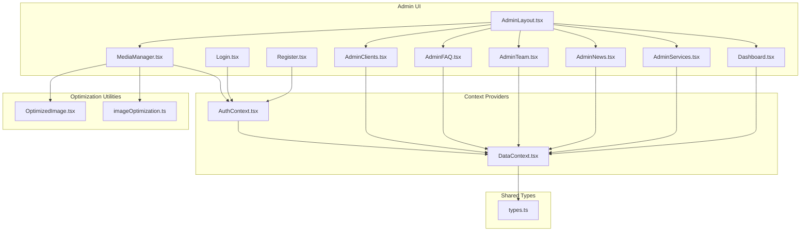
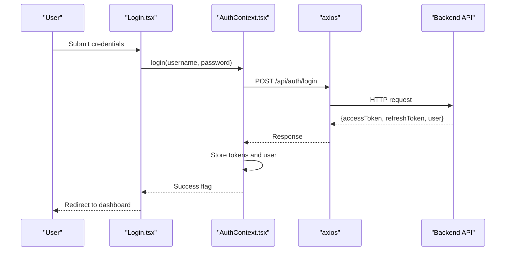
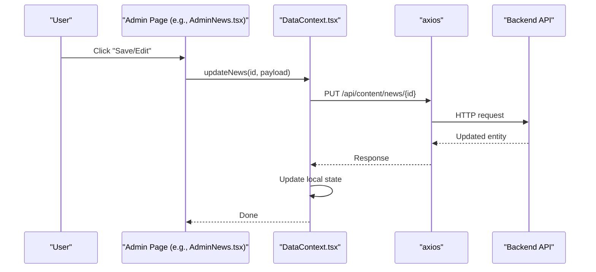
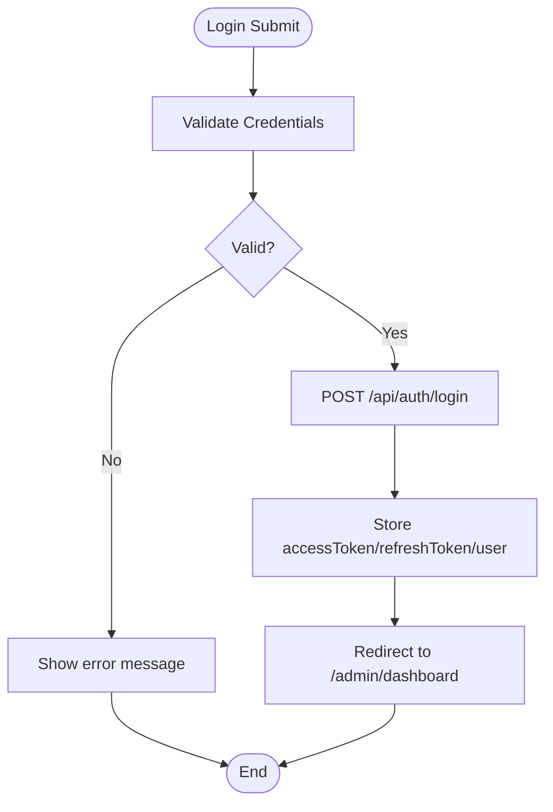
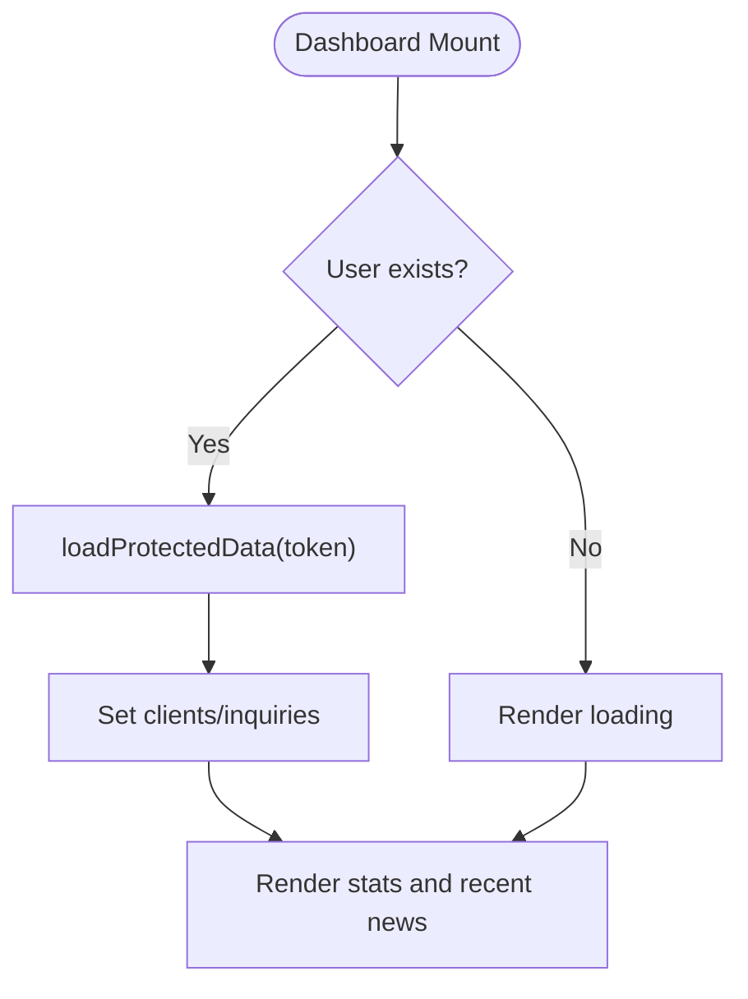
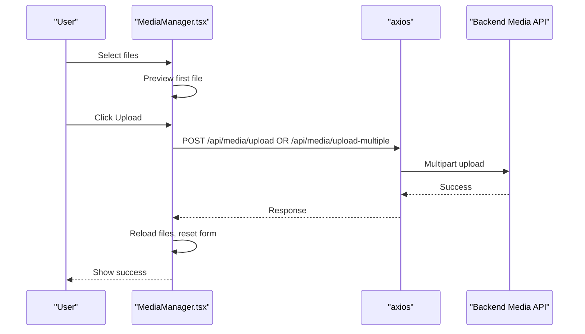
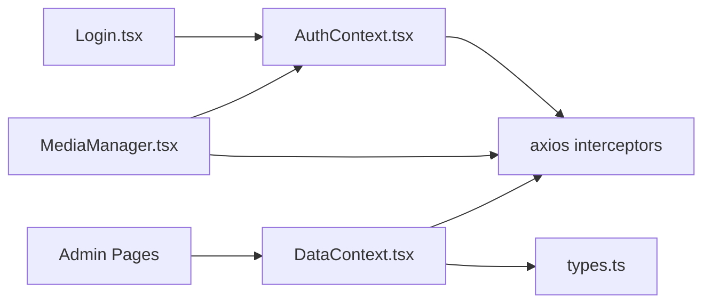

# Admin Panel

<cite>
**Referenced Files in This Document**
- [AdminLayout.tsx](file://src/pages/admin/AdminLayout.tsx)
- [Dashboard.tsx](file://src/pages/admin/Dashboard.tsx)
- [Login.tsx](file://src/pages/admin/Login.tsx)
- [Register.tsx](file://src/pages/admin/Register.tsx)
- [AdminServices.tsx](file://src/pages/admin/AdminServices.tsx)
- [AdminNews.tsx](file://src/pages/admin/AdminNews.tsx)
- [AdminTeam.tsx](file://src/pages/admin/AdminTeam.tsx)
- [AdminFAQ.tsx](file://src/pages/admin/AdminFAQ.tsx)
- [AdminClients.tsx](file://src/pages/admin/AdminClients.tsx)
- [MediaManager.tsx](file://src/pages/admin/MediaManager.tsx)
- [AuthContext.tsx](file://src/context/AuthContext.tsx)
- [DataContext.tsx](file://src/context/DataContext.tsx)
- [types.ts](file://src/types.ts)
- [imageOptimization.ts](file://src/utils/imageOptimization.ts)
- [OptimizedImage.tsx](file://src/components/OptimizedImage.tsx)
</cite>

## Table of Contents
1. [Introduction](#introduction)
2. [Project Structure](#project-structure)
3. [Core Components](#core-components)
4. [Architecture Overview](#architecture-overview)
5. [Detailed Component Analysis](#detailed-component-analysis)
6. [Dependency Analysis](#dependency-analysis)
7. [Performance Considerations](#performance-considerations)
8. [Troubleshooting Guide](#troubleshooting-guide)
9. [Conclusion](#conclusion)

## Introduction
This document explains the admin panel’s content management and administrative capabilities. It covers the authentication system, dashboard interface, content management workflows for services, news, team members, FAQs, and clients, the media management system for uploads and previews, and the administrative UI design. It also documents the data context for CRUD operations, user roles, and provides practical examples via file references for building custom administrative features.

## Project Structure
The admin panel is a React application integrated with a backend API. Authentication state is managed via a context provider, and content CRUD is handled through a data context provider. The admin layout defines navigation and access control, while individual admin pages implement editing, creation, deletion, pagination, and search.

**Diagram sources**
- [AdminLayout.tsx](file://src/pages/admin/AdminLayout.tsx#L1-L90)
- [Dashboard.tsx](file://src/pages/admin/Dashboard.tsx#L1-L137)
- [Login.tsx](file://src/pages/admin/Login.tsx#L1-L129)
- [Register.tsx](file://src/pages/admin/Register.tsx#L1-L248)
- [AdminServices.tsx](file://src/pages/admin/AdminServices.tsx#L1-L131)
- [AdminNews.tsx](file://src/pages/admin/AdminNews.tsx#L1-L212)
- [AdminTeam.tsx](file://src/pages/admin/AdminTeam.tsx#L1-L203)
- [AdminFAQ.tsx](file://src/pages/admin/AdminFAQ.tsx#L1-L120)
- [AdminClients.tsx](file://src/pages/admin/AdminClients.tsx#L1-L292)
- [MediaManager.tsx](file://src/pages/admin/MediaManager.tsx#L1-L308)
- [AuthContext.tsx](file://src/context/AuthContext.tsx#L1-L187)
- [DataContext.tsx](file://src/context/DataContext.tsx#L1-L259)
- [types.ts](file://src/types.ts#L1-L149)
- [imageOptimization.ts](file://src/utils/imageOptimization.ts#L1-L95)
- [OptimizedImage.tsx](file://src/components/OptimizedImage.tsx#L1-L82)

**Section sources**
- [AdminLayout.tsx](file://src/pages/admin/AdminLayout.tsx#L1-L90)
- [AuthContext.tsx](file://src/context/AuthContext.tsx#L1-L187)
- [DataContext.tsx](file://src/context/DataContext.tsx#L1-L259)
- [types.ts](file://src/types.ts#L1-L149)

## Core Components
- Authentication Context: Manages login, logout, token refresh, and axios interceptors for protected requests.
- Data Context: Centralizes CRUD operations for services, team, news, FAQ, clients, and inquiries, plus protected data loading.
- Admin Pages: Provide inline-edit forms, add/delete actions, pagination, and search for each content type.
- Media Manager: Handles single/multiple image uploads, previews, downloads, and deletions via the backend media API.
- Optimization Utilities: Provide responsive image generation and lazy-loading helpers.

**Section sources**
- [AuthContext.tsx](file://src/context/AuthContext.tsx#L54-L114)
- [DataContext.tsx](file://src/context/DataContext.tsx#L89-L234)
- [MediaManager.tsx](file://src/pages/admin/MediaManager.tsx#L55-L112)
- [imageOptimization.ts](file://src/utils/imageOptimization.ts#L11-L94)

## Architecture Overview
The admin UI communicates with a backend API through axios. Authentication tokens are stored locally and attached to requests via interceptors. The data context wraps CRUD endpoints for content types and exposes typed functions to admin pages. Media operations are isolated under a dedicated page with explicit upload and delete flows.

**Diagram sources**
- [Login.tsx](file://src/pages/admin/Login.tsx#L21-L39)
- [AuthContext.tsx](file://src/context/AuthContext.tsx#L54-L76)

**Diagram sources**
- [AdminNews.tsx](file://src/pages/admin/AdminNews.tsx#L39-L42)
- [DataContext.tsx](file://src/context/DataContext.tsx#L129-L137)

## Detailed Component Analysis

### Authentication System
- Login flow validates inputs, calls the auth context login method, stores tokens, and redirects to the dashboard.
- Logout calls the backend logout endpoint with the refresh token, clears local storage, and resets state.
- Token refresh is automatic via axios interceptors on 401 responses; unauthorized requests trigger logout.

**Diagram sources**
- [Login.tsx](file://src/pages/admin/Login.tsx#L21-L39)
- [AuthContext.tsx](file://src/context/AuthContext.tsx#L54-L91)

**Section sources**
- [Login.tsx](file://src/pages/admin/Login.tsx#L1-L129)
- [AuthContext.tsx](file://src/context/AuthContext.tsx#L54-L114)

### Dashboard Interface
- Loads protected data (clients and inquiries) using the data context when the user is present.
- Displays quick stats cards per content type and a recent news table with category badges.

**Diagram sources**
- [Dashboard.tsx](file://src/pages/admin/Dashboard.tsx#L12-L19)
- [DataContext.tsx](file://src/context/DataContext.tsx#L71-L87)

**Section sources**
- [Dashboard.tsx](file://src/pages/admin/Dashboard.tsx#L1-L137)
- [DataContext.tsx](file://src/context/DataContext.tsx#L71-L87)

### Content Management Workflows

#### Services
- Inline editing with cancel/save controls.
- Uses updateService from the data context.

**Section sources**
- [AdminServices.tsx](file://src/pages/admin/AdminServices.tsx#L1-L131)
- [DataContext.tsx](file://src/context/DataContext.tsx#L89-L97)

#### News
- Supports add/edit/delete with pagination and category filtering.
- Uses addNews, updateNews, deleteNews from the data context.

**Section sources**
- [AdminNews.tsx](file://src/pages/admin/AdminNews.tsx#L1-L212)
- [DataContext.tsx](file://src/context/DataContext.tsx#L139-L157)

#### Team Members
- Inline editing with image URL support and pagination.
- Uses addTeamMember, updateTeamMember, deleteTeamMember.

**Section sources**
- [AdminTeam.tsx](file://src/pages/admin/AdminTeam.tsx#L1-L203)
- [DataContext.tsx](file://src/context/DataContext.tsx#L109-L127)

#### FAQ
- Add/edit/delete for questions and answers.
- Uses addFAQ, updateFAQ, deleteFAQ.

**Section sources**
- [AdminFAQ.tsx](file://src/pages/admin/AdminFAQ.tsx#L1-L120)
- [DataContext.tsx](file://src/context/DataContext.tsx#L169-L187)

#### Clients
- Full CRUD with search, status toggling, and pagination.
- Uses addClient, updateClient, deleteClient.

**Section sources**
- [AdminClients.tsx](file://src/pages/admin/AdminClients.tsx#L1-L292)
- [DataContext.tsx](file://src/context/DataContext.tsx#L206-L234)

### Media Management System
- Uploads single or multiple images with preview and progress indication.
- Lists uploaded files with download and delete actions.
- Integrates with backend media endpoints for listing, uploading, and deleting.

**Diagram sources**
- [MediaManager.tsx](file://src/pages/admin/MediaManager.tsx#L38-L96)

**Section sources**
- [MediaManager.tsx](file://src/pages/admin/MediaManager.tsx#L1-L308)

### Administrative Interface Design
- Sidebar navigation with active-state highlighting and logout action.
- Per-page forms with inline editing, add panels, and action buttons.
- Consistent use of icons, spacing, and responsive grids.

**Section sources**
- [AdminLayout.tsx](file://src/pages/admin/AdminLayout.tsx#L19-L78)

### User Role Management and Access Control
- The auth context exposes an isAdmin flag derived from user role.
- Protected routes and data loads depend on the presence of a valid access token and user role.

**Section sources**
- [AuthContext.tsx](file://src/context/AuthContext.tsx#L165-L168)

### Content Approval Workflows
- Inquiries are loaded via the data context and displayed on the dashboard; their statuses are part of the inquiry model.
- While explicit approval actions are not implemented in the provided files, the data context exposes addInquiry and maintains an inquiries array for downstream UIs.

**Section sources**
- [Dashboard.tsx](file://src/pages/admin/Dashboard.tsx#L21)
- [DataContext.tsx](file://src/context/DataContext.tsx#L189-L204)
- [types.ts](file://src/types.ts#L55-L67)

### Bulk Operations and Scheduling
- Bulk operations: The media manager supports multiple file uploads; content CRUD supports batch-like operations via repeated calls.
- Scheduling: No scheduling features are present in the provided files.

**Section sources**
- [MediaManager.tsx](file://src/pages/admin/MediaManager.tsx#L72-L83)
- [AdminNews.tsx](file://src/pages/admin/AdminNews.tsx#L44-L56)

## Dependency Analysis
- Admin pages depend on the data context for CRUD operations and on the auth context for user state and axios defaults.
- Media manager depends on the auth context for tokens and axios for HTTP calls.
- Shared types define the shape of content entities and API responses.

**Diagram sources**
- [AuthContext.tsx](file://src/context/AuthContext.tsx#L117-L163)
- [DataContext.tsx](file://src/context/DataContext.tsx#L32-L33)
- [MediaManager.tsx](file://src/pages/admin/MediaManager.tsx#L6-L7)
- [types.ts](file://src/types.ts#L1-L149)

**Section sources**
- [AuthContext.tsx](file://src/context/AuthContext.tsx#L117-L163)
- [DataContext.tsx](file://src/context/DataContext.tsx#L32-L33)
- [types.ts](file://src/types.ts#L1-L149)

## Performance Considerations
- Image optimization utilities support responsive srcset/sizes and WebP conversion when available.
- Lazy loading is implemented via an optimized image component and a generic setup function.
- Pagination reduces DOM size and improves rendering performance for long lists.

**Section sources**
- [imageOptimization.ts](file://src/utils/imageOptimization.ts#L11-L94)
- [OptimizedImage.tsx](file://src/components/OptimizedImage.tsx#L15-L81)
- [AdminTeam.tsx](file://src/pages/admin/AdminTeam.tsx#L23-L31)
- [AdminClients.tsx](file://src/pages/admin/AdminClients.tsx#L31-L33)

## Troubleshooting Guide
- Authentication failures: Check login error messages and console logs; ensure tokens are stored and axios interceptors attach Authorization headers.
- Protected data not loading: Confirm the token is present and loadProtectedData is called after login.
- Media upload errors: Verify the selected files, endpoint availability, and error messages returned by the backend.
- CRUD errors: Inspect network tab for failed PUT/POST/DELETE calls and review console logs in admin pages.

**Section sources**
- [Login.tsx](file://src/pages/admin/Login.tsx#L33-L35)
- [AuthContext.tsx](file://src/context/AuthContext.tsx#L136-L156)
- [MediaManager.tsx](file://src/pages/admin/MediaManager.tsx#L90-L95)
- [DataContext.tsx](file://src/context/DataContext.tsx#L89-L97)

## Conclusion
The admin panel provides a cohesive, context-driven interface for managing site content and media. Authentication and data contexts centralize cross-cutting concerns, while individual admin pages implement consistent CRUD experiences with pagination, search, and inline editing. The included optimization utilities help maintain performance, and the modular structure supports extending workflows such as content approval or scheduling.