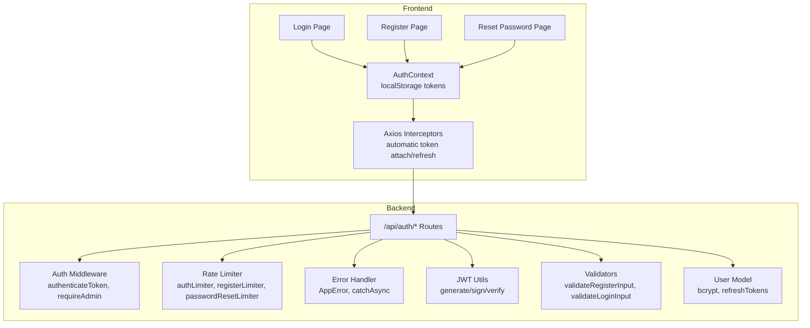
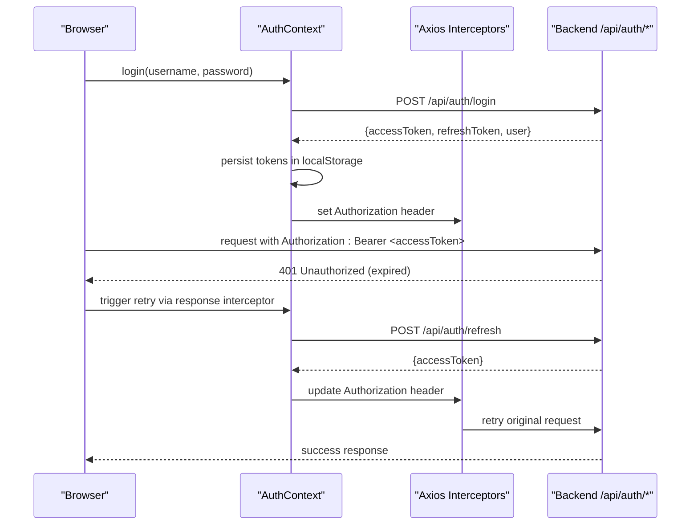
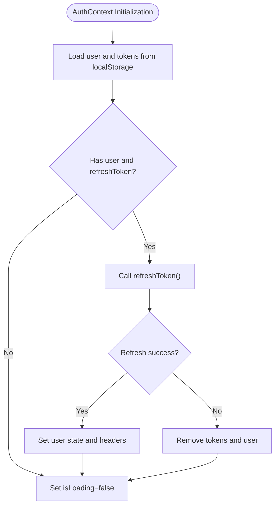
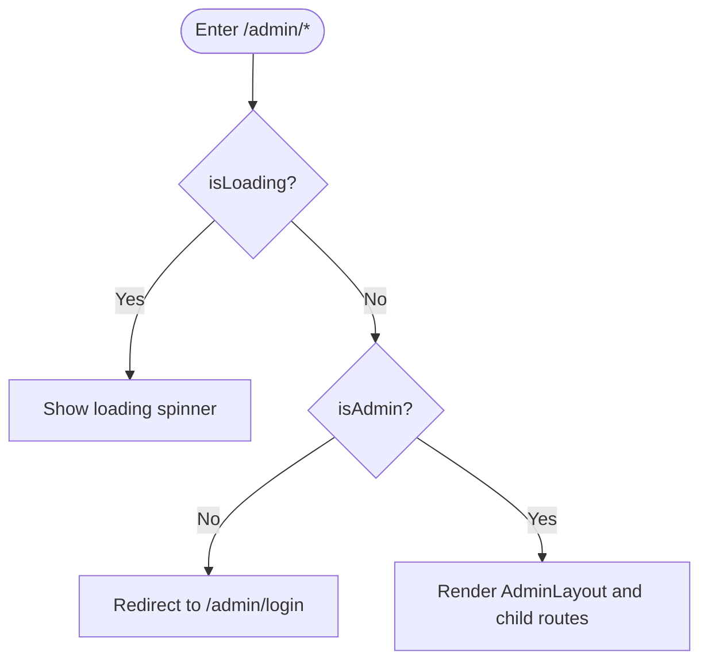
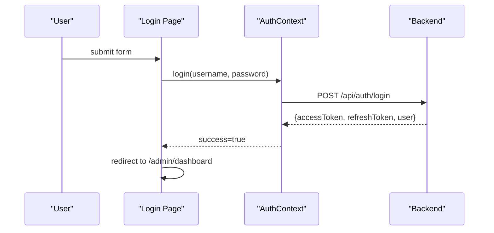
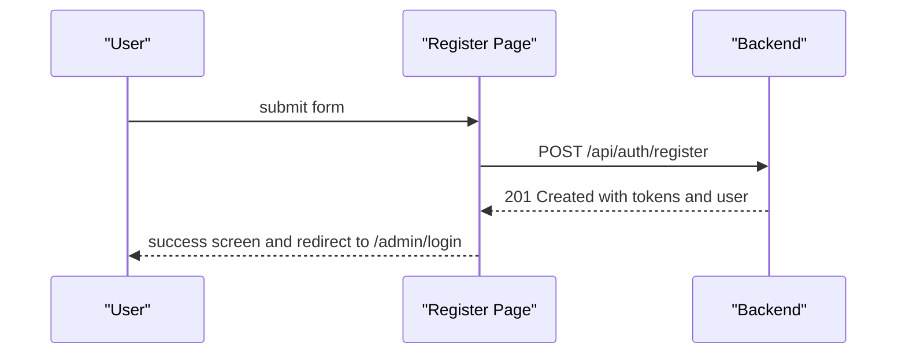
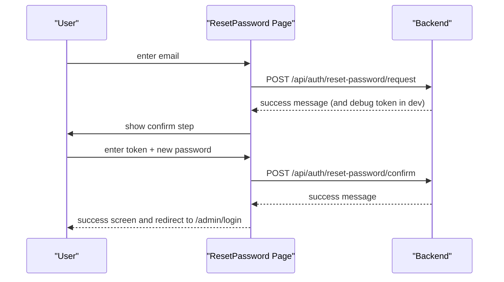
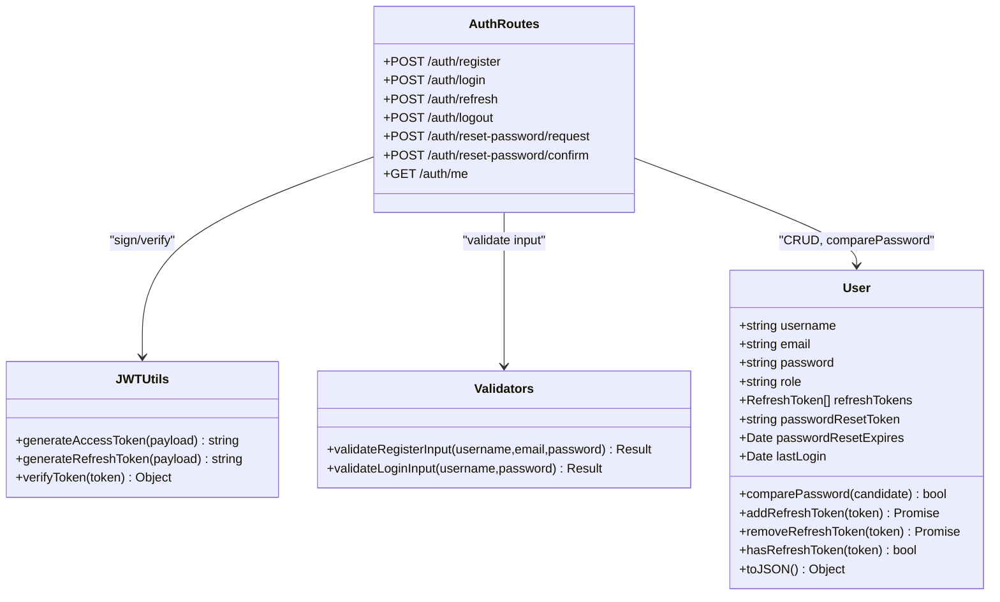
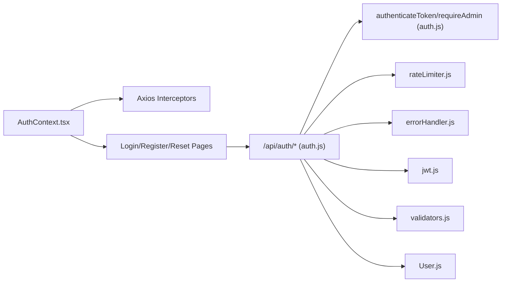

# Authentication System

<cite>
**Referenced Files in This Document**
- [AuthContext.tsx](file://src/context/AuthContext.tsx)
- [App.tsx](file://src/App.tsx)
- [Login.tsx](file://src/pages/admin/Login.tsx)
- [Register.tsx](file://src/pages/admin/Register.tsx)
- [ResetPassword.tsx](file://src/pages/admin/ResetPassword.tsx)
- [auth.js](file://server/middleware/auth.js)
- [rateLimiter.js](file://server/middleware/rateLimiter.js)
- [errorHandler.js](file://server/middleware/errorHandler.js)
- [auth.js](file://server/routes/auth.js)
- [jwt.js](file://server/utils/jwt.js)
- [validators.js](file://server/utils/validators.js)
- [crypto.js](file://server/utils/crypto.js)
- [User.js](file://server/models/User.js)
- [server.js](file://server/server.js)
</cite>

## Table of Contents
1. [Introduction](#introduction)
2. [Project Structure](#project-structure)
3. [Core Components](#core-components)
4. [Architecture Overview](#architecture-overview)
5. [Detailed Component Analysis](#detailed-component-analysis)
6. [Dependency Analysis](#dependency-analysis)
7. [Performance Considerations](#performance-considerations)
8. [Security Considerations](#security-considerations)
9. [Troubleshooting Guide](#troubleshooting-guide)
10. [Conclusion](#conclusion)

## Introduction
This document explains the admin authentication system covering user login, registration, and password management. It details the authentication flow, JWT token handling, session management, role-based access control, and secure credential storage. It also documents the AuthContext provider, token refresh mechanisms, logout procedures, and common authentication scenarios with error handling and troubleshooting guidance.

## Project Structure
The authentication system spans the frontend React application and the backend Node.js/Express server:
- Frontend: React context provider manages authentication state, persists tokens in localStorage, and handles automatic token refresh via Axios interceptors.
- Backend: Express routes implement login, registration, refresh, logout, and password reset. Middleware enforces authentication and admin roles, applies rate limits, and centralizes error handling. JWT utilities sign and verify tokens; validators enforce input rules; the User model stores hashed passwords and refresh tokens.

**Diagram sources**
- [AuthContext.tsx](file://src/context/AuthContext.tsx#L25-L179)
- [App.tsx](file://src/App.tsx#L54-L74)
- [Login.tsx](file://src/pages/admin/Login.tsx#L21-L39)
- [Register.tsx](file://src/pages/admin/Register.tsx#L58-L89)
- [ResetPassword.tsx](file://src/pages/admin/ResetPassword.tsx#L19-L94)
- [auth.js](file://server/routes/auth.js#L16-L279)
- [auth.js](file://server/middleware/auth.js#L5-L42)
- [rateLimiter.js](file://server/middleware/rateLimiter.js#L7-L42)
- [errorHandler.js](file://server/middleware/errorHandler.js#L5-L64)
- [jwt.js](file://server/utils/jwt.js#L10-L34)
- [validators.js](file://server/utils/validators.js#L21-L63)
- [User.js](file://server/models/User.js#L50-L100)

**Section sources**
- [AuthContext.tsx](file://src/context/AuthContext.tsx#L25-L179)
- [App.tsx](file://src/App.tsx#L54-L74)
- [auth.js](file://server/routes/auth.js#L16-L279)

## Core Components
- AuthContext provider: Manages user state, login/logout, token refresh, and Axios interceptors for automatic Authorization header injection and transparent token refresh on 401 responses.
- ProtectedRoute: Guards admin routes and redirects unauthenticated or non-admin users to the login page.
- Frontend forms: Login, registration, and password reset pages with client-side validation and user feedback.
- Backend routes: /auth/register, /auth/login, /auth/refresh, /auth/logout, /auth/reset-password/request, /auth/reset-password/confirm, and /auth/me.
- Middleware: authenticateToken verifies access tokens; requireAdmin enforces admin-only access; rateLimiter applies strict limits to auth endpoints; errorHandler centralizes error responses.
- Utilities: JWT signing/verification, input validators, and crypto helpers for password reset tokens.

**Section sources**
- [AuthContext.tsx](file://src/context/AuthContext.tsx#L11-L187)
- [App.tsx](file://src/App.tsx#L54-L74)
- [Login.tsx](file://src/pages/admin/Login.tsx#L21-L39)
- [Register.tsx](file://src/pages/admin/Register.tsx#L30-L56)
- [ResetPassword.tsx](file://src/pages/admin/ResetPassword.tsx#L48-L94)
- [auth.js](file://server/routes/auth.js#L16-L279)
- [auth.js](file://server/middleware/auth.js#L5-L42)
- [rateLimiter.js](file://server/middleware/rateLimiter.js#L7-L42)
- [errorHandler.js](file://server/middleware/errorHandler.js#L5-L64)
- [jwt.js](file://server/utils/jwt.js#L10-L34)
- [validators.js](file://server/utils/validators.js#L21-L63)
- [crypto.js](file://server/utils/crypto.js#L7-L21)
- [User.js](file://server/models/User.js#L50-L100)

## Architecture Overview
The system uses bearer token authentication with short-lived access tokens and long-lived refresh tokens. On initialization, the frontend loads persisted tokens and validates them. Requests automatically include the Authorization header. When the backend responds with 401 Unauthorized, the frontend refreshes the access token using the stored refresh token and retries the original request. Admin-only routes are protected by middleware that checks the user’s role.

**Diagram sources**
- [AuthContext.tsx](file://src/context/AuthContext.tsx#L54-L114)
- [auth.js](file://server/routes/auth.js#L75-L120)
- [auth.js](file://server/routes/auth.js#L127-L156)

## Detailed Component Analysis

### AuthContext Provider
Responsibilities:
- Initialize from localStorage on startup, verify token validity, and set user state.
- Expose login, logout, and refreshToken functions.
- Configure Axios interceptors to attach Authorization headers and handle automatic token refresh on 401 responses.
- Persist tokens and user data in localStorage and clear on logout.

Key behaviors:
- Automatic token refresh: On 401 Unauthorized responses, the response interceptor triggers refreshToken, updates localStorage, and retries the original request.
- Role-based UI: isAdmin computed property enables admin-only UI elements and route guards.

**Diagram sources**
- [AuthContext.tsx](file://src/context/AuthContext.tsx#L29-L52)
- [AuthContext.tsx](file://src/context/AuthContext.tsx#L93-L114)

**Section sources**
- [AuthContext.tsx](file://src/context/AuthContext.tsx#L25-L179)

### ProtectedRoute Guard
Responsibilities:
- Block access to admin routes unless the user is authenticated and has role=admin.
- Show a loading state while checking auth status.

**Diagram sources**
- [App.tsx](file://src/App.tsx#L54-L74)

**Section sources**
- [App.tsx](file://src/App.tsx#L54-L74)

### Login Form
Responsibilities:
- Client-side validation for username and password presence.
- Submit credentials to backend via AuthContext.login.
- Redirect to dashboard on success; display user-friendly errors on failure.

**Diagram sources**
- [Login.tsx](file://src/pages/admin/Login.tsx#L21-L39)
- [AuthContext.tsx](file://src/context/AuthContext.tsx#L54-L76)
- [auth.js](file://server/routes/auth.js#L75-L120)

**Section sources**
- [Login.tsx](file://src/pages/admin/Login.tsx#L21-L39)
- [AuthContext.tsx](file://src/context/AuthContext.tsx#L54-L76)
- [auth.js](file://server/routes/auth.js#L75-L120)

### Registration Process
Responsibilities:
- Client-side validation for username, email, and password.
- Submit registration data to backend.
- Handle conflict errors (duplicate username/email) and generic failures.

**Diagram sources**
- [Register.tsx](file://src/pages/admin/Register.tsx#L58-L89)
- [auth.js](file://server/routes/auth.js#L16-L68)
- [validators.js](file://server/utils/validators.js#L21-L46)

**Section sources**
- [Register.tsx](file://src/pages/admin/Register.tsx#L30-L56)
- [Register.tsx](file://src/pages/admin/Register.tsx#L58-L89)
- [auth.js](file://server/routes/auth.js#L16-L68)
- [validators.js](file://server/utils/validators.js#L21-L46)

### Password Reset Workflow
Responsibilities:
- Request step: send email to backend; always succeed to avoid email enumeration.
- Confirm step: validate token and new password; update user’s password and invalidate refresh tokens.

**Diagram sources**
- [ResetPassword.tsx](file://src/pages/admin/ResetPassword.tsx#L19-L94)
- [auth.js](file://server/routes/auth.js#L186-L262)
- [crypto.js](file://server/utils/crypto.js#L7-L21)

**Section sources**
- [ResetPassword.tsx](file://src/pages/admin/ResetPassword.tsx#L19-L94)
- [auth.js](file://server/routes/auth.js#L186-L262)
- [crypto.js](file://server/utils/crypto.js#L7-L21)

### Backend Authentication Routes
Endpoints:
- POST /api/auth/register: Validates input, checks uniqueness, hashes password, generates tokens, saves refresh token, returns tokens and user.
- POST /api/auth/login: Validates input, finds user, compares password, updates lastLogin, generates tokens, saves refresh token.
- POST /api/auth/refresh: Verifies refresh token, checks token existence on user, returns new access token.
- POST /api/auth/logout: Accepts refresh token, verifies and removes it from user record.
- POST /api/auth/reset-password/request: Generates reset token, stores hashed token with expiry, returns success message.
- POST /api/auth/reset-password/confirm: Validates token and password, updates user password, clears reset token and refresh tokens.
- GET /api/auth/me: Returns current user profile after authentication.

Middleware:
- authenticateToken: Extracts Authorization header, verifies access token, attaches user to request.
- requireAdmin: Enforces admin-only access.
- Rate limiters: Strict limits for auth endpoints, moderate for registration and password reset.

Error handling:
- AppError class wraps operational errors with status codes.
- catchAsync wraps async handlers to forward errors to centralized handler.
- errorHandler returns localized messages in development and generic messages in production.

JWT and validation:
- JWT utilities: generateAccessToken, generateRefreshToken, verifyToken.
- Validators: validateRegisterInput, validateLoginInput.
- User model: pre-save hashing, comparePassword, refresh token CRUD, JSON redaction.

**Diagram sources**
- [User.js](file://server/models/User.js#L4-L100)
- [jwt.js](file://server/utils/jwt.js#L10-L34)
- [validators.js](file://server/utils/validators.js#L21-L63)
- [auth.js](file://server/routes/auth.js#L16-L279)

**Section sources**
- [auth.js](file://server/routes/auth.js#L16-L279)
- [auth.js](file://server/middleware/auth.js#L5-L42)
- [rateLimiter.js](file://server/middleware/rateLimiter.js#L7-L42)
- [errorHandler.js](file://server/middleware/errorHandler.js#L5-L64)
- [jwt.js](file://server/utils/jwt.js#L10-L34)
- [validators.js](file://server/utils/validators.js#L21-L63)
- [User.js](file://server/models/User.js#L50-L100)

## Dependency Analysis
- Frontend depends on AuthContext for state and token lifecycle, Axios interceptors for transparent refresh, and React Router for protected routing.
- Backend routes depend on middleware for authentication and admin enforcement, rate limiter for abuse prevention, error handler for consistent responses, JWT utilities for token operations, validators for input sanitization, and the User model for persistence and password comparison.

**Diagram sources**
- [AuthContext.tsx](file://src/context/AuthContext.tsx#L116-L163)
- [auth.js](file://server/routes/auth.js#L16-L279)
- [auth.js](file://server/middleware/auth.js#L5-L42)
- [rateLimiter.js](file://server/middleware/rateLimiter.js#L7-L42)
- [errorHandler.js](file://server/middleware/errorHandler.js#L5-L64)
- [jwt.js](file://server/utils/jwt.js#L10-L34)
- [validators.js](file://server/utils/validators.js#L21-L63)
- [User.js](file://server/models/User.js#L50-L100)

**Section sources**
- [AuthContext.tsx](file://src/context/AuthContext.tsx#L116-L163)
- [auth.js](file://server/routes/auth.js#L16-L279)

## Performance Considerations
- Token lifetime: Access tokens expire in 24 hours; refresh tokens expire in 7 days. This reduces long-term exposure while enabling seamless sessions.
- Axios interceptors: Avoid redundant token refresh calls by leveraging the built-in retry mechanism on 401 responses.
- Rate limiting: Limits reduce resource consumption and mitigate brute-force attempts on auth endpoints.
- Input validation: Early validation prevents unnecessary backend calls and improves throughput.

[No sources needed since this section provides general guidance]

## Security Considerations
- CSRF protection: The current implementation does not include CSRF tokens for form submissions. Consider adding SameSite cookies, CSRF tokens for state-changing forms, and Origin/CORS hardening for production.
- Rate limiting: Implemented for auth endpoints, registration, and password reset to prevent brute-force attacks.
- Account lockout: Not implemented. Consider adding login attempt tracking with temporary lockout after repeated failures.
- Secure credential storage:
  - Tokens are stored in localStorage. In production, prefer httpOnly cookies for refresh tokens and shorter-lived access tokens with secure flags.
  - Passwords are hashed with bcrypt before storage.
- Token invalidation: Logout endpoint removes the refresh token from the database; consider blacklisting access tokens or implementing short-lived tokens with refresh-only persistence.
- Error messages: Operational errors return localized messages; production error handler avoids leaking internal details.

**Section sources**
- [rateLimiter.js](file://server/middleware/rateLimiter.js#L7-L42)
- [errorHandler.js](file://server/middleware/errorHandler.js#L20-L43)
- [User.js](file://server/models/User.js#L50-L100)
- [auth.js](file://server/routes/auth.js#L163-L179)

## Troubleshooting Guide
Common issues and resolutions:
- Login fails with invalid credentials:
  - Verify username/password meet validation rules.
  - Check backend logs for detailed error messages.
  - Ensure JWT_SECRET is configured consistently on frontend and backend.
- 401 Unauthorized after token expiration:
  - Confirm refreshToken is present in localStorage.
  - Verify the refresh endpoint returns a new access token.
  - Check that Axios interceptors are attached and retry logic executes.
- Registration conflicts:
  - Duplicate username or email triggers a 409 error. Prompt user to choose alternatives.
- Password reset not working:
  - Ensure the reset token matches the hashed token stored with expiry.
  - Confirm the new password meets minimum length requirements.
- Protected route redirects to login:
  - Confirm user is authenticated and has role=admin.
  - Check that AuthContext initializes tokens correctly on app startup.

**Section sources**
- [Login.tsx](file://src/pages/admin/Login.tsx#L26-L35)
- [Register.tsx](file://src/pages/admin/Register.tsx#L78-L88)
- [ResetPassword.tsx](file://src/pages/admin/ResetPassword.tsx#L85-L94)
- [App.tsx](file://src/App.tsx#L54-L74)
- [AuthContext.tsx](file://src/context/AuthContext.tsx#L135-L163)
- [auth.js](file://server/routes/auth.js#L75-L120)
- [auth.js](file://server/routes/auth.js#L127-L156)
- [auth.js](file://server/routes/auth.js#L186-L262)

## Conclusion
The authentication system integrates a React context provider with Axios interceptors for seamless token management and automatic refresh, backed by robust backend routes, middleware, and utilities. It supports login, registration, password reset, and admin-only access control with rate limiting and consistent error handling. For production, strengthen security with CSRF protection, secure cookie storage, and optional account lockout policies.