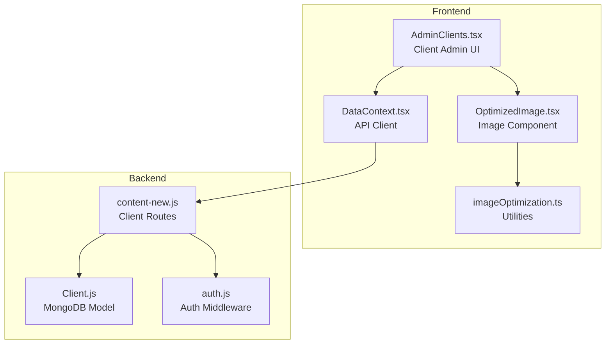
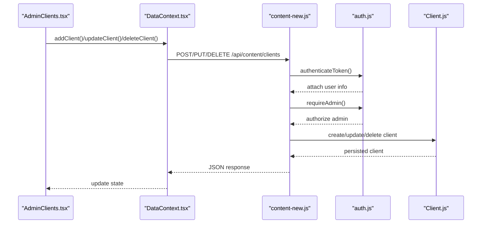
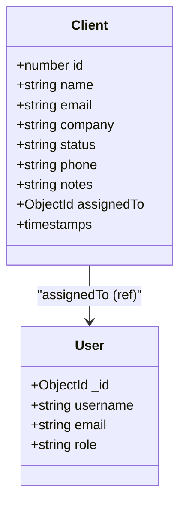
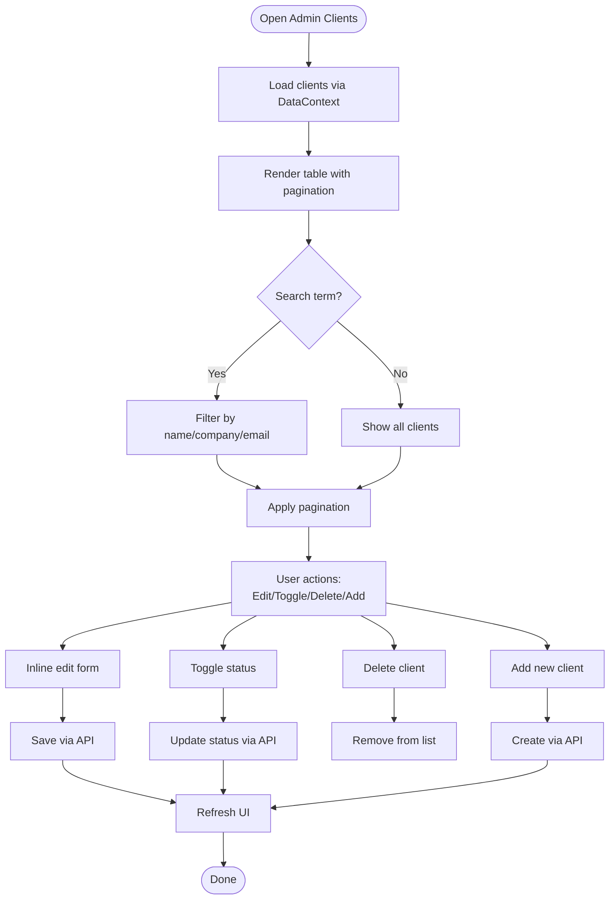
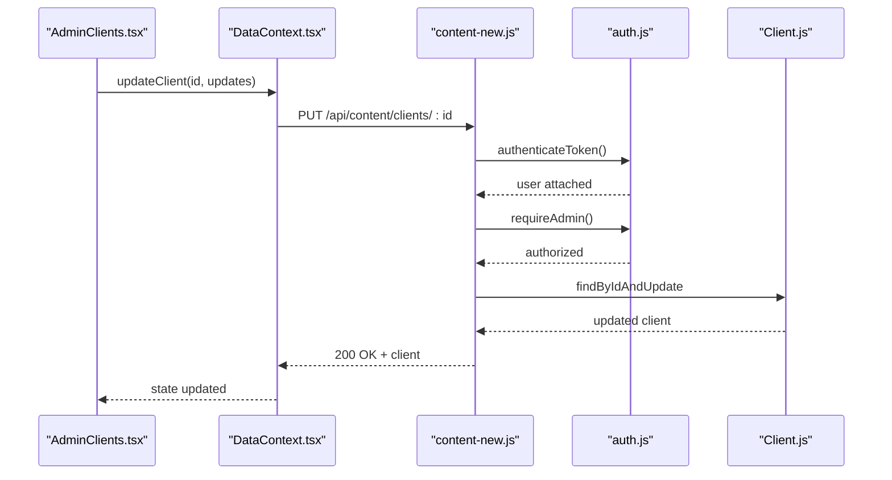
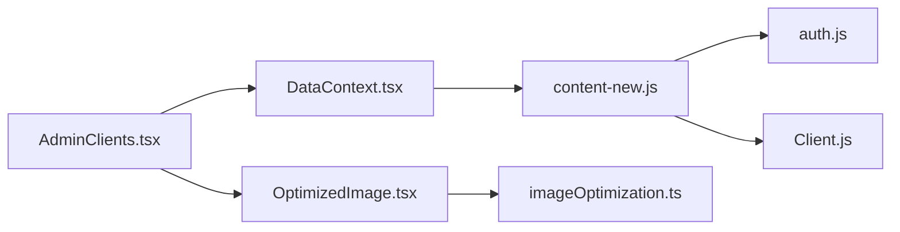

# Clients Management

<cite>
**Referenced Files in This Document**
- [Client.js](file://server/models/Client.js)
- [content-new.js](file://server/routes/content-new.js)
- [AdminClients.tsx](file://src/pages/admin/AdminClients.tsx)
- [DataContext.tsx](file://src/context/DataContext.tsx)
- [types.ts](file://src/types.ts)
- [imageOptimization.ts](file://src/utils/imageOptimization.ts)
- [OptimizedImage.tsx](file://src/components/OptimizedImage.tsx)
- [auth.js](file://server/middleware/auth.js)
- [Content.js](file://server/models/Content.js)
</cite>

## Table of Contents
1. [Introduction](#introduction)
2. [Project Structure](#project-structure)
3. [Core Components](#core-components)
4. [Architecture Overview](#architecture-overview)
5. [Detailed Component Analysis](#detailed-component-analysis)
6. [Dependency Analysis](#dependency-analysis)
7. [Performance Considerations](#performance-considerations)
8. [Troubleshooting Guide](#troubleshooting-guide)
9. [Conclusion](#conclusion)

## Introduction
This document describes the client testimonials and case study management system with a focus on client profile creation, client administration, and portfolio showcase workflows. It covers the client form fields, validation rules, client status management, administrative controls, and integration points with the broader content management system. It also documents client profile CRUD operations, client visibility controls, and image optimization capabilities used in client-related content.

## Project Structure
The client management system spans both the frontend admin interface and the backend content management API:

- Frontend admin interface: client listing, filtering, pagination, and inline editing
- Backend API: client CRUD endpoints with authentication and authorization
- Data model: client schema with validation and indexing
- Utilities: image optimization helpers for responsive and efficient image delivery

**Diagram sources**
- [AdminClients.tsx](file://src/pages/admin/AdminClients.tsx#L1-L292)
- [DataContext.tsx](file://src/context/DataContext.tsx#L1-L259)
- [content-new.js](file://server/routes/content-new.js#L285-L361)
- [Client.js](file://server/models/Client.js#L1-L66)
- [auth.js](file://server/middleware/auth.js#L1-L45)
- [OptimizedImage.tsx](file://src/components/OptimizedImage.tsx#L1-L81)
- [imageOptimization.ts](file://src/utils/imageOptimization.ts#L1-L95)

**Section sources**
- [AdminClients.tsx](file://src/pages/admin/AdminClients.tsx#L1-L292)
- [content-new.js](file://server/routes/content-new.js#L285-L361)
- [Client.js](file://server/models/Client.js#L1-L66)
- [DataContext.tsx](file://src/context/DataContext.tsx#L1-L259)
- [auth.js](file://server/middleware/auth.js#L1-L45)
- [OptimizedImage.tsx](file://src/components/OptimizedImage.tsx#L1-L81)
- [imageOptimization.ts](file://src/utils/imageOptimization.ts#L1-L95)

## Core Components
- Client data model with validation rules for name, email, company, and status
- Admin UI for client listing, filtering, pagination, inline editing, and deletion
- Protected client CRUD endpoints with JWT authentication and admin authorization
- Image optimization utilities for responsive images and lazy loading

Key capabilities:
- Client CRUD operations via admin UI and API
- Client status toggling (active/inactive)
- Client search/filtering by name, email, or company
- Client data synchronization between frontend and backend

**Section sources**
- [Client.js](file://server/models/Client.js#L1-L66)
- [AdminClients.tsx](file://src/pages/admin/AdminClients.tsx#L1-L292)
- [content-new.js](file://server/routes/content-new.js#L285-L361)
- [DataContext.tsx](file://src/context/DataContext.tsx#L206-L234)
- [types.ts](file://src/types.ts#L44-L53)

## Architecture Overview
The client management architecture follows a clear separation of concerns:
- Frontend admin page renders client data and handles user interactions
- DataContext manages API communication and state updates
- Express routes handle client CRUD operations
- Authentication middleware enforces token validation and admin roles
- Client model defines schema, validation, and indexes

**Diagram sources**
- [AdminClients.tsx](file://src/pages/admin/AdminClients.tsx#L1-L292)
- [DataContext.tsx](file://src/context/DataContext.tsx#L206-L234)
- [content-new.js](file://server/routes/content-new.js#L285-L361)
- [auth.js](file://server/middleware/auth.js#L1-L45)
- [Client.js](file://server/models/Client.js#L1-L66)

## Detailed Component Analysis

### Client Data Model and Validation
The client model defines required fields, constraints, and indexes:
- Required fields: name, email, company
- Email validation with regex pattern
- Status enum with default active
- Indexes on email, status, and company for efficient queries
- Additional fields: phone, notes, assignedTo (user reference)

Validation characteristics:
- Name and company length limits
- Email format validation
- Status restricted to predefined values
- Optional phone and notes fields

**Diagram sources**
- [Client.js](file://server/models/Client.js#L1-L66)
- [Content.js](file://server/models/Content.js#L44-L56)

**Section sources**
- [Client.js](file://server/models/Client.js#L1-L66)
- [Content.js](file://server/models/Content.js#L44-L56)

### Admin Client Management UI
The admin client page provides:
- Client listing with pagination (10 items per page)
- Real-time filtering by name, company, or email
- Inline editing for company, contact name, email, and status
- Add new client form with name, company, email, and status
- Toggle status between active and inactive
- Delete client action

User interactions:
- Search bar triggers immediate filtering and resets pagination
- Pagination controls navigate through filtered results
- Status toggle updates client status via API
- Inline edit saves changes immediately

**Diagram sources**
- [AdminClients.tsx](file://src/pages/admin/AdminClients.tsx#L1-L292)
- [DataContext.tsx](file://src/context/DataContext.tsx#L206-L234)

**Section sources**
- [AdminClients.tsx](file://src/pages/admin/AdminClients.tsx#L1-L292)
- [DataContext.tsx](file://src/context/DataContext.tsx#L206-L234)
- [types.ts](file://src/types.ts#L44-L53)

### Client CRUD Operations
Backend endpoints support full CRUD:
- GET /api/content/clients: fetch clients with optional status and search filters
- POST /api/content/clients: create client (admin only)
- PUT /api/content/clients/:id: update client (admin only)
- DELETE /api/content/clients/:id: delete client (admin only)

Authentication and authorization:
- All client endpoints require a valid JWT bearer token
- Admin role required for client management operations

**Diagram sources**
- [content-new.js](file://server/routes/content-new.js#L328-L345)
- [auth.js](file://server/middleware/auth.js#L1-L45)
- [Client.js](file://server/models/Client.js#L1-L66)
- [DataContext.tsx](file://src/context/DataContext.tsx#L216-L224)

**Section sources**
- [content-new.js](file://server/routes/content-new.js#L285-L361)
- [auth.js](file://server/middleware/auth.js#L1-L45)
- [DataContext.tsx](file://src/context/DataContext.tsx#L216-L224)

### Client Status Management
Client status is controlled via the admin UI:
- Active: visible and eligible for display
- Inactive: hidden from public view
- Toggle action switches status on the fly
- Status filter available in the API for admin queries

Status impact:
- Controls visibility in admin-managed lists
- Can be combined with search filters for targeted queries

**Section sources**
- [AdminClients.tsx](file://src/pages/admin/AdminClients.tsx#L64-L68)
- [content-new.js](file://server/routes/content-new.js#L294-L312)

### Client Verification and Search
Client verification and search features:
- Real-time filtering in the admin UI by name, company, or email
- API supports search queries with regex matching across name, email, and company
- Status filtering for administrative queries

Verification process:
- Email validation ensures proper format
- Unique constraints enforced at the database level
- Admin authorization required for all modifications

**Section sources**
- [AdminClients.tsx](file://src/pages/admin/AdminClients.tsx#L22-L27)
- [content-new.js](file://server/routes/content-new.js#L294-L305)
- [Client.js](file://server/models/Client.js#L10-L15)

### Image Optimization for Client Content
While the client model does not include a logo field, the system provides robust image optimization utilities for portfolio and related content:
- Responsive srcset generation for multiple widths
- Breakpoint-aware sizes attribute
- WebP conversion when supported
- Lazy loading with IntersectionObserver
- Preload capability for critical images

Usage scenarios:
- Portfolio showcases and case studies
- Team member photos and client imagery
- Marketing materials and testimonials

**Section sources**
- [imageOptimization.ts](file://src/utils/imageOptimization.ts#L1-L95)
- [OptimizedImage.tsx](file://src/components/OptimizedImage.tsx#L1-L81)

## Dependency Analysis
Client management depends on:
- Authentication middleware for token validation and admin checks
- Client model for persistence and validation
- DataContext for frontend-backend synchronization
- Image optimization utilities for media performance

**Diagram sources**
- [AdminClients.tsx](file://src/pages/admin/AdminClients.tsx#L1-L292)
- [DataContext.tsx](file://src/context/DataContext.tsx#L1-L259)
- [content-new.js](file://server/routes/content-new.js#L285-L361)
- [auth.js](file://server/middleware/auth.js#L1-L45)
- [Client.js](file://server/models/Client.js#L1-L66)
- [OptimizedImage.tsx](file://src/components/OptimizedImage.tsx#L1-L81)
- [imageOptimization.ts](file://src/utils/imageOptimization.ts#L1-L95)

**Section sources**
- [content-new.js](file://server/routes/content-new.js#L285-L361)
- [auth.js](file://server/middleware/auth.js#L1-L45)
- [Client.js](file://server/models/Client.js#L1-L66)
- [DataContext.tsx](file://src/context/DataContext.tsx#L1-L259)

## Performance Considerations
- Client listing uses pagination (10 items/page) to limit DOM and API payload sizes
- Filtering is client-side in the admin UI; consider server-side filtering for large datasets
- Image optimization utilities reduce bandwidth and improve loading performance
- Authentication middleware validates tokens efficiently; ensure token caching for repeated requests
- Database indexes on email, status, and company support efficient querying

Recommendations:
- Implement server-side filtering and pagination for client search
- Use lazy loading for client avatars and portfolio images
- Consider debouncing search input to reduce API calls
- Monitor API response times and cache frequently accessed client data

## Troubleshooting Guide
Common issues and resolutions:
- Authentication failures: ensure valid JWT bearer token is included in Authorization header
- Admin access denied: verify user role is admin
- Client not found: confirm client ID exists and matches route parameter
- Validation errors: check required fields and format constraints (email, lengths)
- Network errors: verify API endpoint availability and CORS configuration

Debugging steps:
- Check browser network tab for failed requests
- Verify token validity and expiration
- Confirm admin privileges for client operations
- Review server logs for validation or database errors

**Section sources**
- [auth.js](file://server/middleware/auth.js#L1-L45)
- [content-new.js](file://server/routes/content-new.js#L328-L345)

## Conclusion
The client management system provides a comprehensive solution for client profile administration with secure CRUD operations, intuitive admin controls, and performance-focused image optimization. The architecture cleanly separates frontend and backend concerns while maintaining strong validation and authorization. Future enhancements could include server-side filtering, expanded client fields (such as logo upload), and automated client profile expiration workflows.