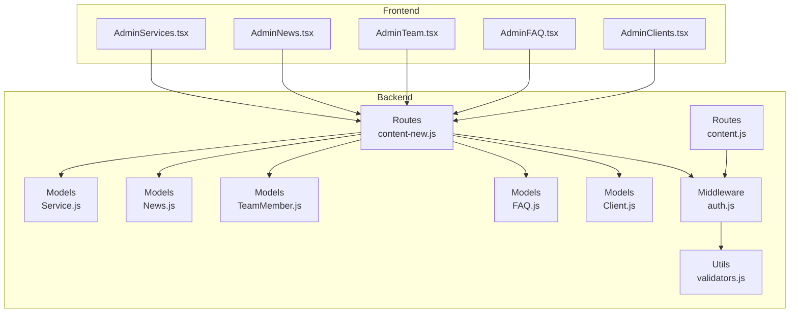
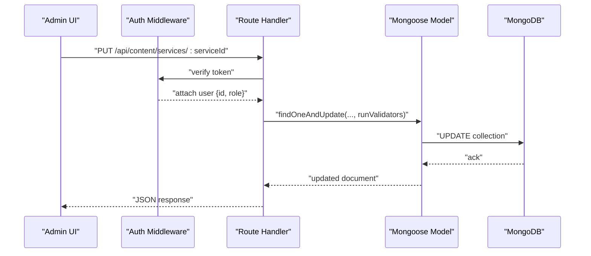
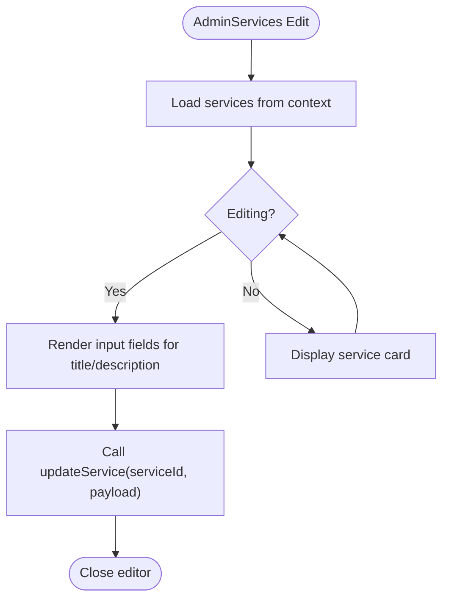
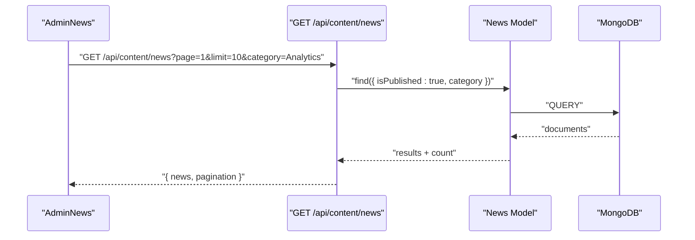
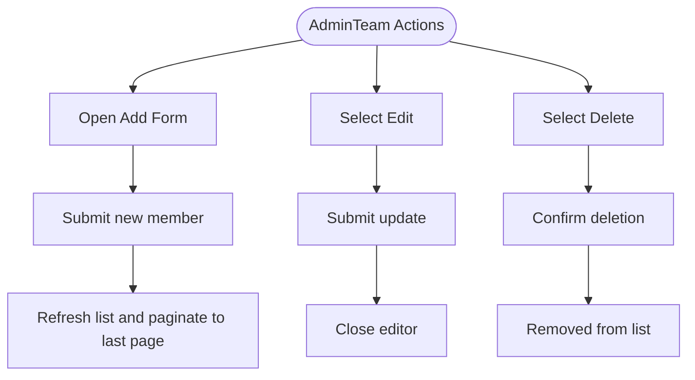
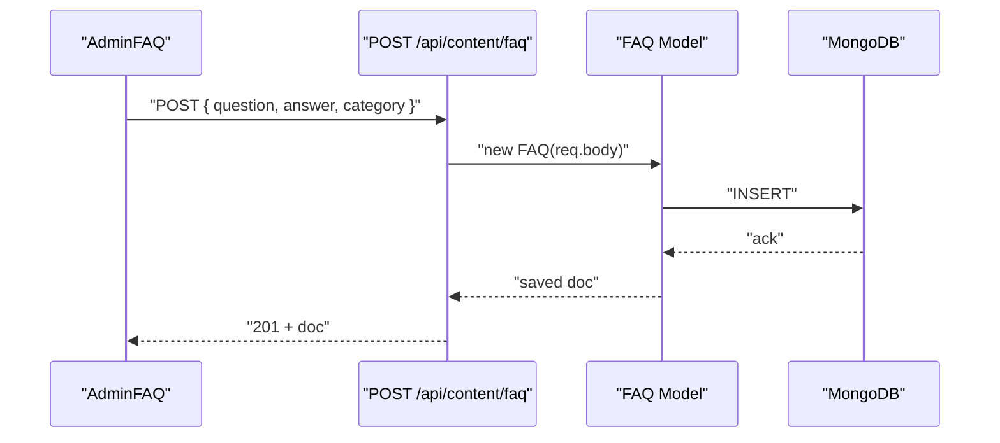
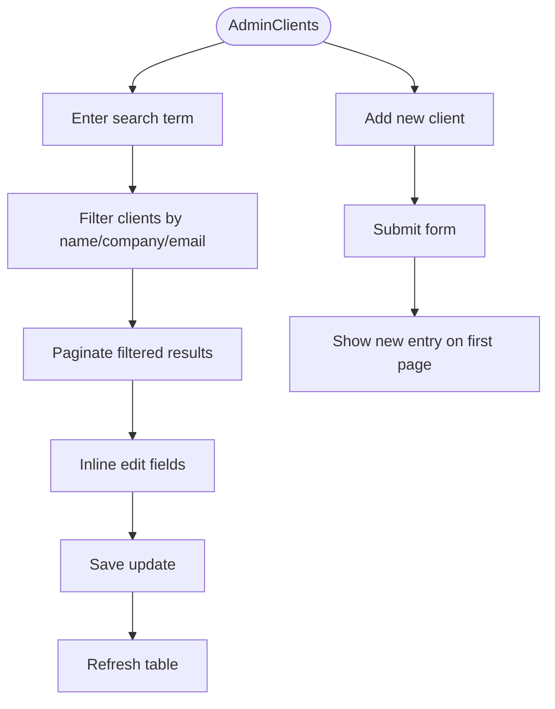
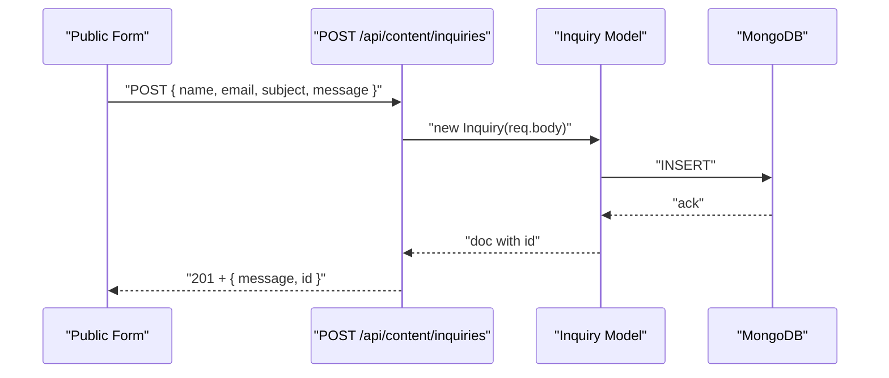
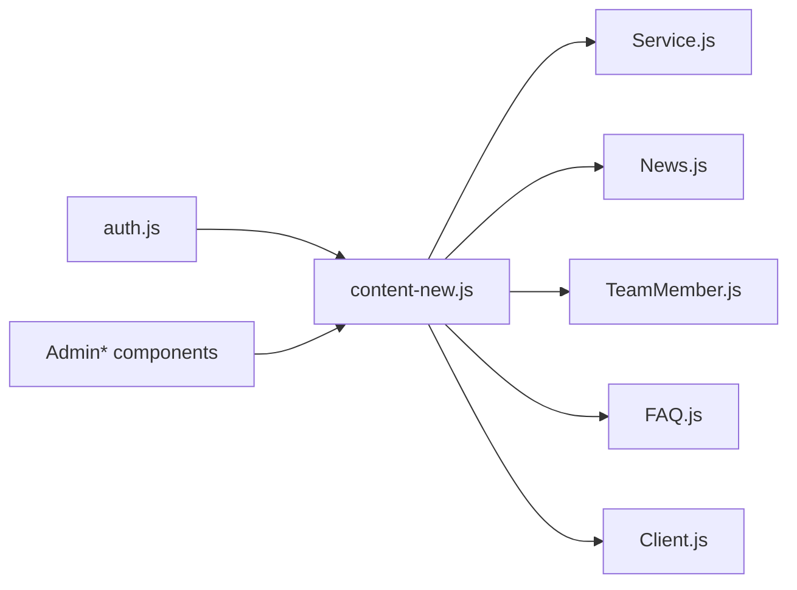
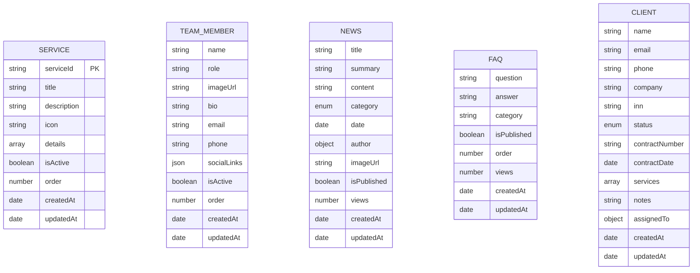

# Content Management

<cite>
**Referenced Files in This Document**
- [server/models/Service.js](file://server/models/Service.js)
- [server/models/News.js](file://server/models/News.js)
- [server/models/TeamMember.js](file://server/models/TeamMember.js)
- [server/models/FAQ.js](file://server/models/FAQ.js)
- [server/models/Client.js](file://server/models/Client.js)
- [server/models/Content.js](file://server/models/Content.js)
- [server/routes/content-new.js](file://server/routes/content-new.js)
- [server/routes/content.js](file://server/routes/content.js)
- [server/middleware/auth.js](file://server/middleware/auth.js)
- [server/utils/validators.js](file://server/utils/validators.js)
- [src/pages/admin/AdminServices.tsx](file://src/pages/admin/AdminServices.tsx)
- [src/pages/admin/AdminNews.tsx](file://src/pages/admin/AdminNews.tsx)
- [src/pages/admin/AdminTeam.tsx](file://src/pages/admin/AdminTeam.tsx)
- [src/pages/admin/AdminFAQ.tsx](file://src/pages/admin/AdminFAQ.tsx)
- [src/pages/admin/AdminClients.tsx](file://src/pages/admin/AdminClients.tsx)
</cite>

## Table of Contents
1. [Introduction](#introduction)
2. [Project Structure](#project-structure)
3. [Core Components](#core-components)
4. [Architecture Overview](#architecture-overview)
5. [Detailed Component Analysis](#detailed-component-analysis)
6. [Dependency Analysis](#dependency-analysis)
7. [Performance Considerations](#performance-considerations)
8. [Troubleshooting Guide](#troubleshooting-guide)
9. [Conclusion](#conclusion)
10. [Appendices](#appendices)

## Introduction
This document describes the content management system for managing services, news articles, team members, FAQs, and client records. It explains CRUD endpoints, validation rules, authentication and authorization, content categorization, search and filtering, pagination, and the admin UI components used by content editors. It also outlines the data models, database indexes, and how content is presented to site visitors.

## Project Structure
The system is split into:
- Backend (Node.js + Express + Mongoose): models, routes, middleware, and utilities
- Frontend (React): admin pages for managing content

**Diagram sources**
- [server/routes/content-new.js](file://server/routes/content-new.js#L1-L441)
- [server/routes/content.js](file://server/routes/content.js#L1-L267)
- [server/models/Service.js](file://server/models/Service.js#L1-L49)
- [server/models/News.js](file://server/models/News.js#L1-L64)
- [server/models/TeamMember.js](file://server/models/TeamMember.js#L1-L57)
- [server/models/FAQ.js](file://server/models/FAQ.js#L1-L43)
- [server/models/Client.js](file://server/models/Client.js#L1-L66)
- [server/middleware/auth.js](file://server/middleware/auth.js#L1-L45)
- [server/utils/validators.js](file://server/utils/validators.js#L1-L72)
- [src/pages/admin/AdminServices.tsx](file://src/pages/admin/AdminServices.tsx#L1-L131)
- [src/pages/admin/AdminNews.tsx](file://src/pages/admin/AdminNews.tsx#L1-L212)
- [src/pages/admin/AdminTeam.tsx](file://src/pages/admin/AdminTeam.tsx#L1-L203)
- [src/pages/admin/AdminFAQ.tsx](file://src/pages/admin/AdminFAQ.tsx#L1-L120)
- [src/pages/admin/AdminClients.tsx](file://src/pages/admin/AdminClients.tsx#L1-L292)

**Section sources**
- [server/routes/content-new.js](file://server/routes/content-new.js#L1-L441)
- [server/routes/content.js](file://server/routes/content.js#L1-L267)
- [server/models/Service.js](file://server/models/Service.js#L1-L49)
- [server/models/News.js](file://server/models/News.js#L1-L64)
- [server/models/TeamMember.js](file://server/models/TeamMember.js#L1-L57)
- [server/models/FAQ.js](file://server/models/FAQ.js#L1-L43)
- [server/models/Client.js](file://server/models/Client.js#L1-L66)
- [server/middleware/auth.js](file://server/middleware/auth.js#L1-L45)
- [server/utils/validators.js](file://server/utils/validators.js#L1-L72)
- [src/pages/admin/AdminServices.tsx](file://src/pages/admin/AdminServices.tsx#L1-L131)
- [src/pages/admin/AdminNews.tsx](file://src/pages/admin/AdminNews.tsx#L1-L212)
- [src/pages/admin/AdminTeam.tsx](file://src/pages/admin/AdminTeam.tsx#L1-L203)
- [src/pages/admin/AdminFAQ.tsx](file://src/pages/admin/AdminFAQ.tsx#L1-L120)
- [src/pages/admin/AdminClients.tsx](file://src/pages/admin/AdminClients.tsx#L1-L292)

## Core Components
- Authentication and Authorization: JWT verification middleware and admin-only enforcement
- Content Models: Strongly typed schemas with validation rules and indexes
- Routes: Public and admin-only endpoints for services, news, team, FAQ, clients, and inquiries
- Admin UI: React components for creating, editing, listing, and deleting content with pagination and search

Key backend endpoints:
- Services: GET /api/content/services, GET /api/content/services/:id, PUT /api/content/services/:serviceId (admin)
- Team: GET /api/content/team, POST/PUT/DELETE /api/content/team/:id (admin)
- News: GET /api/content/news (with pagination and category filter), GET /api/content/news/:id, POST/PUT/DELETE /api/content/news/:id (admin)
- FAQ: GET /api/content/faq (with optional category filter), POST/PUT/DELETE /api/content/faq/:id (admin)
- Clients: GET /api/content/clients (with status and search filters), POST/PUT/DELETE /api/content/clients/:id (admin)
- Inquiries: GET /api/content/inquiries (admin), POST (public), PUT/DELETE /api/content/inquiries/:id (admin)

Validation highlights:
- Service: title and description length limits, icon default, isActive/order flags
- News: title/summary/content length limits, category enum, author population, isPublished flag, views counter
- TeamMember: name/role length limits, email regex, optional bio/phone/social links, isActive/order flags
- FAQ: question/answer length limits, category default, isPublished flag, order field, views counter
- Client: name/email/company length limits, email regex, optional INN format, status enum, services array, notes, assignedTo user reference

**Section sources**
- [server/middleware/auth.js](file://server/middleware/auth.js#L1-L45)
- [server/models/Service.js](file://server/models/Service.js#L1-L49)
- [server/models/News.js](file://server/models/News.js#L1-L64)
- [server/models/TeamMember.js](file://server/models/TeamMember.js#L1-L57)
- [server/models/FAQ.js](file://server/models/FAQ.js#L1-L43)
- [server/models/Client.js](file://server/models/Client.js#L1-L66)
- [server/routes/content-new.js](file://server/routes/content-new.js#L17-L441)

## Architecture Overview
The admin UI components call backend routes via fetch-like operations (as used in the admin pages). Authentication is enforced per route using middleware. Data is persisted using Mongoose models with indexes optimized for common queries.

**Diagram sources**
- [server/routes/content-new.js](file://server/routes/content-new.js#L45-L59)
- [server/middleware/auth.js](file://server/middleware/auth.js#L5-L34)
- [server/models/Service.js](file://server/models/Service.js#L38-L40)

**Section sources**
- [server/routes/content-new.js](file://server/routes/content-new.js#L1-L441)
- [server/middleware/auth.js](file://server/middleware/auth.js#L1-L45)
- [server/models/Service.js](file://server/models/Service.js#L1-L49)

## Detailed Component Analysis

### Services Management
- Data model: serviceId (unique), title, description, icon default, details array, isActive, order
- Routes: list all active services, get by id, update by serviceId (admin)
- Admin UI: inline edit form with title and description fields; saves via updateService

**Diagram sources**
- [src/pages/admin/AdminServices.tsx](file://src/pages/admin/AdminServices.tsx#L23-L34)
- [server/routes/content-new.js](file://server/routes/content-new.js#L45-L59)

**Section sources**
- [server/models/Service.js](file://server/models/Service.js#L1-L49)
- [server/routes/content-new.js](file://server/routes/content-new.js#L17-L59)
- [src/pages/admin/AdminServices.tsx](file://src/pages/admin/AdminServices.tsx#L1-L131)

### News Articles Management
- Data model: title, summary, optional content, category enum, date, author reference, optional imageUrl, isPublished flag, views counter
- Routes: paginated list of published news with optional category filter, get by id, increment views, create/update/delete (admin)
- Admin UI: add/edit forms with category dropdown, pagination controls, delete action

**Diagram sources**
- [server/routes/content-new.js](file://server/routes/content-new.js#L129-L152)
- [server/models/News.js](file://server/models/News.js#L3-L45)

**Section sources**
- [server/models/News.js](file://server/models/News.js#L1-L64)
- [server/routes/content-new.js](file://server/routes/content-new.js#L124-L220)
- [src/pages/admin/AdminNews.tsx](file://src/pages/admin/AdminNews.tsx#L1-L212)

### Team Members Management
- Data model: name, role, imageUrl, optional bio/email/phone/social links, isActive, order
- Routes: list active team members, create/update/delete (admin)
- Admin UI: add/edit cards with image placeholder, pagination, delete action

**Diagram sources**
- [src/pages/admin/AdminTeam.tsx](file://src/pages/admin/AdminTeam.tsx#L43-L53)
- [server/routes/content-new.js](file://server/routes/content-new.js#L80-L118)
- [server/models/TeamMember.js](file://server/models/TeamMember.js#L1-L57)

**Section sources**
- [server/models/TeamMember.js](file://server/models/TeamMember.js#L1-L57)
- [server/routes/content-new.js](file://server/routes/content-new.js#L65-L118)
- [src/pages/admin/AdminTeam.tsx](file://src/pages/admin/AdminTeam.tsx#L1-L203)

### FAQ Management
- Data model: question, answer, category default, isPublished, order, views
- Routes: list published FAQ (optional category), create/update/delete (admin)
- Admin UI: add/edit accordion-style entries with icons

**Diagram sources**
- [server/routes/content-new.js](file://server/routes/content-new.js#L245-L249)
- [server/models/FAQ.js](file://server/models/FAQ.js#L1-L43)

**Section sources**
- [server/models/FAQ.js](file://server/models/FAQ.js#L1-L43)
- [server/routes/content-new.js](file://server/routes/content-new.js#L225-L283)
- [src/pages/admin/AdminFAQ.tsx](file://src/pages/admin/AdminFAQ.tsx#L1-L120)

### Clients Management
- Data model: name, email, phone, company, optional INN, status enum, optional contract fields, services array, notes, assignedTo user
- Routes: list with status/search filters, create/update/delete (admin)
- Admin UI: searchable table with inline edit, status toggle, pagination

**Diagram sources**
- [src/pages/admin/AdminClients.tsx](file://src/pages/admin/AdminClients.tsx#L22-L62)
- [server/routes/content-new.js](file://server/routes/content-new.js#L294-L312)
- [server/models/Client.js](file://server/models/Client.js#L1-L66)

**Section sources**
- [server/models/Client.js](file://server/models/Client.js#L1-L66)
- [server/routes/content-new.js](file://server/routes/content-new.js#L289-L361)
- [src/pages/admin/AdminClients.tsx](file://src/pages/admin/AdminClients.tsx#L1-L292)

### Inquiries Management
- Data model: name, phone, email, subject, message, date, status enum, optional resolvedAt, assignedTo user
- Routes: list with status/priority filters (admin), public POST, admin update/delete
- Admin UI: list view with status updates and resolution timestamping

**Diagram sources**
- [server/routes/content-new.js](file://server/routes/content-new.js#L390-L397)
- [server/models/Client.js](file://server/models/Client.js#L50-L53)

**Section sources**
- [server/routes/content-new.js](file://server/routes/content-new.js#L366-L439)

## Dependency Analysis
- Routes depend on models for data access and on middleware for auth/admin checks
- Admin UI components depend on shared data context hooks to call update/add/delete functions
- Models define indexes to optimize frequent queries (e.g., active order, category/date, published date)

**Diagram sources**
- [server/middleware/auth.js](file://server/middleware/auth.js#L1-L45)
- [server/routes/content-new.js](file://server/routes/content-new.js#L1-L12)
- [server/models/Service.js](file://server/models/Service.js#L1-L49)
- [server/models/News.js](file://server/models/News.js#L1-L64)
- [server/models/TeamMember.js](file://server/models/TeamMember.js#L1-L57)
- [server/models/FAQ.js](file://server/models/FAQ.js#L1-L43)
- [server/models/Client.js](file://server/models/Client.js#L1-L66)
- [src/pages/admin/AdminServices.tsx](file://src/pages/admin/AdminServices.tsx#L1-L10)
- [src/pages/admin/AdminNews.tsx](file://src/pages/admin/AdminNews.tsx#L1-L10)
- [src/pages/admin/AdminTeam.tsx](file://src/pages/admin/AdminTeam.tsx#L1-L10)
- [src/pages/admin/AdminFAQ.tsx](file://src/pages/admin/AdminFAQ.tsx#L1-L10)
- [src/pages/admin/AdminClients.tsx](file://src/pages/admin/AdminClients.tsx#L1-L10)

**Section sources**
- [server/routes/content-new.js](file://server/routes/content-new.js#L1-L441)
- [server/middleware/auth.js](file://server/middleware/auth.js#L1-L45)
- [server/models/Service.js](file://server/models/Service.js#L1-L49)
- [server/models/News.js](file://server/models/News.js#L1-L64)
- [server/models/TeamMember.js](file://server/models/TeamMember.js#L1-L57)
- [server/models/FAQ.js](file://server/models/FAQ.js#L1-L43)
- [server/models/Client.js](file://server/models/Client.js#L1-L66)
- [src/pages/admin/AdminServices.tsx](file://src/pages/admin/AdminServices.tsx#L1-L131)
- [src/pages/admin/AdminNews.tsx](file://src/pages/admin/AdminNews.tsx#L1-L212)
- [src/pages/admin/AdminTeam.tsx](file://src/pages/admin/AdminTeam.tsx#L1-L203)
- [src/pages/admin/AdminFAQ.tsx](file://src/pages/admin/AdminFAQ.tsx#L1-L120)
- [src/pages/admin/AdminClients.tsx](file://src/pages/admin/AdminClients.tsx#L1-L292)

## Performance Considerations
- Indexes: Models define indexes for common filters (e.g., News by date, FAQ by publish/order, Client by status/company). These improve query performance for paginated lists and filters.
- Pagination: News and Clients endpoints support limit/page query parameters to avoid large payloads.
- Population: News and Clients populate user references (author/assignedTo) to enrich data without embedding large documents.
- Validation: Mongoose validators prevent invalid writes and reduce downstream processing overhead.

[No sources needed since this section provides general guidance]

## Troubleshooting Guide
Common issues and resolutions:
- Authentication failures: Ensure a valid bearer token is sent; missing or expired tokens trigger access errors.
- Authorization failures: Admin-only routes require role=admin; verify user role.
- Not found errors: Many routes return 404 when entity does not exist; confirm IDs and filters.
- Validation errors: Exceeding max lengths or invalid enums will cause validation failures; adjust inputs accordingly.
- Public form submissions: Inquiries public endpoint returns a success message with the new record id.

**Section sources**
- [server/middleware/auth.js](file://server/middleware/auth.js#L5-L34)
- [server/routes/content-new.js](file://server/routes/content-new.js#L32-L38)
- [server/routes/content-new.js](file://server/routes/content-new.js#L158-L164)
- [server/routes/content-new.js](file://server/routes/content-new.js#L390-L397)

## Conclusion
The content management system provides a clear separation between admin and public APIs, robust validation at the model level, and intuitive admin UIs for managing services, news, team, FAQ, and clients. Authentication and authorization are enforced per-route, and indexes optimize common queries. The admin pages offer straightforward CRUD experiences with pagination and search capabilities.

[No sources needed since this section summarizes without analyzing specific files]

## Appendices

### Data Models Overview

**Diagram sources**
- [server/models/Service.js](file://server/models/Service.js#L3-L40)
- [server/models/TeamMember.js](file://server/models/TeamMember.js#L3-L49)
- [server/models/News.js](file://server/models/News.js#L3-L45)
- [server/models/FAQ.js](file://server/models/FAQ.js#L3-L34)
- [server/models/Client.js](file://server/models/Client.js#L3-L56)

### Content Categorization and Tagging
- News supports categories: News, Analytics, Event
- FAQ supports categories: defaults to a general category
- Clients can be tagged with services arrays and filtered by status and search terms
- No explicit tagging system is present; categorization is achieved via enum fields and free-text search

**Section sources**
- [server/models/News.js](file://server/models/News.js#L19-L23)
- [server/models/FAQ.js](file://server/models/FAQ.js#L15-L19)
- [server/routes/content-new.js](file://server/routes/content-new.js#L295-L305)

### Search and Filtering
- Clients: Full-text search across name, email, and company using regex
- News: Category filter supported via query parameter
- FAQ: Optional category filter supported via query parameter
- Pagination: Implemented via limit/page query parameters for News and Clients

**Section sources**
- [server/routes/content-new.js](file://server/routes/content-new.js#L130-L139)
- [server/routes/content-new.js](file://server/routes/content-new.js#L230-L238)
- [server/routes/content-new.js](file://server/routes/content-new.js#L295-L305)

### Rich Text Editing and Preview
- The News model includes an optional content field suitable for rich text; the admin UI exposes a textarea for editing summaries and titles but does not include a dedicated rich text editor component
- For production deployments requiring rich text, integrate a WYSIWYG editor and persist HTML to the content field

**Section sources**
- [server/models/News.js](file://server/models/News.js#L15-L18)
- [src/pages/admin/AdminNews.tsx](file://src/pages/admin/AdminNews.tsx#L94-L100)

### Publishing Workflows and Draft Management
- Published/unpublished toggles:
  - News: isPublished flag controls visibility in public listings
  - FAQ: isPublished flag controls visibility in public listings
- Draft management: No explicit draft schema is defined; consider extending models with a draft state and a scheduled publish date if needed
- Expiration: No automated expiration logic is present; consider adding an expireAt field and a cleanup job if content should auto-expire

**Section sources**
- [server/models/News.js](file://server/models/News.js#L35-L38)
- [server/models/FAQ.js](file://server/models/FAQ.js#L20-L23)

### Bulk Operations
- No bulk endpoints are currently exposed in the routes
- To implement bulk actions, add batch endpoints (e.g., bulk delete by ids) and enforce admin-only access

**Section sources**
- [server/routes/content-new.js](file://server/routes/content-new.js#L1-L441)

### Versioning and Audit Trails
- No versioning or audit trail fields are present in the models
- To track changes, consider adding version numbers, change logs, or separate audit collections

**Section sources**
- [server/models/Service.js](file://server/models/Service.js#L38-L40)
- [server/models/News.js](file://server/models/News.js#L43-L45)
- [server/models/TeamMember.js](file://server/models/TeamMember.js#L47-L49)
- [server/models/FAQ.js](file://server/models/FAQ.js#L32-L34)
- [server/models/Client.js](file://server/models/Client.js#L54-L56)