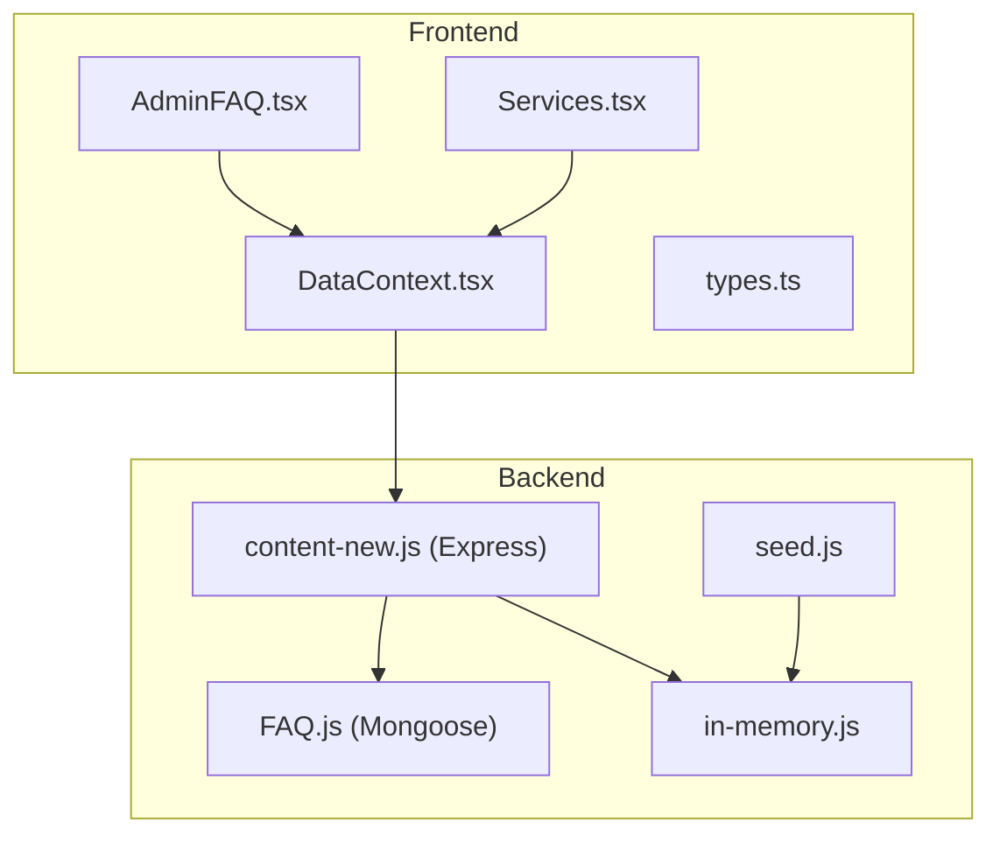
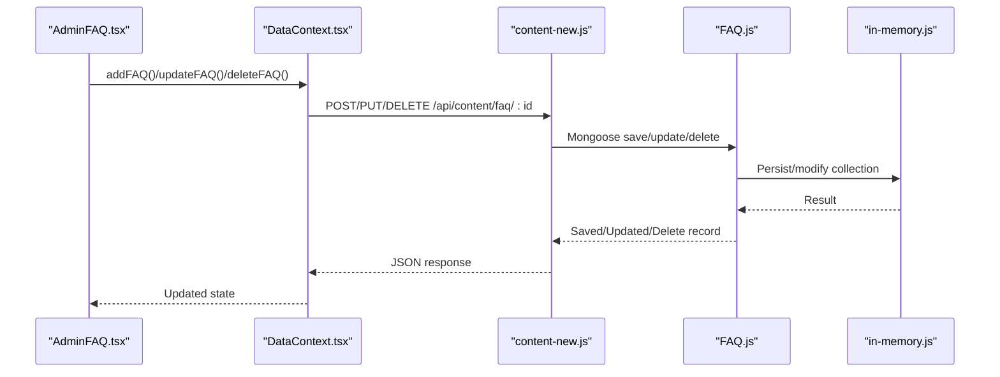
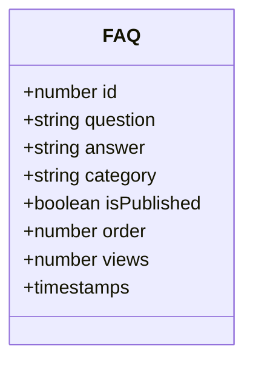
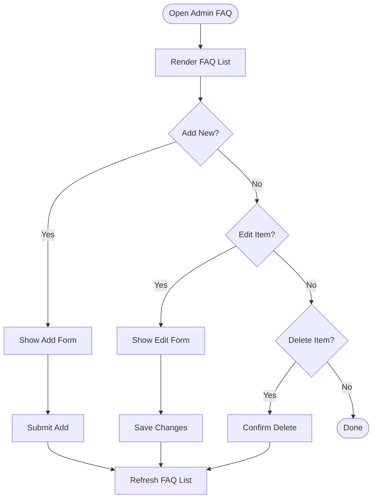
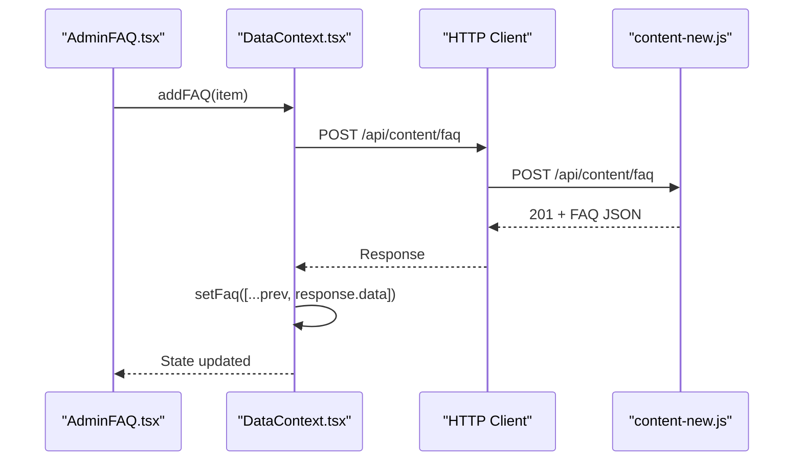
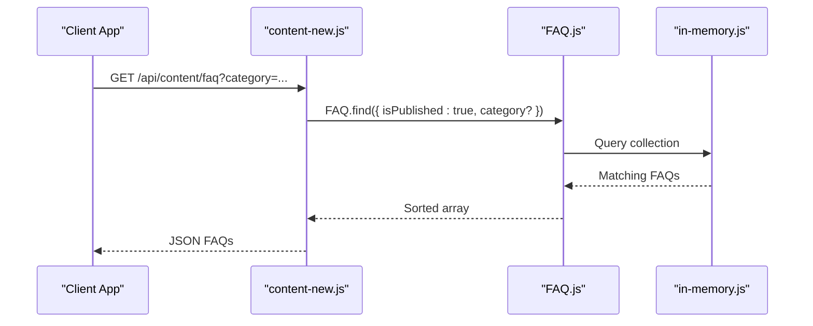
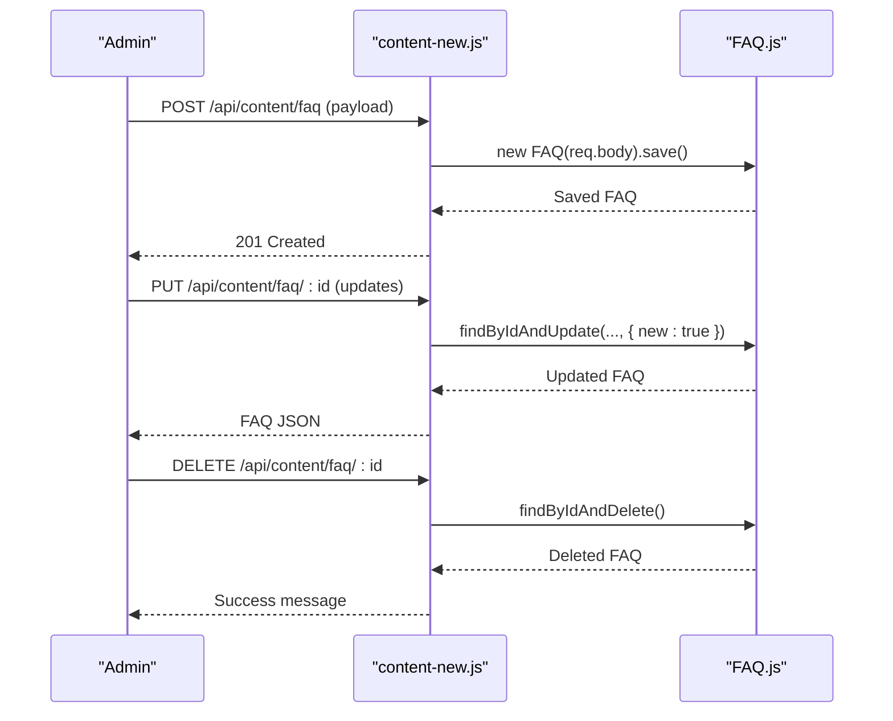
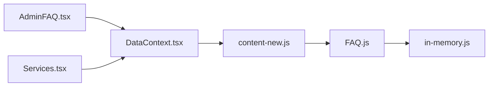

# FAQ Management

<cite>
**Referenced Files in This Document**
- [FAQ.js](file://server/models/FAQ.js)
- [content-new.js](file://server/routes/content-new.js)
- [AdminFAQ.tsx](file://src/pages/admin/AdminFAQ.tsx)
- [DataContext.tsx](file://src/context/DataContext.tsx)
- [types.ts](file://src/types.ts)
- [Services.tsx](file://src/pages/Services.tsx)
- [in-memory.js](file://server/db/in-memory.js)
- [seed.js](file://server/seed.js)
- [constants.tsx](file://src/constants.tsx)
</cite>

## Table of Contents
1. [Introduction](#introduction)
2. [Project Structure](#project-structure)
3. [Core Components](#core-components)
4. [Architecture Overview](#architecture-overview)
5. [Detailed Component Analysis](#detailed-component-analysis)
6. [Dependency Analysis](#dependency-analysis)
7. [Performance Considerations](#performance-considerations)
8. [Troubleshooting Guide](#troubleshooting-guide)
9. [Conclusion](#conclusion)
10. [Appendices](#appendices)

## Introduction
This document explains the FAQ management system with a focus on creating, organizing, categorizing, and publishing questions and answers. It covers the FAQ form fields, validation rules, category assignment, ordering, and publication controls. It also documents the admin workflow for CRUD operations, category filtering, and how FAQs integrate with the customer portal and services. The system supports admin-only editing and exposes a public endpoint for retrieving published FAQs, optionally filtered by category.

## Project Structure
The FAQ system spans frontend and backend components:
- Backend model defines the FAQ schema and indexes.
- Backend routes expose admin-only CRUD endpoints and a public read endpoint.
- Frontend admin page provides a form to add/edit/delete FAQs.
- Data context manages state and API calls for FAQs.
- Types define the FAQItem contract.
- Services page links to contact forms and supports FAQ-driven content.

**Diagram sources**
- [AdminFAQ.tsx](file://src/pages/admin/AdminFAQ.tsx#L1-L120)
- [DataContext.tsx](file://src/context/DataContext.tsx#L1-L259)
- [types.ts](file://src/types.ts#L37-L43)
- [Services.tsx](file://src/pages/Services.tsx#L1-L53)
- [FAQ.js](file://server/models/FAQ.js#L1-L43)
- [content-new.js](file://server/routes/content-new.js#L221-L284)
- [in-memory.js](file://server/db/in-memory.js#L1-L271)
- [seed.js](file://server/seed.js#L102-L123)

**Section sources**
- [FAQ.js](file://server/models/FAQ.js#L1-L43)
- [content-new.js](file://server/routes/content-new.js#L221-L284)
- [AdminFAQ.tsx](file://src/pages/admin/AdminFAQ.tsx#L1-L120)
- [DataContext.tsx](file://src/context/DataContext.tsx#L1-L259)
- [types.ts](file://src/types.ts#L37-L43)
- [Services.tsx](file://src/pages/Services.tsx#L1-L53)
- [in-memory.js](file://server/db/in-memory.js#L1-L271)
- [seed.js](file://server/seed.js#L102-L123)

## Core Components
- FAQ model: Defines fields, validation, defaults, and indexes.
- Admin UI: Provides add, edit, and delete actions for FAQs.
- Data context: Centralizes API calls for CRUD operations.
- Public API: Returns published FAQs, optionally filtered by category.

Key capabilities:
- Question and answer fields with length limits.
- Category field with default value.
- Publication toggle and ordering control.
- Public retrieval sorted by order and recency.

**Section sources**
- [FAQ.js](file://server/models/FAQ.js#L3-L38)
- [content-new.js](file://server/routes/content-new.js#L230-L238)
- [AdminFAQ.tsx](file://src/pages/admin/AdminFAQ.tsx#L6-L30)
- [DataContext.tsx](file://src/context/DataContext.tsx#L159-L187)

## Architecture Overview
The FAQ lifecycle involves admin actions and public consumption:
- Admin adds or edits FAQs via the admin page.
- Data context calls admin-only endpoints to persist changes.
- Public consumers fetch published FAQs, optionally filtered by category.

**Diagram sources**
- [AdminFAQ.tsx](file://src/pages/admin/AdminFAQ.tsx#L21-L30)
- [DataContext.tsx](file://src/context/DataContext.tsx#L169-L187)
- [content-new.js](file://server/routes/content-new.js#L245-L283)
- [FAQ.js](file://server/models/FAQ.js#L1-L43)
- [in-memory.js](file://server/db/in-memory.js#L37-L83)

## Detailed Component Analysis

### FAQ Model and Validation
The FAQ model enforces:
- Question: required, trimmed, max length constraint.
- Answer: required, max length constraint.
- Category: trimmed, default category applied if omitted.
- Publication flag: defaults to published.
- Ordering: numeric order for display control.
- Views counter: default zero.

Indexes:
- Composite index on publication and order for efficient retrieval.
- Index on category for filtering.

**Diagram sources**
- [FAQ.js](file://server/models/FAQ.js#L3-L38)

**Section sources**
- [FAQ.js](file://server/models/FAQ.js#L3-L38)

### Admin FAQ Page Workflow
The admin page supports:
- Toggle “Add new FAQ” panel.
- Inline edit mode per FAQ item.
- Add, save, cancel, and delete actions.

**Diagram sources**
- [AdminFAQ.tsx](file://src/pages/admin/AdminFAQ.tsx#L16-L30)

**Section sources**
- [AdminFAQ.tsx](file://src/pages/admin/AdminFAQ.tsx#L6-L117)

### Data Context and API Calls
The data context encapsulates:
- Fetching FAQs on app initialization.
- Adding, updating, and deleting FAQs via HTTP calls.
- Updating local state after successful API responses.

**Diagram sources**
- [DataContext.tsx](file://src/context/DataContext.tsx#L169-L177)
- [content-new.js](file://server/routes/content-new.js#L245-L249)

**Section sources**
- [DataContext.tsx](file://src/context/DataContext.tsx#L44-L68)
- [DataContext.tsx](file://src/context/DataContext.tsx#L159-L187)

### Public FAQ Retrieval and Filtering
Public retrieval:
- Endpoint returns only published FAQs.
- Sorting prioritizes order, then recency.
- Optional category filter supported.

**Diagram sources**
- [content-new.js](file://server/routes/content-new.js#L230-L238)
- [FAQ.js](file://server/models/FAQ.js#L36-L38)
- [in-memory.js](file://server/db/in-memory.js#L25-L35)

**Section sources**
- [content-new.js](file://server/routes/content-new.js#L230-L238)

### FAQ Categories and Organization
- Default category is applied if none provided.
- Category filtering is supported in the public endpoint.
- Ordering field controls presentation order.

Practical usage:
- Assign categories during creation or editing.
- Filter FAQs by category on the client side or via query parameters.

**Section sources**
- [FAQ.js](file://server/models/FAQ.js#L15-L19)
- [content-new.js](file://server/routes/content-new.js#L231-L234)

### FAQ CRUD Operations
- Create: Admin-only POST to create a new FAQ.
- Update: Admin-only PUT to modify an existing FAQ.
- Delete: Admin-only DELETE to remove an FAQ.
- Read: Public GET to retrieve published FAQs with optional category filter.

**Diagram sources**
- [content-new.js](file://server/routes/content-new.js#L245-L283)
- [FAQ.js](file://server/models/FAQ.js#L1-L43)

**Section sources**
- [content-new.js](file://server/routes/content-new.js#L245-L283)

### FAQ Approval and Publishing Controls
- Publication flag defaults to true.
- Public endpoint filters by published status.
- Admin-only routes enable editing and deletion.

Operational implication:
- FAQs are visible immediately upon creation unless edited otherwise.
- Use the admin panel to unpublish or adjust order.

**Section sources**
- [FAQ.js](file://server/models/FAQ.js#L20-L23)
- [content-new.js](file://server/routes/content-new.js#L233-L234)

### FAQ Expiration
No automated expiration mechanism exists in the current codebase. Expiration would require extending the model with an expiration date field and implementing a cleanup job or query-time filtering.

[No sources needed since this section provides general guidance]

### FAQ Search Integration and Customer Portal Visibility
- Public endpoint supports category-based filtering for easy client-side filtering.
- The Services page links to the contact form and can drive FAQ visibility indirectly by guiding users to relevant sections.
- No dedicated full-text search is implemented; filtering is limited to category.

**Section sources**
- [content-new.js](file://server/routes/content-new.js#L231-L234)
- [Services.tsx](file://src/pages/Services.tsx#L38-L43)

### Relationship Between FAQs and Services
- Services are displayed on the Services page and link to the contact form.
- FAQs are fetched independently and can be referenced in marketing or informational contexts.
- There is no direct foreign key relationship between FAQs and Services in the current schema.

**Section sources**
- [Services.tsx](file://src/pages/Services.tsx#L1-L53)
- [FAQ.js](file://server/models/FAQ.js#L1-L43)

## Dependency Analysis
- Admin UI depends on Data Context for state and API operations.
- Data Context depends on Express routes for CRUD operations.
- Routes depend on Mongoose model and in-memory database abstraction.
- Public retrieval depends on model indexes for performance.

**Diagram sources**
- [AdminFAQ.tsx](file://src/pages/admin/AdminFAQ.tsx#L1-L120)
- [DataContext.tsx](file://src/context/DataContext.tsx#L1-L259)
- [content-new.js](file://server/routes/content-new.js#L1-L441)
- [FAQ.js](file://server/models/FAQ.js#L1-L43)
- [in-memory.js](file://server/db/in-memory.js#L1-L271)
- [Services.tsx](file://src/pages/Services.tsx#L1-L53)

**Section sources**
- [AdminFAQ.tsx](file://src/pages/admin/AdminFAQ.tsx#L1-L120)
- [DataContext.tsx](file://src/context/DataContext.tsx#L1-L259)
- [content-new.js](file://server/routes/content-new.js#L1-L441)
- [FAQ.js](file://server/models/FAQ.js#L1-L43)
- [in-memory.js](file://server/db/in-memory.js#L1-L271)
- [Services.tsx](file://src/pages/Services.tsx#L1-L53)

## Performance Considerations
- Indexes on publication and order, and on category, improve query performance for public retrieval.
- Sorting by order and creation date ensures stable presentation.
- Consider pagination for large FAQ sets in production deployments.

**Section sources**
- [FAQ.js](file://server/models/FAQ.js#L36-L38)
- [content-new.js](file://server/routes/content-new.js#L236-L237)

## Troubleshooting Guide
Common issues and resolutions:
- Unauthorized access to admin endpoints: Ensure authentication and admin role are enforced.
- FAQ not appearing publicly: Verify publication flag is true and category matches filter criteria.
- Duplicate IDs or missing IDs: Confirm in-memory ID generation and route parameters.
- Validation errors on submit: Check question/answer length constraints and required fields.

**Section sources**
- [content-new.js](file://server/routes/content-new.js#L245-L283)
- [FAQ.js](file://server/models/FAQ.js#L4-L14)
- [in-memory.js](file://server/db/in-memory.js#L89-L91)

## Conclusion
The FAQ management system provides a straightforward admin workflow for creating, editing, and deleting FAQs, with robust publication controls and category filtering for public consumption. The model and routes enforce validation and indexing for performance. Extending the system could include automated expiration, full-text search, and richer categorization or tagging.

## Appendices

### Example Data Initialization
Sample FAQs are seeded during initialization for development and testing.

**Section sources**
- [seed.js](file://server/seed.js#L102-L123)
- [in-memory.js](file://server/db/in-memory.js#L218-L235)
- [constants.tsx](file://src/constants.tsx#L125-L141)