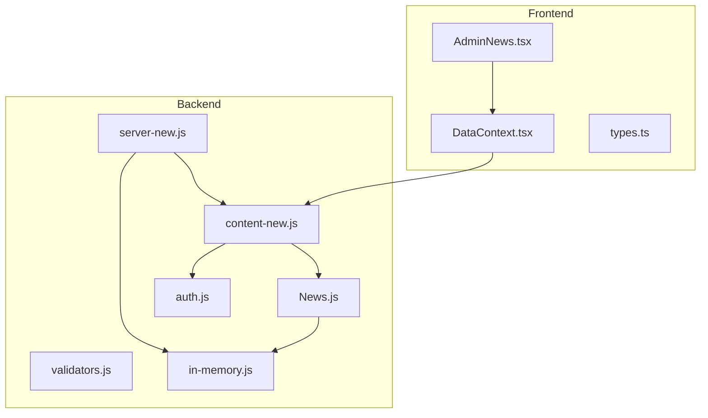
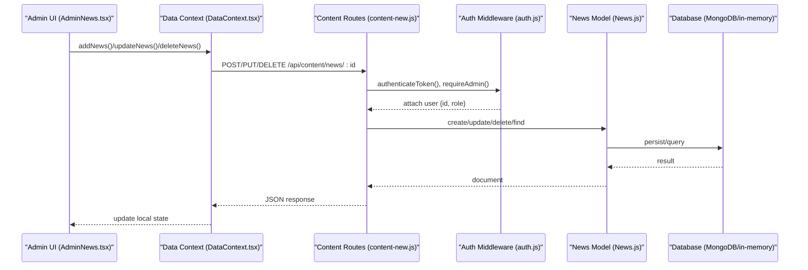
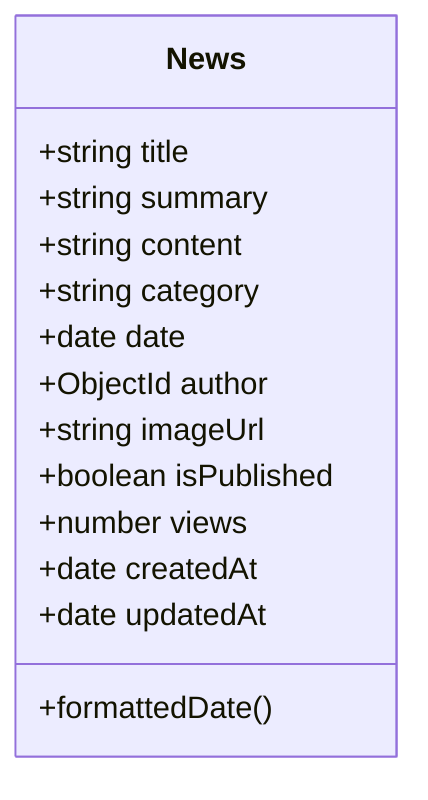
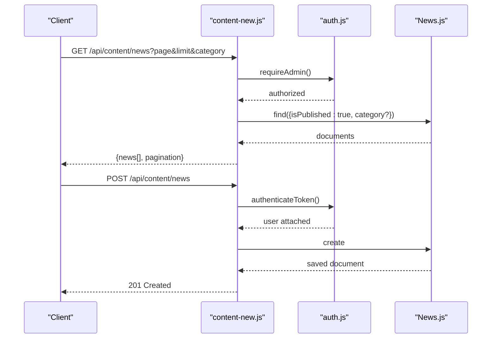
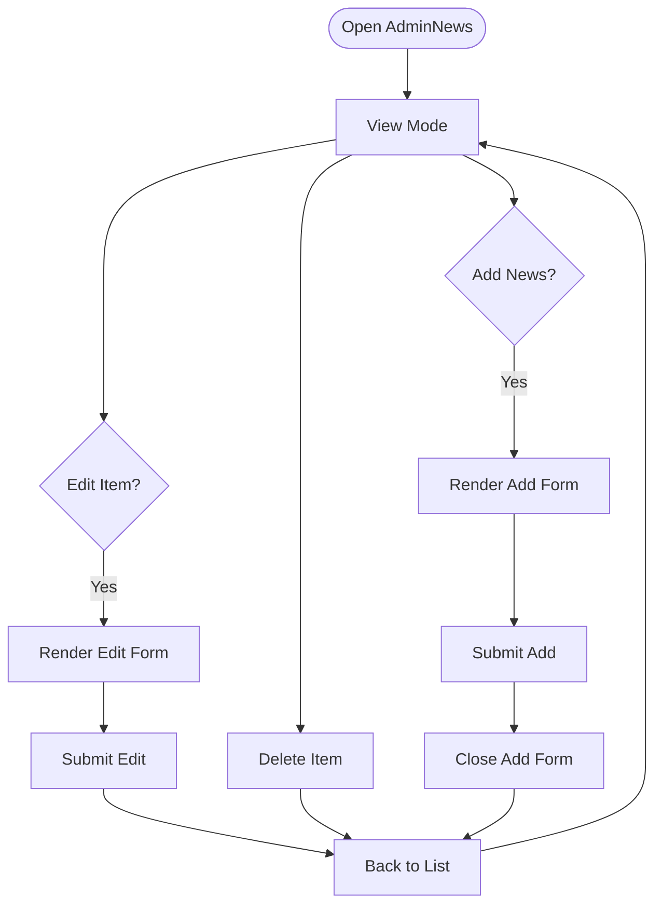
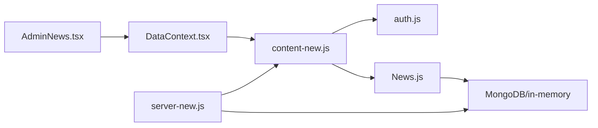

# News Management

<cite>
**Referenced Files in This Document**
- [News.js](file://server/models/News.js)
- [content-new.js](file://server/routes/content-new.js)
- [AdminNews.tsx](file://src/pages/admin/AdminNews.tsx)
- [DataContext.tsx](file://src/context/DataContext.tsx)
- [types.ts](file://src/types.ts)
- [auth.js](file://server/middleware/auth.js)
- [validators.js](file://server/utils/validators.js)
- [server-new.js](file://server/server-new.js)
- [in-memory.js](file://server/db/in-memory.js)
- [seed.js](file://server/scripts/seedContent.js)
- [Content.js](file://server/models/Content.js)
- [server.js](file://server/server.js)
- [content.js](file://server/routes/content.js)
</cite>

## Table of Contents
1. [Introduction](#introduction)
2. [Project Structure](#project-structure)
3. [Core Components](#core-components)
4. [Architecture Overview](#architecture-overview)
5. [Detailed Component Analysis](#detailed-component-analysis)
6. [Dependency Analysis](#dependency-analysis)
7. [Performance Considerations](#performance-considerations)
8. [Troubleshooting Guide](#troubleshooting-guide)
9. [Conclusion](#conclusion)
10. [Appendices](#appendices)

## Introduction
This document describes the news management system for article creation, editing, and publication workflows. It covers the news article form fields (title, summary, content, category), rich text editor integration, content validation rules, SEO optimization features, and CRUD operations. It also documents the approval workflow, draft saving, automated publishing schedules, archiving, search indexing, and social media integration. Finally, it explains the relationships between news articles and other content types and how administrators manage visibility and priority.

## Project Structure
The news management system spans frontend and backend components:
- Frontend admin interface for managing news items
- Data context for API communication
- Backend routes for content CRUD operations
- Mongoose model for news persistence
- Authentication and authorization middleware
- In-memory database for development/demo
- SEO and performance enhancements

**Diagram sources**
- [AdminNews.tsx](file://src/pages/admin/AdminNews.tsx#L1-L212)
- [DataContext.tsx](file://src/context/DataContext.tsx#L1-L259)
- [types.ts](file://src/types.ts#L26-L35)
- [server-new.js](file://server/server-new.js#L1-L133)
- [content-new.js](file://server/routes/content-new.js#L1-L441)
- [auth.js](file://server/middleware/auth.js#L1-L45)
- [validators.js](file://server/utils/validators.js#L1-L72)
- [News.js](file://server/models/News.js#L1-L64)
- [in-memory.js](file://server/db/in-memory.js#L1-L271)

**Section sources**
- [AdminNews.tsx](file://src/pages/admin/AdminNews.tsx#L1-L212)
- [DataContext.tsx](file://src/context/DataContext.tsx#L1-L259)
- [types.ts](file://src/types.ts#L26-L35)
- [server-new.js](file://server/server-new.js#L1-L133)
- [content-new.js](file://server/routes/content-new.js#L1-L441)
- [auth.js](file://server/middleware/auth.js#L1-L45)
- [validators.js](file://server/utils/validators.js#L1-L72)
- [News.js](file://server/models/News.js#L1-L64)
- [in-memory.js](file://server/db/in-memory.js#L1-L271)

## Core Components
- News model defines fields, validation rules, indexes, and virtuals for formatted dates.
- Content routes expose REST endpoints for news CRUD, filtering by category, pagination, and view counting.
- Admin UI provides a simple form for creating/editing news with category selection.
- Data context manages API calls for news operations and state updates.
- Authentication middleware enforces admin-only access for write operations.
- In-memory database supports development and demo scenarios.

Key capabilities:
- Article creation with title, summary, optional content, category, author association, and image URL
- Editing and deletion with validation
- Publication status flag and view counter
- Category taxonomy: News, Analytics, Event
- Pagination and category filtering for public listing

**Section sources**
- [News.js](file://server/models/News.js#L3-L45)
- [content-new.js](file://server/routes/content-new.js#L129-L219)
- [AdminNews.tsx](file://src/pages/admin/AdminNews.tsx#L13-L56)
- [DataContext.tsx](file://src/context/DataContext.tsx#L129-L157)
- [auth.js](file://server/middleware/auth.js#L36-L42)

## Architecture Overview
The system follows a layered architecture:
- Presentation layer: React admin UI
- Application layer: Express routes with middleware
- Domain layer: Mongoose model with indexes and virtuals
- Data layer: MongoDB via Mongoose or in-memory simulation

**Diagram sources**
- [AdminNews.tsx](file://src/pages/admin/AdminNews.tsx#L39-L56)
- [DataContext.tsx](file://src/context/DataContext.tsx#L129-L157)
- [content-new.js](file://server/routes/content-new.js#L173-L219)
- [auth.js](file://server/middleware/auth.js#L5-L42)
- [News.js](file://server/models/News.js#L1-L64)
- [in-memory.js](file://server/db/in-memory.js#L37-L83)

## Detailed Component Analysis

### News Model and Validation
The news model defines:
- Required title and summary with length limits
- Optional content field with length limit
- Category enum with default
- Author reference to User
- Image URL, publication flag, and view counter
- Timestamps and indexes for efficient queries

Validation rules:
- Title: required, trimmed, max 300 characters
- Summary: required, max 500 characters
- Content: max 5000 characters
- Category: enum ['News','Analytics','Event'], default 'News'

Indexes:
- Sort by date descending
- Compound index by category and date
- Compound index by publication status and date

Virtual:
- Formatted date for display

**Diagram sources**
- [News.js](file://server/models/News.js#L3-L61)

**Section sources**
- [News.js](file://server/models/News.js#L3-L61)

### Content Routes: News CRUD
Endpoints:
- GET /api/content/news: List published news with pagination and optional category filter
- GET /api/content/news/:id: Retrieve news by ID and increment views
- POST /api/content/news: Create news (admin-only)
- PUT /api/content/news/:id: Update news (admin-only)
- DELETE /api/content/news/:id: Delete news (admin-only)

Pagination and filtering:
- Query parameters: limit, page, category
- Sorting: newest first by date
- Population: author fields included

Authentication and authorization:
- All write endpoints require authenticated admin user

**Diagram sources**
- [content-new.js](file://server/routes/content-new.js#L129-L219)
- [auth.js](file://server/middleware/auth.js#L5-L42)
- [News.js](file://server/models/News.js#L1-L64)

**Section sources**
- [content-new.js](file://server/routes/content-new.js#L129-L219)
- [auth.js](file://server/middleware/auth.js#L36-L42)

### Admin UI: News Management
The admin page provides:
- Add news form with category dropdown and input fields
- Edit mode per item with inline controls
- Pagination controls for browsing items
- Delete action for removing items

Form fields:
- Date (displayed)
- Category (dropdown)
- Title
- Summary (textarea)

State management:
- Local state for editing and adding forms
- Pagination state with items per page

**Diagram sources**
- [AdminNews.tsx](file://src/pages/admin/AdminNews.tsx#L67-L107)
- [AdminNews.tsx](file://src/pages/admin/AdminNews.tsx#L112-L151)
- [AdminNews.tsx](file://src/pages/admin/AdminNews.tsx#L185-L207)

**Section sources**
- [AdminNews.tsx](file://src/pages/admin/AdminNews.tsx#L13-L56)
- [AdminNews.tsx](file://src/pages/admin/AdminNews.tsx#L112-L151)
- [AdminNews.tsx](file://src/pages/admin/AdminNews.tsx#L185-L207)

### Data Context: API Integration
The data context encapsulates:
- Fetching initial content (services, team, news, FAQ)
- Protected data loading (clients, inquiries) with bearer token
- CRUD operations for news with optimistic UI updates
- Error handling and loading states

API endpoints used:
- GET /api/content/news
- POST /api/content/news
- PUT /api/content/news/:id
- DELETE /api/content/news/:id

**Section sources**
- [DataContext.tsx](file://src/context/DataContext.tsx#L44-L87)
- [DataContext.tsx](file://src/context/DataContext.tsx#L129-L157)

### Authentication and Authorization
- Token verification middleware attaches user to request
- Admin-only middleware restricts write operations
- JWT utilities support token lifecycle

**Section sources**
- [auth.js](file://server/middleware/auth.js#L5-L42)

### Validation Utilities
While the backend enforces validation via Mongoose schema, the validators module provides reusable validation helpers for other parts of the system (e.g., user registration). These utilities can be leveraged consistently across the application.

**Section sources**
- [validators.js](file://server/utils/validators.js#L1-L72)

### Database Layer
- MongoDB connection and environment configuration
- In-memory database simulation for development
- Seed script initializes sample content

**Section sources**
- [server-new.js](file://server/server-new.js#L23-L32)
- [in-memory.js](file://server/db/in-memory.js#L118-L264)
- [seed.js](file://server/scripts/seedContent.js#L76-L123)

### Legacy Implementation Notes
The repository contains both a legacy content route file and a newer content route file. The newer implementation under content-new.js is the active one for production use, while the legacy content.js demonstrates earlier patterns.

**Section sources**
- [content.js](file://server/routes/content.js#L83-L130)
- [Content.js](file://server/models/Content.js#L22-L34)

## Dependency Analysis
The following diagram shows key dependencies among components:

**Diagram sources**
- [AdminNews.tsx](file://src/pages/admin/AdminNews.tsx#L1-L212)
- [DataContext.tsx](file://src/context/DataContext.tsx#L1-L259)
- [content-new.js](file://server/routes/content-new.js#L1-L441)
- [auth.js](file://server/middleware/auth.js#L1-L45)
- [News.js](file://server/models/News.js#L1-L64)
- [server-new.js](file://server/server-new.js#L1-L133)
- [in-memory.js](file://server/db/in-memory.js#L1-L271)

**Section sources**
- [AdminNews.tsx](file://src/pages/admin/AdminNews.tsx#L1-L212)
- [DataContext.tsx](file://src/context/DataContext.tsx#L1-L259)
- [content-new.js](file://server/routes/content-new.js#L1-L441)
- [auth.js](file://server/middleware/auth.js#L1-L45)
- [News.js](file://server/models/News.js#L1-L64)
- [server-new.js](file://server/server-new.js#L1-L133)
- [in-memory.js](file://server/db/in-memory.js#L1-L271)

## Performance Considerations
- Database indexes on date, category+date, and isPublished+date improve query performance for listing and filtering.
- Pagination reduces payload sizes for large datasets.
- View counting increments on retrieval; consider caching or batch updates for high-traffic scenarios.
- Frontend uses optimistic updates for smoother UX; ensure conflict resolution if concurrent edits occur.

[No sources needed since this section provides general guidance]

## Troubleshooting Guide
Common issues and resolutions:
- Access denied errors: Ensure admin role and valid bearer token are present on write operations.
- Not found errors: Verify resource IDs and that the resource exists.
- Validation failures: Check field lengths and enums against model constraints.
- Pagination anomalies: Confirm query parameters and index usage for sorting.

**Section sources**
- [auth.js](file://server/middleware/auth.js#L10-L33)
- [content-new.js](file://server/routes/content-new.js#L162-L201)
- [News.js](file://server/models/News.js#L4-L17)

## Conclusion
The news management system provides a robust foundation for creating, editing, and publishing news articles with strong validation, admin-only write protections, and scalable pagination. The admin UI simplifies content management, while the backend ensures data integrity and performance through indexes and middleware. Future enhancements can include rich text editor integration, approval workflows, scheduled publishing, SEO metadata fields, and social sharing features.

[No sources needed since this section summarizes without analyzing specific files]

## Appendices

### API Reference: News Endpoints
- GET /api/content/news?page&limit&category
  - Returns paginated list of published news with author population
- GET /api/content/news/:id
  - Returns single news item and increments views
- POST /api/content/news
  - Creates news with author set to current user
- PUT /api/content/news/:id
  - Updates news
- DELETE /api/content/news/:id
  - Deletes news

**Section sources**
- [content-new.js](file://server/routes/content-new.js#L129-L219)

### Rich Text Editor Integration
Current implementation uses plain text inputs in the admin UI. To integrate a rich text editor:
- Replace textarea with a WYSIWYG editor component
- Sanitize and validate HTML content server-side
- Store sanitized HTML in the content field
- Render content safely in the frontend

[No sources needed since this section provides general guidance]

### Content Validation Rules
- Title: required, max 300 characters
- Summary: required, max 500 characters
- Content: optional, max 5000 characters
- Category: enum ['News','Analytics','Event'], default 'News'
- Author: ObjectId reference to User
- Publication status: boolean flag
- Views: integer counter

**Section sources**
- [News.js](file://server/models/News.js#L4-L17)
- [News.js](file://server/models/News.js#L19-L22)
- [News.js](file://server/models/News.js#L28-L31)
- [News.js](file://server/models/News.js#L35-L42)

### SEO Optimization Features
- robots.txt and sitemap.xml for search engine control
- structured data and meta tags for improved indexing
- Canonical URLs and Open Graph/Twitter cards

**Section sources**
- [server-new.js](file://server/server-new.js#L44-L55)

### Approval Workflow and Draft Saving
- Current model defaults to published; introduce draft flag and approval status
- Add workflow transitions: draft → review → approved → published
- Store reviewer and timestamps for audit trail

[No sources needed since this section provides general guidance]

### Automated Publishing Schedules
- Add scheduled publish date field
- Background job to publish pending items at due time
- Notifications for publish completion

[No sources needed since this section provides general guidance]

### Archiving and Search Indexing
- Archive old articles by moving to archive collection
- Index news for internal search with title, summary, and content
- Support full-text search with database capabilities

[No sources needed since this section provides general guidance]

### Social Media Integration
- Generate shareable links and preview metadata
- Integrate social sharing buttons
- Track engagement metrics

[No sources needed since this section provides general guidance]

### Relationship Between News and Other Content Types
- News can link to Services, Team Members, FAQs, Clients, and Inquiries
- Cross-references enable richer storytelling and navigation
- Use populate/population in routes to enrich related data

**Section sources**
- [content-new.js](file://server/routes/content-new.js#L139-L139)
- [content-new.js](file://server/routes/content-new.js#L160-L160)

### Administrator Visibility and Priority
- Admin-only endpoints protect content integrity
- Priority can be managed via ordering fields or separate priority index
- Visibility toggles controlled by publication status flag

**Section sources**
- [auth.js](file://server/middleware/auth.js#L36-L42)
- [News.js](file://server/models/News.js#L35-L38)