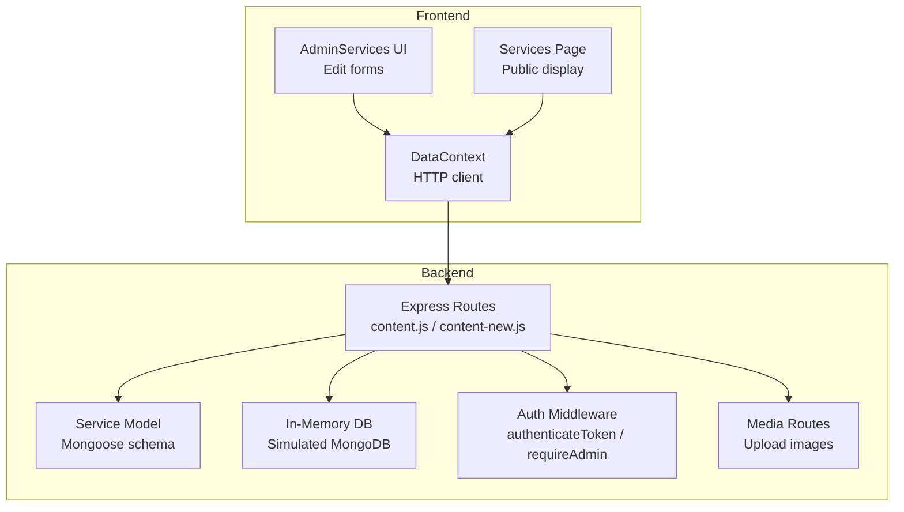
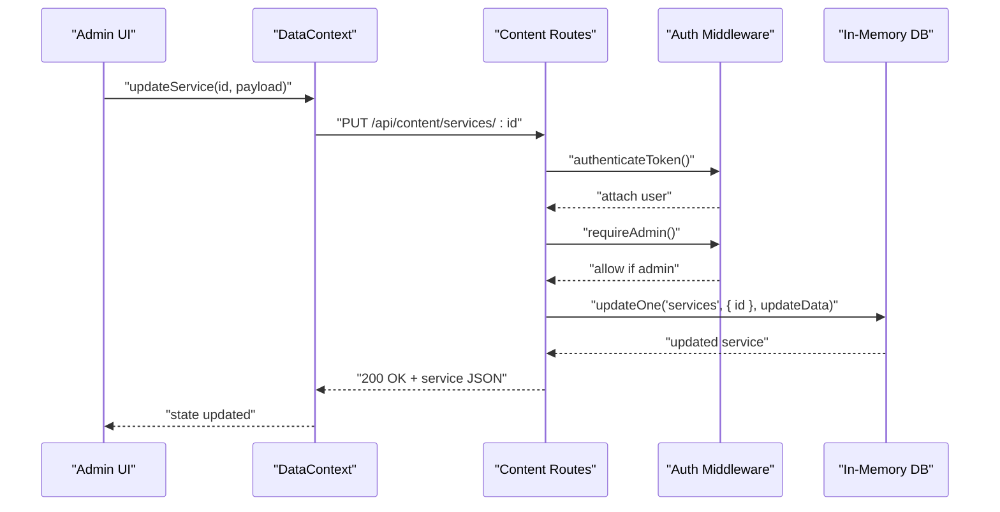
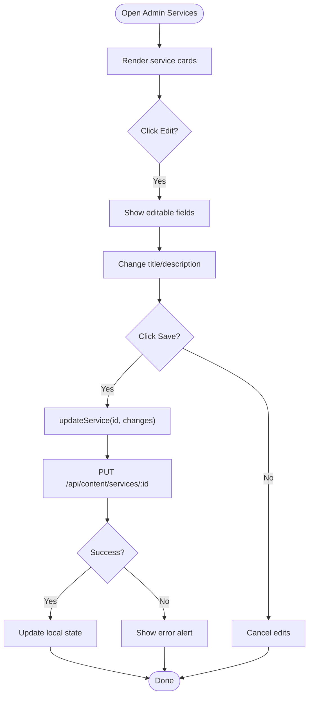
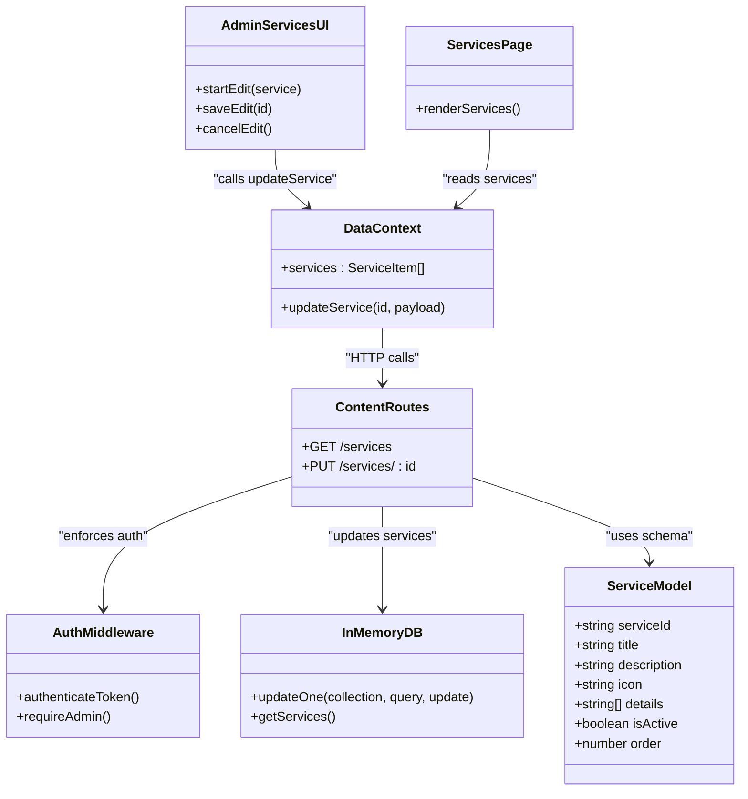

# Services Management

<cite>
**Referenced Files in This Document**
- [Service.js](file://server/models/Service.js)
- [AdminServices.tsx](file://src/pages/admin/AdminServices.tsx)
- [content.js](file://server/routes/content.js)
- [content-new.js](file://server/routes/content-new.js)
- [Services.tsx](file://src/pages/Services.tsx)
- [in-memory.js](file://server/db/in-memory.js)
- [DataContext.tsx](file://src/context/DataContext.tsx)
- [types.ts](file://src/types.ts)
- [auth.js](file://server/middleware/auth.js)
- [media.js](file://server/routes/media.js)
- [server.js](file://server/server.js)
- [server-new.js](file://server/server-new.js)
</cite>

## Table of Contents
1. [Introduction](#introduction)
2. [Project Structure](#project-structure)
3. [Core Components](#core-components)
4. [Architecture Overview](#architecture-overview)
5. [Detailed Component Analysis](#detailed-component-analysis)
6. [Dependency Analysis](#dependency-analysis)
7. [Performance Considerations](#performance-considerations)
8. [Troubleshooting Guide](#troubleshooting-guide)
9. [Conclusion](#conclusion)

## Introduction
This document describes the services management system with a focus on service creation, editing, and deletion workflows. It documents the service form interface, validation rules, image upload capabilities, ordering functionality, and the integration with the frontend service display. It also covers service visibility controls, administrative permissions, and how administrators can manage service presentation and priority.

## Project Structure
The services management system spans backend models and routes, an in-memory database simulation, frontend data context and admin UI, and media upload capabilities.

**Diagram sources**
- [AdminServices.tsx](file://src/pages/admin/AdminServices.tsx#L1-L131)
- [Services.tsx](file://src/pages/Services.tsx#L1-L53)
- [DataContext.tsx](file://src/context/DataContext.tsx#L1-L259)
- [content.js](file://server/routes/content.js#L1-L267)
- [content-new.js](file://server/routes/content-new.js#L1-L90)
- [Service.js](file://server/models/Service.js#L1-L49)
- [in-memory.js](file://server/db/in-memory.js#L1-L271)
- [auth.js](file://server/middleware/auth.js#L1-L45)
- [media.js](file://server/routes/media.js#L1-L142)

**Section sources**
- [AdminServices.tsx](file://src/pages/admin/AdminServices.tsx#L1-L131)
- [Services.tsx](file://src/pages/Services.tsx#L1-L53)
- [DataContext.tsx](file://src/context/DataContext.tsx#L1-L259)
- [content.js](file://server/routes/content.js#L1-L267)
- [content-new.js](file://server/routes/content-new.js#L1-L90)
- [Service.js](file://server/models/Service.js#L1-L49)
- [in-memory.js](file://server/db/in-memory.js#L1-L271)
- [auth.js](file://server/middleware/auth.js#L1-L45)
- [media.js](file://server/routes/media.js#L1-L142)

## Core Components
- Service model defines the schema with title, description, icon, details, isActive flag, and order field.
- Admin UI allows editing title and description for each service.
- Frontend displays services with icons and optional details list.
- Data context manages HTTP calls to content endpoints and updates local state.
- Authentication middleware enforces admin-only access for write operations.
- Media routes support image uploads for service assets.

**Section sources**
- [Service.js](file://server/models/Service.js#L3-L44)
- [AdminServices.tsx](file://src/pages/admin/AdminServices.tsx#L50-L126)
- [Services.tsx](file://src/pages/Services.tsx#L14-L46)
- [DataContext.tsx](file://src/context/DataContext.tsx#L89-L97)
- [auth.js](file://server/middleware/auth.js#L36-L42)
- [media.js](file://server/routes/media.js#L47-L70)

## Architecture Overview
The system follows a layered architecture:
- Presentation layer: React admin UI and public services page
- Data layer: DataContext orchestrates HTTP requests
- API layer: Express routes handle CRUD operations
- Persistence layer: In-memory DB (simulating MongoDB) or Mongoose models
- Security layer: Authentication and admin authorization middleware

**Diagram sources**
- [AdminServices.tsx](file://src/pages/admin/AdminServices.tsx#L23-L34)
- [DataContext.tsx](file://src/context/DataContext.tsx#L89-L97)
- [content.js](file://server/routes/content.js#L16-L30)
- [auth.js](file://server/middleware/auth.js#L36-L42)
- [in-memory.js](file://server/db/in-memory.js#L47-L61)

## Detailed Component Analysis

### Service Model and Schema
The Service model defines:
- serviceId: unique identifier
- title: required, trimmed, max length 200
- description: required, max length 1000
- icon: required, default icon name
- details: array of strings, each up to 500 chars
- isActive: boolean flag for visibility
- order: numeric priority for display sorting

Indexes:
- serviceId: 1
- { isActive: 1, order: 1 }

These fields enable:
- Unique identification per service
- Controlled visibility via isActive
- Deterministic ordering via order
- Rich presentation with icon and details

**Section sources**
- [Service.js](file://server/models/Service.js#L3-L44)

### Admin Services UI (Editing Workflow)
The admin page renders a list of services. Each service card supports inline editing of:
- Title
- Description

Saving uses DataContext’s updateService, which performs a PUT to the content API. The UI disables actions while saving and shows a spinner.

**Diagram sources**
- [AdminServices.tsx](file://src/pages/admin/AdminServices.tsx#L12-L34)
- [DataContext.tsx](file://src/context/DataContext.tsx#L89-L97)
- [content.js](file://server/routes/content.js#L16-L30)

**Section sources**
- [AdminServices.tsx](file://src/pages/admin/AdminServices.tsx#L50-L126)
- [DataContext.tsx](file://src/context/DataContext.tsx#L89-L97)

### Public Services Display
The public Services page fetches services and renders:
- Icon placeholder using the service.icon
- Title and description
- Optional details bullet list
- “Order now” link pre-filled with service title

This page consumes the same services data used by the admin interface.

**Section sources**
- [Services.tsx](file://src/pages/Services.tsx#L14-L46)
- [DataContext.tsx](file://src/context/DataContext.tsx#L49-L68)

### Data Context and HTTP Layer
DataContext coordinates:
- Initial load of services, team, news, FAQ
- Updating a service via PUT /api/content/services/:id
- Maintains loading state and error handling

Endpoints used:
- GET /api/content/services
- PUT /api/content/services/:id (authenticated, admin)

**Section sources**
- [DataContext.tsx](file://src/context/DataContext.tsx#L44-L68)
- [DataContext.tsx](file://src/context/DataContext.tsx#L89-L97)

### Backend Routes and Permissions
Two route sets exist:
- Legacy content routes (content.js): GET /services and PUT /services/:id (authenticated)
- New content routes (content-new.js): GET /services (public), GET /services/:id, PUT /services/:serviceId (authenticated, admin)

Permissions:
- authenticateToken: validates bearer token
- requireAdmin: restricts to admin role

Sorting and filtering:
- New routes sort services by { isActive: 1, order: 1 } and filter by isActive: true for public retrieval

**Section sources**
- [content.js](file://server/routes/content.js#L7-L30)
- [content-new.js](file://server/routes/content-new.js#L22-L59)
- [auth.js](file://server/middleware/auth.js#L5-L42)

### In-Memory Database Simulation
The in-memory DB simulates MongoDB collections:
- Collections: services, teamMembers, news, faqs, clients, inquiries
- Provides CRUD helpers: find, findOne, insertOne, updateOne, deleteOne
- Initializes with sample services data
- Used by legacy content routes

Note: The new routes use Mongoose models and actual MongoDB connections.

**Section sources**
- [in-memory.js](file://server/db/in-memory.js#L4-L91)
- [in-memory.js](file://server/db/in-memory.js#L119-L264)

### Image Upload Capabilities
The media routes support:
- Single image upload: POST /api/media/upload
- Multiple images upload: POST /api/media/upload-multiple
- File listing: GET /api/media/files
- File deletion: DELETE /api/media/files/:filename
- Static serving of uploaded files

Validation:
- Only image MIME types accepted
- Max file size 5MB
- Unique filenames generated

Integration:
- Admin UI can leverage these endpoints to upload service-related images; current admin form does not expose image selection but the capability exists.

**Section sources**
- [media.js](file://server/routes/media.js#L47-L96)
- [media.js](file://server/routes/media.js#L99-L137)

### Validation Rules
Model-level validation (Mongoose):
- title: required, max length 200
- description: required, max length 1000
- icon: required, default icon name
- details: array of strings, each up to 500 chars
- isActive: boolean default true
- order: number default 0

Route-level validation (new routes):
- PUT /api/content/services/:serviceId requires title, description, details in request body

Note: The legacy content routes do not enforce field presence at the route level; validation occurs in the model.

**Section sources**
- [Service.js](file://server/models/Service.js#L10-L29)
- [content-new.js](file://server/routes/content-new.js#L45-L52)

### Service Ordering and Visibility Controls
- Ordering: Services are sorted by order ascending; isActive filters public listings.
- Visibility: isActive flag controls whether a service appears on the public page.
- Priority: Administrators adjust order to change display priority.

**Section sources**
- [content-new.js](file://server/routes/content-new.js#L22-L25)
- [Service.js](file://server/models/Service.js#L30-L37)

### Service Approval and Publishing Controls
- Approval workflow: Not implemented in the current codebase.
- Publishing controls: isActive toggles visibility; order controls prominence.
- Relationship with other content types: Services are separate from team, news, FAQ, clients, and inquiries.

**Section sources**
- [Service.js](file://server/models/Service.js#L30-L37)
- [content-new.js](file://server/routes/content-new.js#L22-L25)

### Service Scheduling, Availability, and Expiration
- Scheduling features: Not implemented in the current codebase.
- Availability management: Not implemented in the current codebase.
- Automated expiration: Not implemented in the current codebase.

**Section sources**
- [Service.js](file://server/models/Service.js#L1-L49)

### Frontend Integration and Display
- Admin UI: Uses DataContext to fetch and update services.
- Public UI: Renders services with icons, descriptions, and optional details.
- Link integration: “Order now” links pre-fill the contact subject with the service title.

**Section sources**
- [AdminServices.tsx](file://src/pages/admin/AdminServices.tsx#L6-L7)
- [Services.tsx](file://src/pages/Services.tsx#L14-L46)
- [DataContext.tsx](file://src/context/DataContext.tsx#L49-L68)

## Dependency Analysis

**Diagram sources**
- [Service.js](file://server/models/Service.js#L3-L44)
- [AdminServices.tsx](file://src/pages/admin/AdminServices.tsx#L12-L34)
- [Services.tsx](file://src/pages/Services.tsx#L14-L46)
- [DataContext.tsx](file://src/context/DataContext.tsx#L89-L97)
- [content.js](file://server/routes/content.js#L7-L30)
- [auth.js](file://server/middleware/auth.js#L36-L42)
- [in-memory.js](file://server/db/in-memory.js#L47-L61)

**Section sources**
- [Service.js](file://server/models/Service.js#L1-L49)
- [AdminServices.tsx](file://src/pages/admin/AdminServices.tsx#L1-L131)
- [Services.tsx](file://src/pages/Services.tsx#L1-L53)
- [DataContext.tsx](file://src/context/DataContext.tsx#L1-L259)
- [content.js](file://server/routes/content.js#L1-L267)
- [auth.js](file://server/middleware/auth.js#L1-L45)
- [in-memory.js](file://server/db/in-memory.js#L1-L271)

## Performance Considerations
- Sorting and indexing: The model includes indexes on { serviceId: 1 } and { isActive: 1, order: 1 }, supporting efficient lookups and ordered retrieval.
- Public listing: New routes filter by isActive and sort by order, minimizing frontend work.
- In-memory DB: Suitable for development; for production, ensure proper database indexing and connection pooling.

[No sources needed since this section provides general guidance]

## Troubleshooting Guide
Common issues and resolutions:
- Authentication failures: Ensure a valid Bearer token is included for protected endpoints.
- Authorization failures: Confirm the user has admin role for write operations.
- Service not found: Verify the service ID/path parameter matches the expected format.
- Upload errors: Confirm the file is an image and under 5MB; check server logs for multer errors.
- Validation errors: Ensure title and description meet length constraints; details entries are within limits.

**Section sources**
- [auth.js](file://server/middleware/auth.js#L5-L42)
- [content.js](file://server/routes/content.js#L16-L30)
- [media.js](file://server/routes/media.js#L29-L44)
- [Service.js](file://server/models/Service.js#L10-L29)

## Conclusion
The services management system provides a clean separation between admin editing and public display, with strong foundations for visibility and ordering controls. While advanced scheduling, availability, and approval workflows are not present, the underlying model and routes support future extensions. Image upload capabilities are available and can be integrated into the admin interface to enrich service assets.