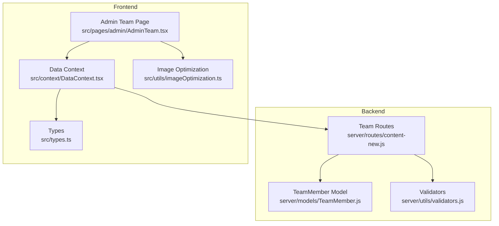
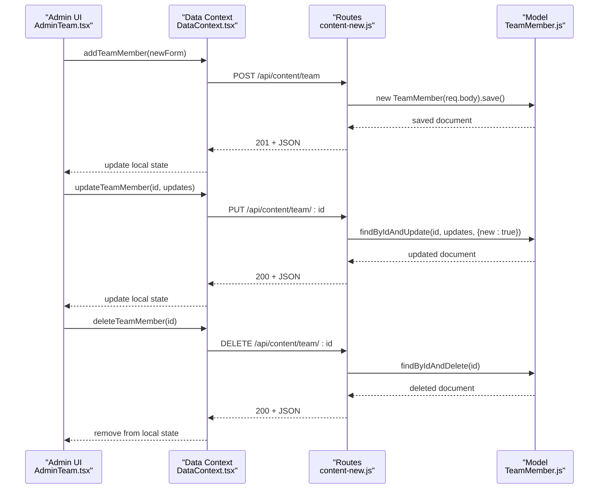
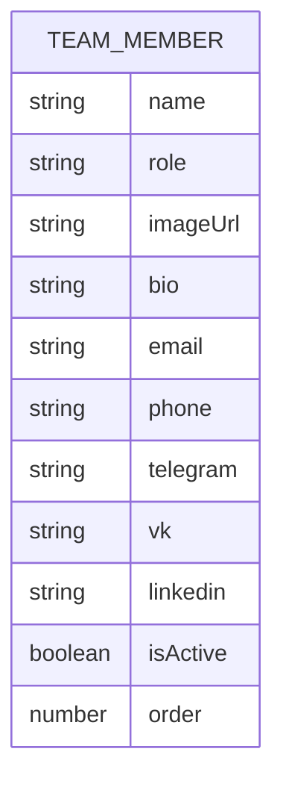
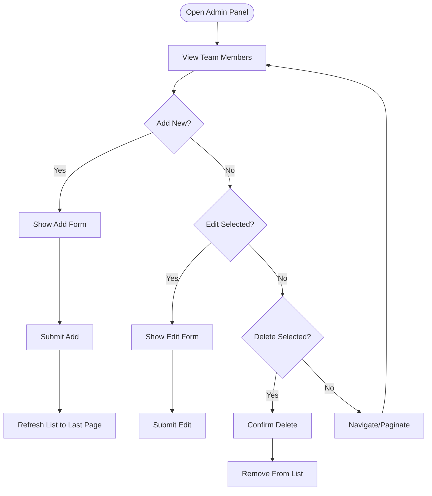
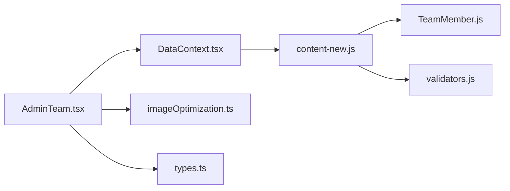

# Team Management

<cite>
**Referenced Files in This Document**
- [TeamMember.js](file://server/models/TeamMember.js)
- [content-new.js](file://server/routes/content-new.js)
- [AdminTeam.tsx](file://src/pages/admin/AdminTeam.tsx)
- [DataContext.tsx](file://src/context/DataContext.tsx)
- [types.ts](file://src/types.ts)
- [imageOptimization.ts](file://src/utils/imageOptimization.ts)
- [validators.js](file://server/utils/validators.js)
- [test-content-api.js](file://server/test-content-api.js)
</cite>

## Table of Contents
1. [Introduction](#introduction)
2. [Project Structure](#project-structure)
3. [Core Components](#core-components)
4. [Architecture Overview](#architecture-overview)
5. [Detailed Component Analysis](#detailed-component-analysis)
6. [Dependency Analysis](#dependency-analysis)
7. [Performance Considerations](#performance-considerations)
8. [Troubleshooting Guide](#troubleshooting-guide)
9. [Conclusion](#conclusion)

## Introduction
This document describes the team member management system with a focus on staff profile creation, editing, and organizational structure management. It covers the team member form fields, validation rules, image optimization, team hierarchy management, CRUD operations, approval and visibility controls, and integration with service assignments. The documentation includes concrete examples from the codebase and illustrates how administrators can manage team member profiles and visibility.

## Project Structure
The team management feature spans the backend (Express/Mongoose) and the frontend (React/TypeScript). Key areas:
- Backend data model and API endpoints for team members
- Frontend admin panel for managing team members
- Shared TypeScript types for team member data
- Image optimization utilities for responsive and efficient image delivery
- Validation utilities for input sanitization

**Diagram sources**
- [TeamMember.js](file://server/models/TeamMember.js#L1-L57)
- [content-new.js](file://server/routes/content-new.js#L65-L118)
- [AdminTeam.tsx](file://src/pages/admin/AdminTeam.tsx#L1-L203)
- [DataContext.tsx](file://src/context/DataContext.tsx#L99-L127)
- [types.ts](file://src/types.ts#L18-L24)
- [imageOptimization.ts](file://src/utils/imageOptimization.ts#L1-L95)
- [validators.js](file://server/utils/validators.js#L1-L72)

**Section sources**
- [TeamMember.js](file://server/models/TeamMember.js#L1-L57)
- [content-new.js](file://server/routes/content-new.js#L65-L118)
- [AdminTeam.tsx](file://src/pages/admin/AdminTeam.tsx#L1-L203)
- [DataContext.tsx](file://src/context/DataContext.tsx#L99-L127)
- [types.ts](file://src/types.ts#L18-L24)
- [imageOptimization.ts](file://src/utils/imageOptimization.ts#L1-L95)
- [validators.js](file://server/utils/validators.js#L1-L72)

## Core Components
- TeamMember data model defines required fields, optional fields, and indexing for ordering and visibility.
- REST endpoints expose GET/POST/PUT/DELETE for team members with admin-only write access.
- Admin UI provides add/edit/delete actions with pagination and loading states.
- Data context encapsulates HTTP calls for team member CRUD operations.
- Types define the shape of team member data used across the app.
- Image optimization utilities support responsive images and lazy loading.

**Section sources**
- [TeamMember.js](file://server/models/TeamMember.js#L3-L49)
- [content-new.js](file://server/routes/content-new.js#L65-L118)
- [AdminTeam.tsx](file://src/pages/admin/AdminTeam.tsx#L8-L53)
- [DataContext.tsx](file://src/context/DataContext.tsx#L99-L127)
- [types.ts](file://src/types.ts#L18-L24)
- [imageOptimization.ts](file://src/utils/imageOptimization.ts#L1-L95)

## Architecture Overview
The system follows a layered architecture:
- Presentation layer: AdminTeam page renders team cards and forms.
- Data layer: DataContext exposes CRUD methods for team members.
- API layer: Express routes enforce authentication and admin roles.
- Persistence layer: Mongoose model stores team member records with indexes for ordering and visibility.

**Diagram sources**
- [AdminTeam.tsx](file://src/pages/admin/AdminTeam.tsx#L38-L53)
- [DataContext.tsx](file://src/context/DataContext.tsx#L99-L127)
- [content-new.js](file://server/routes/content-new.js#L75-L118)
- [TeamMember.js](file://server/models/TeamMember.js#L51-L52)

## Detailed Component Analysis

### TeamMember Data Model
The TeamMember model enforces:
- Required fields: name, role, imageUrl
- Optional fields: bio, email, phone, socialLinks (telegram, vk, linkedin)
- Visibility and ordering: isActive flag and order field
- Indexing: compound index on isActive and order for efficient retrieval

**Diagram sources**
- [TeamMember.js](file://server/models/TeamMember.js#L3-L49)

**Section sources**
- [TeamMember.js](file://server/models/TeamMember.js#L3-L49)

### Team CRUD Endpoints
The backend exposes:
- GET /api/content/team: fetches active team members ordered by order
- POST /api/content/team: creates a new team member (admin-only)
- PUT /api/content/team/:id: updates a team member (admin-only)
- DELETE /api/content/team/:id: deletes a team member (admin-only)

Authorization:
- All endpoints require authentication
- Admin role required for write operations

**Section sources**
- [content-new.js](file://server/routes/content-new.js#L65-L118)

### Admin Team UI
The AdminTeam page provides:
- Add new team member form with name, role, and imageUrl
- Edit existing team member inline
- Delete team member action
- Pagination for browsing team members
- Loading state during data fetch

**Diagram sources**
- [AdminTeam.tsx](file://src/pages/admin/AdminTeam.tsx#L38-L53)

**Section sources**
- [AdminTeam.tsx](file://src/pages/admin/AdminTeam.tsx#L8-L53)

### Data Context and HTTP Calls
The DataContext wraps HTTP interactions:
- addTeamMember: POST /api/content/team
- updateTeamMember: PUT /api/content/team/:id
- deleteTeamMember: DELETE /api/content/team/:id

These methods update the local state after successful API responses.

**Section sources**
- [DataContext.tsx](file://src/context/DataContext.tsx#L99-L127)

### Types and Shape Consistency
The shared TypeScript type TeamMember defines:
- id: number
- name: string
- role: string
- imageUrl: string

This ensures frontend components and API responses align.

**Section sources**
- [types.ts](file://src/types.ts#L18-L24)

### Validation Rules
Backend validation enforced by the model:
- name: required, trimmed, max length 100
- role: required, trimmed, max length 200
- imageUrl: required
- bio: max length 1000
- email: trimmed, lowercase, regex pattern validation
- phone: trimmed
- socialLinks: optional strings for telegram, vk, linkedin
- isActive: boolean, defaults to true
- order: number, defaults to 0

Note: The model does not enforce department assignment or team member approval workflow. These would need to be added to the model and routes if required.

**Section sources**
- [TeamMember.js](file://server/models/TeamMember.js#L4-L46)

### Image Optimization
The frontend provides utilities for responsive and efficient image delivery:
- generateSrcSet: creates responsive srcset attributes
- generateSizes: generates sizes attribute for breakpoints
- preloadImage: preloads critical images
- setupLazyLoading: lazy loads images near viewport
- getOptimizedImageUrl: converts images to WebP when supported

These utilities help optimize image loading performance in the admin panel and other pages.

**Section sources**
- [imageOptimization.ts](file://src/utils/imageOptimization.ts#L11-L94)

### Team Hierarchy Management
The model includes an order field and an index on {isActive: 1, order: 1}. This enables:
- Sorting team members by order
- Filtering by isActive for visibility control

Administrators can adjust the order field to control display precedence.

**Section sources**
- [TeamMember.js](file://server/models/TeamMember.js#L43-L52)

### Team Member Approval Workflow and Active Status
- isActive flag controls visibility in public listings (GET /api/content/team filters by isActive: true)
- There is no explicit approval workflow in the model or routes; administrators can toggle isActive via updates

**Section sources**
- [TeamMember.js](file://server/models/TeamMember.js#L39-L42)
- [content-new.js](file://server/routes/content-new.js#L70-L73)

### Department Filtering and Automated Expiration
- The model does not include a department field or automated expiration date
- If department filtering is required, extend the model with a department field and add query parameters to the GET endpoint
- Automated expiration would require adding an expirationDate field and implementing background jobs or scheduled tasks

[No sources needed since this section provides general guidance]

### Integration with Service Assignments
- The TeamMember model does not include a direct relationship to services
- To integrate team members with services, add a services array or serviceIds field to the TeamMember model and update routes accordingly
- Administrators can then assign services to team members through the admin panel

[No sources needed since this section provides general guidance]

### Example: CRUD Operations from the API Tests
The test suite demonstrates:
- Adding a new team member
- Updating a team member’s role
- Deleting a team member
- Verifying deletion

These operations map directly to the backend endpoints and illustrate expected behavior.

**Section sources**
- [test-content-api.js](file://server/test-content-api.js#L63-L92)

## Dependency Analysis
The AdminTeam page depends on DataContext for HTTP operations. DataContext depends on the backend routes. The routes depend on the TeamMember model. Validators provide reusable validation logic.

**Diagram sources**
- [AdminTeam.tsx](file://src/pages/admin/AdminTeam.tsx#L1-L5)
- [DataContext.tsx](file://src/context/DataContext.tsx#L99-L127)
- [content-new.js](file://server/routes/content-new.js#L65-L118)
- [TeamMember.js](file://server/models/TeamMember.js#L1-L57)
- [validators.js](file://server/utils/validators.js#L1-L72)
- [imageOptimization.ts](file://src/utils/imageOptimization.ts#L1-L95)
- [types.ts](file://src/types.ts#L18-L24)

**Section sources**
- [AdminTeam.tsx](file://src/pages/admin/AdminTeam.tsx#L1-L5)
- [DataContext.tsx](file://src/context/DataContext.tsx#L99-L127)
- [content-new.js](file://server/routes/content-new.js#L65-L118)
- [TeamMember.js](file://server/models/TeamMember.js#L1-L57)
- [validators.js](file://server/utils/validators.js#L1-L72)
- [imageOptimization.ts](file://src/utils/imageOptimization.ts#L1-L95)
- [types.ts](file://src/types.ts#L18-L24)

## Performance Considerations
- Use the order field and compound index to efficiently sort and filter team members
- Apply pagination in the UI to avoid loading large lists at once
- Utilize image optimization utilities to reduce bandwidth and improve load times
- Keep bio and other optional fields concise to minimize payload sizes

[No sources needed since this section provides general guidance]

## Troubleshooting Guide
Common issues and resolutions:
- Authentication failures: Ensure requests include a valid bearer token
- Authorization failures: Verify the user has admin privileges for write operations
- Validation errors: Confirm required fields meet length and format constraints
- Network errors: Check DataContext error logging and retry logic

**Section sources**
- [content-new.js](file://server/routes/content-new.js#L65-L118)
- [DataContext.tsx](file://src/context/DataContext.tsx#L99-L127)
- [validators.js](file://server/utils/validators.js#L21-L46)

## Conclusion
The team member management system provides a solid foundation for creating, editing, and organizing staff profiles. The backend enforces strong validation and exposes secure CRUD endpoints, while the frontend offers an intuitive admin interface with pagination and image optimization. Extending the model to include department assignment, approval workflows, and automated expiration would further enhance administrative capabilities and compliance with organizational needs.