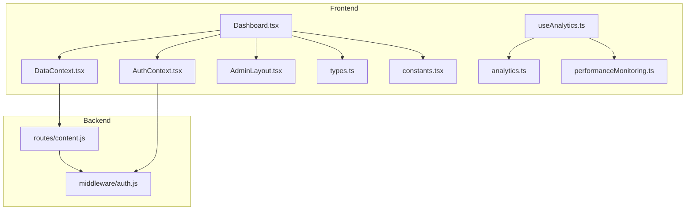
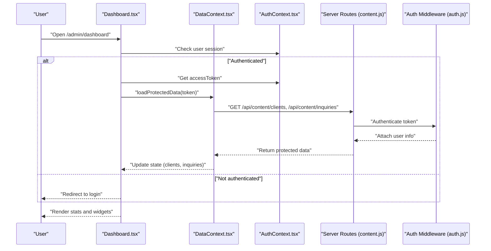
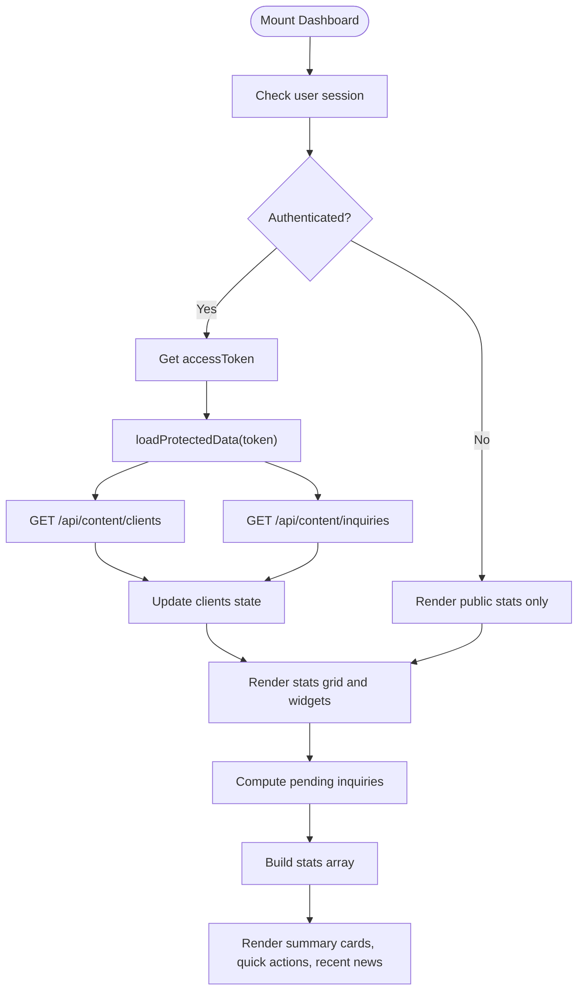
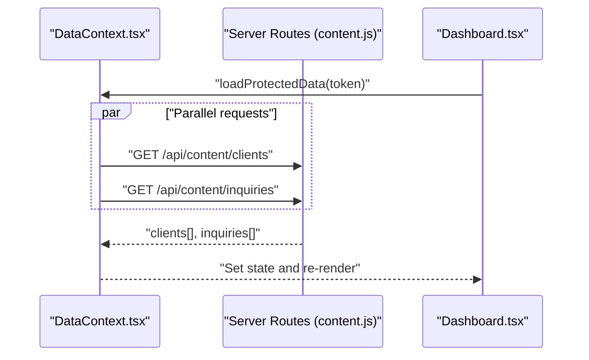
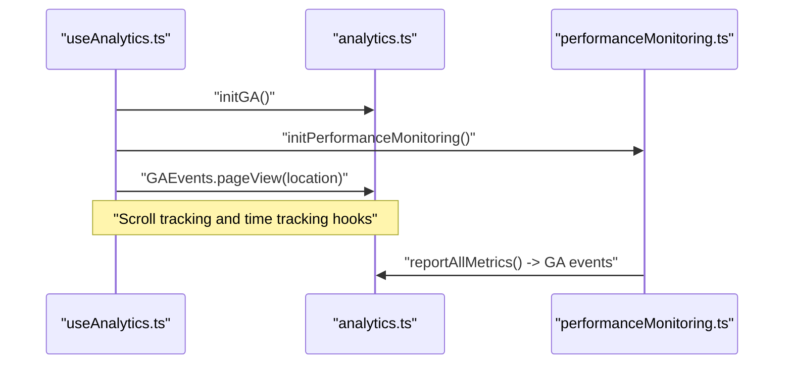
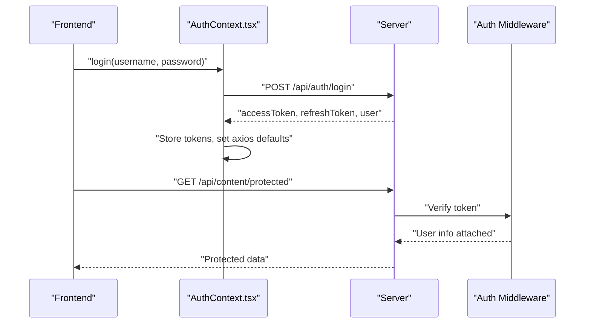
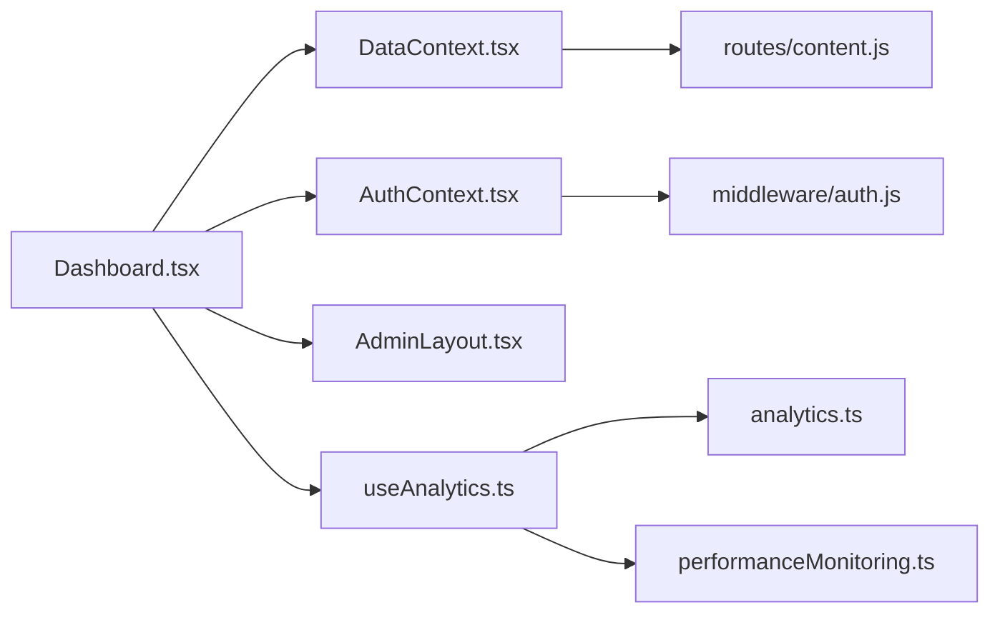

# Dashboard Interface

<cite>
**Referenced Files in This Document**
- [Dashboard.tsx](file://src/pages/admin/Dashboard.tsx)
- [AdminLayout.tsx](file://src/pages/admin/AdminLayout.tsx)
- [DataContext.tsx](file://src/context/DataContext.tsx)
- [AuthContext.tsx](file://src/context/AuthContext.tsx)
- [analytics.ts](file://src/utils/analytics.ts)
- [useAnalytics.ts](file://src/hooks/useAnalytics.ts)
- [performanceMonitoring.ts](file://src/utils/performanceMonitoring.ts)
- [types.ts](file://src/types.ts)
- [constants.tsx](file://src/constants.tsx)
- [content.js](file://server/routes/content.js)
- [auth.js](file://server/middleware/auth.js)
- [responsive.spec.ts](file://e2e/responsive.spec.ts)
</cite>

## Table of Contents
1. [Introduction](#introduction)
2. [Project Structure](#project-structure)
3. [Core Components](#core-components)
4. [Architecture Overview](#architecture-overview)
5. [Detailed Component Analysis](#detailed-component-analysis)
6. [Dependency Analysis](#dependency-analysis)
7. [Performance Considerations](#performance-considerations)
8. [Troubleshooting Guide](#troubleshooting-guide)
9. [Conclusion](#conclusion)
10. [Appendices](#appendices)

## Introduction
This document provides a comprehensive guide to the admin dashboard interface focused on analytics, statistics display, and administrative overview. It explains the dashboard layout, widget components, and data visualization elements, documents data fetching mechanisms, real-time updates, and performance metrics display, and covers responsive design patterns, user preferences handling, and customizable dashboard layouts. It also addresses dashboard security, data filtering, and export capabilities, making it accessible to administrators while offering technical implementation details for developers extending dashboard functionality.

## Project Structure
The admin dashboard is part of a React-based frontend integrated with a Node.js/Express backend. The dashboard page composes reusable UI widgets and integrates with shared contexts for data and authentication. Analytics and performance utilities are wired via custom hooks and utility modules. The backend exposes REST endpoints secured with JWT-based authentication.

**Diagram sources**
- [Dashboard.tsx](file://src/pages/admin/Dashboard.tsx#L1-L137)
- [AdminLayout.tsx](file://src/pages/admin/AdminLayout.tsx#L1-L90)
- [DataContext.tsx](file://src/context/DataContext.tsx#L1-L259)
- [AuthContext.tsx](file://src/context/AuthContext.tsx#L1-L187)
- [useAnalytics.ts](file://src/hooks/useAnalytics.ts#L1-L72)
- [analytics.ts](file://src/utils/analytics.ts#L1-L172)
- [performanceMonitoring.ts](file://src/utils/performanceMonitoring.ts#L1-L281)
- [types.ts](file://src/types.ts#L1-L149)
- [constants.tsx](file://src/constants.tsx#L1-L156)
- [content.js](file://server/routes/content.js#L1-L267)
- [auth.js](file://server/middleware/auth.js#L1-L45)

**Section sources**
- [Dashboard.tsx](file://src/pages/admin/Dashboard.tsx#L1-L137)
- [AdminLayout.tsx](file://src/pages/admin/AdminLayout.tsx#L1-L90)
- [DataContext.tsx](file://src/context/DataContext.tsx#L1-L259)
- [AuthContext.tsx](file://src/context/AuthContext.tsx#L1-L187)
- [content.js](file://server/routes/content.js#L1-L267)
- [auth.js](file://server/middleware/auth.js#L1-L45)

## Core Components
- Dashboard page: Renders summary statistics, quick actions, and recent activity.
- Data context: Centralizes data fetching and CRUD operations for services, team, news, FAQ, clients, and inquiries.
- Authentication context: Manages login, logout, token refresh, and protected routes.
- Analytics utilities: Initialize Google Analytics, track page views, scroll depth, time on page, and performance metrics.
- Backend routes: Provide content endpoints with JWT authentication for protected data.

Key implementation references:
- Dashboard rendering and stats grid: [Dashboard.tsx](file://src/pages/admin/Dashboard.tsx#L43-L68)
- Protected data loading on auth: [Dashboard.tsx](file://src/pages/admin/Dashboard.tsx#L11-L19)
- Data context provider and loaders: [DataContext.tsx](file://src/context/DataContext.tsx#L35-L87)
- Authentication lifecycle and interceptors: [AuthContext.tsx](file://src/context/AuthContext.tsx#L25-L163)
- Analytics initialization and tracking: [useAnalytics.ts](file://src/hooks/useAnalytics.ts#L9-L25), [analytics.ts](file://src/utils/analytics.ts#L16-L37)
- Performance monitoring: [performanceMonitoring.ts](file://src/utils/performanceMonitoring.ts#L29-L40)

**Section sources**
- [Dashboard.tsx](file://src/pages/admin/Dashboard.tsx#L1-L137)
- [DataContext.tsx](file://src/context/DataContext.tsx#L1-L259)
- [AuthContext.tsx](file://src/context/AuthContext.tsx#L1-L187)
- [useAnalytics.ts](file://src/hooks/useAnalytics.ts#L1-L72)
- [analytics.ts](file://src/utils/analytics.ts#L1-L172)
- [performanceMonitoring.ts](file://src/utils/performanceMonitoring.ts#L1-L281)

## Architecture Overview
The dashboard follows a layered architecture:
- Presentation layer: Dashboard page and AdminLayout compose UI widgets.
- Data layer: DataContext aggregates data from backend endpoints.
- Security layer: AuthContext manages tokens and axios interceptors; backend enforces JWT-based access control.
- Analytics layer: useAnalytics initializes GA and performance monitoring; analytics.ts wraps gtag calls.

**Diagram sources**
- [Dashboard.tsx](file://src/pages/admin/Dashboard.tsx#L7-L19)
- [DataContext.tsx](file://src/context/DataContext.tsx#L70-L87)
- [AuthContext.tsx](file://src/context/AuthContext.tsx#L54-L91)
- [content.js](file://server/routes/content.js#L182-L240)
- [auth.js](file://server/middleware/auth.js#L5-L34)

## Detailed Component Analysis

### Dashboard Page
The dashboard page renders:
- Welcome header and description
- Summary cards for services, news, team, FAQ, clients, and pending inquiries
- Quick actions for adding content
- Recent news table with category badges

**Diagram sources**
- [Dashboard.tsx](file://src/pages/admin/Dashboard.tsx#L7-L19)
- [Dashboard.tsx](file://src/pages/admin/Dashboard.tsx#L21-L30)
- [DataContext.tsx](file://src/context/DataContext.tsx#L70-L87)

**Section sources**
- [Dashboard.tsx](file://src/pages/admin/Dashboard.tsx#L43-L132)
- [Dashboard.tsx](file://src/pages/admin/Dashboard.tsx#L21-L30)

### Data Context and Fetching Mechanisms
- Initial data: Services, team, news, FAQ loaded concurrently on app startup.
- Protected data: Clients and inquiries fetched after successful login using bearer token.
- CRUD operations: Implemented for all content types, updating state locally and calling backend endpoints.

**Diagram sources**
- [DataContext.tsx](file://src/context/DataContext.tsx#L70-L87)
- [content.js](file://server/routes/content.js#L182-L240)

**Section sources**
- [DataContext.tsx](file://src/context/DataContext.tsx#L44-L87)
- [content.js](file://server/routes/content.js#L82-L240)

### Analytics and Performance Tracking
- Analytics initialization: Loads gtag script and configures GA.
- Page view tracking: Tracks route changes automatically.
- Scroll depth and time on page: Monitors engagement.
- Performance monitoring: Captures Core Web Vitals and reports metrics to GA.

**Diagram sources**
- [useAnalytics.ts](file://src/hooks/useAnalytics.ts#L9-L25)
- [analytics.ts](file://src/utils/analytics.ts#L16-L37)
- [performanceMonitoring.ts](file://src/utils/performanceMonitoring.ts#L29-L40)

**Section sources**
- [useAnalytics.ts](file://src/hooks/useAnalytics.ts#L1-L72)
- [analytics.ts](file://src/utils/analytics.ts#L1-L172)
- [performanceMonitoring.ts](file://src/utils/performanceMonitoring.ts#L1-L281)

### Security and Access Control
- Frontend: Axios interceptors attach Authorization header; token refresh handled automatically.
- Backend: authenticateToken middleware validates tokens and attaches user info; requireAdmin guards protected routes.

**Diagram sources**
- [AuthContext.tsx](file://src/context/AuthContext.tsx#L54-L114)
- [auth.js](file://server/middleware/auth.js#L5-L34)
- [content.js](file://server/routes/content.js#L182-L240)

**Section sources**
- [AuthContext.tsx](file://src/context/AuthContext.tsx#L54-L163)
- [auth.js](file://server/middleware/auth.js#L1-L45)

### Widget Components and Data Visualization Elements
- Summary cards: Display counts for services, news, team, FAQ, clients, and pending inquiries with icons and links to respective admin pages.
- Quick actions: Buttons to add news, team members, and FAQ items.
- Recent news table: Lists latest news items with category badges and truncation for long titles.

Implementation references:
- Summary cards and grid: [Dashboard.tsx](file://src/pages/admin/Dashboard.tsx#L50-L68)
- Quick actions panel: [Dashboard.tsx](file://src/pages/admin/Dashboard.tsx#L70-L91)
- Recent news table: [Dashboard.tsx](file://src/pages/admin/Dashboard.tsx#L93-L131)

Note: The current dashboard does not include dedicated chart components. Developers can integrate chart libraries by adding new components and connecting them to the DataContext.

**Section sources**
- [Dashboard.tsx](file://src/pages/admin/Dashboard.tsx#L50-L131)

### Responsive Design Patterns
The dashboard leverages Tailwind CSS for responsive behavior:
- Grid layouts adapt from single column on mobile to multiple columns on larger screens.
- Typography and spacing adjust across breakpoints.
- Mobile-first navigation and sidebar behavior are handled in AdminLayout.

E2E tests validate responsive behavior across viewports and ensure readability and touch targets meet standards.

**Section sources**
- [Dashboard.tsx](file://src/pages/admin/Dashboard.tsx#L50-L68)
- [AdminLayout.tsx](file://src/pages/admin/AdminLayout.tsx#L1-L90)
- [responsive.spec.ts](file://e2e/responsive.spec.ts#L1-L103)

### User Preferences and Customizable Layouts
- Current state: Dashboard uses static layouts and predefined widgets.
- Extension points:
  - Add preference storage for widget visibility/order.
  - Implement drag-and-drop or toggle controls for widget rearrangement.
  - Persist preferences in localStorage or backend user profile.

[No sources needed since this section proposes extension points conceptually]

### Data Filtering and Export Capabilities
- Filtering: The dashboard currently displays recent items without filters. Implement filter controls and state management to refine datasets.
- Export: Add export buttons to download filtered datasets as CSV or PDF using libraries like csv-stringify and jsPDF.

[No sources needed since this section proposes extension points conceptually]

## Dependency Analysis
The dashboard depends on shared contexts and utilities for data, authentication, and analytics. The backend routes enforce security and expose content endpoints.

**Diagram sources**
- [Dashboard.tsx](file://src/pages/admin/Dashboard.tsx#L1-L137)
- [DataContext.tsx](file://src/context/DataContext.tsx#L1-L259)
- [AuthContext.tsx](file://src/context/AuthContext.tsx#L1-L187)
- [AdminLayout.tsx](file://src/pages/admin/AdminLayout.tsx#L1-L90)
- [content.js](file://server/routes/content.js#L1-L267)
- [auth.js](file://server/middleware/auth.js#L1-L45)
- [useAnalytics.ts](file://src/hooks/useAnalytics.ts#L1-L72)
- [analytics.ts](file://src/utils/analytics.ts#L1-L172)
- [performanceMonitoring.ts](file://src/utils/performanceMonitoring.ts#L1-L281)

**Section sources**
- [Dashboard.tsx](file://src/pages/admin/Dashboard.tsx#L1-L137)
- [DataContext.tsx](file://src/context/DataContext.tsx#L1-L259)
- [AuthContext.tsx](file://src/context/AuthContext.tsx#L1-L187)
- [content.js](file://server/routes/content.js#L1-L267)
- [auth.js](file://server/middleware/auth.js#L1-L45)

## Performance Considerations
- Concurrent data loading: DataContext loads initial content in parallel to reduce perceived latency.
- Lazy initialization: Analytics and performance monitoring are initialized on demand via hooks.
- Metrics reporting: Core Web Vitals are captured and summarized for GA, aiding performance monitoring.

Recommendations:
- Implement pagination for large datasets (clients, inquiries).
- Add caching strategies and debounced filters for improved interactivity.
- Monitor slow resources and optimize bundle sizes.

**Section sources**
- [DataContext.tsx](file://src/context/DataContext.tsx#L44-L68)
- [useAnalytics.ts](file://src/hooks/useAnalytics.ts#L9-L25)
- [performanceMonitoring.ts](file://src/utils/performanceMonitoring.ts#L29-L40)

## Troubleshooting Guide
Common issues and resolutions:
- Missing analytics tracking ID: GA initialization logs a warning when the tracking ID is absent.
- Token errors: AuthContext handles 401 responses by refreshing tokens or logging out.
- Protected data fetch failures: DataContext catches and logs errors during protected data loading.

**Section sources**
- [analytics.ts](file://src/utils/analytics.ts#L17-L20)
- [AuthContext.tsx](file://src/context/AuthContext.tsx#L136-L156)
- [DataContext.tsx](file://src/context/DataContext.tsx#L84-L86)

## Conclusion
The admin dashboard provides a clean, responsive overview of key content and administrative tasks. It integrates secure data access, analytics, and performance monitoring. Developers can extend the dashboard by adding charts, filters, and export capabilities while maintaining security and performance best practices.

## Appendices
- Types and constants: Define shapes for content items and provide mock data for development and testing.
- Backend migration: Guidance for switching to the new server implementation and creating an admin user.

**Section sources**
- [types.ts](file://src/types.ts#L1-L149)
- [constants.tsx](file://src/constants.tsx#L1-L156)
- [MIGRATION.md](file://server/MIGRATION.md#L90-L148)