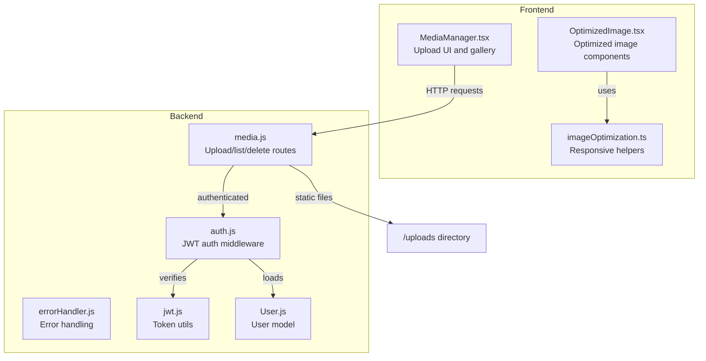
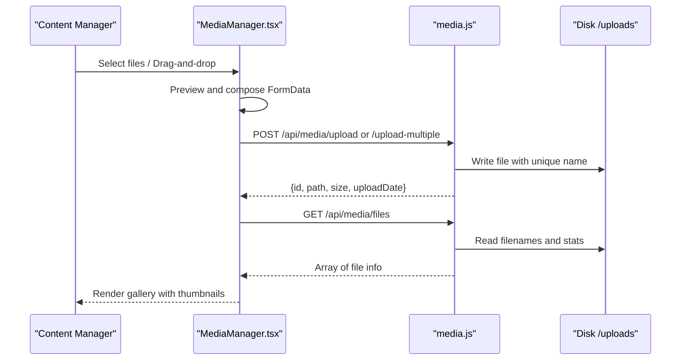
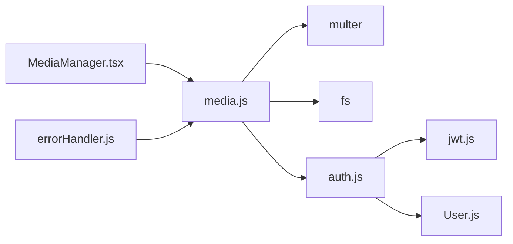

# Media Management

<cite>
**Referenced Files in This Document**
- [media.js](file://server/routes/media.js)
- [MediaManager.tsx](file://src/pages/admin/MediaManager.tsx)
- [imageOptimization.ts](file://src/utils/imageOptimization.ts)
- [OptimizedImage.tsx](file://src/components/OptimizedImage.tsx)
- [auth.js](file://server/middleware/auth.js)
- [errorHandler.js](file://server/middleware/errorHandler.js)
- [jwt.js](file://server/utils/jwt.js)
- [User.js](file://server/models/User.js)
- [package.json](file://server/package.json)
- [DEPLOYMENT.md](file://DEPLOYMENT.md)
- [SECURITY.md](file://SECURITY.md)
</cite>

## Table of Contents
1. [Introduction](#introduction)
2. [Project Structure](#project-structure)
3. [Core Components](#core-components)
4. [Architecture Overview](#architecture-overview)
5. [Detailed Component Analysis](#detailed-component-analysis)
6. [Dependency Analysis](#dependency-analysis)
7. [Performance Considerations](#performance-considerations)
8. [Troubleshooting Guide](#troubleshooting-guide)
9. [Conclusion](#conclusion)
10. [Appendices](#appendices)

## Introduction
This document describes the media management system with a focus on file uploads, image optimization, and media library organization. It explains the upload interface, supported formats and size limits, the image optimization pipeline, thumbnail generation and responsive image handling, storage architecture and static serving, security controls, and media listing and deletion. Practical examples are drawn from the actual codebase to guide both content managers and developers extending the system.

## Project Structure
The media management system spans the backend Express routes and middleware, the frontend admin page, and shared image optimization utilities and components.

**Diagram sources**
- [media.js](file://server/routes/media.js#L1-L142)
- [MediaManager.tsx](file://src/pages/admin/MediaManager.tsx#L1-L308)
- [imageOptimization.ts](file://src/utils/imageOptimization.ts#L1-L95)
- [OptimizedImage.tsx](file://src/components/OptimizedImage.tsx#L1-L82)
- [auth.js](file://server/middleware/auth.js#L1-L45)
- [errorHandler.js](file://server/middleware/errorHandler.js#L1-L65)
- [jwt.js](file://server/utils/jwt.js#L1-L41)
- [User.js](file://server/models/User.js#L1-L105)

**Section sources**
- [media.js](file://server/routes/media.js#L1-L142)
- [MediaManager.tsx](file://src/pages/admin/MediaManager.tsx#L1-L308)
- [imageOptimization.ts](file://src/utils/imageOptimization.ts#L1-L95)
- [OptimizedImage.tsx](file://src/components/OptimizedImage.tsx#L1-L82)
- [auth.js](file://server/middleware/auth.js#L1-L45)
- [errorHandler.js](file://server/middleware/errorHandler.js#L1-L65)
- [jwt.js](file://server/utils/jwt.js#L1-L41)
- [User.js](file://server/models/User.js#L1-L105)

## Core Components
- Upload interface: Drag-and-drop area and file selection with preview and batch upload support.
- Upload endpoints: Single and multiple image uploads with size limits and MIME-type filtering.
- Media library: List endpoint returning metadata and static file serving.
- Deletion endpoint: Secure removal of uploaded files.
- Authentication: JWT-based access control for media endpoints.
- Image optimization utilities: Responsive srcset/sizes generation and lazy/preload helpers.
- Optimized components: Reusable image/picture wrappers with lazy loading and decoding hints.

**Section sources**
- [MediaManager.tsx](file://src/pages/admin/MediaManager.tsx#L160-L244)
- [media.js](file://server/routes/media.js#L28-L44)
- [media.js](file://server/routes/media.js#L46-L96)
- [media.js](file://server/routes/media.js#L98-L121)
- [media.js](file://server/routes/media.js#L123-L140)
- [auth.js](file://server/middleware/auth.js#L5-L34)
- [imageOptimization.ts](file://src/utils/imageOptimization.ts#L11-L31)
- [imageOptimization.ts](file://src/utils/imageOptimization.ts#L51-L71)
- [OptimizedImage.tsx](file://src/components/OptimizedImage.tsx#L15-L36)
- [OptimizedImage.tsx](file://src/components/OptimizedImage.tsx#L54-L81)

## Architecture Overview
The frontend admin page interacts with backend media routes via authenticated HTTP requests. Uploaded files are stored on disk under a dedicated uploads directory and served statically. The backend enforces authentication and file constraints, while the frontend provides previews and a grid view.

**Diagram sources**
- [MediaManager.tsx](file://src/pages/admin/MediaManager.tsx#L55-L96)
- [MediaManager.tsx](file://src/pages/admin/MediaManager.tsx#L22-L36)
- [media.js](file://server/routes/media.js#L46-L96)
- [media.js](file://server/routes/media.js#L98-L121)
- [media.js](file://server/routes/media.js#L139-L140)

## Detailed Component Analysis

### Upload Interface and Batch Operations
- Drag-and-drop area and file input with accept="image/*".
- Preview of selected files and batch upload handling.
- Single vs multiple upload paths using FormData keys "image" and "images".

Concrete examples from the codebase:
- File input and label for drag-and-drop selection.
- Preview creation using FileReader for the first selected image.
- Conditional upload logic: single or array upload based on selection count.
- Reset after successful upload and reload of file list.

**Section sources**
- [MediaManager.tsx](file://src/pages/admin/MediaManager.tsx#L160-L185)
- [MediaManager.tsx](file://src/pages/admin/MediaManager.tsx#L187-L243)
- [MediaManager.tsx](file://src/pages/admin/MediaManager.tsx#L55-L96)

### Upload Endpoint and File Constraints
- Multer disk storage with custom destination and filename generation.
- File filter accepts only image/* MIME types.
- Size limit of 5 MB per file.
- Single and multiple upload handlers return structured metadata.

Key behaviors:
- Unique filename generation prevents collisions.
- Error returned for non-image uploads.
- Limits enforced at upload boundary.

**Section sources**
- [media.js](file://server/routes/media.js#L15-L26)
- [media.js](file://server/routes/media.js#L28-L44)
- [media.js](file://server/routes/media.js#L46-L96)

### Media Library Listing and Static Serving
- GET /api/media/files lists all files, skipping hidden ones, and sorts by upload date.
- Each entry includes id, filename, path, size, and uploadDate.
- Static route serves files from the uploads directory.

Practical usage:
- The frontend constructs image URLs using the base API URL plus the returned path.
- Pagination or search filters are not implemented in the current backend.

**Section sources**
- [media.js](file://server/routes/media.js#L98-L121)
- [media.js](file://server/routes/media.js#L139-L140)
- [MediaManager.tsx](file://src/pages/admin/MediaManager.tsx#L264-L268)

### Delete Endpoint
- DELETE /api/media/files/:filename removes a file by name.
- Requires authentication and returns success or error messages.

**Section sources**
- [media.js](file://server/routes/media.js#L123-L137)

### Authentication and Access Control
- All media endpoints are protected by authenticateToken middleware.
- Token verification decodes user identity and attaches user info to the request.
- Role checks can be extended using requireAdmin if needed.

**Section sources**
- [media.js](file://server/routes/media.js#L5)
- [auth.js](file://server/middleware/auth.js#L5-L34)
- [jwt.js](file://server/utils/jwt.js#L28-L34)
- [User.js](file://server/models/User.js#L26-L30)

### Image Optimization Pipeline and Responsive Images
- Utilities for generating srcset and sizes attributes for responsive images.
- Lazy loading setup using IntersectionObserver.
- Optional WebP conversion detection for browsers supporting WebP.
- Optimized image components provide lazy loading and decoding hints.

Implementation highlights:
- generateSrcSet produces width descriptors for srcset.
- generateSizes builds media-query-aware sizes strings.
- setupLazyLoading observes images entering the viewport.
- getOptimizedImageUrl switches to WebP when supported.

Note: The current backend does not perform server-side resizing or WebP conversion. These utilities are intended for frontend consumption and URL-based transformations.

**Section sources**
- [imageOptimization.ts](file://src/utils/imageOptimization.ts#L11-L31)
- [imageOptimization.ts](file://src/utils/imageOptimization.ts#L51-L71)
- [imageOptimization.ts](file://src/utils/imageOptimization.ts#L78-L94)
- [OptimizedImage.tsx](file://src/components/OptimizedImage.tsx#L15-L36)
- [OptimizedImage.tsx](file://src/components/OptimizedImage.tsx#L54-L81)

### Thumbnail Generation
- The current implementation serves full-size images from the uploads directory.
- No server-side thumbnail generation is present in the backend.
- Thumbnails can be introduced by adding a resize operation in the upload flow and storing separate variants.

[No sources needed since this section provides general guidance]

### Storage Architecture and File Naming
- Files are stored on disk under the server/uploads directory.
- Directory is ensured at startup.
- Filenames are generated using a timestamp and random suffix to avoid conflicts.
- Static serving exposes files under /uploads.

**Section sources**
- [media.js](file://server/routes/media.js#L9-L13)
- [media.js](file://server/routes/media.js#L20-L25)
- [media.js](file://server/routes/media.js#L139-L140)

### CDN Integration
- The current deployment guide focuses on static hosting for the frontend and reverse proxy for the backend.
- There is no explicit CDN configuration for media assets in the provided backend code.
- To integrate a CDN, serve /uploads via CDN and adjust base URLs accordingly.

**Section sources**
- [DEPLOYMENT.md](file://DEPLOYMENT.md#L101-L137)
- [media.js](file://server/routes/media.js#L139-L140)

### Security Considerations
- File type validation: Only image/* uploads are accepted.
- Size limits: 5 MB per file enforced by Multer.
- Authentication: All media endpoints require a valid JWT.
- Error handling: Centralized error handler masks internal details in production.
- Additional security guidance includes strong secrets, HTTPS, rate limiting, and CORS hardening.

**Section sources**
- [media.js](file://server/routes/media.js#L28-L44)
- [auth.js](file://server/middleware/auth.js#L5-L34)
- [errorHandler.js](file://server/middleware/errorHandler.js#L16-L44)
- [SECURITY.md](file://SECURITY.md#L103-L137)

### Media Search, Filtering, and Organization
- Current backend provides listing by upload date; no search or filtering endpoints are implemented.
- Organization is implicit by filename and upload date.
- Extending the system could add query parameters for filtering by filename pattern or date range.

**Section sources**
- [media.js](file://server/routes/media.js#L98-L121)

## Dependency Analysis
The media module depends on Express, Multer, and filesystem APIs. Authentication relies on JWT utilities and the User model. The frontend depends on Axios and the media routes.

**Diagram sources**
- [MediaManager.tsx](file://src/pages/admin/MediaManager.tsx#L1-L308)
- [media.js](file://server/routes/media.js#L1-L142)
- [auth.js](file://server/middleware/auth.js#L1-L45)
- [jwt.js](file://server/utils/jwt.js#L1-L41)
- [User.js](file://server/models/User.js#L1-L105)
- [errorHandler.js](file://server/middleware/errorHandler.js#L1-L65)

**Section sources**
- [package.json](file://server/package.json#L18-L30)
- [media.js](file://server/routes/media.js#L1-L142)
- [auth.js](file://server/middleware/auth.js#L1-L45)
- [jwt.js](file://server/utils/jwt.js#L1-L41)
- [User.js](file://server/models/User.js#L1-L105)
- [errorHandler.js](file://server/middleware/errorHandler.js#L1-L65)

## Performance Considerations
- Upload size limit reduces server load and storage pressure.
- Static serving of images offloads bandwidth from the API server.
- Frontend lazy loading and optional WebP conversion improve perceived performance.
- Consider adding server-side resizing and compression for improved performance and reduced bandwidth.

[No sources needed since this section provides general guidance]

## Troubleshooting Guide
Common issues and remedies:
- Upload fails with non-image files: Ensure MIME type starts with image/.
- Exceeds size limit: Reduce file size below 5 MB.
- Authentication errors: Verify access token presence and validity.
- File not found on delete: Confirm filename matches stored value.
- Production error details: Error handler suppresses stack traces; check logs.

**Section sources**
- [media.js](file://server/routes/media.js#L28-L44)
- [media.js](file://server/routes/media.js#L46-L96)
- [auth.js](file://server/middleware/auth.js#L5-L34)
- [media.js](file://server/routes/media.js#L123-L137)
- [errorHandler.js](file://server/middleware/errorHandler.js#L16-L44)

## Conclusion
The media management system provides a secure, authenticated upload and gallery experience with clear constraints and straightforward operations. The frontend offers a practical drag-and-drop interface and batch uploads, while the backend enforces file type and size policies and serves files statically. Developers can extend the system by adding server-side image processing, CDN integration, and advanced search/filtering capabilities.

## Appendices

### Supported Formats and Size Limits
- Supported: Images (MIME type starting with image/)
- Size limit: 5 MB per file
- Batch uploads: Up to 10 files via array field

**Section sources**
- [media.js](file://server/routes/media.js#L28-L44)
- [media.js](file://server/routes/media.js#L72-L96)

### Example: Upload Flow (Single and Multiple)
- Single upload uses field name "image".
- Multiple upload uses field name "images" with array limit of 10.
- Both require a valid JWT in the Authorization header.

**Section sources**
- [MediaManager.tsx](file://src/pages/admin/MediaManager.tsx#L62-L83)
- [media.js](file://server/routes/media.js#L46-L96)

### Example: Media Metadata Returned
- Fields include id, originalName, filename, path, mimetype, size, uploadDate.
- Sorting: Newest first by uploadDate.

**Section sources**
- [media.js](file://server/routes/media.js#L53-L61)
- [media.js](file://server/routes/media.js#L79-L87)
- [media.js](file://server/routes/media.js#L107-L115)

### Example: Responsive Image Helpers
- generateSrcSet(baseUrl, widths): Produces width descriptors for srcset.
- generateSizes(breakpoints): Builds sizes with media queries.
- getOptimizedImageUrl(url): Switches to WebP when supported.

**Section sources**
- [imageOptimization.ts](file://src/utils/imageOptimization.ts#L11-L31)
- [imageOptimization.ts](file://src/utils/imageOptimization.ts#L78-L94)

### Example: Optimized Image Components
- OptimizedImage: Adds lazy loading and decoding hints.
- OptimizedPicture: Wraps picture with multiple sources.

**Section sources**
- [OptimizedImage.tsx](file://src/components/OptimizedImage.tsx#L15-L36)
- [OptimizedImage.tsx](file://src/components/OptimizedImage.tsx#L54-L81)