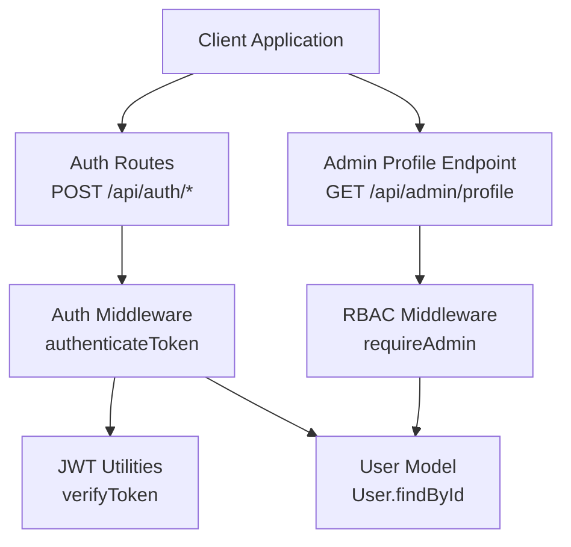
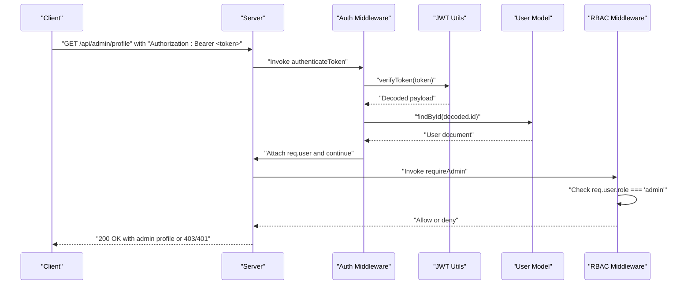
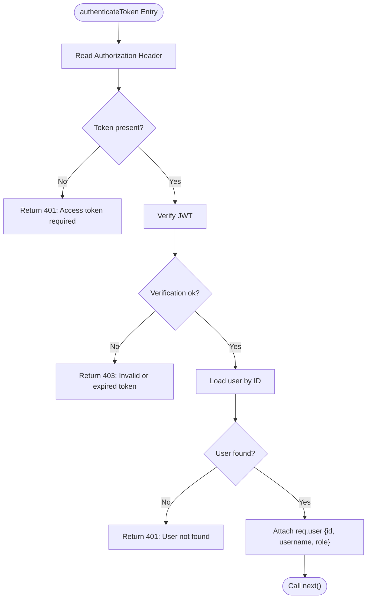
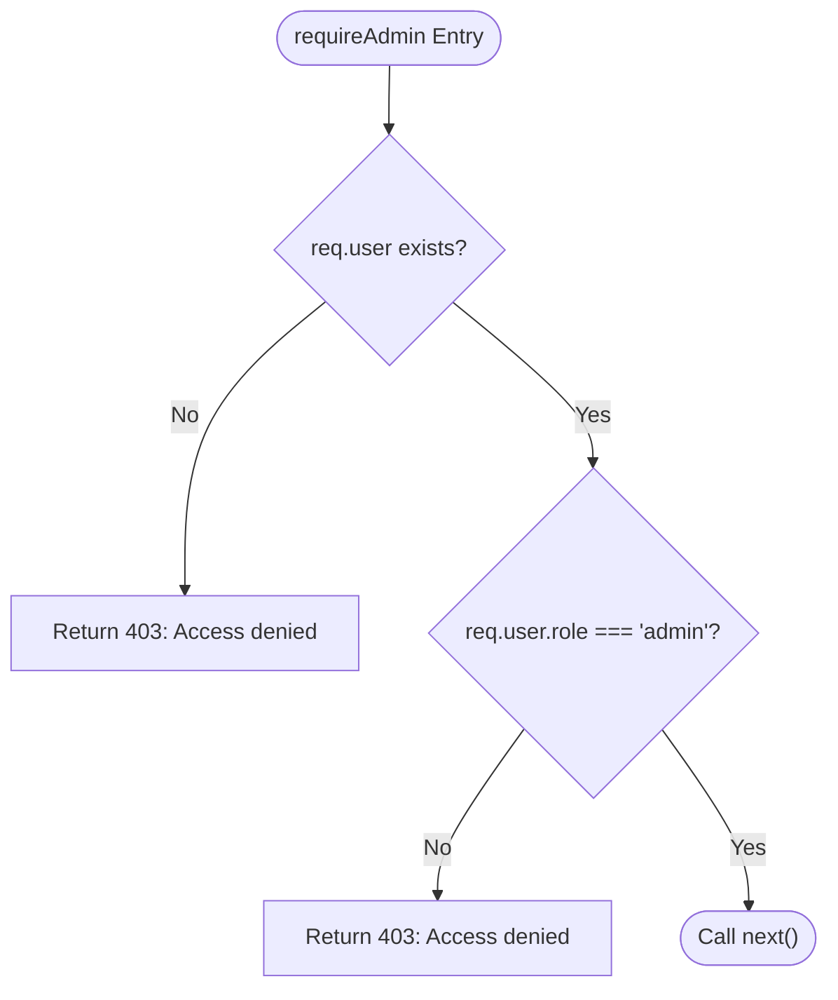
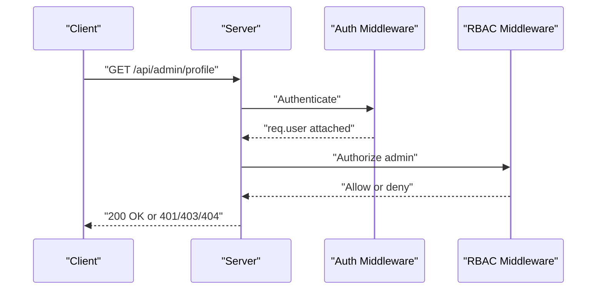
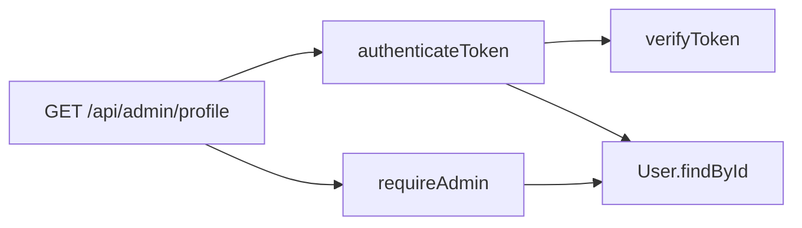

# Admin Protected Routes

<cite>
**Referenced Files in This Document**
- [auth.js](file://server/middleware/auth.js)
- [errorHandler.js](file://server/middleware/errorHandler.js)
- [jwt.js](file://server/utils/jwt.js)
- [User.js](file://server/models/User.js)
- [auth.js](file://server/routes/auth.js)
- [server.js](file://server/server.js)
- [test-api.js](file://server/test-api.js)
- [test-registration.js](file://server/test-registration.js)
</cite>

## Table of Contents
1. [Introduction](#introduction)
2. [Project Structure](#project-structure)
3. [Core Components](#core-components)
4. [Architecture Overview](#architecture-overview)
5. [Detailed Component Analysis](#detailed-component-analysis)
6. [Dependency Analysis](#dependency-analysis)
7. [Performance Considerations](#performance-considerations)
8. [Troubleshooting Guide](#troubleshooting-guide)
9. [Conclusion](#conclusion)

## Introduction
This document provides API documentation for admin-only protected endpoints, focusing on the profile management and administrative functions. It explains the authentication and authorization mechanisms, including JWT verification, role-based access control (RBAC) with admin privileges, and the protection of sensitive routes. It also covers endpoint specifications for /api/admin/profile, token validation processes, access denial scenarios, and security best practices for protecting administrative endpoints.

## Project Structure
The admin-protected functionality spans middleware for authentication and authorization, JWT utilities, user model definitions, and route handlers. The primary runtime server exposes the admin profile endpoint and integrates with authentication and authorization middleware.

**Diagram sources**
- [server.js](file://server/server.js#L284-L301)
- [auth.js](file://server/middleware/auth.js#L5-L42)
- [jwt.js](file://server/utils/jwt.js#L28-L34)
- [User.js](file://server/models/User.js#L4-L48)

**Section sources**
- [server.js](file://server/server.js#L284-L301)
- [auth.js](file://server/middleware/auth.js#L1-L45)
- [jwt.js](file://server/utils/jwt.js#L1-L41)
- [User.js](file://server/models/User.js#L1-L105)

## Core Components
- Authentication middleware: Extracts the bearer token from the Authorization header, verifies it via JWT utilities, ensures the user still exists in the database, and attaches user metadata to the request.
- RBAC middleware: Enforces admin-only access by checking the user’s role after authentication.
- JWT utilities: Provide token generation and verification functions used by authentication and refresh flows.
- User model: Defines roles and includes methods for password comparison and refresh token management.
- Auth routes: Provide login, registration, refresh, logout, and profile retrieval endpoints.
- Admin profile endpoint: A protected route under GET /api/admin/profile guarded by authentication and RBAC middleware.

Key implementation references:
- Authentication middleware: [authenticateToken](file://server/middleware/auth.js#L5-L34)
- RBAC middleware: [requireAdmin](file://server/middleware/auth.js#L37-L42)
- JWT verification: [verifyToken](file://server/utils/jwt.js#L28-L34)
- User role definition: [role enum](file://server/models/User.js#L26-L30)
- Admin profile endpoint: [GET /api/admin/profile](file://server/server.js#L284-L301)

**Section sources**
- [auth.js](file://server/middleware/auth.js#L1-L45)
- [jwt.js](file://server/utils/jwt.js#L1-L41)
- [User.js](file://server/models/User.js#L1-L105)
- [server.js](file://server/server.js#L284-L301)

## Architecture Overview
The admin profile endpoint follows a layered architecture:
- Client sends requests with Authorization: Bearer <token>.
- Authentication middleware validates the token and enriches the request with user identity.
- RBAC middleware checks the user’s role and denies access if not admin.
- The handler returns the admin profile data.

**Diagram sources**
- [server.js](file://server/server.js#L284-L301)
- [auth.js](file://server/middleware/auth.js#L5-L42)
- [jwt.js](file://server/utils/jwt.js#L28-L34)
- [User.js](file://server/models/User.js#L18-L28)

## Detailed Component Analysis

### Authentication Middleware
Responsibilities:
- Extracts the bearer token from the Authorization header.
- Verifies the token using JWT utilities.
- Confirms the user still exists in the database.
- Attaches user identity (id, username, role) to the request object.

Behavior highlights:
- Missing token triggers a 401 error.
- Invalid/expired token triggers a 403 error.
- Nonexistent user triggers a 401 error.
- On success, continues to the next middleware/route.

**Diagram sources**
- [auth.js](file://server/middleware/auth.js#L5-L34)
- [jwt.js](file://server/utils/jwt.js#L28-L34)
- [User.js](file://server/models/User.js#L18-L28)

**Section sources**
- [auth.js](file://server/middleware/auth.js#L5-L34)
- [jwt.js](file://server/utils/jwt.js#L28-L34)
- [User.js](file://server/models/User.js#L18-L28)

### RBAC Middleware (Admin Only)
Responsibilities:
- Ensures the authenticated user has role equal to 'admin'.
- Denies access with 403 if the user is not an admin.

**Diagram sources**
- [auth.js](file://server/middleware/auth.js#L37-L42)

**Section sources**
- [auth.js](file://server/middleware/auth.js#L37-L42)

### JWT Utilities
Responsibilities:
- Generate access tokens and refresh tokens with defined expiration policies.
- Verify tokens and handle invalid/expired cases.

Key functions:
- [generateAccessToken](file://server/utils/jwt.js#L10-L12)
- [generateRefreshToken](file://server/utils/jwt.js#L19-L21)
- [verifyToken](file://server/utils/jwt.js#L28-L34)

Security note:
- The secret is loaded from environment variables; ensure it is strong and rotated securely.

**Section sources**
- [jwt.js](file://server/utils/jwt.js#L1-L41)

### User Model and Roles
Responsibilities:
- Define user schema including role enumeration ('user' | 'admin').
- Provide methods for password comparison and refresh token lifecycle.
- Control serialization to avoid leaking sensitive fields.

Relevant fields and methods:
- Role enum: [role field](file://server/models/User.js#L26-L30)
- Password comparison: [comparePassword](file://server/models/User.js#L66-L72)
- Refresh token management: [addRefreshToken](file://server/models/User.js#L75-L78), [removeRefreshToken](file://server/models/User.js#L81-L84), [hasRefreshToken](file://server/models/User.js#L87-L89)
- Serialization: [toJSON](file://server/models/User.js#L92-L100)

**Section sources**
- [User.js](file://server/models/User.js#L1-L105)

### Auth Routes (Supporting Context)
While the admin profile endpoint is defined in the main server, the auth routes demonstrate the token lifecycle and user management patterns used by admin users.

Endpoints and behaviors:
- POST /api/auth/register: Validates input, prevents duplicates, creates user, generates tokens, stores refresh token.
- POST /api/auth/login: Validates credentials, compares password, updates last login, generates tokens.
- POST /api/auth/refresh: Verifies refresh token, regenerates access token.
- POST /api/auth/logout: Attempts to invalidate refresh token.
- GET /api/auth/me: Returns authenticated user profile.

These flows illustrate how admin users receive tokens and maintain sessions, which are then used to access protected endpoints.

**Section sources**
- [auth.js](file://server/routes/auth.js#L16-L68)
- [auth.js](file://server/routes/auth.js#L75-L120)
- [auth.js](file://server/routes/auth.js#L127-L156)
- [auth.js](file://server/routes/auth.js#L163-L179)
- [auth.js](file://server/routes/auth.js#L269-L277)

### Admin Profile Endpoint
Endpoint specification:
- Method: GET
- Path: /api/admin/profile
- Authentication: Required (Bearer token)
- Authorization: Admin role required
- Success response: 200 OK with admin profile data
- Error responses:
  - 401 Unauthorized: Missing or invalid/expired token; user not found
  - 403 Forbidden: Insufficient permissions (non-admin)
  - 404 Not Found: User record missing despite valid token

Processing logic:
- Enforce authentication middleware to attach user identity.
- Enforce RBAC middleware to ensure role equals 'admin'.
- Retrieve and return admin profile data.

**Diagram sources**
- [server.js](file://server/server.js#L284-L301)
- [auth.js](file://server/middleware/auth.js#L5-L42)

**Section sources**
- [server.js](file://server/server.js#L284-L301)
- [auth.js](file://server/middleware/auth.js#L37-L42)

### Example Workflows

#### Successful Admin Access
- Authenticate via login to obtain access and refresh tokens.
- Call GET /api/admin/profile with Authorization: Bearer <accessToken>.
- Server validates token, confirms admin role, and returns profile data.

References:
- [test-api.js](file://server/test-api.js#L10-L27)
- [server.js](file://server/server.js#L284-L301)

#### Admin Registration and Access
- Register a new user (role configured as admin).
- Login to receive tokens.
- Access /api/admin/profile to confirm admin privileges.

References:
- [test-registration.js](file://server/test-registration.js#L3-L39)
- [auth.js](file://server/routes/auth.js#L42-L43)
- [server.js](file://server/server.js#L284-L301)

## Dependency Analysis
The admin profile endpoint depends on:
- Authentication middleware for token verification and user attachment.
- RBAC middleware for role enforcement.
- JWT utilities for token verification.
- User model for user lookup and role validation.

**Diagram sources**
- [server.js](file://server/server.js#L284-L301)
- [auth.js](file://server/middleware/auth.js#L5-L42)
- [jwt.js](file://server/utils/jwt.js#L28-L34)
- [User.js](file://server/models/User.js#L18-L28)

**Section sources**
- [server.js](file://server/server.js#L284-L301)
- [auth.js](file://server/middleware/auth.js#L5-L42)
- [jwt.js](file://server/utils/jwt.js#L28-L34)
- [User.js](file://server/models/User.js#L18-L28)

## Performance Considerations
- Token verification is lightweight; ensure JWT secret is strong and environment-managed.
- Minimize database lookups by verifying token signature first, then fetching user only if needed.
- Avoid exposing sensitive fields in user responses; rely on model serialization to exclude secrets.
- Consider caching frequently accessed admin metadata for short periods if appropriate.

## Troubleshooting Guide
Common issues and resolutions:
- Missing Authorization header: Ensure clients send Authorization: Bearer <token>.
  - Symptom: 401 Unauthorized during authentication.
  - Reference: [authenticateToken](file://server/middleware/auth.js#L10-L12)
- Invalid or expired token: Re-authenticate or refresh the token.
  - Symptom: 403 Forbidden during authentication.
  - Reference: [authenticateToken](file://server/middleware/auth.js#L32)
- User not found: Token valid but user deleted or data inconsistent.
  - Symptom: 401 Unauthorized during authentication.
  - Reference: [authenticateToken](file://server/middleware/auth.js#L19-L21)
- Non-admin access attempt: RBAC middleware denies access.
  - Symptom: 403 Forbidden.
  - Reference: [requireAdmin](file://server/middleware/auth.js#L38-L40)
- Endpoint not found: Route not registered or incorrect path.
  - Symptom: 404 Not Found.
  - Reference: [server.js](file://server/server.js#L284-L301)

Operational error handling:
- Centralized error handling and async wrappers are available for consistent error responses.
  - Reference: [errorHandler](file://server/middleware/errorHandler.js#L16-L44), [catchAsync](file://server/middleware/errorHandler.js#L53-L56)

**Section sources**
- [auth.js](file://server/middleware/auth.js#L10-L42)
- [errorHandler.js](file://server/middleware/errorHandler.js#L16-L56)
- [server.js](file://server/server.js#L284-L301)

## Conclusion
The admin profile endpoint is protected by a robust two-layer mechanism: authentication middleware validates tokens and user existence, while RBAC middleware enforces admin-only access. JWT utilities provide secure token generation and verification, and the user model encapsulates role semantics and sensitive data handling. Following the documented workflows and best practices ensures secure administration of protected endpoints.