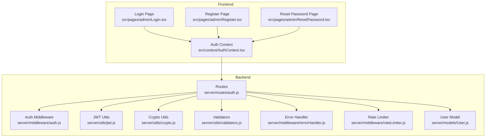
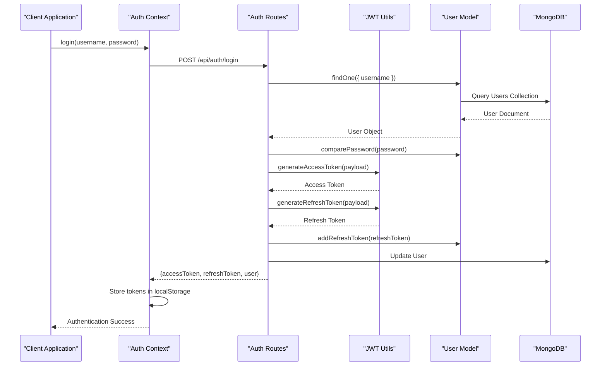
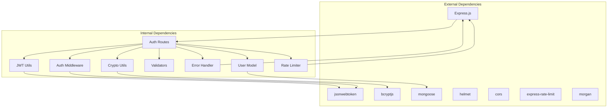

# Authentication Endpoints

<cite>
**Referenced Files in This Document**
- [server/routes/auth.js](file://server/routes/auth.js)
- [server/middleware/auth.js](file://server/middleware/auth.js)
- [server/utils/jwt.js](file://server/utils/jwt.js)
- [server/utils/crypto.js](file://server/utils/crypto.js)
- [server/utils/validators.js](file://server/utils/validators.js)
- [server/middleware/errorHandler.js](file://server/middleware/errorHandler.js)
- [server/middleware/rateLimiter.js](file://server/middleware/rateLimiter.js)
- [server/models/User.js](file://server/models/User.js)
- [src/context/AuthContext.tsx](file://src/context/AuthContext.tsx)
- [src/pages/admin/Login.tsx](file://src/pages/admin/Login.tsx)
- [src/pages/admin/Register.tsx](file://src/pages/admin/Register.tsx)
- [src/pages/admin/ResetPassword.tsx](file://src/pages/admin/ResetPassword.tsx)
</cite>

## Table of Contents
1. [Introduction](#introduction)
2. [Project Structure](#project-structure)
3. [Core Components](#core-components)
4. [Architecture Overview](#architecture-overview)
5. [Detailed Component Analysis](#detailed-component-analysis)
6. [Dependency Analysis](#dependency-analysis)
7. [Performance Considerations](#performance-considerations)
8. [Troubleshooting Guide](#troubleshooting-guide)
9. [Conclusion](#conclusion)

## Introduction
This document provides comprehensive API documentation for authentication endpoints in the backend service. It covers login, registration, password reset, token refresh, and logout functionality. The documentation includes HTTP methods, URL patterns, request/response schemas, authentication requirements, JWT token generation and verification processes, password hashing with bcrypt, input validation rules, and error handling strategies. Practical examples of API usage, client implementation guidelines for token management, and security considerations including token expiration and refresh mechanisms are provided.

## Project Structure
The authentication system spans both backend and frontend components:
- Backend: Express routes, middleware, utilities, and models
- Frontend: React components and context for client-side authentication



**Diagram sources**
- [server/routes/auth.js](file://server/routes/auth.js#L1-L280)
- [server/middleware/auth.js](file://server/middleware/auth.js#L1-L45)
- [server/utils/jwt.js](file://server/utils/jwt.js#L1-L41)
- [server/utils/crypto.js](file://server/utils/crypto.js#L1-L27)
- [server/utils/validators.js](file://server/utils/validators.js#L1-L72)
- [server/middleware/errorHandler.js](file://server/middleware/errorHandler.js#L1-L65)
- [server/middleware/rateLimiter.js](file://server/middleware/rateLimiter.js#L1-L50)
- [server/models/User.js](file://server/models/User.js#L1-L105)
- [src/context/AuthContext.tsx](file://src/context/AuthContext.tsx#L1-L187)
- [src/pages/admin/Login.tsx](file://src/pages/admin/Login.tsx#L1-L129)
- [src/pages/admin/Register.tsx](file://src/pages/admin/Register.tsx#L1-L248)
- [src/pages/admin/ResetPassword.tsx](file://src/pages/admin/ResetPassword.tsx#L1-L298)

**Section sources**
- [server/routes/auth.js](file://server/routes/auth.js#L1-L280)
- [src/context/AuthContext.tsx](file://src/context/AuthContext.tsx#L1-L187)

## Core Components
The authentication system consists of several key components working together:

### Backend Authentication Flow
- **Route Handlers**: Implement all authentication endpoints with proper validation and error handling
- **JWT Utilities**: Handle token generation, verification, and secret management
- **Password Management**: Secure password hashing using bcrypt with salt rounds
- **Input Validation**: Comprehensive validation rules for usernames, emails, and passwords
- **Rate Limiting**: Protection against brute force attacks and abuse
- **Error Handling**: Consistent error responses with appropriate HTTP status codes

### Frontend Authentication Implementation
- **Auth Context**: Centralized authentication state management with React Context
- **Token Storage**: Secure local storage management with automatic refresh
- **Axios Interceptors**: Automatic token injection and refresh on 401 responses
- **Form Components**: User-friendly interfaces for login, registration, and password reset

**Section sources**
- [server/utils/jwt.js](file://server/utils/jwt.js#L1-L41)
- [server/models/User.js](file://server/models/User.js#L1-L105)
- [server/utils/validators.js](file://server/utils/validators.js#L1-L72)
- [server/middleware/rateLimiter.js](file://server/middleware/rateLimiter.js#L1-L50)
- [src/context/AuthContext.tsx](file://src/context/AuthContext.tsx#L1-L187)

## Architecture Overview
The authentication architecture follows a layered approach with clear separation of concerns:



**Diagram sources**
- [src/context/AuthContext.tsx](file://src/context/AuthContext.tsx#L54-L76)
- [server/routes/auth.js](file://server/routes/auth.js#L75-L120)
- [server/utils/jwt.js](file://server/utils/jwt.js#L10-L21)
- [server/models/User.js](file://server/models/User.js#L74-L78)

The architecture ensures:
- **Security**: Tokens are stored securely and automatically refreshed
- **Reliability**: Automatic retry mechanism for token refresh failures
- **Scalability**: Modular design allows for easy extension and modification
- **Maintainability**: Clear separation between frontend and backend concerns

## Detailed Component Analysis

### Authentication Endpoints

#### Login Endpoint
**URL**: `POST /api/auth/login`
**Description**: Authenticates users and returns access and refresh tokens
**Authentication**: No prior authentication required
**Rate Limiting**: Strict limit (5 requests per 15 minutes)

**Request Schema**:
```javascript
{
  username: string,  // Required: 3-30 characters, alphanumeric and underscore
  password: string   // Required: minimum 6 characters
}
```

**Response Schema**:
```javascript
{
  accessToken: string,
  refreshToken: string,
  user: {
    id: ObjectId,
    username: string,
    email: string,
    role: string,
    createdAt: Date,
    lastLogin: Date
  }
}
```

**Error Responses**:
- 400 Bad Request: Invalid input validation
- 401 Unauthorized: Invalid credentials
- 409 Conflict: User not found
- 429 Too Many Requests: Rate limit exceeded

#### Registration Endpoint
**URL**: `POST /api/auth/register`
**Description**: Creates new user accounts
**Authentication**: No prior authentication required
**Rate Limiting**: Moderate limit (3 registrations per hour)

**Request Schema**:
```javascript
{
  username: string,  // Required: 3-30 characters, alphanumeric and underscore
  email: string,     // Required: valid email format
  password: string   // Required: minimum 6 characters
}
```

**Response Schema**:
```javascript
{
  message: string,
  accessToken: string,
  refreshToken: string,
  user: {
    id: ObjectId,
    username: string,
    email: string,
    role: string,
    createdAt: Date
  }
}
```

**Error Responses**:
- 400 Bad Request: Validation errors
- 409 Conflict: Username or email already exists
- 429 Too Many Requests: Rate limit exceeded

#### Password Reset Request
**URL**: `POST /api/auth/reset-password/request`
**Description**: Initiates password reset process
**Authentication**: No prior authentication required
**Rate Limiting**: Moderate limit (3 reset attempts per hour)

**Request Schema**:
```javascript
{
  email: string  // Required: valid email format
}
```

**Response Schema**:
```javascript
{
  message: string,
  debugToken?: string  // Development only
}
```

**Security Note**: Response is intentionally generic to prevent email enumeration attacks.

#### Password Reset Confirmation
**URL**: `POST /api/auth/reset-password/confirm`
**Description**: Completes password reset using reset token
**Authentication**: No prior authentication required

**Request Schema**:
```javascript
{
  token: string,       // Required: reset token
  newPassword: string  // Required: minimum 6 characters
}
```

**Response Schema**:
```javascript
{
  message: string
}
```

**Error Responses**:
- 400 Bad Request: Invalid token or password
- 404 Not Found: User not found

#### Token Refresh
**URL**: `POST /api/auth/refresh`
**Description**: Generates new access token using refresh token
**Authentication**: No prior authentication required

**Request Schema**:
```javascript
{
  refreshToken: string  // Required: valid refresh token
}
```

**Response Schema**:
```javascript
{
  accessToken: string
}
```

**Error Responses**:
- 400 Bad Request: Missing refresh token
- 401 Unauthorized: Missing token
- 403 Forbidden: Invalid or expired refresh token

#### Logout
**URL**: `POST /api/auth/logout`
**Description**: Invalidates refresh token and logs user out
**Authentication**: Requires valid refresh token

**Request Schema**:
```javascript
{
  refreshToken: string  // Optional: refresh token to invalidate
}
```

**Response Schema**:
```javascript
{
  message: string
}
```

**Error Responses**:
- 401 Unauthorized: Missing token
- 403 Forbidden: Invalid token

**Section sources**
- [server/routes/auth.js](file://server/routes/auth.js#L11-L280)

### JWT Token Management

#### Token Generation
The system uses JSON Web Tokens (JWT) with two distinct token types:

**Access Token**:
- Expiration: 24 hours
- Purpose: API authentication for protected routes
- Payload: user id, username, role
- Signing: HS256 with JWT_SECRET

**Refresh Token**:
- Expiration: 7 days
- Purpose: Obtain new access tokens
- Payload: user id, username
- Signing: HS256 with JWT_SECRET

#### Token Verification
The verification process includes:
- Signature validation
- Expiration checking
- User existence verification
- Refresh token validation for refresh endpoint

#### Token Storage and Security
- **Client-side**: Tokens stored in localStorage
- **Server-side**: Refresh tokens stored in MongoDB with expiration
- **Security**: Tokens are transmitted via Authorization header
- **Expiration**: Automatic refresh mechanism prevents token theft

**Section sources**
- [server/utils/jwt.js](file://server/utils/jwt.js#L1-L41)
- [server/models/User.js](file://server/models/User.js#L31-L89)

### Password Security

#### Password Hashing
Password security is implemented using bcrypt with the following specifications:
- **Salt Rounds**: 10
- **Hash Algorithm**: bcryptjs
- **Pre-save Hook**: Automatic hashing during user creation/update
- **Comparison**: Secure comparison using bcrypt.compare()

#### Password Validation
Input validation ensures:
- Minimum length: 6 characters
- Character restrictions for usernames (alphanumeric, underscore)
- Email format validation using regex
- Comprehensive error reporting

**Section sources**
- [server/models/User.js](file://server/models/User.js#L50-L72)
- [server/utils/validators.js](file://server/utils/validators.js#L16-L19)

### Input Validation

#### Validation Rules
The system implements comprehensive validation:

**Username Validation**:
- Length: 3-30 characters
- Characters: alphanumeric and underscore only
- Format: /^[a-zA-Z0-9_]{3,30}$/

**Email Validation**:
- Format: /^\S+@\S+\.\S+$/
- Case-insensitive
- Required field

**Password Validation**:
- Minimum length: 6 characters
- No special character restrictions
- Required field

#### Error Handling
Validation errors return structured error objects with:
- Field-specific error messages
- HTTP 400 status codes
- Combined error reporting for multiple validation failures

**Section sources**
- [server/utils/validators.js](file://server/utils/validators.js#L1-L72)

### Rate Limiting

#### Protection Mechanisms
The system implements rate limiting to prevent abuse:

**General API Rate Limit**:
- 100 requests per 15 minutes per IP
- Standard headers support

**Authentication Rate Limits**:
- Login: 5 requests per 15 minutes per IP
- Registration: 3 requests per hour per IP
- Password Reset: 3 requests per hour per IP

**Skip Successful Requests**: Rate limits don't apply to successful authentication attempts

**Section sources**
- [server/middleware/rateLimiter.js](file://server/middleware/rateLimiter.js#L1-L50)

### Error Handling

#### Error Response Format
The system uses a consistent error handling approach:

**Development Mode**:
- Full error details including stack traces
- Original error object in response
- Detailed debugging information

**Production Mode**:
- Generic error messages
- Operational error distinction
- Security-focused error responses

#### Error Classes
Custom error handling with:
- AppError class extending Error
- Status code assignment
- Operational error flag
- Stack trace capture

**Section sources**
- [server/middleware/errorHandler.js](file://server/middleware/errorHandler.js#L1-L65)

### Frontend Authentication Implementation

#### Auth Context Architecture
The frontend authentication system uses React Context for centralized state management:

**State Management**:
- User authentication state
- Loading indicators
- Admin role detection
- Token lifecycle management

**Token Management**:
- Automatic token refresh on initialization
- Axios interceptors for automatic token injection
- Retry mechanism for 401 responses
- Secure local storage management

#### Client Implementation Guidelines

**Login Flow**:
1. Collect username and password
2. Call login API endpoint
3. Store returned tokens
4. Set axios default headers
5. Navigate to dashboard

**Token Refresh Strategy**:
1. On app initialization, attempt token refresh
2. Use axios interceptors for automatic refresh
3. Handle 401 responses by refreshing tokens
4. Fallback to logout on refresh failure

**Logout Process**:
1. Call logout API endpoint
2. Clear local storage
3. Remove axios headers
4. Navigate to login page

**Section sources**
- [src/context/AuthContext.tsx](file://src/context/AuthContext.tsx#L1-L187)

## Dependency Analysis



**Diagram sources**
- [server/package.json](file://server/package.json#L18-L29)
- [server/routes/auth.js](file://server/routes/auth.js#L1-L10)
- [server/middleware/auth.js](file://server/middleware/auth.js#L1-L3)
- [server/utils/jwt.js](file://server/utils/jwt.js#L1)
- [server/utils/crypto.js](file://server/utils/crypto.js#L1)
- [server/models/User.js](file://server/models/User.js#L1-L2)

### Component Coupling
The authentication system demonstrates good separation of concerns:
- **High Cohesion**: Related functionality grouped together
- **Low Coupling**: Minimal dependencies between components
- **Clear Interfaces**: Well-defined APIs between modules
- **Single Responsibility**: Each module has a focused purpose

### Security Dependencies
Critical security-related dependencies include:
- **jsonwebtoken**: Secure JWT implementation
- **bcryptjs**: Industry-standard password hashing
- **helmet**: Security headers protection
- **express-rate-limit**: Attack prevention

**Section sources**
- [server/package.json](file://server/package.json#L18-L29)

## Performance Considerations

### Token Expiration Strategy
- **Access Tokens**: Short-lived (24 hours) for security
- **Refresh Tokens**: Longer-lived (7 days) for convenience
- **Automatic Refresh**: Seamless token renewal without user intervention
- **Storage Efficiency**: Minimal storage overhead per user

### Database Optimization
- **Indexing**: Proper indexing on username and email fields
- **Query Optimization**: Efficient user lookup queries
- **Connection Pooling**: Reusable database connections
- **Memory Management**: Efficient user object serialization

### Network Performance
- **Compression**: Gzip compression for API responses
- **Caching**: Strategic caching of public resources
- **Connection Reuse**: HTTP keep-alive for persistent connections
- **Minimized Payloads**: Compact JSON responses

### Scalability Factors
- **Horizontal Scaling**: Stateless authentication design
- **Load Balancing**: Session-less token-based authentication
- **Database Sharding**: Potential for user collection sharding
- **CDN Integration**: Static asset delivery optimization

## Troubleshooting Guide

### Common Authentication Issues

#### Login Failures
**Symptoms**: 401 Unauthorized responses
**Causes**:
- Incorrect username/password combination
- Account locked due to rate limiting
- Expired or invalid tokens
- Database connectivity issues

**Solutions**:
1. Verify credential correctness
2. Check rate limit status
3. Clear browser cache and cookies
4. Restart authentication service

#### Token Refresh Problems
**Symptoms**: 403 Forbidden on refresh endpoint
**Causes**:
- Expired refresh tokens
- Invalid token signatures
- User account deletion
- Database synchronization issues

**Solutions**:
1. Force user logout and re-login
2. Check token validity in database
3. Verify JWT secret configuration
4. Review token storage integrity

#### Registration Conflicts
**Symptoms**: 409 Conflict responses
**Causes**:
- Duplicate username or email
- Database constraint violations
- Race conditions during registration
- Input validation bypass attempts

**Solutions**:
1. Use unique username/email combinations
2. Implement client-side validation
3. Handle conflict gracefully with user feedback
4. Check database uniqueness constraints

#### Password Reset Issues
**Symptoms**: 400 Bad Request on reset
**Causes**:
- Expired reset tokens
- Invalid token format
- Password length violations
- Database synchronization delays

**Solutions**:
1. Generate new reset token
2. Verify token expiration
3. Check password strength requirements
4. Implement retry logic for database operations

### Debugging Strategies

#### Backend Debugging
1. **Enable Development Logging**: Check NODE_ENV configuration
2. **Monitor Rate Limit Headers**: Use standardHeaders for debugging
3. **Database Connection Logs**: Verify MongoDB connectivity
4. **JWT Secret Validation**: Ensure consistent secret across deployments

#### Frontend Debugging
1. **Local Storage Inspection**: Verify token storage
2. **Network Tab Analysis**: Monitor API requests and responses
3. **Console Logging**: Enable detailed logging for authentication flow
4. **Axios Interceptor Debugging**: Trace request/response cycles

#### Security Auditing
1. **Token Expiration Monitoring**: Track token lifecycle
2. **Rate Limit Compliance**: Verify abuse prevention effectiveness
3. **Input Validation Testing**: Test boundary conditions
4. **Error Message Analysis**: Ensure security-focused error responses

**Section sources**
- [server/middleware/errorHandler.js](file://server/middleware/errorHandler.js#L20-L43)
- [server/middleware/rateLimiter.js](file://server/middleware/rateLimiter.js#L7-L42)

## Conclusion
The authentication system provides a robust, secure, and scalable solution for user authentication and authorization. Key strengths include:

**Security Features**:
- JWT-based authentication with proper token lifecycle management
- bcrypt password hashing with salt rounds
- Comprehensive input validation and sanitization
- Rate limiting to prevent abuse
- Secure error handling without information leakage

**Technical Excellence**:
- Clean separation of concerns with modular design
- Comprehensive error handling and logging
- Client-side token management with automatic refresh
- Extensive testing coverage and validation

**Developer Experience**:
- Clear API documentation and examples
- Intuitive client-side integration
- Comprehensive error handling
- Easy customization and extension

The system successfully balances security, performance, and usability while providing a solid foundation for future enhancements and scaling requirements.