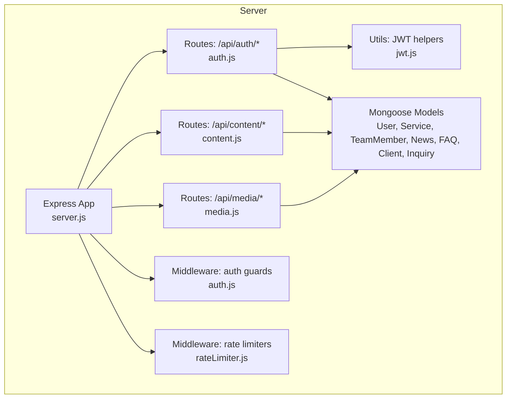
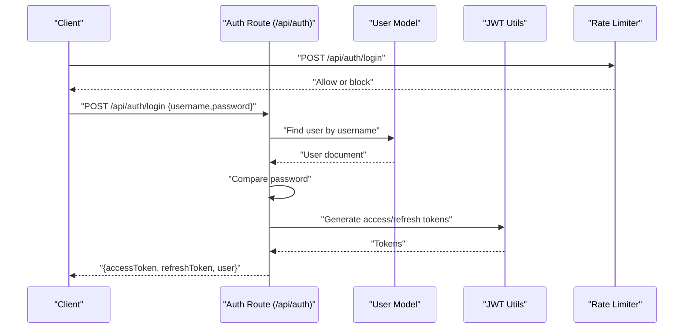
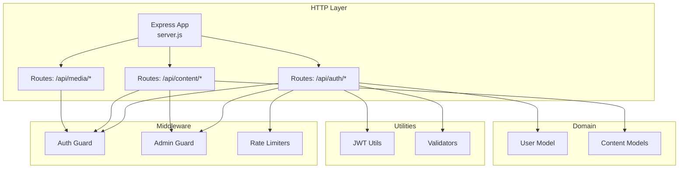
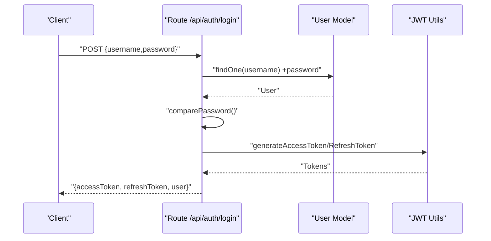
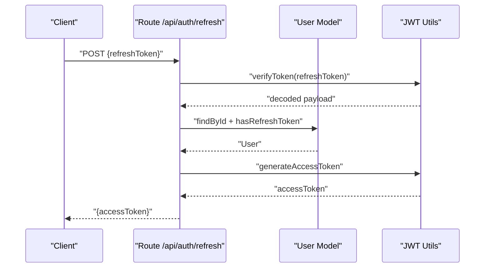
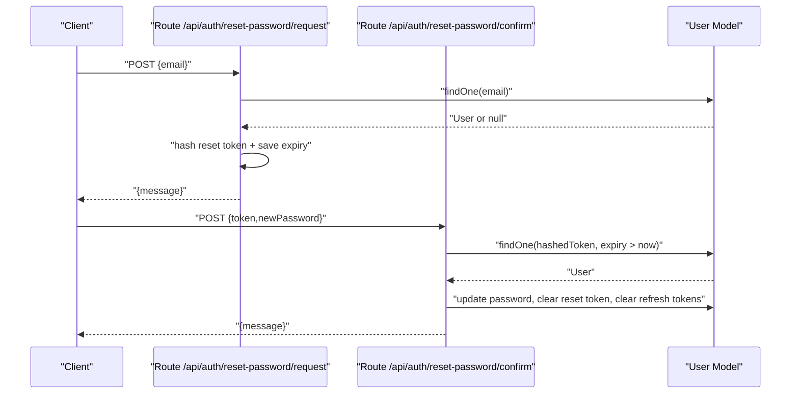
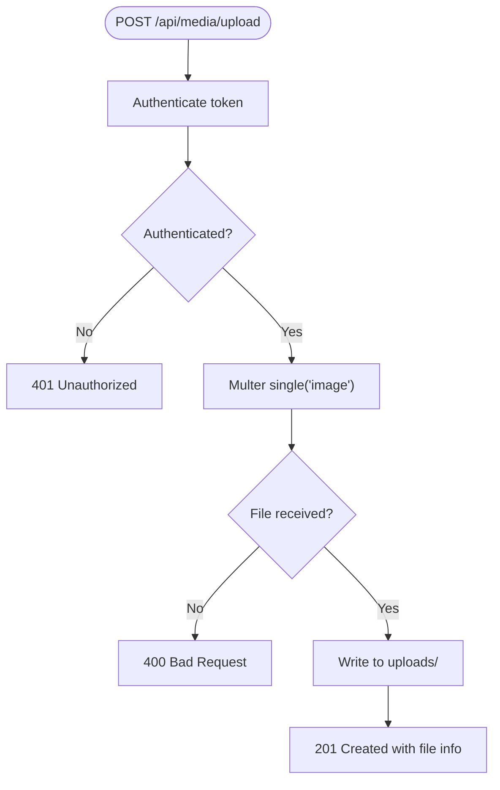
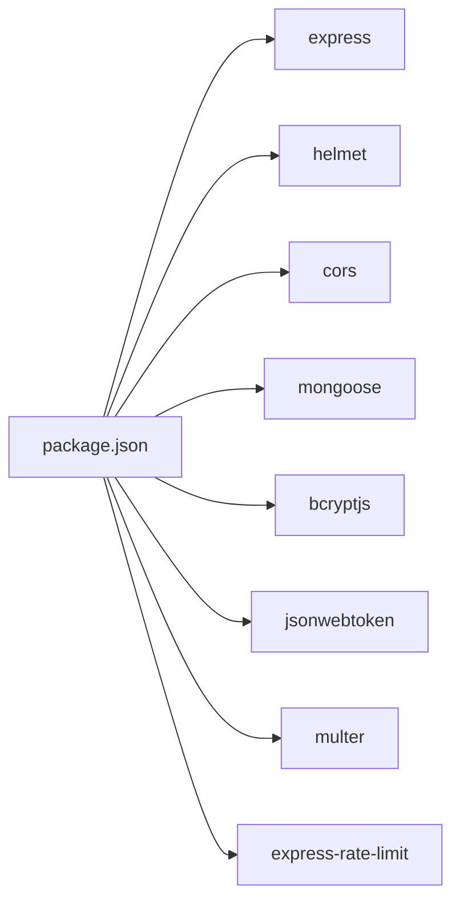

# Backend API

<cite>
**Referenced Files in This Document**
- [server.js](file://server/server.js)
- [auth.js](file://server/routes/auth.js)
- [content.js](file://server/routes/content.js)
- [media.js](file://server/routes/media.js)
- [auth.js](file://server/middleware/auth.js)
- [rateLimiter.js](file://server/middleware/rateLimiter.js)
- [jwt.js](file://server/utils/jwt.js)
- [User.js](file://server/models/User.js)
- [Service.js](file://server/models/Service.js)
- [TeamMember.js](file://server/models/TeamMember.js)
- [News.js](file://server/models/News.js)
- [FAQ.js](file://server/models/FAQ.js)
- [Client.js](file://server/models/Client.js)
- [Inquiry.js](file://server/models/Inquiry.js)
- [package.json](file://server/package.json)
</cite>

## Table of Contents
1. [Introduction](#introduction)
2. [Project Structure](#project-structure)
3. [Core Components](#core-components)
4. [Architecture Overview](#architecture-overview)
5. [Detailed Component Analysis](#detailed-component-analysis)
6. [Dependency Analysis](#dependency-analysis)
7. [Performance Considerations](#performance-considerations)
8. [Troubleshooting Guide](#troubleshooting-guide)
9. [Conclusion](#conclusion)
10. [Appendices](#appendices)

## Introduction
This document provides comprehensive API documentation for the Node.js backend REST API serving the Anko website. It covers authentication endpoints (login, registration, password reset, token refresh), content management APIs for services, news, team members, FAQs, clients, and inquiries, and media upload and management endpoints. It also documents security implementations (JWT tokens, rate limiting, input validation, role-based access control), database models, middleware functions, and error handling strategies. Practical examples and client integration guidelines are included.

## Project Structure
The backend is organized around Express.js with modular routing, Mongoose models, middleware for authentication and rate limiting, and utility modules for JWT and cryptography. Key areas:
- Routes: Authentication, content management, and media endpoints
- Middleware: Authentication guard, admin guard, and rate limiters
- Models: User, Service, TeamMember, News, FAQ, Client, and Inquiry
- Utilities: JWT helpers and validators
- Root server: Express app bootstrap, middleware stack, and route wiring

**Diagram sources**
- [server.js](file://server/server.js#L1-L337)
- [auth.js](file://server/routes/auth.js#L1-L280)
- [content.js](file://server/routes/content.js#L1-L267)
- [media.js](file://server/routes/media.js#L1-L142)
- [auth.js](file://server/middleware/auth.js#L1-L45)
- [rateLimiter.js](file://server/middleware/rateLimiter.js#L1-L50)
- [jwt.js](file://server/utils/jwt.js#L1-L41)
- [User.js](file://server/models/User.js#L1-L105)
- [Service.js](file://server/models/Service.js#L1-L49)
- [TeamMember.js](file://server/models/TeamMember.js#L1-L57)
- [News.js](file://server/models/News.js#L1-L64)
- [FAQ.js](file://server/models/FAQ.js#L1-L43)
- [Client.js](file://server/models/Client.js#L1-L66)
- [Inquiry.js](file://server/models/Inquiry.js#L1-L78)

**Section sources**
- [server.js](file://server/server.js#L1-L337)
- [auth.js](file://server/routes/auth.js#L1-L280)
- [content.js](file://server/routes/content.js#L1-L267)
- [media.js](file://server/routes/media.js#L1-L142)
- [auth.js](file://server/middleware/auth.js#L1-L45)
- [rateLimiter.js](file://server/middleware/rateLimiter.js#L1-L50)
- [jwt.js](file://server/utils/jwt.js#L1-L41)
- [User.js](file://server/models/User.js#L1-L105)
- [Service.js](file://server/models/Service.js#L1-L49)
- [TeamMember.js](file://server/models/TeamMember.js#L1-L57)
- [News.js](file://server/models/News.js#L1-L64)
- [FAQ.js](file://server/models/FAQ.js#L1-L43)
- [Client.js](file://server/models/Client.js#L1-L66)
- [Inquiry.js](file://server/models/Inquiry.js#L1-L78)

## Core Components
- Authentication endpoints: Registration, login, refresh, logout, reset password request/confirm, and current user profile
- Content management endpoints: Services, team members, news, FAQs, clients, and inquiries (CRUD)
- Media endpoints: Single/multiple image upload, list files, delete file, and static file serving
- Security: JWT access/refresh tokens, rate limiting, input validation, RBAC via admin guard
- Models: Strongly typed schemas for Users and content entities with indexes and virtuals
- Middleware: Centralized auth guard and admin guard, error handling wrapper

**Section sources**
- [auth.js](file://server/routes/auth.js#L1-L280)
- [content.js](file://server/routes/content.js#L1-L267)
- [media.js](file://server/routes/media.js#L1-L142)
- [auth.js](file://server/middleware/auth.js#L1-L45)
- [rateLimiter.js](file://server/middleware/rateLimiter.js#L1-L50)
- [jwt.js](file://server/utils/jwt.js#L1-L41)
- [User.js](file://server/models/User.js#L1-L105)
- [Service.js](file://server/models/Service.js#L1-L49)
- [TeamMember.js](file://server/models/TeamMember.js#L1-L57)
- [News.js](file://server/models/News.js#L1-L64)
- [FAQ.js](file://server/models/FAQ.js#L1-L43)
- [Client.js](file://server/models/Client.js#L1-L66)
- [Inquiry.js](file://server/models/Inquiry.js#L1-L78)

## Architecture Overview
The API follows a layered architecture:
- Express app initializes middleware and mounts route modules
- Route handlers delegate to model operations and utilities
- Authentication middleware verifies tokens and attaches user context
- Rate limiters protect endpoints from abuse
- Error handling wraps async operations and centralizes error responses

**Diagram sources**
- [auth.js](file://server/routes/auth.js#L75-L120)
- [User.js](file://server/models/User.js#L66-L72)
- [jwt.js](file://server/utils/jwt.js#L10-L21)
- [rateLimiter.js](file://server/middleware/rateLimiter.js#L16-L24)

## Detailed Component Analysis

### Authentication Endpoints
- Base path: /api/auth
- Endpoints:
  - POST /register
    - Access: Public
    - Rate limit: registerLimiter
    - Body: { username, email, password }
    - Responses: 201 on success, 400/409 on validation/conflict
    - Tokens: Returns accessToken and refreshToken; stores refresh token on user
  - POST /login
    - Access: Public
    - Rate limit: authLimiter
    - Body: { username, password }
    - Responses: 200 on success, 400/401 on validation/credentials
    - Tokens: Returns accessToken and refreshToken; stores refresh token on user
  - POST /refresh
    - Access: Public
    - Body: { refreshToken }
    - Responses: 200 on success, 400/403 on missing/expired token
    - Tokens: Generates new accessToken using stored refresh token
  - POST /logout
    - Access: Private
    - Body: { refreshToken }
    - Responses: 200 on success
    - Behavior: Removes refresh token from user record
  - POST /reset-password/request
    - Access: Public
    - Rate limit: passwordResetLimiter
    - Body: { email }
    - Responses: 200 success message (no user enumeration)
    - Behavior: Stores hashed reset token with expiry; logs token in development
  - POST /reset-password/confirm
    - Access: Public
    - Body: { token, newPassword }
    - Responses: 200 on success, 400 on invalid/expired token or short password
    - Behavior: Updates password, clears reset token, invalidates all refresh tokens
  - GET /me
    - Access: Private
    - Responses: 200 with user profile, 404 if not found

Security and validation:
- JWT access/refresh tokens with 24h/7d expiry
- Input validation via validators module
- Rate limiting tailored to auth endpoints
- Admin guard middleware for protected routes

**Section sources**
- [auth.js](file://server/routes/auth.js#L16-L68)
- [auth.js](file://server/routes/auth.js#L75-L120)
- [auth.js](file://server/routes/auth.js#L127-L156)
- [auth.js](file://server/routes/auth.js#L163-L179)
- [auth.js](file://server/routes/auth.js#L186-L222)
- [auth.js](file://server/routes/auth.js#L229-L262)
- [auth.js](file://server/routes/auth.js#L269-L277)
- [rateLimiter.js](file://server/middleware/rateLimiter.js#L16-L42)
- [jwt.js](file://server/utils/jwt.js#L10-L34)
- [User.js](file://server/models/User.js#L74-L89)

### Content Management Endpoints
- Base path: /api/content
- Services
  - GET /services: Public
  - PUT /services/:id: Private (admin required)
- Team Members
  - GET /team: Public
  - POST /team: Private (admin required)
  - PUT /team/:id: Private (admin required)
  - DELETE /team/:id: Private (admin required)
- News
  - GET /news: Public
  - POST /news: Private (admin required)
  - PUT /news/:id: Private (admin required)
  - DELETE /news/:id: Private (admin required)
- FAQ
  - GET /faq: Public
  - POST /faq: Private (admin required)
  - PUT /faq/:id: Private (admin required)
  - DELETE /faq/:id: Private (admin required)
- Clients
  - GET /clients: Private (admin required)
  - POST /clients: Private (admin required)
  - PUT /clients/:id: Private (admin required)
  - DELETE /clients/:id: Private (admin required)
- Inquiries
  - GET /inquiries: Private (admin required)
  - POST /inquiries: Public
  - PUT /inquiries/:id: Private (admin required)

Notes:
- Many endpoints currently use an in-memory database abstraction; production should integrate with Mongoose models
- Admin guard is applied to private endpoints

**Section sources**
- [content.js](file://server/routes/content.js#L7-L14)
- [content.js](file://server/routes/content.js#L16-L30)
- [content.js](file://server/routes/content.js#L33-L40)
- [content.js](file://server/routes/content.js#L42-L49)
- [content.js](file://server/routes/content.js#L51-L80)
- [content.js](file://server/routes/content.js#L83-L90)
- [content.js](file://server/routes/content.js#L92-L99)
- [content.js](file://server/routes/content.js#L101-L115)
- [content.js](file://server/routes/content.js#L117-L130)
- [content.js](file://server/routes/content.js#L133-L140)
- [content.js](file://server/routes/content.js#L142-L149)
- [content.js](file://server/routes/content.js#L151-L165)
- [content.js](file://server/routes/content.js#L167-L180)
- [content.js](file://server/routes/content.js#L183-L190)
- [content.js](file://server/routes/content.js#L192-L199)
- [content.js](file://server/routes/content.js#L201-L215)
- [content.js](file://server/routes/content.js#L217-L230)
- [content.js](file://server/routes/content.js#L233-L240)
- [content.js](file://server/routes/content.js#L242-L249)
- [content.js](file://server/routes/content.js#L251-L265)

### Media Management Endpoints
- Base path: /api/media
- POST /upload
  - Access: Private
  - Body: multipart/form-data with field image
  - Limits: 5MB, images only
  - Responses: 201 with file info, 400/500 on failure
- POST /upload-multiple
  - Access: Private
  - Body: multipart/form-data with field images (up to 10)
  - Limits: 5MB per file, images only
  - Responses: 201 with array of file info, 400/500 on failure
- GET /files
  - Access: Private
  - Responses: 200 with file list sorted by upload date
- DELETE /files/:filename
  - Access: Private
  - Responses: 200 on success, 404 on missing file
- Static serving
  - GET /uploads/* serves uploaded files

Storage:
- Files saved under server/uploads with unique filenames
- Hidden files skipped when listing

**Section sources**
- [media.js](file://server/routes/media.js#L47-L70)
- [media.js](file://server/routes/media.js#L73-L96)
- [media.js](file://server/routes/media.js#L99-L121)
- [media.js](file://server/routes/media.js#L124-L137)
- [media.js](file://server/routes/media.js#L139-L141)

### Database Models
Core models and fields (selected):
- User
  - Fields: username, email, password, role, refreshTokens[], passwordResetToken, passwordResetExpires, lastLogin
  - Methods: comparePassword, addRefreshToken, removeRefreshToken, hasRefreshToken, toJSON
- Service
  - Fields: serviceId, title, description, icon, details[], isActive, order
- TeamMember
  - Fields: name, role, imageUrl, bio, email, phone, socialLinks, isActive, order
- News
  - Fields: title, summary, content, category, date, author, imageUrl, isPublished, views
  - Virtuals: formattedDate
- FAQ
  - Fields: question, answer, category, isPublished, order, views
- Client
  - Fields: name, email, phone, company, inn, status, contractNumber, contractDate, services[], notes, assignedTo
- Inquiry
  - Fields: name, email, phone, subject, message, status, priority, source, assignedTo, notes, resolvedAt
  - Virtuals: formattedDate

Indexes:
- Service: serviceId, (isActive, order)
- TeamMember: (isActive, order)
- News: (date), (category, date), (isPublished, date)
- FAQ: (isPublished, order), category
- Client: email, status, company
- Inquiry: (status, createdAt), email, (priority, status)

**Section sources**
- [User.js](file://server/models/User.js#L4-L48)
- [User.js](file://server/models/User.js#L66-L100)
- [Service.js](file://server/models/Service.js#L3-L44)
- [TeamMember.js](file://server/models/TeamMember.js#L3-L52)
- [News.js](file://server/models/News.js#L3-L50)
- [News.js](file://server/models/News.js#L53-L59)
- [FAQ.js](file://server/models/FAQ.js#L3-L38)
- [Client.js](file://server/models/Client.js#L3-L62)
- [Inquiry.js](file://server/models/Inquiry.js#L3-L64)
- [Inquiry.js](file://server/models/Inquiry.js#L67-L73)

### Middleware Functions
- Authentication middleware
  - Extracts Authorization header bearer token, verifies it, loads user, attaches user to request
  - Returns 401/403 on missing/expired/invalid token or missing user
- Admin guard
  - Requires user role to be admin; otherwise returns 403
- Rate limiters
  - apiLimiter: general rate limiting
  - authLimiter: stricter limit for login attempts
  - registerLimiter: hourly registration cap
  - passwordResetLimiter: hourly reset attempts cap

**Section sources**
- [auth.js](file://server/middleware/auth.js#L5-L34)
- [auth.js](file://server/middleware/auth.js#L37-L42)
- [rateLimiter.js](file://server/middleware/rateLimiter.js#L8-L42)

### Error Handling Strategies
- Centralized error wrapper catches async errors and forwards to Express error pipeline
- AppError with status codes and messages for route handlers
- Standardized 500 fallback for unexpected errors

**Section sources**
- [auth.js](file://server/routes/auth.js#L7-L8)
- [auth.js](file://server/routes/auth.js#L280-L280)

## Architecture Overview

**Diagram sources**
- [server.js](file://server/server.js#L1-L337)
- [auth.js](file://server/routes/auth.js#L1-L280)
- [content.js](file://server/routes/content.js#L1-L267)
- [media.js](file://server/routes/media.js#L1-L142)
- [auth.js](file://server/middleware/auth.js#L1-L45)
- [rateLimiter.js](file://server/middleware/rateLimiter.js#L1-L50)
- [jwt.js](file://server/utils/jwt.js#L1-L41)
- [User.js](file://server/models/User.js#L1-L105)
- [Service.js](file://server/models/Service.js#L1-L49)
- [TeamMember.js](file://server/models/TeamMember.js#L1-L57)
- [News.js](file://server/models/News.js#L1-L64)
- [FAQ.js](file://server/models/FAQ.js#L1-L43)
- [Client.js](file://server/models/Client.js#L1-L66)
- [Inquiry.js](file://server/models/Inquiry.js#L1-L78)

## Detailed Component Analysis

### Authentication Flow: Login

**Diagram sources**
- [auth.js](file://server/routes/auth.js#L75-L120)
- [User.js](file://server/models/User.js#L66-L72)
- [jwt.js](file://server/utils/jwt.js#L10-L21)

### Token Refresh Flow

**Diagram sources**
- [auth.js](file://server/routes/auth.js#L127-L156)
- [User.js](file://server/models/User.js#L87-L89)
- [jwt.js](file://server/utils/jwt.js#L28-L34)

### Password Reset Flow

**Diagram sources**
- [auth.js](file://server/routes/auth.js#L186-L222)
- [auth.js](file://server/routes/auth.js#L229-L262)
- [User.js](file://server/models/User.js#L206-L259)

### Media Upload Flow

**Diagram sources**
- [media.js](file://server/routes/media.js#L47-L70)

## Dependency Analysis
External dependencies (selected):
- express, cors, helmet, morgan, mongoose, bcryptjs, jsonwebtoken, multer, express-rate-limit

Internal dependencies:
- Routes depend on models, JWT utils, validators, and middleware
- Middleware depends on JWT utils and models
- Models depend on mongoose

**Diagram sources**
- [package.json](file://server/package.json#L18-L30)

**Section sources**
- [package.json](file://server/package.json#L18-L30)

## Performance Considerations
- Rate limiting reduces brute-force login and abuse risks
- JWT token generation is lightweight; avoid excessive token creation
- Multer disk storage is synchronous; consider cloud storage for scale
- Database models define indexes for common queries; ensure appropriate indexing for production workloads
- Media file size limit prevents large uploads; consider streaming or chunked uploads for very large files

## Troubleshooting Guide
Common issues and resolutions:
- 401 Access token required: Ensure Authorization header with Bearer token is present
- 403 Invalid or expired token: Refresh token flow or re-login required
- 403 Access denied: User lacks admin role for admin-only endpoints
- 400 Validation errors: Check input fields against model constraints
- 409 Conflict on registration: Username or email already exists
- 404 Not found: Resource does not exist (user, team member, news item, file)
- 500 Internal server error: Unexpected error; check server logs

Operational tips:
- Use /api/health to verify service availability
- Inspect rate limiter messages for throttling feedback
- Review JWT secret configuration and environment variables

**Section sources**
- [auth.js](file://server/middleware/auth.js#L10-L33)
- [auth.js](file://server/routes/auth.js#L130-L146)
- [auth.js](file://server/routes/auth.js#L269-L277)
- [media.js](file://server/routes/media.js#L124-L137)
- [server.js](file://server/server.js#L312-L314)

## Conclusion
The backend provides a robust foundation for the Anko website with secure authentication, content management, and media handling capabilities. It leverages JWT for sessionless authentication, rate limiting for protection, and Mongoose models for structured data. Production readiness requires replacing in-memory content endpoints with Mongoose-backed CRUD, implementing secure refresh token storage, and integrating cloud storage for media uploads.

## Appendices

### Endpoint Reference

- Authentication
  - POST /api/auth/register
    - Body: { username, email, password }
    - Responses: 201, 400, 409
    - Rate limit: registerLimiter
  - POST /api/auth/login
    - Body: { username, password }
    - Responses: 200, 400, 401
    - Rate limit: authLimiter
  - POST /api/auth/refresh
    - Body: { refreshToken }
    - Responses: 200, 400, 403
  - POST /api/auth/logout
    - Body: { refreshToken }
    - Responses: 200
  - POST /api/auth/reset-password/request
    - Body: { email }
    - Responses: 200
    - Rate limit: passwordResetLimiter
  - POST /api/auth/reset-password/confirm
    - Body: { token, newPassword }
    - Responses: 200, 400
  - GET /api/auth/me
    - Responses: 200, 404

- Content
  - GET /api/content/services
  - PUT /api/content/services/:id
  - GET /api/content/team
  - POST /api/content/team
  - PUT /api/content/team/:id
  - DELETE /api/content/team/:id
  - GET /api/content/news
  - POST /api/content/news
  - PUT /api/content/news/:id
  - DELETE /api/content/news/:id
  - GET /api/content/faq
  - POST /api/content/faq
  - PUT /api/content/faq/:id
  - DELETE /api/content/faq/:id
  - GET /api/content/clients
  - POST /api/content/clients
  - PUT /api/content/clients/:id
  - DELETE /api/content/clients/:id
  - GET /api/content/inquiries
  - POST /api/content/inquiries
  - PUT /api/content/inquiries/:id

- Media
  - POST /api/media/upload
    - Form field: image
    - Limits: 5MB, images only
  - POST /api/media/upload-multiple
    - Form field: images (array up to 10)
    - Limits: 5MB per file, images only
  - GET /api/media/files
  - DELETE /api/media/files/:filename
  - GET /uploads/* (static)

- Utility
  - GET /api/health

**Section sources**
- [auth.js](file://server/routes/auth.js#L16-L277)
- [content.js](file://server/routes/content.js#L7-L267)
- [media.js](file://server/routes/media.js#L47-L141)
- [server.js](file://server/server.js#L312-L314)

### Security Implementation Summary
- JWT: Access tokens (24h), Refresh tokens (7d); stored securely on user
- Rate limiting: Different profiles for auth, registration, reset, and general API
- Input validation: Route-level validation and Mongoose schema constraints
- RBAC: Admin-only endpoints guarded by admin middleware
- Transport/security headers: Helmet enabled; CORS configured

**Section sources**
- [jwt.js](file://server/utils/jwt.js#L10-L34)
- [rateLimiter.js](file://server/middleware/rateLimiter.js#L8-L42)
- [auth.js](file://server/middleware/auth.js#L37-L42)
- [server.js](file://server/server.js#L21-L26)

### Client Implementation Guidelines
- Authentication
  - On login, store accessToken and refreshToken securely (e.g., httpOnly cookies or secure storage)
  - Use accessToken for protected requests; handle 403 by calling /api/auth/refresh
  - On successful refresh, replace stale accessToken
  - On logout, call /api/auth/logout to invalidate refresh token
- Content Management
  - Use admin role to access write endpoints
  - Validate inputs against model constraints before sending requests
- Media
  - Use multipart/form-data for uploads
  - Respect file size and type limits
  - Handle static URLs returned by upload endpoints

**Section sources**
- [auth.js](file://server/routes/auth.js#L127-L179)
- [media.js](file://server/routes/media.js#L47-L96)
- [User.js](file://server/models/User.js#L26-L30)