# Content Management API

<cite>
**Referenced Files in This Document**
- [server-new.js](file://server/server-new.js)
- [content-new.js](file://server/routes/content-new.js)
- [media.js](file://server/routes/media.js)
- [auth.js](file://server/middleware/auth.js)
- [errorHandler.js](file://server/middleware/errorHandler.js)
- [Service.js](file://server/models/Service.js)
- [News.js](file://server/models/News.js)
- [TeamMember.js](file://server/models/TeamMember.js)
- [FAQ.js](file://server/models/FAQ.js)
- [Client.js](file://server/models/Client.js)
- [Inquiry.js](file://server/models/Inquiry.js)
- [User.js](file://server/models/User.js)
- [validators.js](file://server/utils/validators.js)
</cite>

## Table of Contents
1. [Introduction](#introduction)
2. [Project Structure](#project-structure)
3. [Core Components](#core-components)
4. [Architecture Overview](#architecture-overview)
5. [Detailed Component Analysis](#detailed-component-analysis)
6. [Dependency Analysis](#dependency-analysis)
7. [Performance Considerations](#performance-considerations)
8. [Troubleshooting Guide](#troubleshooting-guide)
9. [Conclusion](#conclusion)
10. [Appendices](#appendices)

## Introduction
This document describes the Content Management API that powers CRUD operations for services, news articles, team members, FAQs, and client testimonials. It also documents media upload capabilities, authentication and authorization requirements, data validation rules, sorting and filtering, pagination, and operational notes around moderation and versioning.

## Project Structure
The API is implemented as an Express server with modular route handlers and Mongoose models. The primary entry point configures middleware, connects to MongoDB, and mounts content and media routes under /api.

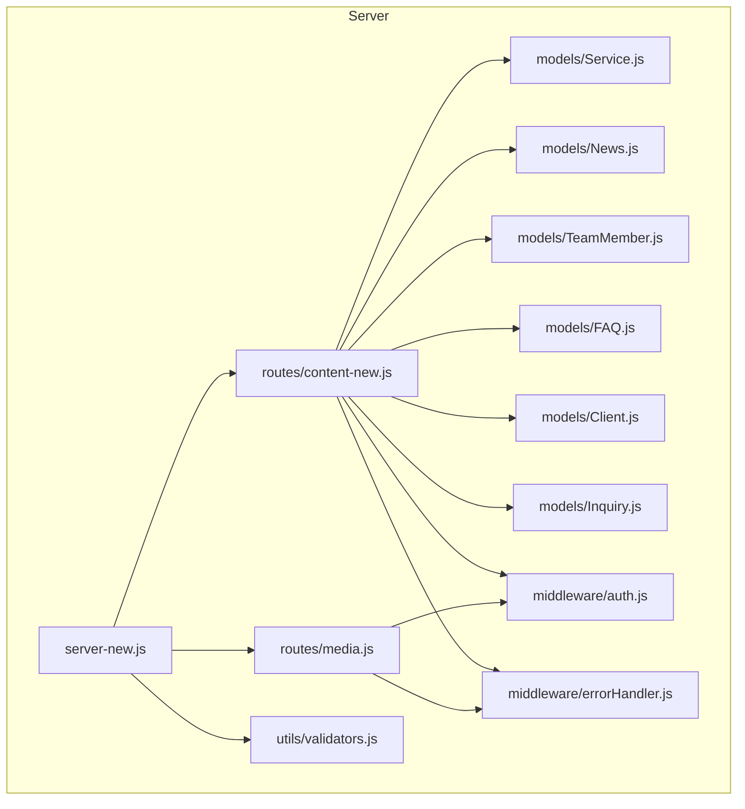

**Diagram sources**
- [server-new.js](file://server/server-new.js#L82-L84)
- [content-new.js](file://server/routes/content-new.js#L1-L441)
- [media.js](file://server/routes/media.js#L1-L142)
- [Service.js](file://server/models/Service.js#L1-L49)
- [News.js](file://server/models/News.js#L1-L64)
- [TeamMember.js](file://server/models/TeamMember.js#L1-L57)
- [FAQ.js](file://server/models/FAQ.js#L1-L43)
- [Client.js](file://server/models/Client.js#L1-L66)
- [Inquiry.js](file://server/models/Inquiry.js#L1-L78)
- [auth.js](file://server/middleware/auth.js#L1-L45)
- [errorHandler.js](file://server/middleware/errorHandler.js#L1-L65)
- [validators.js](file://server/utils/validators.js#L1-L72)

**Section sources**
- [server-new.js](file://server/server-new.js#L82-L84)

## Core Components
- Content routes: Provide public and admin endpoints for services, team, news, FAQ, clients, and inquiries.
- Media routes: Support single and multiple image uploads with size limits and filters.
- Authentication middleware: Validates bearer tokens and enforces admin-only access for write operations.
- Error handling middleware: Centralized error responses and async wrapper.
- Mongoose models: Define schemas, validation rules, indexes, and virtuals for each content type.

**Section sources**
- [content-new.js](file://server/routes/content-new.js#L17-L25)
- [media.js](file://server/routes/media.js#L47-L96)
- [auth.js](file://server/middleware/auth.js#L5-L42)
- [errorHandler.js](file://server/middleware/errorHandler.js#L52-L64)
- [Service.js](file://server/models/Service.js#L3-L44)
- [News.js](file://server/models/News.js#L3-L51)
- [TeamMember.js](file://server/models/TeamMember.js#L3-L52)
- [FAQ.js](file://server/models/FAQ.js#L3-L38)
- [Client.js](file://server/models/Client.js#L3-L62)
- [Inquiry.js](file://server/models/Inquiry.js#L3-L64)

## Architecture Overview
The API follows a layered architecture:
- Entry point initializes Express, middleware, and routes.
- Route handlers delegate to Mongoose models for persistence and validation.
- Authentication middleware attaches user context; admin middleware restricts write operations.
- Error handling middleware standardizes responses.

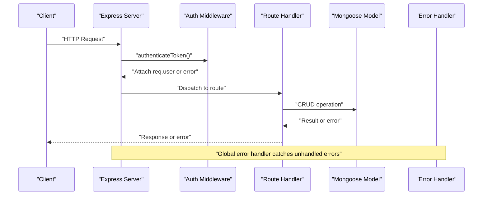

**Diagram sources**
- [server-new.js](file://server/server-new.js#L82-L84)
- [auth.js](file://server/middleware/auth.js#L5-L42)
- [content-new.js](file://server/routes/content-new.js#L45-L59)
- [errorHandler.js](file://server/middleware/errorHandler.js#L16-L44)

## Detailed Component Analysis

### Authentication and Authorization
- Token requirement: All protected endpoints require a Bearer token in the Authorization header.
- Admin requirement: Write operations (POST/PUT/DELETE) on content require admin role.
- User context: On successful verification, the request includes user id, username, and role.

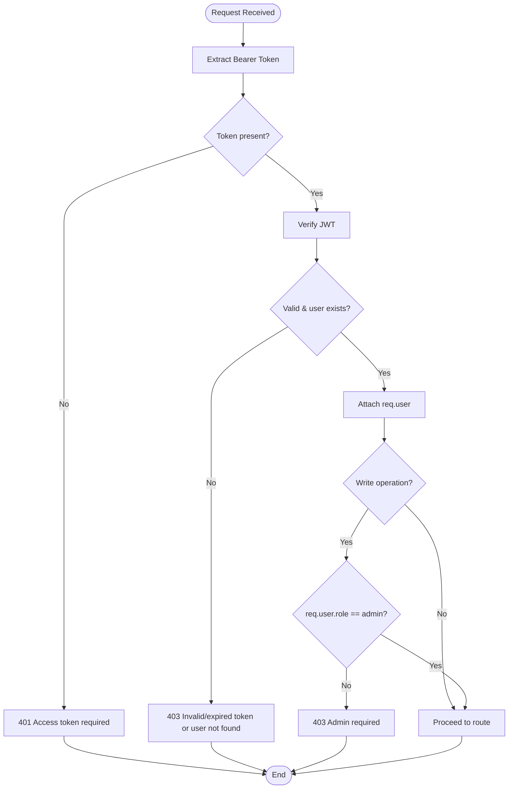

**Diagram sources**
- [auth.js](file://server/middleware/auth.js#L5-L42)

**Section sources**
- [auth.js](file://server/middleware/auth.js#L5-L42)

### Media Uploads
- Single image upload: POST /api/media/upload accepts multipart/form-data with field name image.
- Multiple images: POST /api/media/upload-multiple accepts array field images up to 10 files.
- File constraints: Only images allowed; max file size 5 MB; unique filenames generated.
- Listing and deletion: GET /api/media/files lists uploaded files; DELETE /api/media/files/:filename removes a file.
- Static serving: Uploaded files served from /api/media/uploads.

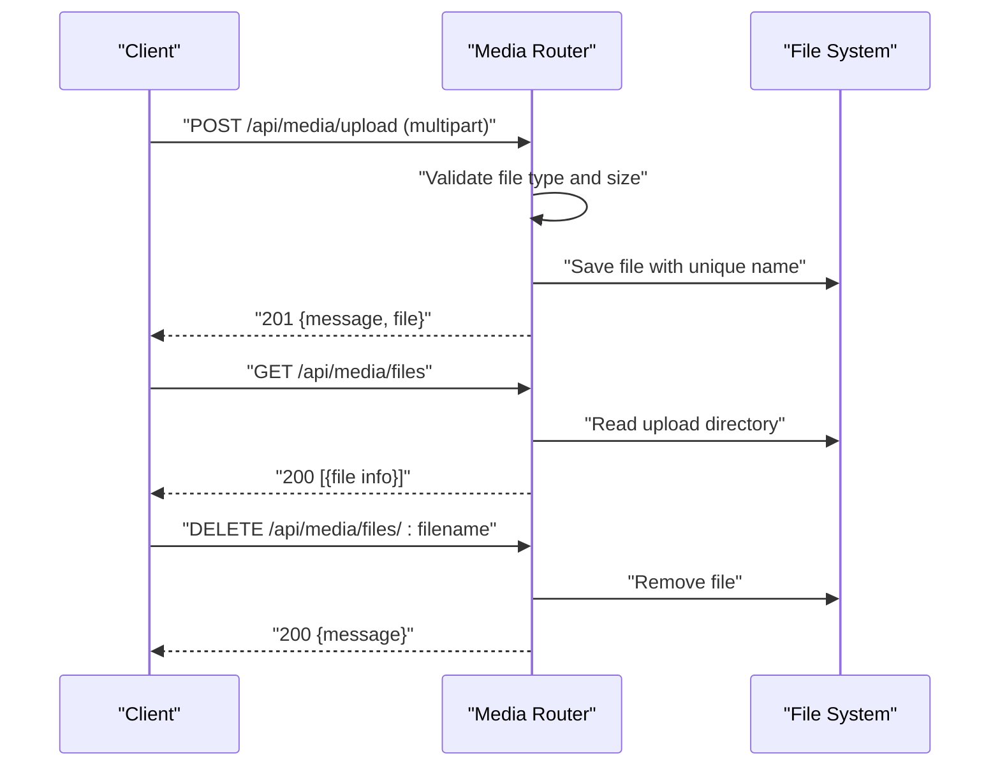

**Diagram sources**
- [media.js](file://server/routes/media.js#L47-L140)

**Section sources**
- [media.js](file://server/routes/media.js#L47-L96)
- [media.js](file://server/routes/media.js#L98-L140)

### Services
- Retrieve all published services ordered by display order: GET /api/content/services
- Retrieve a service by serviceId: GET /api/content/services/:serviceId
- Update a service (admin only): PUT /api/content/services/:serviceId
- Validation rules:
  - serviceId: required, unique, trimmed
  - title: required, trimmed, max length 200
  - description: required, max length 1000
  - icon: required, default FileText
  - details: array of strings, each up to 500 chars
  - isActive: boolean, default true
  - order: number, default 0

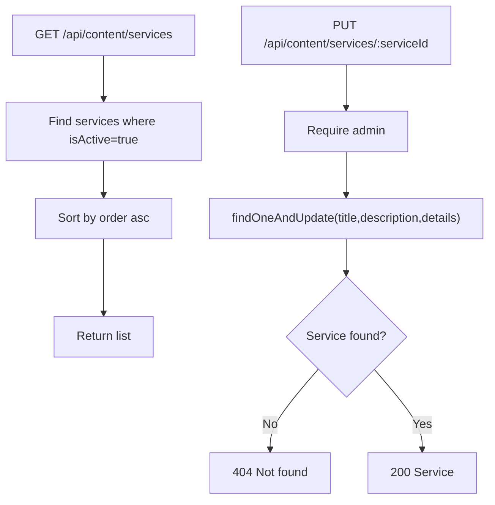

**Diagram sources**
- [content-new.js](file://server/routes/content-new.js#L17-L59)
- [Service.js](file://server/models/Service.js#L3-L44)

**Section sources**
- [content-new.js](file://server/routes/content-new.js#L17-L59)
- [Service.js](file://server/models/Service.js#L3-L44)

### Team Members
- Retrieve all active team members ordered by display order: GET /api/content/team
- Create a team member (admin only): POST /api/content/team
- Update a team member (admin only): PUT /api/content/team/:id
- Delete a team member (admin only): DELETE /api/content/team/:id
- Validation rules:
  - name: required, trimmed, max 100
  - role: required, trimmed, max 200
  - imageUrl: required
  - bio: max 1000
  - email: optional, trimmed, lowercase, valid format
  - phone: optional, trimmed
  - socialLinks: optional fields for telegram, vk, linkedin
  - isActive: boolean, default true
  - order: number, default 0

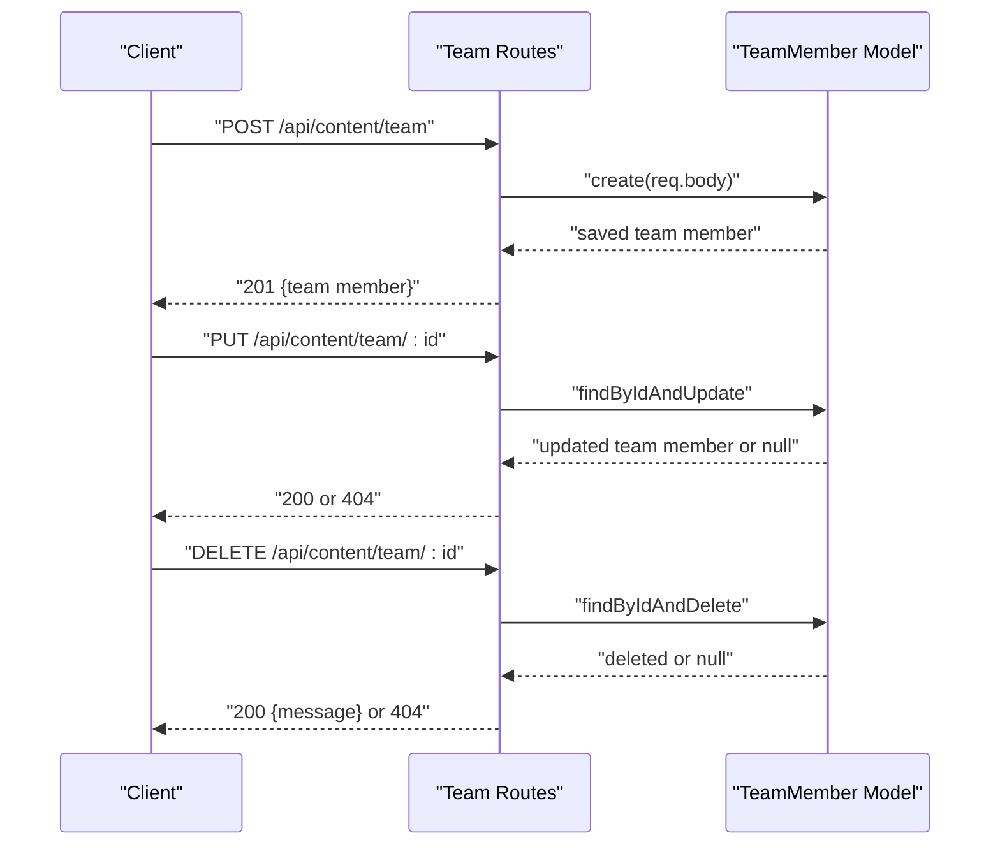

**Diagram sources**
- [content-new.js](file://server/routes/content-new.js#L75-L118)
- [TeamMember.js](file://server/models/TeamMember.js#L3-L52)

**Section sources**
- [content-new.js](file://server/routes/content-new.js#L75-L118)
- [TeamMember.js](file://server/models/TeamMember.js#L3-L52)

### News Articles
- Retrieve paginated and filtered published news: GET /api/content/news?page=&limit=&category=
- Retrieve a news article by ID: GET /api/content/news/:id
- Create a news article (admin only): POST /api/content/news
- Update a news article (admin only): PUT /api/content/news/:id
- Delete a news article (admin only): DELETE /api/content/news/:id
- Sorting and pagination:
  - Default sort: date descending
  - Query params: page (default 1), limit (default 10)
  - Filtering: category (News | Analytics | Event)
- Validation rules:
  - title: required, trimmed, max 300
  - summary: required, max 500
  - content: optional, max 5000
  - category: enum, default News
  - date: defaults to now
  - author: ObjectId reference to User
  - imageUrl: optional
  - isPublished: boolean, default true
  - views: number, default 0
- Behavior:
  - GET /api/content/news/:id increments views and returns populated author

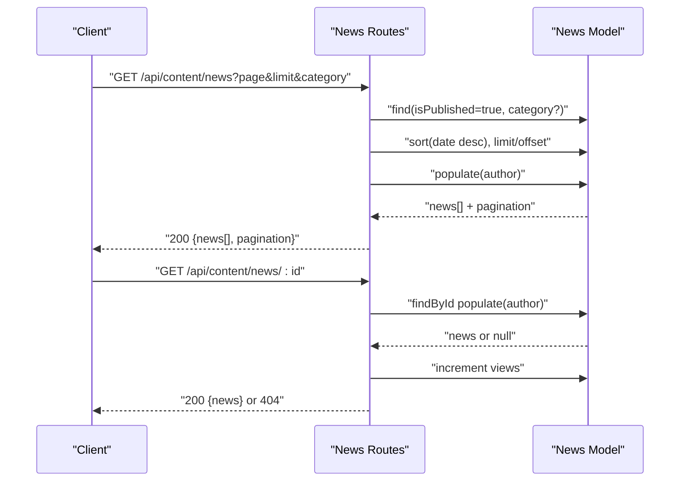

**Diagram sources**
- [content-new.js](file://server/routes/content-new.js#L124-L171)
- [News.js](file://server/models/News.js#L3-L51)

**Section sources**
- [content-new.js](file://server/routes/content-new.js#L124-L171)
- [News.js](file://server/models/News.js#L3-L51)

### FAQs
- Retrieve published FAQs optionally filtered by category: GET /api/content/faq?category=
- Create an FAQ (admin only): POST /api/content/faq
- Update an FAQ (admin only): PUT /api/content/faq/:id
- Delete an FAQ (admin only): DELETE /api/content/faq/:id
- Validation rules:
  - question: required, trimmed, max 500
  - answer: required, max 2000
  - category: optional, default "Общие"
  - isPublished: boolean, default true
  - order: number, default 0
  - views: number, default 0

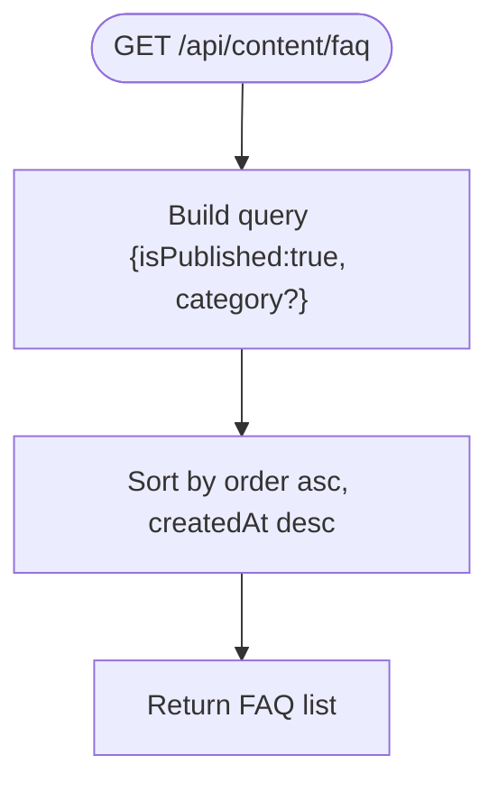

**Diagram sources**
- [content-new.js](file://server/routes/content-new.js#L225-L238)
- [FAQ.js](file://server/models/FAQ.js#L3-L38)

**Section sources**
- [content-new.js](file://server/routes/content-new.js#L225-L283)
- [FAQ.js](file://server/models/FAQ.js#L3-L38)

### Clients (Admin)
- Retrieve clients with optional filters and search: GET /api/content/clients?status=&search=
- Create a client (admin only): POST /api/content/clients
- Update a client (admin only): PUT /api/content/clients/:id
- Delete a client (admin only): DELETE /api/content/clients/:id
- Validation rules:
  - name: required, trimmed, max 200
  - email: required, trimmed, lowercase, valid format
  - phone: optional, trimmed
  - company: optional, max 200
  - inn: optional, digits 10–12
  - status: enum [active, inactive, pending], default active
  - contractNumber: optional
  - contractDate: optional date
  - services: array of strings
  - notes: optional, max 2000
  - assignedTo: ObjectId reference to User

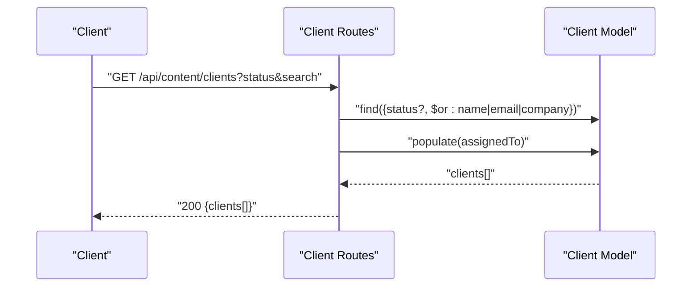

**Diagram sources**
- [content-new.js](file://server/routes/content-new.js#L289-L312)
- [Client.js](file://server/models/Client.js#L3-L62)

**Section sources**
- [content-new.js](file://server/routes/content-new.js#L289-L360)
- [Client.js](file://server/models/Client.js#L3-L62)

### Inquiries (Admin)
- Retrieve inquiries with optional filters: GET /api/content/inquiries?status=&priority=
- Public submission: POST /api/content/inquiries
- Update inquiry (admin only): PUT /api/content/inquiries/:id
- Delete inquiry (admin only): DELETE /api/content/inquiries/:id
- Validation rules:
  - name: required, trimmed, max 200
  - email: optional, trimmed, lowercase, valid format
  - phone: optional, trimmed
  - subject: required, trimmed, max 300
  - message: required, max 2000
  - status: enum [pending, in-progress, resolved, closed], default pending
  - priority: enum [low, medium, high], default medium
  - source: enum [website, email, phone, other], default website
  - assignedTo: ObjectId reference to User
  - notes: optional, max 2000
  - resolvedAt: optional date (auto-set when status becomes resolved/closed)

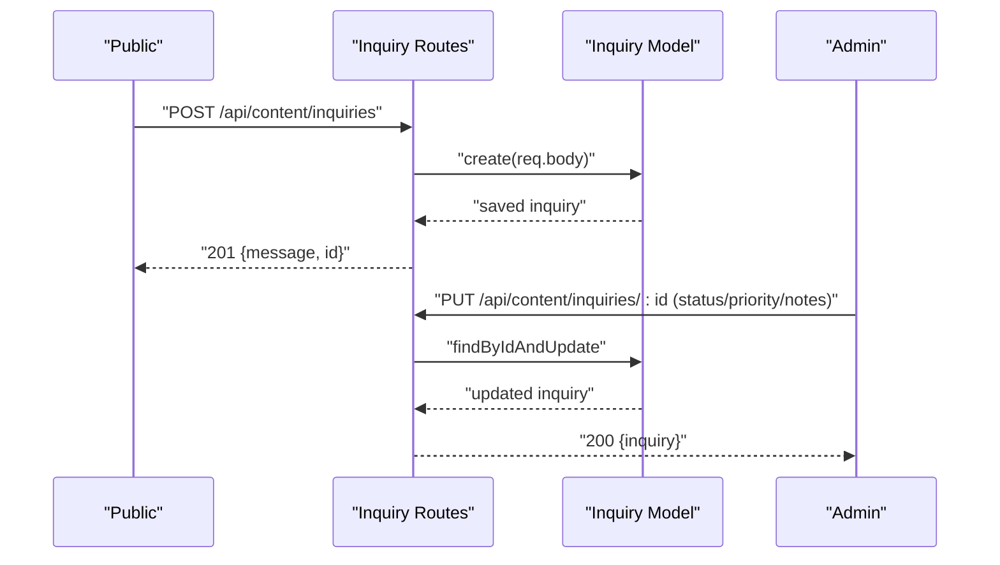

**Diagram sources**
- [content-new.js](file://server/routes/content-new.js#L366-L423)
- [Inquiry.js](file://server/models/Inquiry.js#L3-L64)

**Section sources**
- [content-new.js](file://server/routes/content-new.js#L366-L438)
- [Inquiry.js](file://server/models/Inquiry.js#L3-L64)

### Data Validation Rules
- Shared validation utilities enforce input correctness for registration and authentication.
- Model-level validations define required fields, lengths, formats, enums, and defaults.
- Route handlers rely on Mongoose validators and explicit checks.

**Section sources**
- [validators.js](file://server/utils/validators.js#L21-L46)
- [Service.js](file://server/models/Service.js#L10-L29)
- [TeamMember.js](file://server/models/TeamMember.js#L4-L33)
- [News.js](file://server/models/News.js#L4-L18)
- [FAQ.js](file://server/models/FAQ.js#L4-L14)
- [Client.js](file://server/models/Client.js#L4-L29)
- [Inquiry.js](file://server/models/Inquiry.js#L4-L29)

### Sorting and Filtering
- Services: sort by order ascending.
- Team: sort by isActive=true, then order ascending.
- News: sort by date descending; supports category filter; pagination via page and limit.
- FAQ: sort by order ascending, then createdAt descending; supports category filter.
- Clients: supports status and free-text search across name, email, and company.
- Inquiries: supports status and priority filters.

**Section sources**
- [content-new.js](file://server/routes/content-new.js#L22-L25)
- [content-new.js](file://server/routes/content-new.js#L70-L73)
- [content-new.js](file://server/routes/content-new.js#L129-L151)
- [content-new.js](file://server/routes/content-new.js#L230-L238)
- [content-new.js](file://server/routes/content-new.js#L294-L312)
- [content-new.js](file://server/routes/content-new.js#L371-L383)

### Pagination Support
- Implemented for News listing with page and limit query parameters.
- Response includes pagination metadata: page, limit, total, pages.

**Section sources**
- [content-new.js](file://server/routes/content-new.js#L129-L151)

### File Upload Handling for Media Content
- Upload single image: POST /api/media/upload with field image.
- Upload multiple images: POST /api/media/upload-multiple with field images (array).
- Constraints: images only, max 5 MB per file.
- Listing and deletion endpoints enable asset management.
- Static serving from /api/media/uploads.

**Section sources**
- [media.js](file://server/routes/media.js#L47-L96)
- [media.js](file://server/routes/media.js#L98-L140)

### Content Moderation Workflows
- Published vs draft: Many content types include isPublished flags (News, FAQ).
- Status updates: Inquiries support status transitions and automatic resolvedAt timestamp when marked resolved/closed.
- Admin-only operations: Creation, updates, and deletions for most content types require admin role.

**Section sources**
- [News.js](file://server/models/News.js#L35-L38)
- [FAQ.js](file://server/models/FAQ.js#L20-L23)
- [content-new.js](file://server/routes/content-new.js#L399-L423)
- [auth.js](file://server/middleware/auth.js#L36-L42)

### Approval Processes
- No dedicated approval model is defined in the reviewed files. Approvals are typically handled by setting isPublished flags or status fields and using admin endpoints.

**Section sources**
- [content-new.js](file://server/routes/content-new.js#L178-L185)
- [content-new.js](file://server/routes/content-new.js#L245-L249)
- [content-new.js](file://server/routes/content-new.js#L319-L326)

### Content Versioning
- No explicit content versioning mechanism is implemented in the reviewed files. Timestamps (createdAt, updatedAt) are present on models but not used to maintain versions.

**Section sources**
- [Service.js](file://server/models/Service.js#L38-L40)
- [News.js](file://server/models/News.js#L43-L45)
- [TeamMember.js](file://server/models/TeamMember.js#L47-L49)
- [FAQ.js](file://server/models/FAQ.js#L32-L34)
- [Client.js](file://server/models/Client.js#L54-L56)
- [Inquiry.js](file://server/models/Inquiry.js#L57-L59)

## Dependency Analysis
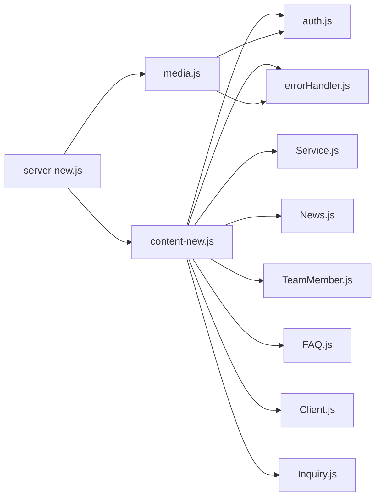

**Diagram sources**
- [content-new.js](file://server/routes/content-new.js#L1-L12)
- [media.js](file://server/routes/media.js#L1-L12)
- [auth.js](file://server/middleware/auth.js#L1-L11)
- [errorHandler.js](file://server/middleware/errorHandler.js#L1-L11)
- [Service.js](file://server/models/Service.js#L1-L2)
- [News.js](file://server/models/News.js#L1-L2)
- [TeamMember.js](file://server/models/TeamMember.js#L1-L2)
- [FAQ.js](file://server/models/FAQ.js#L1-L2)
- [Client.js](file://server/models/Client.js#L1-L2)
- [Inquiry.js](file://server/models/Inquiry.js#L1-L2)
- [server-new.js](file://server/server-new.js#L82-L84)

**Section sources**
- [content-new.js](file://server/routes/content-new.js#L1-L12)
- [media.js](file://server/routes/media.js#L1-L12)
- [server-new.js](file://server/server-new.js#L82-L84)

## Performance Considerations
- Indexes: Models define indexes for frequent queries (e.g., News by date, FAQ by publish/order, Clients by status/company).
- Pagination: News listing uses limit/offset; consider cursor-based pagination for very large datasets.
- File sizes: 5 MB limit prevents large payloads; consider CDN for media delivery.
- Rate limiting: Applied globally to /api in server-new.js.

**Section sources**
- [News.js](file://server/models/News.js#L47-L50)
- [FAQ.js](file://server/models/FAQ.js#L36-L38)
- [Client.js](file://server/models/Client.js#L58-L62)
- [media.js](file://server/routes/media.js#L41-L44)
- [server-new.js](file://server/server-new.js#L68-L69)

## Troubleshooting Guide
- Authentication failures:
  - 401 Missing access token or invalid/expired token.
  - 403 Admin required for write operations.
- Resource not found:
  - 404 returned when resources (service, team member, news, FAQ, client, inquiry) are missing.
- Validation errors:
  - Model-level validation messages are surfaced; ensure request bodies conform to schema rules.
- Media upload errors:
  - Non-image files rejected; exceeding 5 MB limit triggers failure; ensure multipart/form-data is used.

**Section sources**
- [auth.js](file://server/middleware/auth.js#L10-L33)
- [auth.js](file://server/middleware/auth.js#L36-L42)
- [content-new.js](file://server/routes/content-new.js#L34-L36)
- [content-new.js](file://server/routes/content-new.js#L98-L100)
- [content-new.js](file://server/routes/content-new.js#L199-L201)
- [content-new.js](file://server/routes/content-new.js#L264-L265)
- [content-new.js](file://server/routes/content-new.js#L341-L342)
- [content-new.js](file://server/routes/content-new.js#L419-L420)
- [media.js](file://server/routes/media.js#L29-L44)
- [media.js](file://server/routes/media.js#L49-L51)

## Conclusion
The Content Management API provides a robust foundation for managing services, team members, news, FAQs, clients, and inquiries with clear authentication boundaries, strong validation, and practical pagination and media handling. While moderation and versioning are not explicitly implemented, the design supports straightforward extension to meet evolving content workflows.

## Appendices

### API Reference Summary

- Base URL: /api
- Authentication: Bearer token in Authorization header
- Admin-only endpoints require role=admin

Endpoints
- Services
  - GET /content/services
  - GET /content/services/:serviceId
  - PUT /content/services/:serviceId (admin)
- Team
  - GET /content/team
  - POST /content/team (admin)
  - PUT /content/team/:id (admin)
  - DELETE /content/team/:id (admin)
- News
  - GET /content/news?page=&limit=&category=
  - GET /content/news/:id
  - POST /content/news (admin)
  - PUT /content/news/:id (admin)
  - DELETE /content/news/:id (admin)
- FAQ
  - GET /content/faq?category=
  - POST /content/faq (admin)
  - PUT /content/faq/:id (admin)
  - DELETE /content/faq/:id (admin)
- Clients (admin)
  - GET /content/clients?status=&search=
  - POST /content/clients (admin)
  - PUT /content/clients/:id (admin)
  - DELETE /content/clients/:id (admin)
- Inquiries
  - GET /content/inquiries?status=&priority=
  - POST /content/inquiries
  - PUT /content/inquiries/:id (admin)
  - DELETE /content/inquiries/:id (admin)
- Media
  - POST /media/upload
  - POST /media/upload-multiple
  - GET /media/files
  - DELETE /media/files/:filename

**Section sources**
- [content-new.js](file://server/routes/content-new.js#L17-L441)
- [media.js](file://server/routes/media.js#L47-L140)