# Error Handling & Middleware

<cite>
**Referenced Files in This Document**
- [errorHandler.js](file://server/middleware/errorHandler.js)
- [rateLimiter.js](file://server/middleware/rateLimiter.js)
- [auth.js](file://server/middleware/auth.js)
- [jwt.js](file://server/utils/jwt.js)
- [validators.js](file://server/utils/validators.js)
- [auth.js](file://server/routes/auth.js)
- [server.js](file://server/server.js)
- [User.js](file://server/models/User.js)
- [ErrorBoundary.tsx](file://src/components/ErrorBoundary.tsx)
- [AuthContext.tsx](file://src/context/AuthContext.tsx)
- [SECURITY.md](file://SECURITY.md)
- [package.json](file://server/package.json)
</cite>

## Table of Contents
1. [Introduction](#introduction)
2. [Project Structure](#project-structure)
3. [Core Components](#core-components)
4. [Architecture Overview](#architecture-overview)
5. [Detailed Component Analysis](#detailed-component-analysis)
6. [Dependency Analysis](#dependency-analysis)
7. [Performance Considerations](#performance-considerations)
8. [Troubleshooting Guide](#troubleshooting-guide)
9. [Conclusion](#conclusion)
10. [Appendices](#appendices)

## Introduction
This document explains the error handling middleware and global error management strategies implemented in the backend and frontend. It covers the custom error handler, rate limiting middleware, CORS policy setup, and security middleware (Helmet). It also documents error response formats, HTTP status codes, logging strategies, and debugging approaches. Guidance is included for common error scenarios such as validation failures, authentication errors, and database connection issues, along with examples of proper error handling in API responses, client-side error handling patterns, and monitoring integration for production deployments.

## Project Structure
The error handling and middleware ecosystem spans backend Express middleware, route handlers, utilities, and frontend error boundaries and context. The backend integrates Helmet for headers protection, Morgan for logging, and CORS for cross-origin policies. Route handlers apply rate limiters and custom error handling via a shared error utility.

```mermaid
graph TB
subgraph "Backend"
S["Express Server<br/>server.js"]
H["Helmet<br/>Security Headers"]
C["CORS Policy"]
M["Morgan Logger"]
RL["Rate Limiter Configurations<br/>rateLimiter.js"]
EH["Error Handler & Not Found<br/>errorHandler.js"]
AU["Auth Middleware<br/>auth.js"]
JWT["JWT Utilities<br/>jwt.js"]
VAL["Validators<br/>validators.js"]
UM["User Model<br/>User.js"]
R["Auth Routes<br/>routes/auth.js"]
end
subgraph "Frontend"
EB["Error Boundary<br/>ErrorBoundary.tsx"]
AC["Auth Context<br/>AuthContext.tsx"]
end
S --> H
S --> C
S --> M
S --> RL
S --> EH
S --> R
R --> AU
AU --> JWT
R --> VAL
R --> UM
EB --> AC
```

**Diagram sources**
- [server.js](file://server/server.js#L20-L28)
- [rateLimiter.js](file://server/middleware/rateLimiter.js#L1-L50)
- [errorHandler.js](file://server/middleware/errorHandler.js#L1-L65)
- [auth.js](file://server/middleware/auth.js#L1-L45)
- [jwt.js](file://server/utils/jwt.js#L1-L41)
- [validators.js](file://server/utils/validators.js#L1-L72)
- [User.js](file://server/models/User.js#L1-L105)
- [auth.js](file://server/routes/auth.js#L1-L280)
- [ErrorBoundary.tsx](file://src/components/ErrorBoundary.tsx#L1-L144)
- [AuthContext.tsx](file://src/context/AuthContext.tsx#L70-L121)

**Section sources**
- [server.js](file://server/server.js#L1-L337)
- [package.json](file://server/package.json#L1-L49)

## Core Components
- Custom error handler with operational error classification and environment-aware responses.
- Asynchronous error wrapper to safely wrap route handlers.
- Not-found handler to standardize 404 responses.
- Rate limiting configurations tailored to API, authentication, registration, and password reset endpoints.
- Authentication middleware with token verification and admin enforcement.
- JWT utilities for token generation and verification.
- Input validators for registration and login.
- User model with pre-save hashing and token management helpers.
- Frontend error boundary and auth context for graceful error handling and token refresh.

**Section sources**
- [errorHandler.js](file://server/middleware/errorHandler.js#L1-L65)
- [rateLimiter.js](file://server/middleware/rateLimiter.js#L1-L50)
- [auth.js](file://server/middleware/auth.js#L1-L45)
- [jwt.js](file://server/utils/jwt.js#L1-L41)
- [validators.js](file://server/utils/validators.js#L1-L72)
- [User.js](file://server/models/User.js#L1-L105)
- [auth.js](file://server/routes/auth.js#L1-L280)
- [ErrorBoundary.tsx](file://src/components/ErrorBoundary.tsx#L1-L144)
- [AuthContext.tsx](file://src/context/AuthContext.tsx#L70-L121)

## Architecture Overview
The backend applies middleware in a specific order to ensure consistent error handling and security. Requests pass through Helmet, CORS, Morgan, and rate limiters before reaching route handlers. Route handlers use validators, JWT utilities, and the auth middleware. Errors are standardized via the error handler and not-found middleware. The frontend wraps the app with an error boundary and centralizes authentication state and token refresh logic.

**Diagram sources**
- [server.js](file://server/server.js#L20-L28)
- [rateLimiter.js](file://server/middleware/rateLimiter.js#L1-L50)
- [auth.js](file://server/middleware/auth.js#L1-L45)
- [jwt.js](file://server/utils/jwt.js#L1-L41)
- [User.js](file://server/models/User.js#L1-L105)
- [auth.js](file://server/routes/auth.js#L1-L280)
- [errorHandler.js](file://server/middleware/errorHandler.js#L1-L65)

## Detailed Component Analysis

### Custom Error Handler and Global Error Management
- Operational vs non-operational errors: Errors are classified by status code prefix to determine whether they are safe to expose in production.
- Environment-aware responses: Development mode returns full error details; production mode suppresses sensitive information and logs errors.
- Standardized 404 handling: A dedicated not-found handler ensures consistent routing errors.
- Async error wrapper: A wrapper catches asynchronous promise rejections and forwards them to Express error middleware.

**Diagram sources**
- [errorHandler.js](file://server/middleware/errorHandler.js#L16-L44)

**Section sources**
- [errorHandler.js](file://server/middleware/errorHandler.js#L1-L65)

### Rate Limiting Middleware Configuration
- General API limiter: Limits requests per IP over a window with standard headers support.
- Authentication limiter: Stricter limits with skip-successful-requests to avoid penalizing valid users.
- Registration limiter: Hourly cap per IP to prevent abuse.
- Password reset limiter: Hourly cap per IP for reset attempts.

**Diagram sources**
- [rateLimiter.js](file://server/middleware/rateLimiter.js#L8-L42)

**Section sources**
- [rateLimiter.js](file://server/middleware/rateLimiter.js#L1-L50)

### CORS Policy Setup
- Development: Allows all origins with credentials enabled.
- Production: Use specific origins via environment variable with credentials enabled to prevent wildcard origins.

**Diagram sources**
- [server.js](file://server/server.js#L22-L25)
- [SECURITY.md](file://SECURITY.md#L103-L116)

**Section sources**
- [server.js](file://server/server.js#L20-L28)
- [SECURITY.md](file://SECURITY.md#L103-L116)

### Security Middleware (Helmet)
- Helmet is applied globally to set secure HTTP headers by default.
- Production hardening guidelines include enabling strict transport security and modern protocols.

**Diagram sources**
- [server.js](file://server/server.js#L21-L21)
- [SECURITY.md](file://SECURITY.md#L118-L123)

**Section sources**
- [server.js](file://server/server.js#L20-L28)
- [SECURITY.md](file://SECURITY.md#L118-L123)

### Authentication Middleware and JWT Utilities
- Token extraction and verification: Middleware extracts bearer tokens, verifies them, and attaches user info to the request.
- Admin enforcement: Additional middleware checks user role for protected routes.
- JWT utilities: Generate access and refresh tokens with expiration, and verify tokens robustly.

**Diagram sources**
- [auth.js](file://server/middleware/auth.js#L5-L34)
- [jwt.js](file://server/utils/jwt.js#L28-L34)
- [User.js](file://server/models/User.js#L1-L105)

**Section sources**
- [auth.js](file://server/middleware/auth.js#L1-L45)
- [jwt.js](file://server/utils/jwt.js#L1-L41)
- [User.js](file://server/models/User.js#L1-L105)

### Input Validation and Route-Level Error Handling
- Validators enforce username, email, and password constraints.
- Route handlers validate inputs, query the database, and use the custom error class for consistent HTTP semantics.

**Diagram sources**
- [validators.js](file://server/utils/validators.js#L21-L63)
- [auth.js](file://server/routes/auth.js#L16-L68)
- [auth.js](file://server/routes/auth.js#L75-L120)
- [auth.js](file://server/routes/auth.js#L186-L222)

**Section sources**
- [validators.js](file://server/utils/validators.js#L1-L72)
- [auth.js](file://server/routes/auth.js#L1-L280)

### Frontend Error Handling Patterns
- Error boundary: Catches JavaScript errors during rendering and displays a friendly UI with reset/home actions; shows detailed error info in development.
- Auth context: Centralizes token refresh and logout logic, handles refresh failures gracefully, and clears local storage.

**Diagram sources**
- [ErrorBoundary.tsx](file://src/components/ErrorBoundary.tsx#L15-L47)
- [AuthContext.tsx](file://src/context/AuthContext.tsx#L93-L114)

**Section sources**
- [ErrorBoundary.tsx](file://src/components/ErrorBoundary.tsx#L1-L144)
- [AuthContext.tsx](file://src/context/AuthContext.tsx#L70-L121)

## Dependency Analysis
- Express server depends on Helmet, CORS, Morgan, and rate limiter packages.
- Route handlers depend on validators, JWT utilities, auth middleware, and the User model.
- Frontend components depend on React lifecycle and Axios for HTTP communication.

**Diagram sources**
- [package.json](file://server/package.json#L18-L29)
- [server.js](file://server/server.js#L1-L337)
- [errorHandler.js](file://server/middleware/errorHandler.js#L1-L65)
- [rateLimiter.js](file://server/middleware/rateLimiter.js#L1-L50)
- [auth.js](file://server/middleware/auth.js#L1-L45)
- [jwt.js](file://server/utils/jwt.js#L1-L41)
- [validators.js](file://server/utils/validators.js#L1-L72)
- [User.js](file://server/models/User.js#L1-L105)
- [ErrorBoundary.tsx](file://src/components/ErrorBoundary.tsx#L1-L144)
- [AuthContext.tsx](file://src/context/AuthContext.tsx#L70-L121)

**Section sources**
- [package.json](file://server/package.json#L1-L49)
- [server.js](file://server/server.js#L1-L337)

## Performance Considerations
- Rate limiting reduces load and protects against brute-force attacks; tune windows and max values per endpoint type.
- Helmet adds minimal overhead while improving security posture.
- Logging with Morgan should be configured appropriately for production throughput.
- Asynchronous wrappers prevent unhandled promise rejections from crashing the server.

[No sources needed since this section provides general guidance]

## Troubleshooting Guide
Common error scenarios and recommended handling:
- Validation failures: Return structured 400 responses with field-specific messages using the validator utilities.
- Authentication errors: Use 401 for missing/expired tokens and 403 for invalid tokens or insufficient privileges.
- Database connection issues: Catch connection errors early and return 503/500 with retry guidance.
- Rate limit exceeded: Ensure clients respect returned headers and backoff strategies.
- CORS errors: Verify origin configuration and credentials settings.
- JWT verification failures: Log and return 403 with a consistent message.

Debugging approaches:
- Development mode exposes stack traces and error details for quick diagnosis.
- Production logs should capture error metadata and request context for later inspection.
- Frontend error boundaries help surface UI-level errors and provide recovery actions.

**Section sources**
- [errorHandler.js](file://server/middleware/errorHandler.js#L20-L43)
- [SECURITY.md](file://SECURITY.md#L200-L225)
- [ErrorBoundary.tsx](file://src/components/ErrorBoundary.tsx#L33-L47)

## Conclusion
The project implements a layered error handling and security strategy: a robust custom error handler, environment-aware responses, strict rate limiting, secure headers via Helmet, and careful CORS configuration. Backend route handlers consistently use validators, JWT utilities, and middleware to maintain predictable error semantics. The frontend complements this with an error boundary and resilient auth context. Together, these components provide a solid foundation for reliable operation and clear diagnostics in both development and production.

[No sources needed since this section summarizes without analyzing specific files]

## Appendices

### Error Response Formats and HTTP Status Codes
- Standardized error shape in production: { status, message }.
- Development includes error details and stack traces.
- Typical HTTP statuses:
  - 400: Validation errors and bad requests.
  - 401: Missing or invalid authentication.
  - 403: Forbidden or expired token.
  - 404: Resource not found.
  - 409: Conflict (e.g., duplicate resource).
  - 429: Too many requests (rate limit).
  - 5xx: Internal server errors.

**Section sources**
- [errorHandler.js](file://server/middleware/errorHandler.js#L20-L43)
- [auth.js](file://server/middleware/auth.js#L10-L21)
- [auth.js](file://server/routes/auth.js#L189-L191)
- [rateLimiter.js](file://server/middleware/rateLimiter.js#L11-L42)

### Monitoring Integration for Production
- Centralized logging with structured logs for auditability.
- Error tracking services can be integrated in the error boundary and auth context.
- Health checks and metrics endpoints should be monitored separately.

**Section sources**
- [SECURITY.md](file://SECURITY.md#L200-L225)
- [server.js](file://server/server.js#L312-L314)