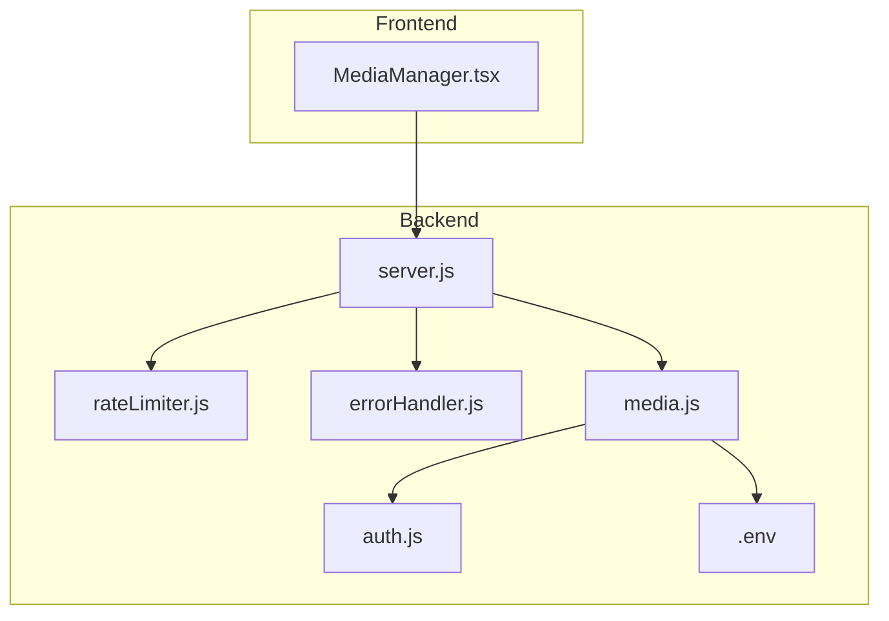
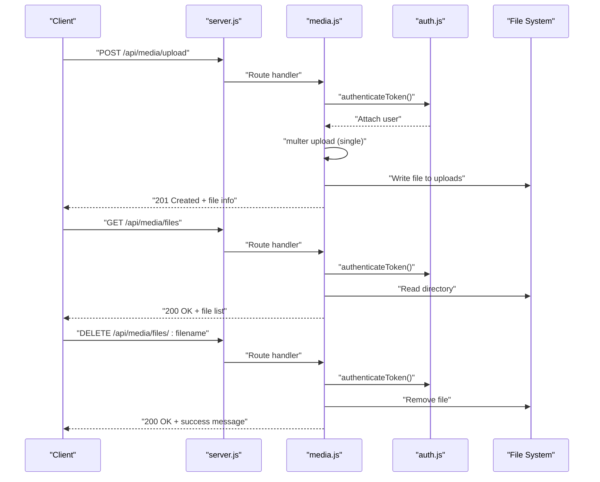
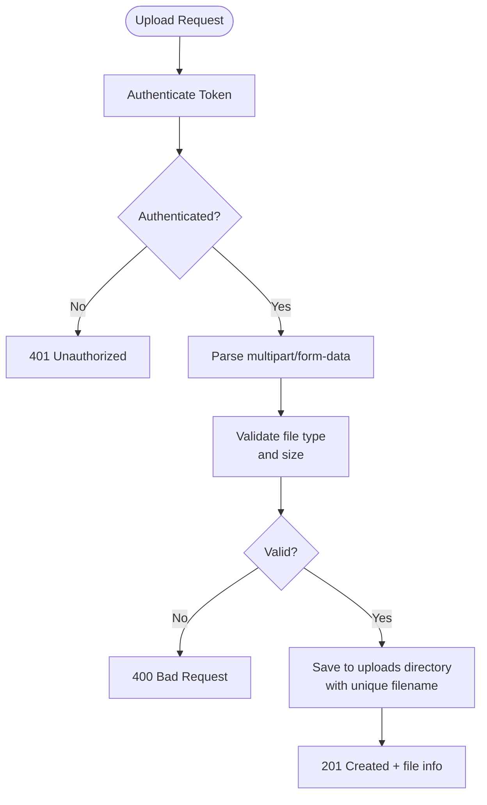
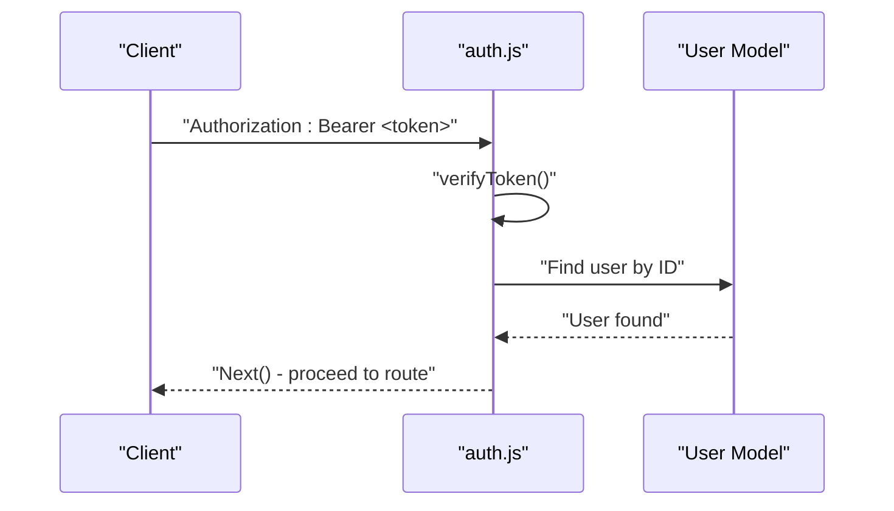
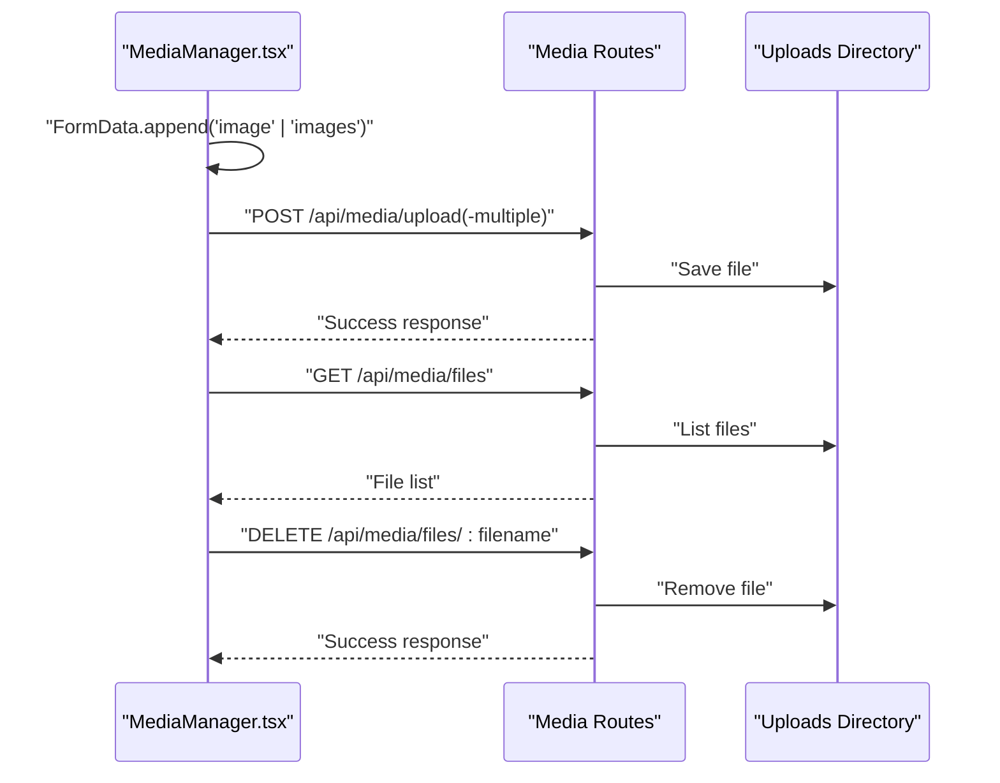
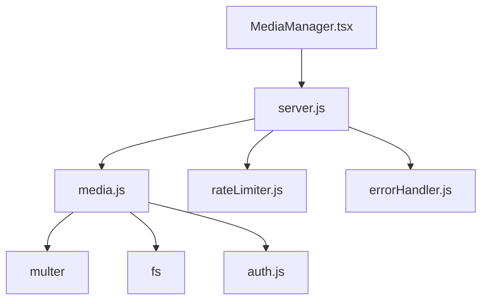

# Media Management API

<cite>
**Referenced Files in This Document**
- [server.js](file://server/server.js)
- [media.js](file://server/routes/media.js)
- [auth.js](file://server/middleware/auth.js)
- [rateLimiter.js](file://server/middleware/rateLimiter.js)
- [errorHandler.js](file://server/middleware/errorHandler.js)
- [.env](file://server/.env)
- [MediaManager.tsx](file://src/pages/admin/MediaManager.tsx)
- [imageOptimization.ts](file://src/utils/imageOptimization.ts)
- [netlify.toml](file://netlify.toml)
- [DEPLOYMENT.md](file://DEPLOYMENT.md)
- [SECURITY.md](file://SECURITY.md)
</cite>

## Table of Contents
1. [Introduction](#introduction)
2. [Project Structure](#project-structure)
3. [Core Components](#core-components)
4. [Architecture Overview](#architecture-overview)
5. [Detailed Component Analysis](#detailed-component-analysis)
6. [Dependency Analysis](#dependency-analysis)
7. [Performance Considerations](#performance-considerations)
8. [Troubleshooting Guide](#troubleshooting-guide)
9. [Conclusion](#conclusion)

## Introduction
This document provides comprehensive API documentation for media management endpoints focused on file upload, retrieval, and deletion. It covers HTTP methods, supported formats, size limitations, security considerations, storage configuration, rate limiting, file naming conventions, and CDN integration guidance. It also includes examples of multipart form data handling, error responses, and best practices for media optimization.

## Project Structure
The media management API is implemented as part of the backend server and integrated with the frontend admin panel. Key components include:
- Media routes for upload, listing, and deletion
- Authentication middleware for protected endpoints
- Rate limiting middleware for abuse prevention
- Static file serving for uploaded content
- Frontend integration via the Media Manager component

**Diagram sources**
- [server.js](file://server/server.js#L307-L309)
- [media.js](file://server/routes/media.js#L1-L142)
- [auth.js](file://server/middleware/auth.js#L1-L45)
- [rateLimiter.js](file://server/middleware/rateLimiter.js#L1-L50)
- [errorHandler.js](file://server/middleware/errorHandler.js#L1-L65)
- [.env](file://server/.env#L1-L6)

**Section sources**
- [server.js](file://server/server.js#L307-L309)
- [media.js](file://server/routes/media.js#L1-L142)
- [auth.js](file://server/middleware/auth.js#L1-L45)
- [rateLimiter.js](file://server/middleware/rateLimiter.js#L1-L50)
- [errorHandler.js](file://server/middleware/errorHandler.js#L1-L65)
- [.env](file://server/.env#L1-L6)

## Core Components
- Media routes module: Implements upload, listing, and deletion endpoints with multer for file handling and disk storage configuration.
- Authentication middleware: Protects endpoints with bearer token verification and user role checks.
- Rate limiting middleware: Provides configurable rate limits for general API and stricter limits for authentication-related operations.
- Static file serving: Serves uploaded files from the configured upload directory.
- Frontend integration: The Media Manager component handles multipart form data submission and displays uploaded files.

Key capabilities:
- Single and multiple file uploads
- File filtering for images only
- Unique filename generation
- File size limit enforcement
- Listing and deletion of uploaded files
- Static asset delivery for served files

**Section sources**
- [media.js](file://server/routes/media.js#L15-L44)
- [media.js](file://server/routes/media.js#L47-L96)
- [media.js](file://server/routes/media.js#L98-L137)
- [media.js](file://server/routes/media.js#L139-L142)
- [auth.js](file://server/middleware/auth.js#L5-L34)
- [rateLimiter.js](file://server/middleware/rateLimiter.js#L8-L42)

## Architecture Overview
The media management API follows a layered architecture:
- Route handlers define endpoints and delegate to middleware for authentication and file processing.
- Multer manages file uploads with configured storage and filters.
- Static middleware serves files from the upload directory.
- Error handling middleware centralizes error responses.

**Diagram sources**
- [server.js](file://server/server.js#L307-L309)
- [media.js](file://server/routes/media.js#L47-L96)
- [media.js](file://server/routes/media.js#L98-L137)
- [auth.js](file://server/middleware/auth.js#L5-L34)

## Detailed Component Analysis

### Media Routes
Endpoints:
- POST /api/media/upload: Upload a single image file
- POST /api/media/upload-multiple: Upload multiple image files (up to 10)
- GET /api/media/files: List all uploaded files
- DELETE /api/media/files/:filename: Delete a specific file

Supported file formats:
- Images only (mimetype starts with "image/")

Size limitations:
- Maximum file size: 5 MB per file

Security considerations:
- All endpoints are protected by authentication middleware
- File upload restricted to images only
- Unique filenames generated to prevent conflicts

Storage location:
- Uploads directory configured via environment variable UPLOAD_PATH (defaults to ./uploads)

Static serving:
- Uploaded files are served from /api/media/uploads

**Diagram sources**
- [media.js](file://server/routes/media.js#L28-L44)
- [media.js](file://server/routes/media.js#L47-L70)
- [auth.js](file://server/middleware/auth.js#L5-L34)

**Section sources**
- [media.js](file://server/routes/media.js#L15-L44)
- [media.js](file://server/routes/media.js#L47-L96)
- [media.js](file://server/routes/media.js#L98-L137)
- [.env](file://server/.env#L6)

### Authentication and Authorization
- Authentication middleware verifies bearer tokens and attaches user context
- Admin-specific protection is available via requireAdmin middleware
- All media endpoints are protected by authenticateToken

**Diagram sources**
- [auth.js](file://server/middleware/auth.js#L5-L34)

**Section sources**
- [auth.js](file://server/middleware/auth.js#L5-L34)

### Rate Limiting
- General API limiter: 100 requests per 15 minutes per IP
- Stricter limits for authentication endpoints
- Configurable via rateLimiter middleware

**Section sources**
- [rateLimiter.js](file://server/middleware/rateLimiter.js#L8-L42)

### Error Handling
- Centralized error handling middleware
- AppError class for structured error responses
- Environment-aware error reporting

**Section sources**
- [errorHandler.js](file://server/middleware/errorHandler.js#L5-L64)

### Frontend Integration
The Media Manager component demonstrates:
- Multipart form data construction for single and multiple file uploads
- Authorization header usage with bearer tokens
- File preview generation for image uploads
- Dynamic file listing and deletion actions

**Diagram sources**
- [MediaManager.tsx](file://src/pages/admin/MediaManager.tsx#L62-L96)
- [media.js](file://server/routes/media.js#L47-L96)
- [media.js](file://server/routes/media.js#L98-L137)

**Section sources**
- [MediaManager.tsx](file://src/pages/admin/MediaManager.tsx#L62-L96)
- [MediaManager.tsx](file://src/pages/admin/MediaManager.tsx#L22-L36)
- [MediaManager.tsx](file://src/pages/admin/MediaManager.tsx#L98-L112)

## Dependency Analysis
The media management API depends on:
- Express for routing and middleware
- Multer for multipart form data handling
- File system for local storage
- JWT authentication for access control
- Rate limiting for abuse prevention

**Diagram sources**
- [media.js](file://server/routes/media.js#L1-L7)
- [server.js](file://server/server.js#L307-L309)
- [rateLimiter.js](file://server/middleware/rateLimiter.js#L1-L1)
- [errorHandler.js](file://server/middleware/errorHandler.js#L1-L1)
- [MediaManager.tsx](file://src/pages/admin/MediaManager.tsx#L1-L8)

**Section sources**
- [media.js](file://server/routes/media.js#L1-L7)
- [server.js](file://server/server.js#L307-L309)
- [rateLimiter.js](file://server/middleware/rateLimiter.js#L1-L1)
- [errorHandler.js](file://server/middleware/errorHandler.js#L1-L1)
- [MediaManager.tsx](file://src/pages/admin/MediaManager.tsx#L1-L8)

## Performance Considerations
- File size limits reduce memory usage during upload processing
- Unique filename generation prevents filesystem contention
- Static file serving from the upload directory avoids in-memory buffering
- Consider implementing CDN integration for global distribution and reduced latency
- Image optimization utilities in the frontend support responsive images and modern formats

[No sources needed since this section provides general guidance]

## Troubleshooting Guide
Common issues and resolutions:
- Authentication failures: Verify bearer token format and expiration
- File upload errors: Check file type restrictions and size limits
- Permission issues: Ensure upload directory exists and is writable
- Rate limiting: Monitor request frequency to avoid temporary blocks

**Section sources**
- [auth.js](file://server/middleware/auth.js#L5-L34)
- [media.js](file://server/routes/media.js#L28-L44)
- [media.js](file://server/routes/media.js#L11-L13)
- [rateLimiter.js](file://server/middleware/rateLimiter.js#L8-L42)

## Conclusion
The media management API provides a secure, efficient solution for handling image uploads, listings, and deletions. With built-in authentication, rate limiting, and static file serving, it offers a robust foundation for media operations. For production deployments, consider integrating a CDN for improved performance and scalability, and ensure proper environment configuration for upload paths and security settings.