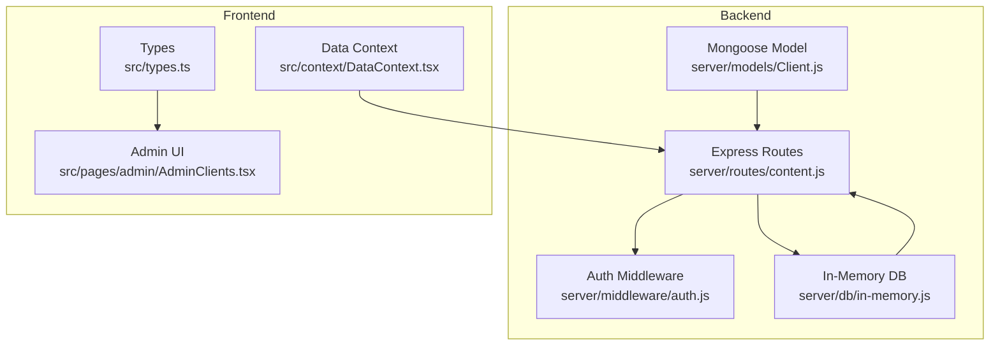
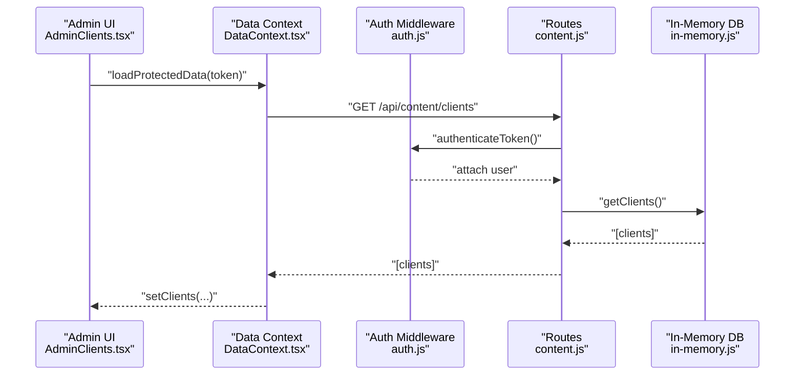
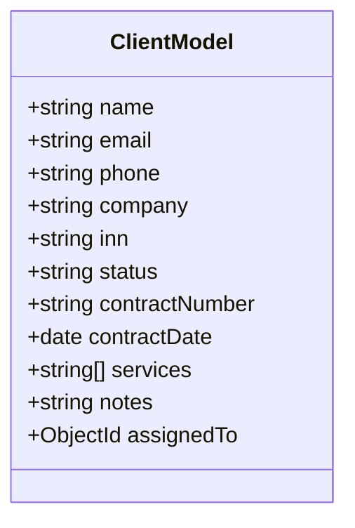
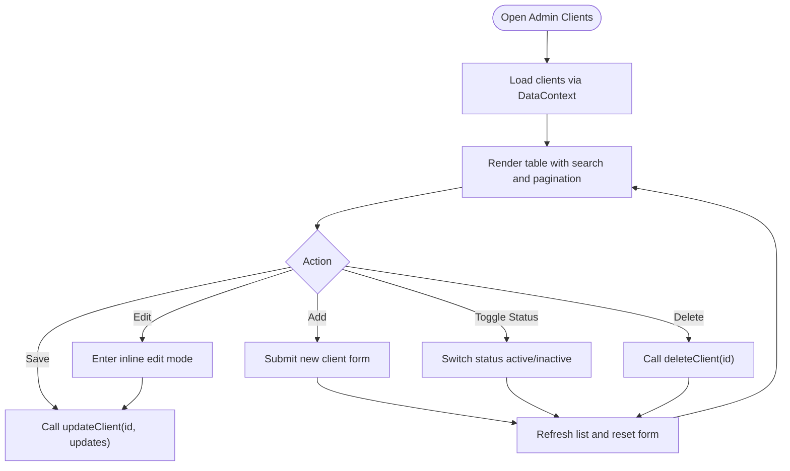
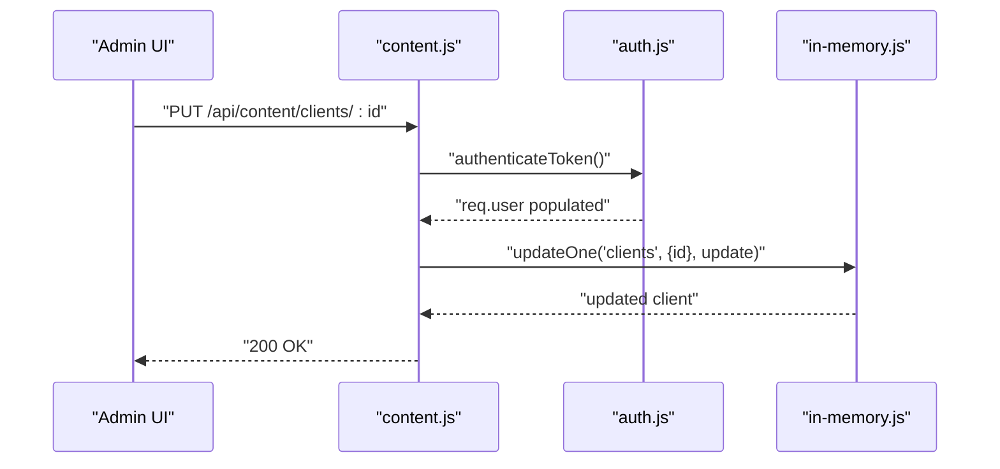
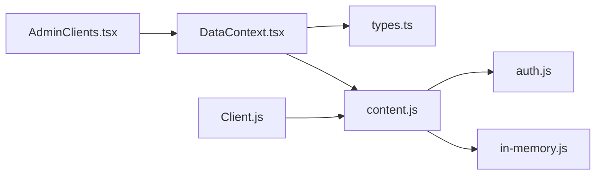

# Client Model

<cite>
**Referenced Files in This Document**
- [Client.js](file://server/models/Client.js)
- [content.js](file://server/routes/content.js)
- [auth.js](file://server/middleware/auth.js)
- [in-memory.js](file://server/db/in-memory.js)
- [types.ts](file://src/types.ts)
- [AdminClients.tsx](file://src/pages/admin/AdminClients.tsx)
- [DataContext.tsx](file://src/context/DataContext.tsx)
- [seed.js](file://server/seed.js)
</cite>

## Table of Contents
1. [Introduction](#introduction)
2. [Project Structure](#project-structure)
3. [Core Components](#core-components)
4. [Architecture Overview](#architecture-overview)
5. [Detailed Component Analysis](#detailed-component-analysis)
6. [Dependency Analysis](#dependency-analysis)
7. [Performance Considerations](#performance-considerations)
8. [Troubleshooting Guide](#troubleshooting-guide)
9. [Conclusion](#conclusion)
10. [Appendices](#appendices)

## Introduction
This document describes the Client model used for managing clients and partners within the Anko project. It focuses on the schema structure, verification and approval semantics, CRUD operations, and how client data is presented in the admin interface. Notably, the repository does not include a dedicated testimonials or ratings model; client records here represent organizations or contacts tracked by administrators. The documentation explains how to manage clients, how statuses are handled, and how the admin UI supports client administration.

## Project Structure
The Client model and related functionality span backend and frontend layers:
- Backend: Mongoose model defines the schema; Express routes expose admin endpoints; in-memory database provides seeded data for development.
- Frontend: TypeScript types define the client shape; the admin page renders and edits clients; the data context orchestrates API calls.

**Diagram sources**
- [Client.js](file://server/models/Client.js#L1-L66)
- [content.js](file://server/routes/content.js#L182-L230)
- [auth.js](file://server/middleware/auth.js#L1-L45)
- [in-memory.js](file://server/db/in-memory.js#L237-L271)
- [types.ts](file://src/types.ts#L44-L53)
- [AdminClients.tsx](file://src/pages/admin/AdminClients.tsx#L1-L292)
- [DataContext.tsx](file://src/context/DataContext.tsx#L1-L259)

**Section sources**
- [Client.js](file://server/models/Client.js#L1-L66)
- [content.js](file://server/routes/content.js#L182-L230)
- [auth.js](file://server/middleware/auth.js#L1-L45)
- [in-memory.js](file://server/db/in-memory.js#L237-L271)
- [types.ts](file://src/types.ts#L44-L53)
- [AdminClients.tsx](file://src/pages/admin/AdminClients.tsx#L1-L292)
- [DataContext.tsx](file://src/context/DataContext.tsx#L1-L259)

## Core Components
- Client Schema (backend): Defines fields for name, email, phone, company, tax ID, status, contract info, services, notes, and assignment. Includes indexes for email, status, and company.
- Client Types (frontend): Declares the Client interface and status union used by the admin UI and data context.
- Admin UI: Provides search, pagination, inline editing, and toggling of client status.
- Protected Routes: Admin endpoints are protected by authentication middleware.
- In-Memory Seed: Sample clients are included for local development.

Key schema highlights:
- Identity: name, email, phone, company
- Business info: tax ID (INN), contract number/date
- Organization: services array, notes
- Governance: status with active/inactive/pending, assignedTo reference
- Timestamps: createdAt/updatedAt via Mongoose options

**Section sources**
- [Client.js](file://server/models/Client.js#L3-L56)
- [types.ts](file://src/types.ts#L44-L53)
- [AdminClients.tsx](file://src/pages/admin/AdminClients.tsx#L1-L292)
- [content.js](file://server/routes/content.js#L182-L230)
- [auth.js](file://server/middleware/auth.js#L1-L45)
- [in-memory.js](file://server/db/in-memory.js#L237-L244)

## Architecture Overview
The admin workflow for clients involves:
- Admin UI requests client data via the data context.
- The data context calls protected endpoints under /api/content/clients.
- Routes enforce authentication and delegate to the in-memory database.
- The UI supports filtering, pagination, inline editing, and status toggling.

**Diagram sources**
- [AdminClients.tsx](file://src/pages/admin/AdminClients.tsx#L1-L292)
- [DataContext.tsx](file://src/context/DataContext.tsx#L70-L87)
- [auth.js](file://server/middleware/auth.js#L5-L34)
- [content.js](file://server/routes/content.js#L182-L190)
- [in-memory.js](file://server/db/in-memory.js#L237-L244)

## Detailed Component Analysis

### Client Schema (Backend)
The schema defines:
- Identity fields: name, email, phone
- Company and tax info: company, tax ID (INN)
- Contract info: contractNumber, contractDate
- Organization: services (array of strings), notes
- Governance: status enum, assignedTo ObjectId reference
- Indexes: email, status, company
- Timestamps: createdAt/updatedAt

Validation and constraints:
- Name and company length limits
- Email format validation
- INN numeric length constraint (10 or 12 digits)
- Status enum restricted to active, inactive, pending
- AssignedTo references a User document

**Diagram sources**
- [Client.js](file://server/models/Client.js#L3-L56)

**Section sources**
- [Client.js](file://server/models/Client.js#L3-L66)

### Client Types (Frontend)
The frontend type definition:
- ClientStatus union: active | inactive
- Client interface: id, name, email, company, status

These types align with the seeded data and admin UI expectations.

**Section sources**
- [types.ts](file://src/types.ts#L44-L53)
- [seed.js](file://server/seed.js#L115-L121)

### Admin Client Management (UI)
AdminClients.tsx provides:
- Search by name/company/email
- Pagination (10 items per page)
- Inline editing for name, company, email, status
- Add new client form
- Toggle status between active and inactive
- Delete client action

**Diagram sources**
- [AdminClients.tsx](file://src/pages/admin/AdminClients.tsx#L1-L292)
- [DataContext.tsx](file://src/context/DataContext.tsx#L206-L234)

**Section sources**
- [AdminClients.tsx](file://src/pages/admin/AdminClients.tsx#L1-L292)
- [DataContext.tsx](file://src/context/DataContext.tsx#L206-L234)

### Protected Routes and Authentication
- GET /api/content/clients requires authentication.
- PUT /api/content/clients/:id and DELETE /api/content/clients/:id require authentication.
- Authentication middleware verifies tokens and attaches user info to the request.

**Diagram sources**
- [content.js](file://server/routes/content.js#L201-L215)
- [auth.js](file://server/middleware/auth.js#L5-L34)
- [in-memory.js](file://server/db/in-memory.js#L47-L61)

**Section sources**
- [content.js](file://server/routes/content.js#L182-L230)
- [auth.js](file://server/middleware/auth.js#L1-L45)

### In-Memory Data and Seeding
- Initial clients are seeded in the in-memory database.
- The seed script also defines initial clients for programmatic initialization.

**Section sources**
- [in-memory.js](file://server/db/in-memory.js#L237-L244)
- [seed.js](file://server/seed.js#L115-L121)

## Dependency Analysis
- Admin UI depends on:
  - DataContext for API calls
  - Types for typing
- DataContext depends on:
  - Axios for HTTP requests
  - Environment variable for base URL
- Routes depend on:
  - Authentication middleware
  - In-memory database for persistence
- Model depends on:
  - Mongoose for schema and indexing

**Diagram sources**
- [AdminClients.tsx](file://src/pages/admin/AdminClients.tsx#L1-L292)
- [DataContext.tsx](file://src/context/DataContext.tsx#L1-L259)
- [types.ts](file://src/types.ts#L44-L53)
- [content.js](file://server/routes/content.js#L182-L230)
- [auth.js](file://server/middleware/auth.js#L1-L45)
- [in-memory.js](file://server/db/in-memory.js#L237-L271)
- [Client.js](file://server/models/Client.js#L1-L66)

**Section sources**
- [AdminClients.tsx](file://src/pages/admin/AdminClients.tsx#L1-L292)
- [DataContext.tsx](file://src/context/DataContext.tsx#L1-L259)
- [content.js](file://server/routes/content.js#L182-L230)
- [auth.js](file://server/middleware/auth.js#L1-L45)
- [in-memory.js](file://server/db/in-memory.js#L237-L271)
- [Client.js](file://server/models/Client.js#L1-L66)

## Performance Considerations
- Indexes on email, status, and company improve query performance for filtering and sorting in the admin UI.
- Pagination reduces payload sizes when listing clients.
- In-memory storage is suitable for development; production would benefit from a persistent database with appropriate indexing and connection pooling.

## Troubleshooting Guide
Common issues and resolutions:
- Authentication errors: Ensure a valid bearer token is attached to requests; verify token validity and user existence.
- Client not found: Confirm the client ID exists in the in-memory collection before attempting updates or deletions.
- Validation failures: Respect field constraints (lengths, formats, enums) before submitting forms.

Operational checks:
- Verify endpoints are protected by authentication middleware.
- Confirm in-memory seed data is loaded during startup.
- Use the admin UI’s search and pagination to locate clients efficiently.

**Section sources**
- [auth.js](file://server/middleware/auth.js#L5-L34)
- [content.js](file://server/routes/content.js#L201-L215)
- [in-memory.js](file://server/db/in-memory.js#L237-L244)

## Conclusion
The Client model in Anko provides a structured way to track clients and partners with robust identity, business, and governance fields. The admin interface supports efficient management through search, pagination, inline editing, and status toggling. While testimonials and ratings are not part of this model, the existing schema and admin tools enable effective client administration and can serve as a foundation for future enhancements such as feedback or review features.

## Appendices

### API Reference: Client Endpoints
- GET /api/content/clients
  - Requires: Authorization header with bearer token
  - Response: Array of clients
- POST /api/content/clients
  - Requires: Authorization header with bearer token
  - Body: Client without id
  - Response: Created client
- PUT /api/content/clients/:id
  - Requires: Authorization header with bearer token
  - Body: Partial client updates
  - Response: Updated client
- DELETE /api/content/clients/:id
  - Requires: Authorization header with bearer token
  - Response: Deletion confirmation

**Section sources**
- [content.js](file://server/routes/content.js#L182-L230)
- [auth.js](file://server/middleware/auth.js#L1-L45)

### Client Schema Fields
- name: String, required, trimmed, max length 200
- email: String, required, trimmed, lowercased, validated format
- phone: String, trimmed
- company: String, trimmed, max length 200
- inn: String, trimmed, numeric 10 or 12 digits
- status: Enum, default active, values active | inactive | pending
- contractNumber: String, trimmed
- contractDate: Date
- services: Array of String
- notes: String, max length 2000
- assignedTo: ObjectId referencing User
- timestamps: createdAt, updatedAt

**Section sources**
- [Client.js](file://server/models/Client.js#L3-L56)

### Admin UI Operations
- Search clients by name, company, or email
- Paginate results (10 per page)
- Inline edit name, company, email, status
- Add new client with name, company, email, status
- Toggle status between active and inactive
- Delete client

**Section sources**
- [AdminClients.tsx](file://src/pages/admin/AdminClients.tsx#L22-L68)