# Content Model

<cite>
**Referenced Files in This Document**
- [Content.js](file://server/models/Content.js)
- [Service.js](file://server/models/Service.js)
- [News.js](file://server/models/News.js)
- [TeamMember.js](file://server/models/TeamMember.js)
- [FAQ.js](file://server/models/FAQ.js)
- [Client.js](file://server/models/Client.js)
- [content-new.js](file://server/routes/content-new.js)
- [content.js](file://server/routes/content.js)
- [in-memory.js](file://server/db/in-memory.js)
- [auth.js](file://server/middleware/auth.js)
- [errorHandler.js](file://server/middleware/errorHandler.js)
- [validators.js](file://server/utils/validators.js)
- [types.ts](file://src/types.ts)
- [DataContext.tsx](file://src/context/DataContext.tsx)
- [AdminNews.tsx](file://src/pages/admin/AdminNews.tsx)
- [AdminFAQ.tsx](file://src/pages/admin/AdminFAQ.tsx)
- [AdminClients.tsx](file://src/pages/admin/AdminClients.tsx)
- [AdminTeam.tsx](file://src/pages/admin/AdminTeam.tsx)
</cite>

## Table of Contents
1. [Introduction](#introduction)
2. [Project Structure](#project-structure)
3. [Core Components](#core-components)
4. [Architecture Overview](#architecture-overview)
5. [Detailed Component Analysis](#detailed-component-analysis)
6. [Dependency Analysis](#dependency-analysis)
7. [Performance Considerations](#performance-considerations)
8. [Troubleshooting Guide](#troubleshooting-guide)
9. [Conclusion](#conclusion)
10. [Appendices](#appendices)

## Introduction
This document describes the Content model used for general page content management in the Anko project. It focuses on the schema structure for managing services, team members, news, FAQ, clients, and inquiries. It documents field definitions, validation rules, publishing workflows, status management, relationships with other models, and administrative content management features. It also outlines content creation, editing, and display logic, along with scheduling, localization, and multimedia support considerations.

## Project Structure
The content management system spans backend models and routes, middleware for authentication and error handling, a frontend data context, and admin UI components. The backend currently supports two content route sets:
- Legacy in-memory routes for services, team, news, FAQ, clients, and inquiries
- New MongoDB-backed routes for services, team, news, FAQ, clients, and inquiries

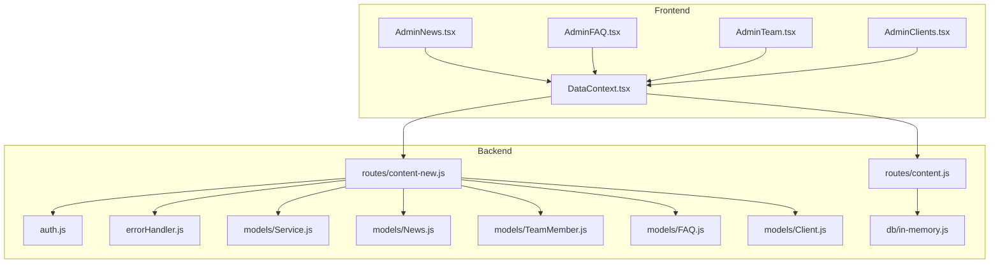

**Diagram sources**
- [DataContext.tsx](file://src/context/DataContext.tsx#L32-L34)
- [content-new.js](file://server/routes/content-new.js#L1-L441)
- [content.js](file://server/routes/content.js#L1-L267)
- [auth.js](file://server/middleware/auth.js#L1-L45)
- [errorHandler.js](file://server/middleware/errorHandler.js#L1-L65)
- [in-memory.js](file://server/db/in-memory.js#L1-L271)
- [Service.js](file://server/models/Service.js#L1-L49)
- [News.js](file://server/models/News.js#L1-L64)
- [TeamMember.js](file://server/models/TeamMember.js#L1-L57)
- [FAQ.js](file://server/models/FAQ.js#L1-L43)
- [Client.js](file://server/models/Client.js#L1-L66)

**Section sources**
- [DataContext.tsx](file://src/context/DataContext.tsx#L32-L34)
- [content-new.js](file://server/routes/content-new.js#L1-L441)
- [content.js](file://server/routes/content.js#L1-L267)
- [in-memory.js](file://server/db/in-memory.js#L1-L271)

## Core Components
- Service: Describes offerings with identifiers, titles, descriptions, icons, details, activity flag, and ordering.
- TeamMember: Stores biographical and contact details, optional social links, and activity/ordering.
- News: Manages titles, summaries, optional content, categories, dates, authors, images, publication flags, and view counters.
- FAQ: Captures questions, answers, categories, publication flags, ordering, and view counters.
- Client: Holds client information, contact details, status, contracts, services, notes, and assigned staff.
- Inquiries: Handles public submissions and internal management with statuses and resolution tracking.

Validation rules and constraints are defined per model to ensure data integrity and enforce limits.

**Section sources**
- [Service.js](file://server/models/Service.js#L3-L40)
- [TeamMember.js](file://server/models/TeamMember.js#L3-L49)
- [News.js](file://server/models/News.js#L3-L45)
- [FAQ.js](file://server/models/FAQ.js#L3-L34)
- [Client.js](file://server/models/Client.js#L3-L56)

## Architecture Overview
The system separates public read access from administrative write access. Public consumers fetch content via the new MongoDB-backed routes, while administrators use authenticated endpoints to manage content. Authentication middleware verifies tokens and enforces admin-only routes. Error handling centralizes error responses and wraps async handlers.

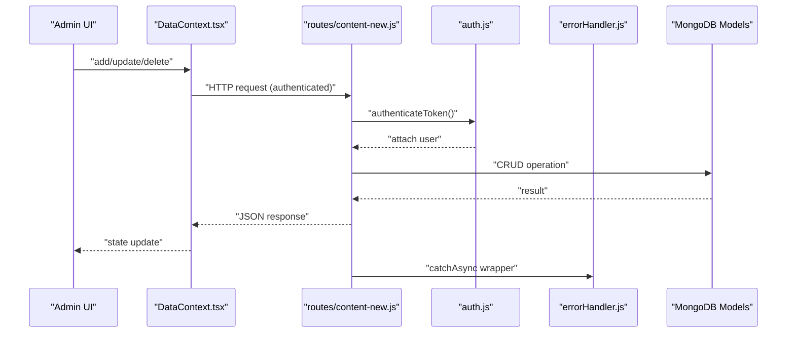

**Diagram sources**
- [DataContext.tsx](file://src/context/DataContext.tsx#L89-L234)
- [content-new.js](file://server/routes/content-new.js#L45-L59)
- [auth.js](file://server/middleware/auth.js#L5-L34)
- [errorHandler.js](file://server/middleware/errorHandler.js#L53-L57)

## Detailed Component Analysis

### Service Model
- Purpose: Manage service offerings with identifiers, titles, descriptions, icons, details, activity flag, and ordering.
- Key fields: serviceId (unique), title, description, icon, details[], isActive, order.
- Validation: Length limits and required fields enforced via schema.
- Indexes: serviceId, (isActive, order) for fast retrieval and ordering.

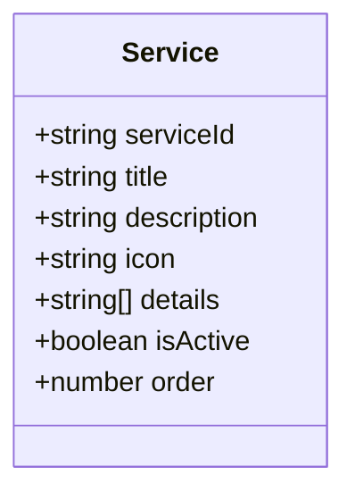

**Diagram sources**
- [Service.js](file://server/models/Service.js#L3-L40)

**Section sources**
- [Service.js](file://server/models/Service.js#L3-L40)

### TeamMember Model
- Purpose: Store team member profiles with biographical details, contact info, optional social links, and activity/ordering.
- Key fields: name, role, imageUrl, bio, email, phone, socialLinks, isActive, order.
- Validation: Name/role length limits, email format, URL presence for image.
- Indexes: (isActive, order) for ordering.

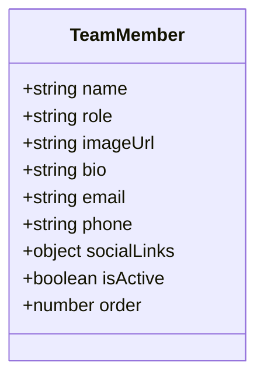

**Diagram sources**
- [TeamMember.js](file://server/models/TeamMember.js#L3-L49)

**Section sources**
- [TeamMember.js](file://server/models/TeamMember.js#L3-L49)

### News Model
- Purpose: Manage news articles with titles, summaries, optional content, categories, dates, authors, images, publication flags, and view counters.
- Key fields: title, summary, content, category, date, author, imageUrl, isPublished, views.
- Validation: Title/summary/content length limits, category enum, default values.
- Indexes: date, (category, date), (isPublished, date), virtual formattedDate.

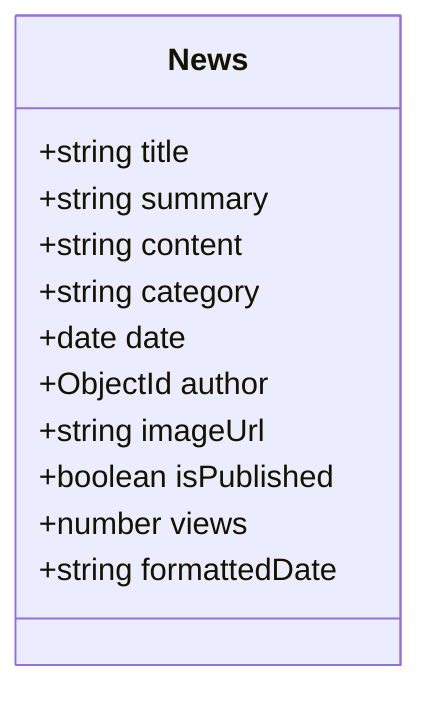

**Diagram sources**
- [News.js](file://server/models/News.js#L3-L59)

**Section sources**
- [News.js](file://server/models/News.js#L3-L59)

### FAQ Model
- Purpose: Store frequently asked questions with categories, publication flags, ordering, and view counters.
- Key fields: question, answer, category, isPublished, order, views.
- Validation: Question/answer length limits, category default.
- Indexes: (isPublished, order), category.

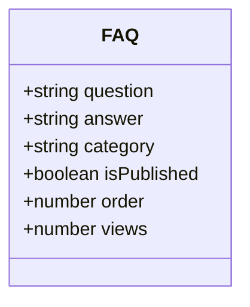

**Diagram sources**
- [FAQ.js](file://server/models/FAQ.js#L3-L34)

**Section sources**
- [FAQ.js](file://server/models/FAQ.js#L3-L34)

### Client Model
- Purpose: Track clients with personal/company details, contact info, status, contracts, services, notes, and assigned staff.
- Key fields: name, email, phone, company, inn, status, contractNumber, contractDate, services[], notes, assignedTo.
- Validation: Email format, INN numeric length, status enum, length limits.
- Indexes: email, status, company.

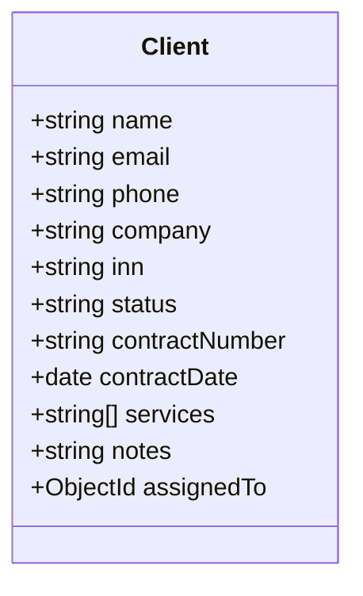

**Diagram sources**
- [Client.js](file://server/models/Client.js#L3-L56)

**Section sources**
- [Client.js](file://server/models/Client.js#L3-L56)

### Content Routes and Workflows
- Public read endpoints:
  - Services: GET /api/content/services
  - Team: GET /api/content/team
  - News: GET /api/content/news (paginated, filters by isPublished and category)
  - FAQ: GET /api/content/faq (filters by isPublished and category)
- Admin write endpoints:
  - Services: PUT /api/content/services/:serviceId
  - Team: POST/PUT/DELETE /api/content/team
  - News: POST/PUT/DELETE /api/content/news
  - FAQ: POST/PUT/DELETE /api/content/faq
  - Clients: GET/POST/PUT/DELETE /api/content/clients (admin-only)
  - Inquiries: GET/POST/PUT/DELETE /api/content/inquiries (admin-only)

Authentication and admin enforcement:
- authenticateToken middleware validates JWT and attaches user.
- requireAdmin middleware restricts routes to admin users.

Error handling:
- catchAsync wraps async handlers to avoid manual try/catch.
- AppError centralizes error responses with status codes.

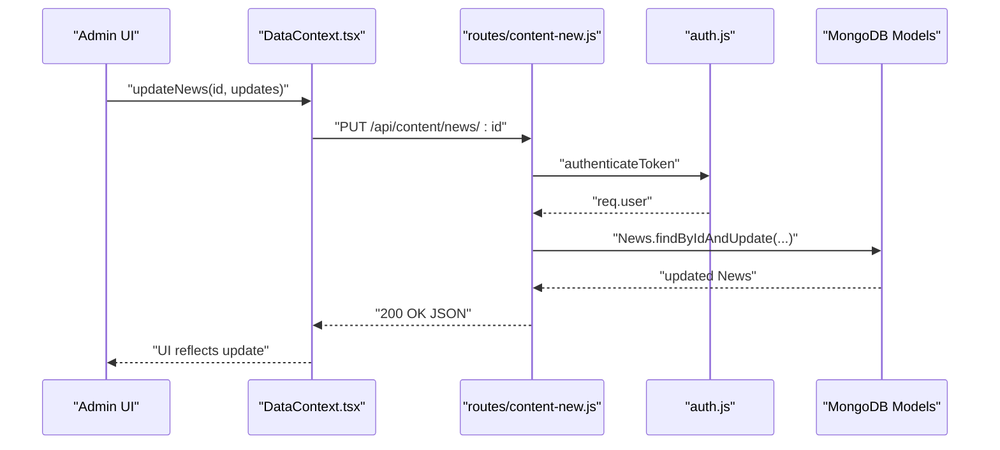

**Diagram sources**
- [DataContext.tsx](file://src/context/DataContext.tsx#L129-L157)
- [content-new.js](file://server/routes/content-new.js#L192-L204)
- [auth.js](file://server/middleware/auth.js#L5-L34)

**Section sources**
- [content-new.js](file://server/routes/content-new.js#L17-L219)
- [auth.js](file://server/middleware/auth.js#L5-L42)
- [errorHandler.js](file://server/middleware/errorHandler.js#L5-L64)

### In-Memory Content (Legacy)
The legacy routes under routes/content.js use an in-memory database simulator for services, team, news, FAQ, clients, and inquiries. These endpoints are public for reads and admin-protected for writes. They demonstrate CRUD operations without persistence.

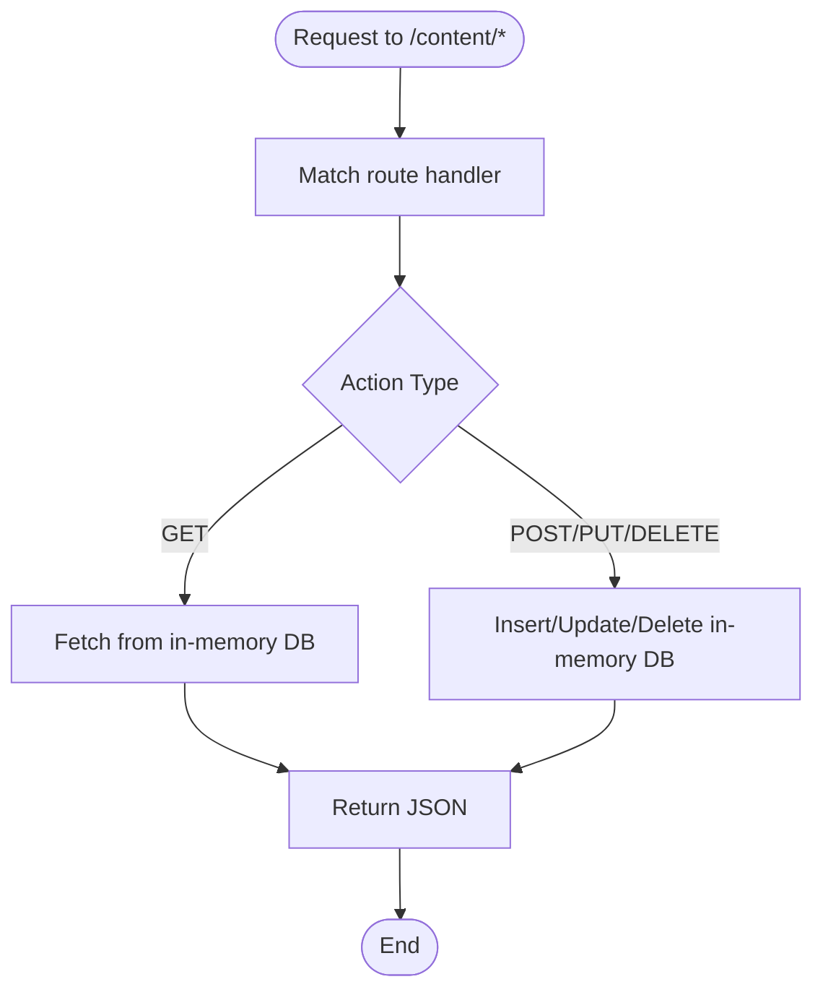

**Diagram sources**
- [content.js](file://server/routes/content.js#L6-L267)
- [in-memory.js](file://server/db/in-memory.js#L24-L83)

**Section sources**
- [content.js](file://server/routes/content.js#L1-L267)
- [in-memory.js](file://server/db/in-memory.js#L1-L271)

### Frontend Data Context and Admin Components
- DataContext.tsx provides typed CRUD methods for services, team, news, FAQ, clients, and inquiries, and loads protected data with bearer tokens.
- Admin components (AdminNews, AdminFAQ, AdminTeam, AdminClients) render forms, lists, and actions for content management.

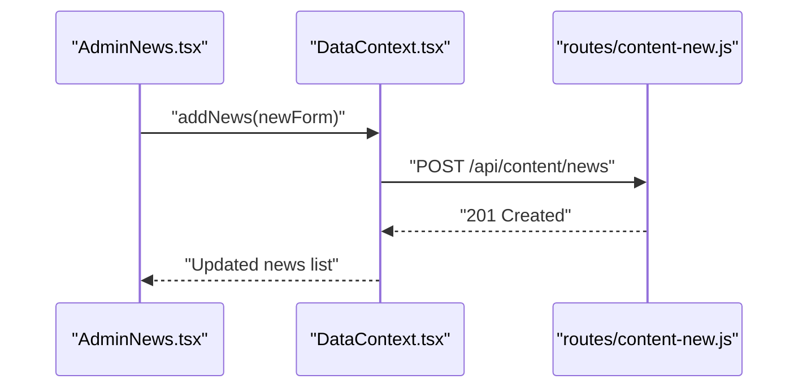

**Diagram sources**
- [AdminNews.tsx](file://src/pages/admin/AdminNews.tsx#L44-L56)
- [DataContext.tsx](file://src/context/DataContext.tsx#L139-L147)
- [content-new.js](file://server/routes/content-new.js#L178-L185)

**Section sources**
- [DataContext.tsx](file://src/context/DataContext.tsx#L89-L234)
- [AdminNews.tsx](file://src/pages/admin/AdminNews.tsx#L1-L212)
- [AdminFAQ.tsx](file://src/pages/admin/AdminFAQ.tsx#L1-L120)
- [AdminTeam.tsx](file://src/pages/admin/AdminTeam.tsx#L1-L203)
- [AdminClients.tsx](file://src/pages/admin/AdminClients.tsx#L1-L292)

## Dependency Analysis
- Backend routes depend on models for schema validation and persistence.
- Authentication middleware depends on JWT utilities and user model.
- Error handling middleware provides centralized error responses.
- Frontend DataContext depends on route URLs and types.

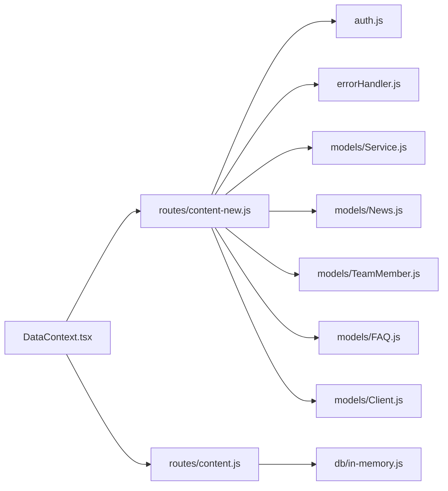

**Diagram sources**
- [content-new.js](file://server/routes/content-new.js#L1-L12)
- [auth.js](file://server/middleware/auth.js#L1-L4)
- [errorHandler.js](file://server/middleware/errorHandler.js#L1-L6)
- [Service.js](file://server/models/Service.js#L1-L2)
- [News.js](file://server/models/News.js#L1-L2)
- [TeamMember.js](file://server/models/TeamMember.js#L1-L2)
- [FAQ.js](file://server/models/FAQ.js#L1-L2)
- [Client.js](file://server/models/Client.js#L1-L2)
- [DataContext.tsx](file://src/context/DataContext.tsx#L32-L34)
- [content.js](file://server/routes/content.js#L1-L4)
- [in-memory.js](file://server/db/in-memory.js#L1-L3)

**Section sources**
- [content-new.js](file://server/routes/content-new.js#L1-L12)
- [auth.js](file://server/middleware/auth.js#L1-L4)
- [errorHandler.js](file://server/middleware/errorHandler.js#L1-L6)
- [DataContext.tsx](file://src/context/DataContext.tsx#L32-L34)

## Performance Considerations
- Indexes: Models define indexes on frequently queried fields (e.g., News date, category; FAQ isPublished/order; Client status/email/company). These improve read performance for paginated and filtered queries.
- Pagination: News endpoint supports limit/page parameters to control payload sizes.
- Virtual fields: News includes a virtual for formatted date to avoid recomputation on the client.
- Recommendations:
  - Use indexes consistently for filters like category, status, and date ranges.
  - Consider caching for frequently accessed public content.
  - Normalize media URLs and leverage CDN for images.

[No sources needed since this section provides general guidance]

## Troubleshooting Guide
- Authentication failures: Ensure Authorization header contains a valid bearer token; verify token expiration and user existence.
- Admin-only routes: requireAdmin blocks non-admin users; confirm user role assignment.
- Validation errors: Schema validations return descriptive messages; check field lengths and enums.
- Error responses: Operational errors return concise messages; development mode exposes stacks.

**Section sources**
- [auth.js](file://server/middleware/auth.js#L5-L42)
- [errorHandler.js](file://server/middleware/errorHandler.js#L16-L44)
- [Service.js](file://server/models/Service.js#L10-L20)
- [News.js](file://server/models/News.js#L4-L18)
- [FAQ.js](file://server/models/FAQ.js#L4-L14)
- [Client.js](file://server/models/Client.js#L4-L25)

## Conclusion
The Anko project’s content model provides a robust foundation for managing services, team profiles, news, FAQ, clients, and inquiries. MongoDB-backed models with strict validation, indexing, and admin-protected routes enable scalable content management. The frontend DataContext and admin components streamline content creation, editing, and display. Extending the system to support richer content (e.g., structured content bodies, scheduling, localization) would benefit from schema enhancements and UI updates aligned with the existing patterns.

[No sources needed since this section summarizes without analyzing specific files]

## Appendices

### Field Definitions and Validation Rules
- Service: serviceId (unique), title, description, icon, details[], isActive, order; length limits and required fields.
- TeamMember: name, role, imageUrl, bio, email, phone, socialLinks, isActive, order; email format and URL requirement.
- News: title, summary, content, category, date, author, imageUrl, isPublished, views; category enum and length limits.
- FAQ: question, answer, category, isPublished, order, views; category default and length limits.
- Client: name, email, phone, company, inn, status, contractNumber, contractDate, services[], notes, assignedTo; INN numeric length and status enum.

**Section sources**
- [Service.js](file://server/models/Service.js#L3-L40)
- [TeamMember.js](file://server/models/TeamMember.js#L3-L49)
- [News.js](file://server/models/News.js#L3-L45)
- [FAQ.js](file://server/models/FAQ.js#L3-L34)
- [Client.js](file://server/models/Client.js#L3-L56)

### Publishing Workflows and Status Management
- Published vs draft: News and FAQ include isPublished flags; public endpoints filter by isPublished.
- Status enums: Client status uses active/inactive/pending; Inquiry uses pending/read/replied.
- Ordering: Services and TeamMembers support order fields for presentation control.

**Section sources**
- [News.js](file://server/models/News.js#L35-L38)
- [FAQ.js](file://server/models/FAQ.js#L20-L23)
- [Client.js](file://server/models/Client.js#L31-L35)
- [content-new.js](file://server/routes/content-new.js#L129-L152)

### Scheduling, Localization, and Multimedia Support
- Scheduling: No explicit scheduled publishing fields are present in the current models.
- Localization: No locale fields or multilingual variants are defined.
- Multimedia: News supports imageUrl; TeamMember supports imageUrl; Client supports optional notes and attachments if added.

**Section sources**
- [News.js](file://server/models/News.js#L32-L34)
- [TeamMember.js](file://server/models/TeamMember.js#L16-L19)
- [Client.js](file://server/models/Client.js#L43-L49)

### Examples: Creation, Editing, and Display Logic
- Creation:
  - News: POST /api/content/news with author attached from token.
  - FAQ: POST /api/content/faq.
  - Team: POST /api/content/team.
  - Clients: POST /api/content/clients (admin-only).
- Editing:
  - News: PUT /api/content/news/:id.
  - FAQ: PUT /api/content/faq/:id.
  - Team: PUT /api/content/team/:id.
  - Clients: PUT /api/content/clients/:id.
- Display:
  - Public: GET /api/content/news (paginated), GET /api/content/faq (filtered), GET /api/content/services, GET /api/content/team.
  - Admin: GET /api/content/clients, GET /api/content/inquiries.

**Section sources**
- [content-new.js](file://server/routes/content-new.js#L178-L219)
- [content-new.js](file://server/routes/content-new.js#L22-L25)
- [content-new.js](file://server/routes/content-new.js#L129-L152)