# Database Models

<cite>
**Referenced Files in This Document**
- [User.js](file://server/models/User.js)
- [Service.js](file://server/models/Service.js)
- [Content.js](file://server/models/Content.js)
- [News.js](file://server/models/News.js)
- [TeamMember.js](file://server/models/TeamMember.js)
- [FAQ.js](file://server/models/FAQ.js)
- [Client.js](file://server/models/Client.js)
- [in-memory.js](file://server/db/in-memory.js)
- [.env](file://server/.env)
- [package.json](file://server/package.json)
- [MIGRATION.md](file://server/MIGRATION.md)
- [seed.js](file://server/seed.js)
- [seedContent.js](file://server/scripts/seedContent.js)
- [validators.js](file://server/utils/validators.js)
</cite>

## Table of Contents
1. [Introduction](#introduction)
2. [Project Structure](#project-structure)
3. [Core Components](#core-components)
4. [Architecture Overview](#architecture-overview)
5. [Detailed Component Analysis](#detailed-component-analysis)
6. [Dependency Analysis](#dependency-analysis)
7. [Performance Considerations](#performance-considerations)
8. [Troubleshooting Guide](#troubleshooting-guide)
9. [Conclusion](#conclusion)
10. [Appendices](#appendices)

## Introduction
This document describes the MongoDB database schema used by the Anko project. It focuses on the data models for Users, Services, Content, News, Team Members, FAQs, and Clients. It explains field definitions, data types, validation rules, business constraints, and indexes. It also covers authentication and role-based access control, password hashing, data access patterns, and operational considerations such as seeding and migrations.

## Project Structure
The backend uses Mongoose ODM to define models and connect to MongoDB. Environment variables configure the database URI and secrets. A dedicated seeding script initializes collections with sample data. A separate in-memory simulation module is available for development and testing.

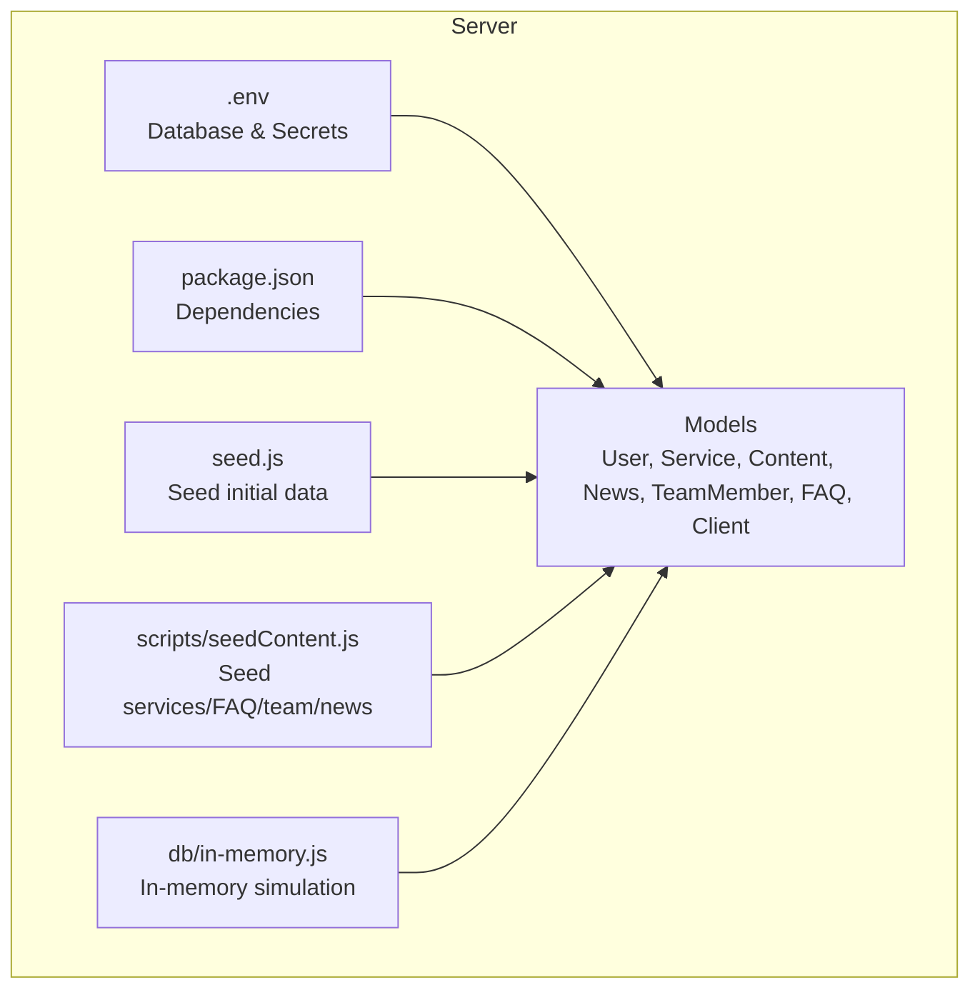

**Diagram sources**
- [.env](file://server/.env#L1-L6)
- [package.json](file://server/package.json#L18-L30)
- [seed.js](file://server/seed.js#L1-L170)
- [seedContent.js](file://server/scripts/seedContent.js#L1-L150)
- [in-memory.js](file://server/db/in-memory.js#L1-L271)

**Section sources**
- [.env](file://server/.env#L1-L6)
- [package.json](file://server/package.json#L18-L30)
- [seed.js](file://server/seed.js#L1-L170)
- [seedContent.js](file://server/scripts/seedContent.js#L1-L150)
- [in-memory.js](file://server/db/in-memory.js#L1-L271)

## Core Components
This section documents each model’s fields, types, constraints, and indexes. It also highlights authentication and RBAC mechanisms.

- User
  - Purpose: Authentication, roles, refresh tokens, password reset.
  - Key fields: username, email, password, role, refreshTokens, passwordResetToken, passwordResetExpires, timestamps.
  - Constraints: Unique username and email; email regex; password min length; role enum; refresh token TTL.
  - Security: Pre-save password hashing via bcrypt; protected JSON serialization; refresh tokens stored with expiration.
  - Access control: role-based endpoints; middleware verifies JWT and checks role.

- Service
  - Purpose: Accounting and business services offered.
  - Key fields: serviceId, title, description, icon, details[], isActive, order, timestamps.
  - Constraints: Unique serviceId; max lengths; default icon; default isActive and order.
  - Indexes: serviceId; compound (isActive, order).

- Content (aggregated)
  - Purpose: General content entities grouped in a single file.
  - Entities: Service, TeamMember, News, FAQ, Client, Inquiry.
  - Notes: The aggregated file exports multiple models; see individual model files for precise definitions.

- News
  - Purpose: Announcements and articles.
  - Key fields: title, summary, content, category, date, author (User), imageUrl, isPublished, views, timestamps.
  - Constraints: Category enum; defaults; date default; author ObjectId reference.
  - Indexes: date desc; category+date; isPublished+date; virtual formattedDate.

- TeamMember
  - Purpose: Staff profiles.
  - Key fields: name, role, imageUrl, bio, email, phone, socialLinks, isActive, order, timestamps.
  - Constraints: Max lengths; optional phone/email; social links object; default isActive and order.
  - Indexes: isActive+order.

- FAQ
  - Purpose: Frequently asked questions.
  - Key fields: question, answer, category, isPublished, order, views, timestamps.
  - Constraints: Defaults; category enum; order and views.
  - Indexes: isPublished+order; category.

- Client
  - Purpose: Testimonials and client records.
  - Key fields: name, email, phone, company, inn, status, contractNumber, contractDate, services[], notes, assignedTo(User), timestamps.
  - Constraints: Company and INN validations; status enum; assignedTo ObjectId reference.
  - Indexes: email; status; company.

**Section sources**
- [User.js](file://server/models/User.js#L4-L48)
- [Service.js](file://server/models/Service.js#L3-L40)
- [Content.js](file://server/models/Content.js#L3-L81)
- [News.js](file://server/models/News.js#L3-L45)
- [TeamMember.js](file://server/models/TeamMember.js#L3-L49)
- [FAQ.js](file://server/models/FAQ.js#L3-L34)
- [Client.js](file://server/models/Client.js#L3-L56)

## Architecture Overview
The backend connects to MongoDB using Mongoose. Models define schemas and indexes. Seed scripts populate collections. In-memory simulation supports local development without a live database.

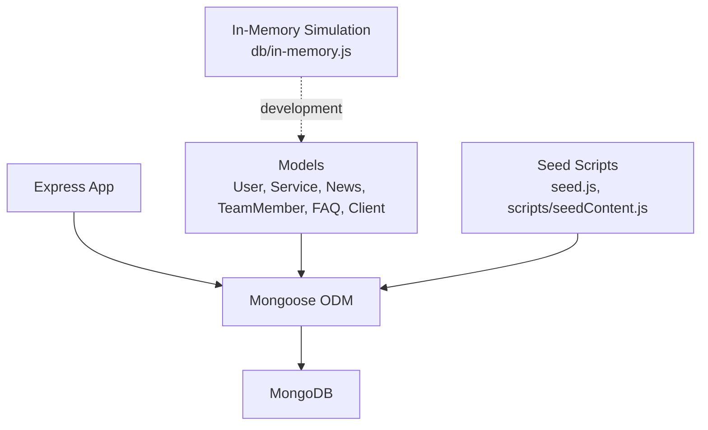

**Diagram sources**
- [seed.js](file://server/seed.js#L1-L170)
- [seedContent.js](file://server/scripts/seedContent.js#L1-L150)
- [in-memory.js](file://server/db/in-memory.js#L1-L271)
- [User.js](file://server/models/User.js#L1-L105)
- [Service.js](file://server/models/Service.js#L1-L49)
- [News.js](file://server/models/News.js#L1-L64)
- [TeamMember.js](file://server/models/TeamMember.js#L1-L57)
- [FAQ.js](file://server/models/FAQ.js#L1-L43)
- [Client.js](file://server/models/Client.js#L1-L66)

## Detailed Component Analysis

### User Model
The User model encapsulates authentication, roles, and session tokens. It enforces strong validation and applies bcrypt hashing before saving. It exposes methods for password comparison and refresh token management.

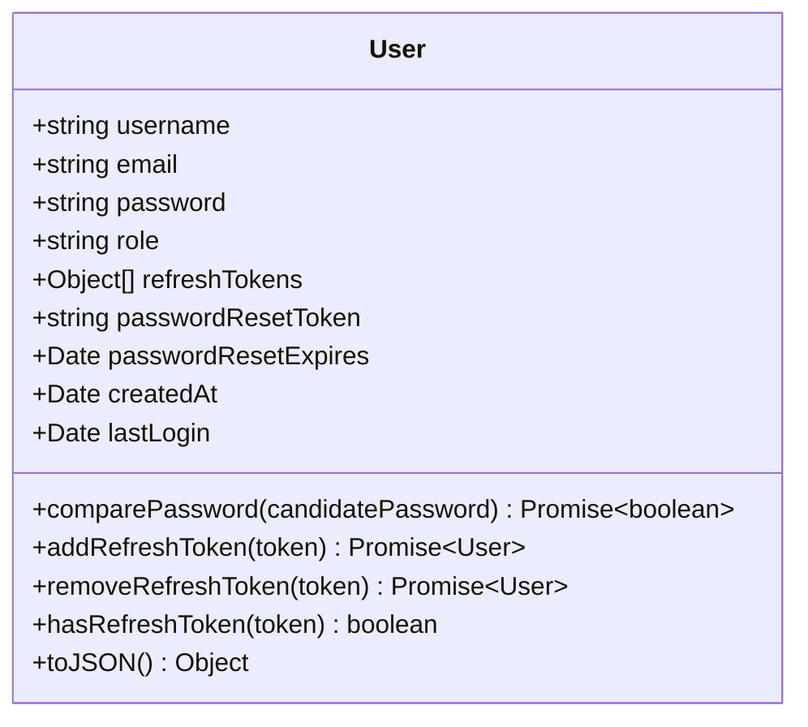

**Diagram sources**
- [User.js](file://server/models/User.js#L4-L100)

Key behaviors:
- Pre-save hook hashes password using bcrypt with salt rounds.
- Methods for password verification and refresh token CRUD.
- toJSON strips sensitive fields for safe serialization.

Validation and constraints:
- Username: required, unique, trimmed, length limits.
- Email: required, unique, trimmed, lowercase, regex match.
- Password: required, minimum length.
- Role: enum with default.
- Refresh tokens: array of objects with createdAt and TTL.

Security and access control:
- JWT-based access/refresh tokens.
- Role-based endpoints restrict admin-only routes.
- Password reset tokens are validated and time-bound.

**Section sources**
- [User.js](file://server/models/User.js#L4-L100)
- [MIGRATION.md](file://server/MIGRATION.md#L198-L213)

### Service Model
Service defines offerings with ordering and visibility controls.

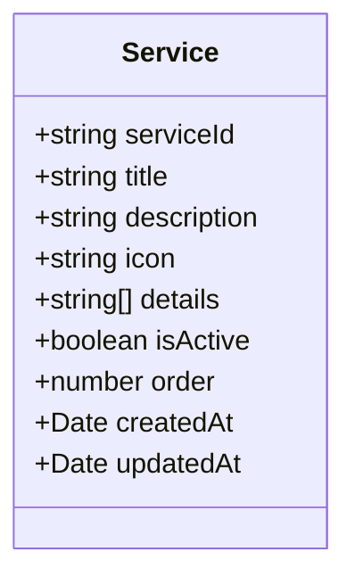

**Diagram sources**
- [Service.js](file://server/models/Service.js#L3-L40)

Indexes:
- serviceId: unique for fast lookup.
- isActive + order: efficient filtering and sorting.

Constraints:
- serviceId uniqueness and trimming.
- Max lengths for title/description.
- Default icon, isActive, order.

**Section sources**
- [Service.js](file://server/models/Service.js#L3-L44)

### Content Model Family (Aggregated)
The aggregated Content model groups several content-related entities under one export. Each maintains its own schema and indexes.

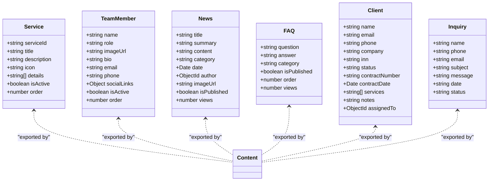

**Diagram sources**
- [Content.js](file://server/models/Content.js#L3-L81)

Notes:
- The aggregated file exports Service, TeamMember, News, FAQ, Client, Inquiry.
- Individual model files provide authoritative definitions and indexes.

**Section sources**
- [Content.js](file://server/models/Content.js#L3-L81)

### News Model
News represents announcements with categorization and publication controls.

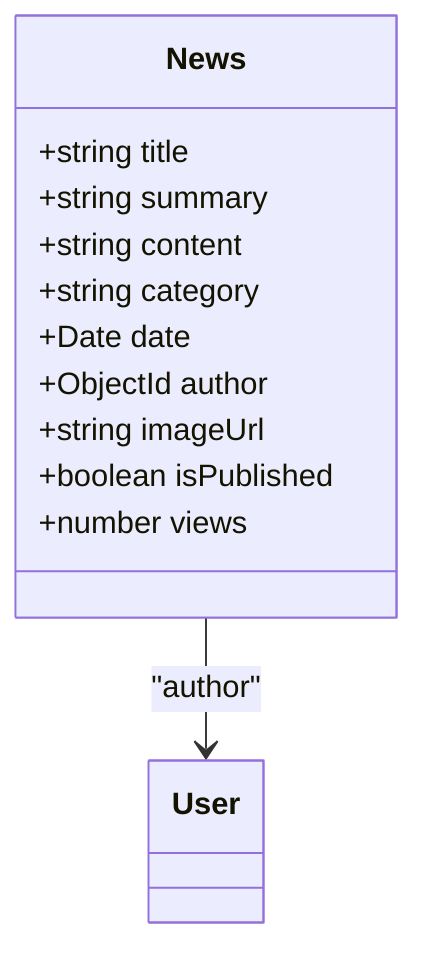

**Diagram sources**
- [News.js](file://server/models/News.js#L3-L45)

Indexes:
- date desc; category+date; isPublished+date.

Virtual fields:
- formattedDate computed from date.

Constraints:
- Category enum; defaults; author ObjectId reference.

**Section sources**
- [News.js](file://server/models/News.js#L3-L60)

### TeamMember Model
TeamMember stores staff profiles with optional biographical and contact details.

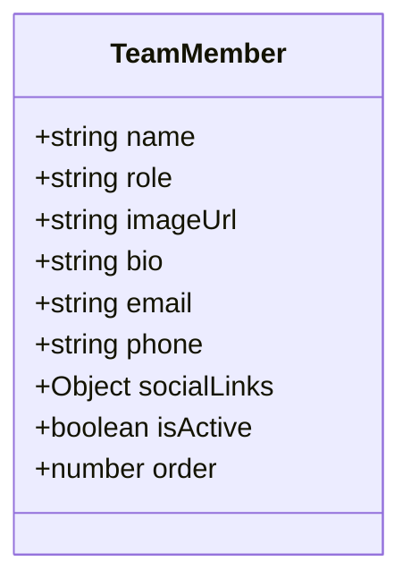

**Diagram sources**
- [TeamMember.js](file://server/models/TeamMember.js#L3-L49)

Indexes:
- isActive + order for efficient rendering.

Constraints:
- Max lengths; optional fields; socialLinks object.

**Section sources**
- [TeamMember.js](file://server/models/TeamMember.js#L3-L52)

### FAQ Model
FAQ organizes frequently asked questions with categories and ordering.

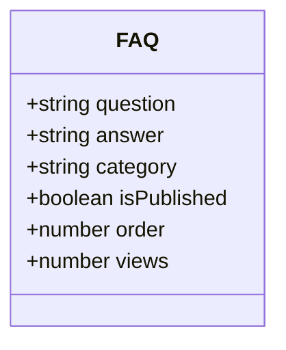

**Diagram sources**
- [FAQ.js](file://server/models/FAQ.js#L3-L34)

Indexes:
- isPublished + order; category.

Constraints:
- Defaults; category enum; order and views.

**Section sources**
- [FAQ.js](file://server/models/FAQ.js#L3-L38)

### Client Model
Client manages client records, contracts, and assignment to users.

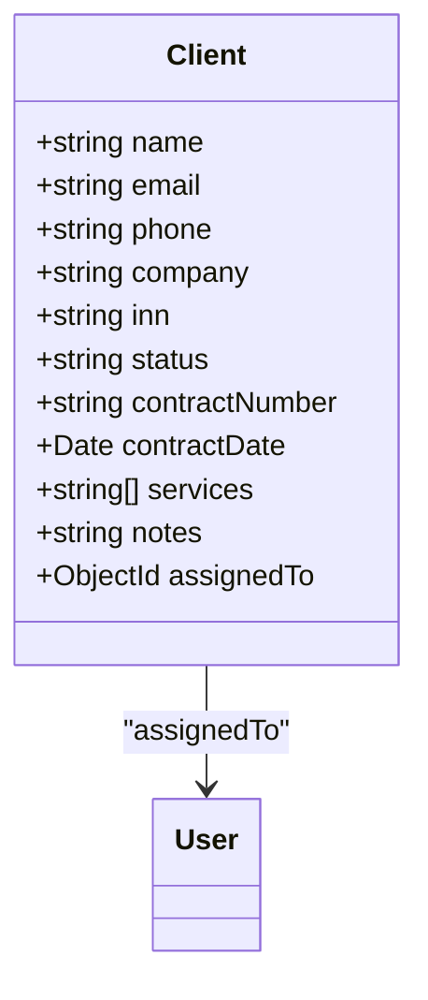

**Diagram sources**
- [Client.js](file://server/models/Client.js#L3-L56)

Indexes:
- email; status; company.

Constraints:
- INN numeric pattern; status enum; assignedTo reference.

**Section sources**
- [Client.js](file://server/models/Client.js#L3-L62)

### Authentication and Access Control Flow
The authentication flow involves JWT access and refresh tokens, with refresh tokens persisted in the User model.

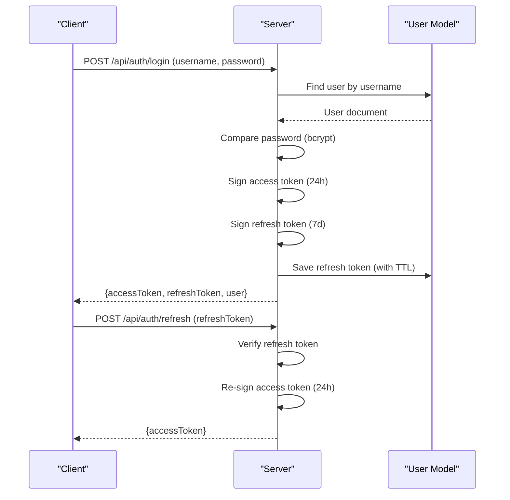

**Diagram sources**
- [User.js](file://server/models/User.js#L50-L89)
- [MIGRATION.md](file://server/MIGRATION.md#L150-L177)

**Section sources**
- [User.js](file://server/models/User.js#L50-L89)
- [MIGRATION.md](file://server/MIGRATION.md#L150-L177)

### Data Seeding and Initialization
Two primary scripts seed the database with realistic content:

- seed.js: Seeds Service, TeamMember, News, FAQ, Client, Inquiry collections.
- scripts/seedContent.js: Seeds Service, FAQ, TeamMember, and a sample News article.

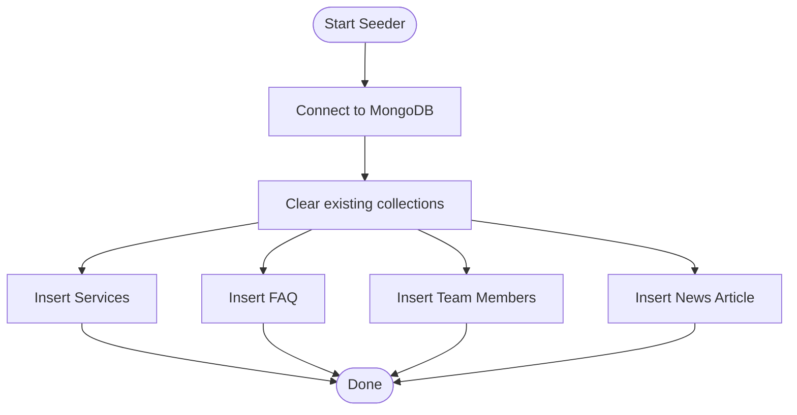

**Diagram sources**
- [seed.js](file://server/seed.js#L130-L167)
- [seedContent.js](file://server/scripts/seedContent.js#L90-L147)

**Section sources**
- [seed.js](file://server/seed.js#L130-L167)
- [seedContent.js](file://server/scripts/seedContent.js#L90-L147)

## Dependency Analysis
The models depend on Mongoose for schema definition and indexes. Seed scripts depend on the models to insert data. Validators support input validation during auth flows.

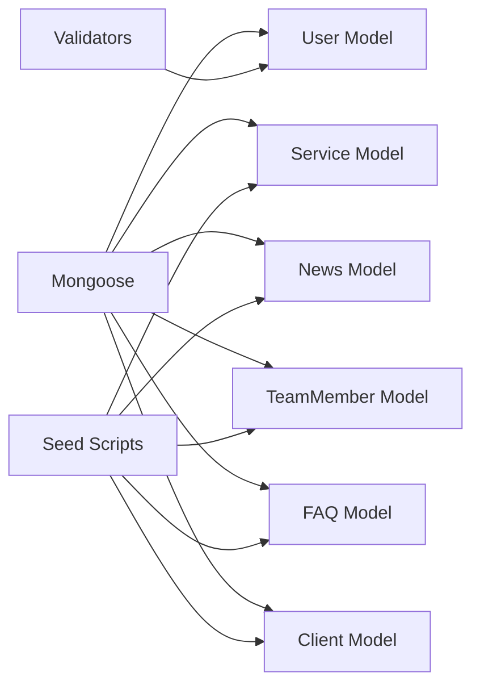

**Diagram sources**
- [User.js](file://server/models/User.js#L1-L105)
- [Service.js](file://server/models/Service.js#L1-L49)
- [News.js](file://server/models/News.js#L1-L64)
- [TeamMember.js](file://server/models/TeamMember.js#L1-L57)
- [FAQ.js](file://server/models/FAQ.js#L1-L43)
- [Client.js](file://server/models/Client.js#L1-L66)
- [seed.js](file://server/seed.js#L1-L170)
- [seedContent.js](file://server/scripts/seedContent.js#L1-L150)
- [validators.js](file://server/utils/validators.js#L1-L72)

**Section sources**
- [User.js](file://server/models/User.js#L1-L105)
- [Service.js](file://server/models/Service.js#L1-L49)
- [News.js](file://server/models/News.js#L1-L64)
- [TeamMember.js](file://server/models/TeamMember.js#L1-L57)
- [FAQ.js](file://server/models/FAQ.js#L1-L43)
- [Client.js](file://server/models/Client.js#L1-L66)
- [seed.js](file://server/seed.js#L1-L170)
- [seedContent.js](file://server/scripts/seedContent.js#L1-L150)
- [validators.js](file://server/utils/validators.js#L1-L72)

## Performance Considerations
- Indexes
  - Service: serviceId, (isActive, order)
  - News: date desc, category+date, isPublished+date
  - TeamMember: (isActive, order)
  - FAQ: isPublished+order, category
  - Client: email, status, company
- Query patterns
  - Filter by isActive/order for services.
  - Sort by date desc for news.
  - Filter by status/category for content.
- Recommendations
  - Add compound indexes for frequent filters.
  - Monitor slow queries and adjust indexes.
  - Use pagination for large lists.

[No sources needed since this section provides general guidance]

## Troubleshooting Guide
Common issues and resolutions:
- MongoDB connection failures
  - Verify MONGODB_URI and that MongoDB is running.
  - Check network/firewall settings.
- Rate limit errors
  - Adjust rate limiter thresholds in middleware.
- Token problems
  - Ensure JWT_SECRET matches across deployments.
  - Clear refresh tokens if needed.
- Validation errors
  - Confirm input against validator rules.
- Seeding failures
  - Ensure database connectivity and permissions.

**Section sources**
- [MIGRATION.md](file://server/MIGRATION.md#L254-L275)
- [validators.js](file://server/utils/validators.js#L21-L63)

## Conclusion
The Anko project’s MongoDB schema centers on robust user authentication, clear content models, and practical indexes for common queries. The design supports role-based access control, secure password handling, and scalable content management. Seed scripts and in-memory simulation streamline development and testing.

[No sources needed since this section summarizes without analyzing specific files]

## Appendices

### Entity Relationship Diagram
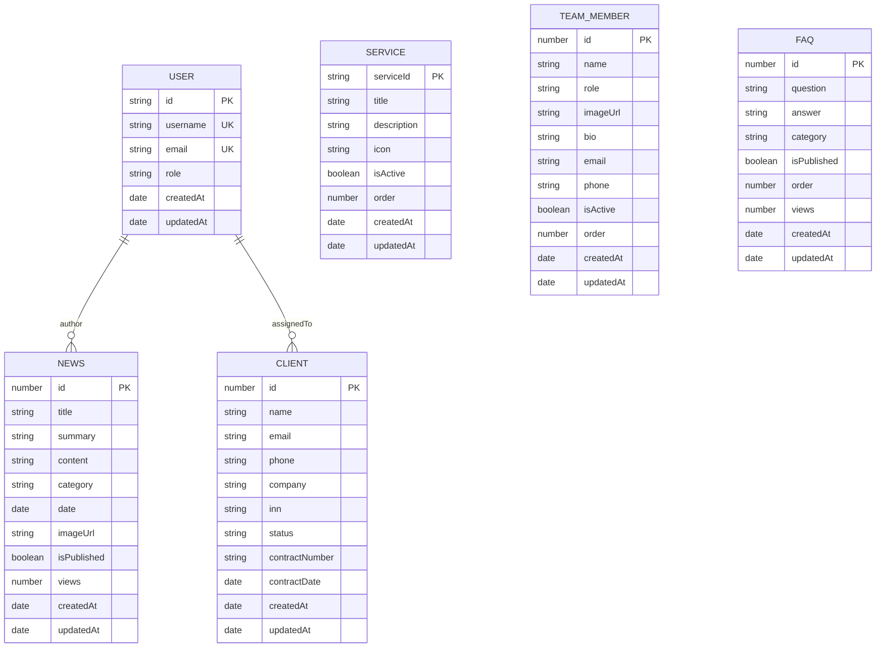

**Diagram sources**
- [User.js](file://server/models/User.js#L4-L48)
- [News.js](file://server/models/News.js#L3-L45)
- [Client.js](file://server/models/Client.js#L3-L56)

### Sample Data Structures
- Service
  - Fields: serviceId, title, description, icon, details[], isActive, order
  - Example: serviceId "registration", title "Registration", details ["Full registration package"]
- TeamMember
  - Fields: id, name, role, imageUrl, bio, email, phone, socialLinks, isActive, order
- News
  - Fields: id, date, title, summary, category, content, isPublished, views
- FAQ
  - Fields: id, question, answer, category, isPublished, order, views
- Client
  - Fields: id, name, email, phone, company, inn, status, contractNumber, contractDate, services[], notes, assignedTo

**Section sources**
- [seed.js](file://server/seed.js#L7-L128)
- [seedContent.js](file://server/scripts/seedContent.js#L11-L88)