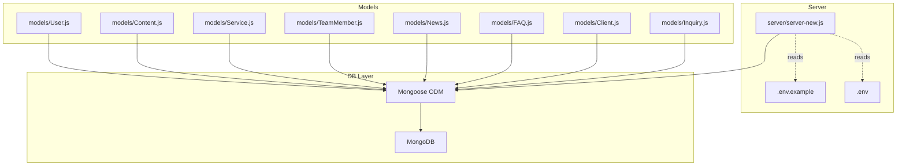
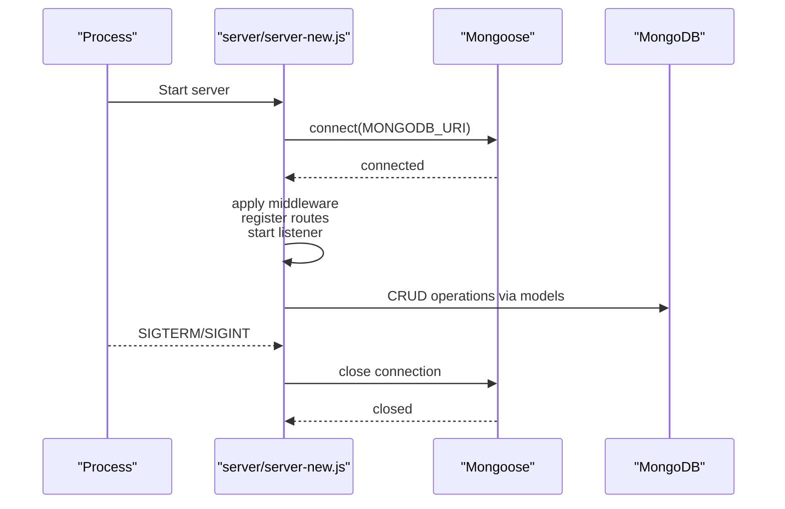
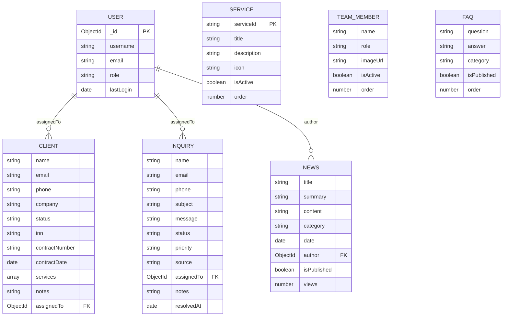
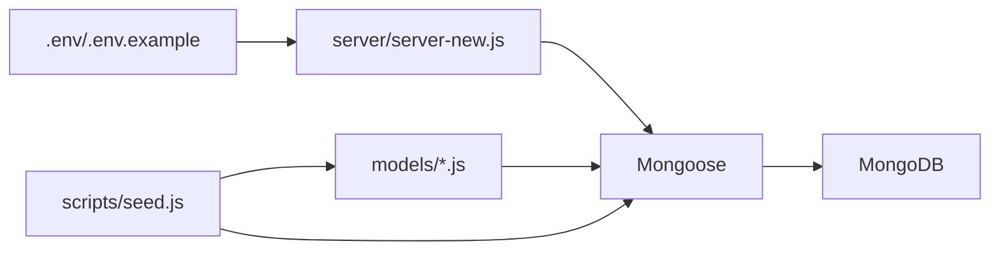

# Database Schema Overview

<cite>
**Referenced Files in This Document**
- [server-new.js](file://server/server-new.js)
- [.env.example](file://server/.env.example)
- [.env](file://server/.env)
- [MIGRATION.md](file://server/MIGRATION.md)
- [seed.js](file://server/seed.js)
- [in-memory.js](file://server/db/in-memory.js)
- [User.js](file://server/models/User.js)
- [Content.js](file://server/models/Content.js)
- [Service.js](file://server/models/Service.js)
- [TeamMember.js](file://server/models/TeamMember.js)
- [News.js](file://server/models/News.js)
- [FAQ.js](file://server/models/FAQ.js)
- [Client.js](file://server/models/Client.js)
- [Inquiry.js](file://server/models/Inquiry.js)
</cite>

## Table of Contents
1. [Introduction](#introduction)
2. [Project Structure](#project-structure)
3. [Core Components](#core-components)
4. [Architecture Overview](#architecture-overview)
5. [Detailed Component Analysis](#detailed-component-analysis)
6. [Dependency Analysis](#dependency-analysis)
7. [Performance Considerations](#performance-considerations)
8. [Troubleshooting Guide](#troubleshooting-guide)
9. [Conclusion](#conclusion)
10. [Appendices](#appendices)

## Introduction
This document describes the MongoDB database schema and connection management for the Anko project. It explains the design principles, connection handling, environment-specific configuration, and security controls. It also documents the current schema relationships, indexes, and operational processes such as initialization and seeding. Practical examples illustrate setup, connection handling, and schema evolution.

## Project Structure
The backend server connects to MongoDB via Mongoose and exposes API endpoints. Environment variables control connection strings, secrets, and runtime behavior. A separate in-memory database module is provided for demonstrations and local development without a live database.

**Diagram sources**
- [server-new.js](file://server/server-new.js#L17-L32)
- [.env.example](file://server/.env.example#L17-L20)
- [.env](file://server/.env#L5-L6)
- [User.js](file://server/models/User.js#L1-L105)
- [Content.js](file://server/models/Content.js#L1-L90)
- [Service.js](file://server/models/Service.js#L1-L49)
- [TeamMember.js](file://server/models/TeamMember.js#L1-L57)
- [News.js](file://server/models/News.js#L1-L64)
- [FAQ.js](file://server/models/FAQ.js#L1-L43)
- [Client.js](file://server/models/Client.js#L1-L66)
- [Inquiry.js](file://server/models/Inquiry.js#L1-L78)

**Section sources**
- [server-new.js](file://server/server-new.js#L17-L32)
- [.env.example](file://server/.env.example#L17-L20)
- [.env](file://server/.env#L5-L6)

## Core Components
- MongoDB connection and lifecycle:
  - The server establishes a connection to MongoDB using the MONGODB_URI environment variable.
  - Connection events are logged, including errors and disconnections.
  - Graceful shutdown closes the Mongoose connection before process exit.
- Environment configuration:
  - Critical variables include PORT, NODE_ENV, MONGODB_URI, JWT_SECRET, CORS_ORIGIN, UPLOAD_DIR, and rate limiting parameters.
  - Example values and guidance are provided in .env.example.
- In-memory database:
  - A lightweight in-memory simulation is available for demos and local testing without a live database.

**Section sources**
- [server-new.js](file://server/server-new.js#L17-L32)
- [server-new.js](file://server/server-new.js#L34-L41)
- [server-new.js](file://server/server-new.js#L106-L121)
- [.env.example](file://server/.env.example#L7-L94)
- [.env](file://server/.env#L1-L6)
- [in-memory.js](file://server/db/in-memory.js#L1-L271)

## Architecture Overview
The backend uses Mongoose to manage models and connections. The server initializes the connection at startup, applies security and rate-limiting middleware, and exposes API routes. Models define schemas, indexes, and virtuals. A seed script initializes collections with sample data.

**Diagram sources**
- [server-new.js](file://server/server-new.js#L17-L32)
- [server-new.js](file://server/server-new.js#L106-L121)

## Detailed Component Analysis

### Database Connection Management
- Connection establishment:
  - Uses MONGODB_URI from environment variables.
  - Logs success and failure during connection.
- Environment-aware behavior:
  - NODE_ENV affects Helmet configuration and logging verbosity.
  - CORS origin is controlled by CORS_ORIGIN in production.
- Lifecycle and safety:
  - Listens for SIGTERM/SIGINT to close the database connection gracefully.
  - Exposes a health endpoint indicating environment and database readiness.

**Section sources**
- [server-new.js](file://server/server-new.js#L17-L32)
- [server-new.js](file://server/server-new.js#L34-L41)
- [server-new.js](file://server/server-new.js#L68-L79)
- [server-new.js](file://server/server-new.js#L106-L121)
- [.env.example](file://server/.env.example#L10-L11)
- [.env.example](file://server/.env.example#L41-L45)

### Schema Design Principles
- Centralized timestamps:
  - Most models include createdAt and updatedAt via Mongoose timestamps option.
- Strong validation:
  - Required fields, min/max lengths, regex patterns, enums, and defaults are enforced at schema level.
- References:
  - Several models reference the User collection via ObjectId with explicit refs.
- Virtuals:
  - Computed fields (e.g., formatted dates) enhance presentation without persisting redundant data.

**Section sources**
- [User.js](file://server/models/User.js#L46-L48)
- [News.js](file://server/models/News.js#L43-L45)
- [Client.js](file://server/models/Client.js#L54-L56)
- [Inquiry.js](file://server/models/Inquiry.js#L57-L59)

### Model Definitions and Relationships
- User:
  - Stores credentials, roles, refresh tokens, and reset tokens.
  - Includes methods for password comparison and refresh token management.
- Content family:
  - Service, TeamMember, News, FAQ, Client, Inquiry define domain entities.
  - News, Client, and Inquiry reference User via ObjectId.
- Relationship summary:
  - One-to-many: User can be associated with multiple Clients and Inquiries.
  - Independent entities: Service, TeamMember, News, FAQ, Client, Inquiry.

**Diagram sources**
- [User.js](file://server/models/User.js#L1-L105)
- [Service.js](file://server/models/Service.js#L1-L49)
- [TeamMember.js](file://server/models/TeamMember.js#L1-L57)
- [News.js](file://server/models/News.js#L1-L64)
- [FAQ.js](file://server/models/FAQ.js#L1-L43)
- [Client.js](file://server/models/Client.js#L1-L66)
- [Inquiry.js](file://server/models/Inquiry.js#L1-L78)

**Section sources**
- [User.js](file://server/models/User.js#L1-L105)
- [Content.js](file://server/models/Content.js#L1-L90)
- [Service.js](file://server/models/Service.js#L1-L49)
- [TeamMember.js](file://server/models/TeamMember.js#L1-L57)
- [News.js](file://server/models/News.js#L1-L64)
- [FAQ.js](file://server/models/FAQ.js#L1-L43)
- [Client.js](file://server/models/Client.js#L1-L66)
- [Inquiry.js](file://server/models/Inquiry.js#L1-L78)

### Indexing Strategy
- Service: indexes on serviceId and composite isActive + order.
- TeamMember: index on isActive + order.
- News: indexes on date, category + date, and isPublished + date.
- FAQ: indexes on isPublished + order and category.
- Client: indexes on email, status, and company.
- Inquiry: indexes on status + createdAt desc, email, and priority + status.

These indexes optimize frequent queries for listing, filtering, and sorting across content types.

**Section sources**
- [Service.js](file://server/models/Service.js#L42-L44)
- [TeamMember.js](file://server/models/TeamMember.js#L51-L52)
- [News.js](file://server/models/News.js#L47-L50)
- [FAQ.js](file://server/models/FAQ.js#L36-L38)
- [Client.js](file://server/models/Client.js#L58-L62)
- [Inquiry.js](file://server/models/Inquiry.js#L61-L64)

### Initialization, Seeding, and Migration
- Seed script:
  - Connects to MongoDB using MONGODB_URI.
  - Clears existing collections and inserts initial data for Service, TeamMember, News, FAQ, Client, and Inquiry.
  - Verifies counts and exits after completion.
- Migration guidance:
  - MIGRATION.md outlines steps to set up the new backend, configure environment variables, create an admin user, and validate health and authentication endpoints.

**Section sources**
- [seed.js](file://server/seed.js#L130-L168)
- [MIGRATION.md](file://server/MIGRATION.md#L65-L148)

### In-Memory Database (Development/Testing)
- Purpose:
  - Simulates MongoDB collections without requiring a live database.
- Collections:
  - services, teamMembers, news, faqs, clients, inquiries.
- Operations:
  - Provides find, findOne, insertOne, insertMany, updateOne, deleteOne, deleteMany, count, and collection getters.
- Initialization:
  - Populates sample data upon creation and logs counts.

**Section sources**
- [in-memory.js](file://server/db/in-memory.js#L1-L271)

## Dependency Analysis
- Server depends on Mongoose for database connectivity and model definitions.
- Models depend on Mongoose for schema definition and persistence.
- Environment variables drive connection and security behavior.
- Seed script depends on models to populate collections.

**Diagram sources**
- [server-new.js](file://server/server-new.js#L17-L32)
- [seed.js](file://server/seed.js#L1-L170)
- [User.js](file://server/models/User.js#L1-L105)
- [Content.js](file://server/models/Content.js#L1-L90)

**Section sources**
- [server-new.js](file://server/server-new.js#L17-L32)
- [seed.js](file://server/seed.js#L1-L170)

## Performance Considerations
- Connection tuning:
  - Configure connection pool size and timeouts via MONGODB_URI options for production deployments.
- Index coverage:
  - Ensure indexes align with query patterns (filters by status, category, date ranges).
- Query patterns:
  - Use projection and pagination for large lists.
  - Prefer compound indexes for multi-field filters.
- Storage and updates:
  - Keep embedded arrays (details, services) bounded to avoid large document growth.
- Caching:
  - Consider caching frequently accessed static content (e.g., services, FAQs) with appropriate invalidation.

[No sources needed since this section provides general guidance]

## Troubleshooting Guide
- MongoDB connection failures:
  - Confirm MongoDB is running and reachable.
  - Verify MONGODB_URI correctness and network/firewall settings.
- Rate limit errors:
  - Temporarily adjust rate limiter thresholds in middleware for diagnostics.
- Token issues:
  - Ensure JWT_SECRET matches across environments.
  - Clear stored refresh tokens if necessary.
- Health checks:
  - Use the /health endpoint to verify server and database readiness.

**Section sources**
- [MIGRATION.md](file://server/MIGRATION.md#L254-L274)

## Conclusion
The Anko project employs a clean, schema-driven design with Mongoose, strong validation, and targeted indexes. Connection management is environment-aware, secure, and resilient. The seed script and migration guide streamline setup and onboarding. For production, complement the current design with robust monitoring, backups, and security hardening.

[No sources needed since this section summarizes without analyzing specific files]

## Appendices

### Environment Variables Reference
- Essential variables:
  - PORT, NODE_ENV, MONGODB_URI, JWT_SECRET, CORS_ORIGIN, UPLOAD_DIR, RATE_LIMIT_MAX, RATE_LIMIT_WINDOW, LOG_LEVEL, API_BASE_URL.

**Section sources**
- [.env.example](file://server/.env.example#L7-L94)
- [.env](file://server/.env#L1-L6)

### Practical Setup Examples
- Local MongoDB:
  - Ensure MongoDB is installed and running locally.
  - Set MONGODB_URI to point to your local instance.
- Admin user creation:
  - Follow migration steps to create an initial admin account.
- Health and authentication verification:
  - Use curl commands to hit /health and /api/auth endpoints as documented in migration notes.

**Section sources**
- [MIGRATION.md](file://server/MIGRATION.md#L90-L148)