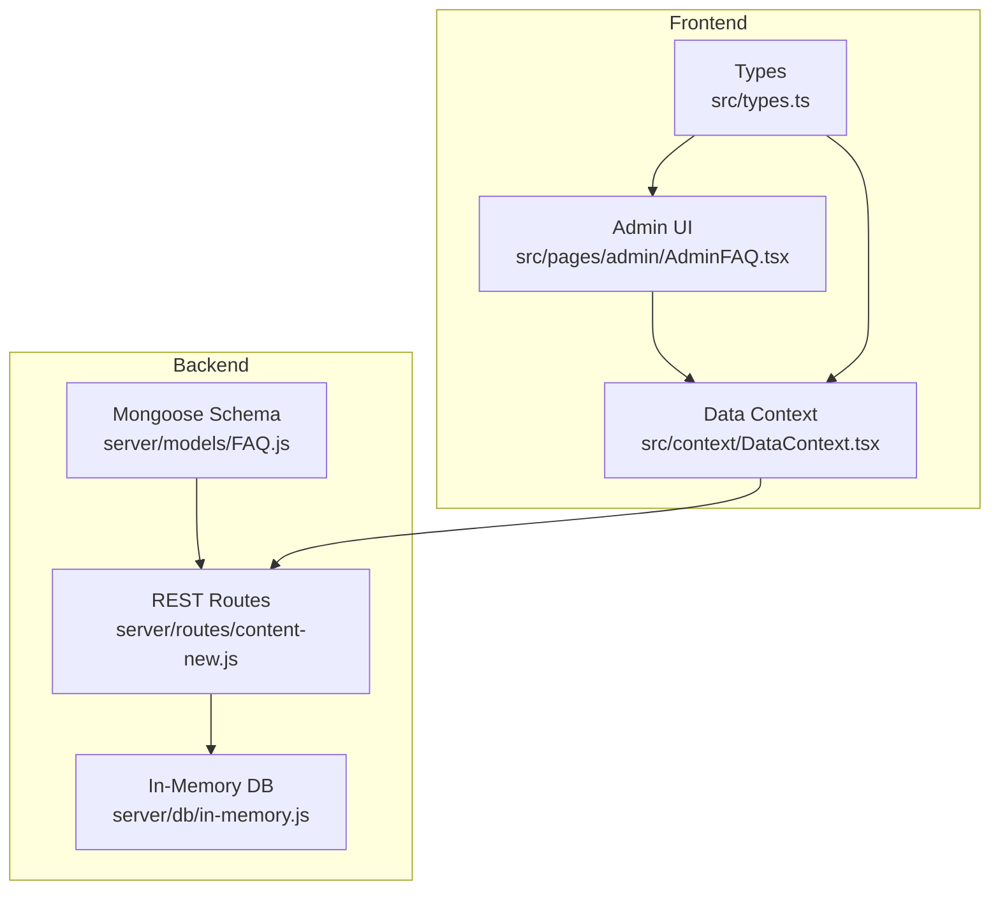
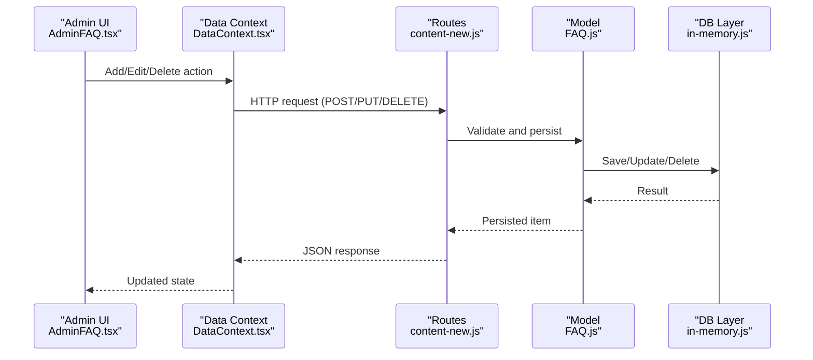
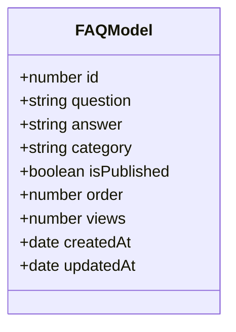
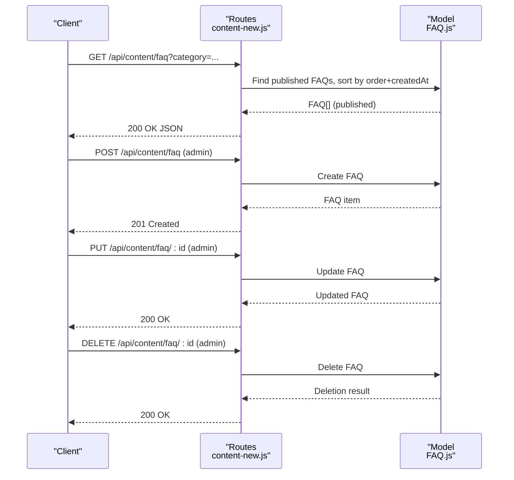
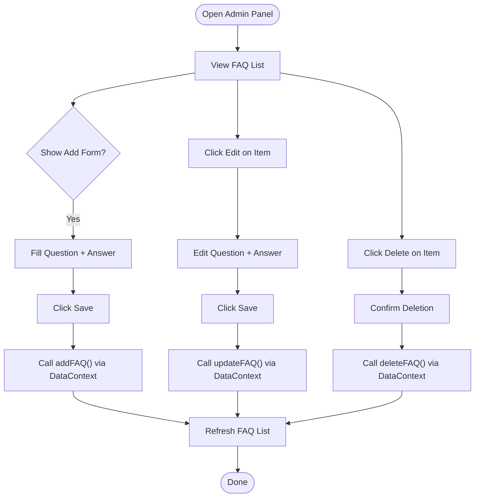
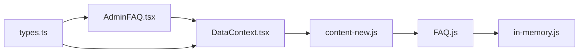

# FAQ Model

<cite>
**Referenced Files in This Document**
- [FAQ.js](file://server/models/FAQ.js)
- [content-new.js](file://server/routes/content-new.js)
- [DataContext.tsx](file://src/context/DataContext.tsx)
- [AdminFAQ.tsx](file://src/pages/admin/AdminFAQ.tsx)
- [types.ts](file://src/types.ts)
- [in-memory.js](file://server/db/in-memory.js)
- [Content.js](file://server/models/Content.js)
</cite>

## Table of Contents
1. [Introduction](#introduction)
2. [Project Structure](#project-structure)
3. [Core Components](#core-components)
4. [Architecture Overview](#architecture-overview)
5. [Detailed Component Analysis](#detailed-component-analysis)
6. [Dependency Analysis](#dependency-analysis)
7. [Performance Considerations](#performance-considerations)
8. [Troubleshooting Guide](#troubleshooting-guide)
9. [Conclusion](#conclusion)

## Introduction
This document describes the FAQ model used in the Anko project for managing frequently asked questions and answers. It covers the schema structure, categorization, ordering, and integration with content management and search. It also documents administrative workflows, API endpoints, and user-facing display patterns.

## Project Structure
The FAQ model spans backend and frontend components:
- Backend: Mongoose schema and REST endpoints for CRUD operations
- Frontend: Admin panel UI for editing and managing FAQs
- Data context: Shared state and HTTP client integration for admin actions
- Types: TypeScript interfaces for type safety

**Diagram sources**
- [FAQ.js](file://server/models/FAQ.js#L1-L43)
- [content-new.js](file://server/routes/content-new.js#L228-L283)
- [in-memory.js](file://server/db/in-memory.js#L1-L271)
- [DataContext.tsx](file://src/context/DataContext.tsx#L149-L187)
- [AdminFAQ.tsx](file://src/pages/admin/AdminFAQ.tsx#L1-L120)
- [types.ts](file://src/types.ts#L37-L42)

**Section sources**
- [FAQ.js](file://server/models/FAQ.js#L1-L43)
- [content-new.js](file://server/routes/content-new.js#L228-L283)
- [DataContext.tsx](file://src/context/DataContext.tsx#L149-L187)
- [AdminFAQ.tsx](file://src/pages/admin/AdminFAQ.tsx#L1-L120)
- [types.ts](file://src/types.ts#L37-L42)
- [in-memory.js](file://server/db/in-memory.js#L1-L271)

## Core Components
- FAQ schema defines fields for question text, answer content, category, publication flag, ordering, and view counters, plus timestamps.
- REST endpoints support listing published FAQs with optional category filter, creating, updating, and deleting FAQs.
- Admin UI allows adding, editing, and removing FAQs; it integrates with the data context for HTTP operations.
- Types define the FAQ item interface used across the admin UI and data context.

Key schema fields and constraints:
- question: required, trimmed, max length constraint
- answer: required, max length constraint
- category: optional, defaults to a general category
- isPublished: boolean flag controlling visibility
- order: numeric ordering field
- views: counter for views
- timestamps: createdAt and updatedAt

Indexes:
- Composite index on isPublished and order for efficient retrieval
- Single-field index on category for filtering

**Section sources**
- [FAQ.js](file://server/models/FAQ.js#L3-L38)
- [content-new.js](file://server/routes/content-new.js#L230-L238)
- [AdminFAQ.tsx](file://src/pages/admin/AdminFAQ.tsx#L6-L30)
- [DataContext.tsx](file://src/context/DataContext.tsx#L159-L187)
- [types.ts](file://src/types.ts#L37-L42)

## Architecture Overview
The FAQ lifecycle involves the admin UI, data context, backend routes, and persistence layer.

**Diagram sources**
- [AdminFAQ.tsx](file://src/pages/admin/AdminFAQ.tsx#L21-L30)
- [DataContext.tsx](file://src/context/DataContext.tsx#L159-L187)
- [content-new.js](file://server/routes/content-new.js#L245-L283)
- [FAQ.js](file://server/models/FAQ.js#L1-L43)
- [in-memory.js](file://server/db/in-memory.js#L37-L83)

## Detailed Component Analysis

### FAQ Schema and Data Model
The FAQ schema enforces required fields and limits, supports categorization, and enables ordered presentation of published items.

- Fields:
  - question: validated for presence and length
  - answer: validated for presence and length
  - category: default category applied if not provided
  - isPublished: controls visibility in listings
  - order: numeric ordering for presentation
  - views: view counter
  - timestamps: createdAt and updatedAt managed automatically

- Indexes:
  - Compound index on isPublished and order for fast retrieval and ordering
  - Single index on category for filtering

**Diagram sources**
- [FAQ.js](file://server/models/FAQ.js#L3-L38)

**Section sources**
- [FAQ.js](file://server/models/FAQ.js#L3-L38)

### REST API Endpoints for FAQ
Public endpoint:
- GET /api/content/faq
  - Filters: isPublished=true, optional category query param
  - Sorting: order ascending, then createdAt descending

Admin endpoints:
- POST /api/content/faq
  - Requires authentication and admin role
  - Creates a new FAQ item
- PUT /api/content/faq/:id
  - Requires authentication and admin role
  - Updates an existing FAQ by ID
- DELETE /api/content/faq/:id
  - Requires authentication and admin role
  - Deletes an FAQ by ID

**Diagram sources**
- [content-new.js](file://server/routes/content-new.js#L230-L283)
- [FAQ.js](file://server/models/FAQ.js#L1-L43)

**Section sources**
- [content-new.js](file://server/routes/content-new.js#L230-L283)

### Admin UI Workflow (Add, Edit, Delete)
The admin UI provides:
- Toggle to show/hide the “Add new FAQ” form
- Inline editing per FAQ item
- Delete action per item

**Diagram sources**
- [AdminFAQ.tsx](file://src/pages/admin/AdminFAQ.tsx#L6-L30)
- [DataContext.tsx](file://src/context/DataContext.tsx#L159-L187)

**Section sources**
- [AdminFAQ.tsx](file://src/pages/admin/AdminFAQ.tsx#L6-L30)
- [DataContext.tsx](file://src/context/DataContext.tsx#L159-L187)

### Data Context Integration
The data context exposes:
- addFAQ(item): posts to POST /api/content/faq
- updateFAQ(id, updated): patches to PUT /api/content/faq/:id
- deleteFAQ(id): deletes to DELETE /api/content/faq/:id

These functions update local state after successful requests.

**Section sources**
- [DataContext.tsx](file://src/context/DataContext.tsx#L159-L187)

### Types and Interfaces
The FAQ item interface used by the admin UI and data context:
- id: number
- question: string
- answer: string

Note: The current frontend types do not include category, isPublished, order, or views. These fields are managed by the backend model and are not part of the admin UI’s edit form.

**Section sources**
- [types.ts](file://src/types.ts#L37-L42)

### Persistence Layer
Two persistence modes are present:
- Mongoose model with indexes for production-like behavior
- In-memory DB for development/demo

The in-memory DB initializes sample FAQs and supports CRUD operations used by the admin UI.

**Section sources**
- [FAQ.js](file://server/models/FAQ.js#L1-L43)
- [in-memory.js](file://server/db/in-memory.js#L218-L235)
- [Content.js](file://server/models/Content.js#L36-L42)

## Dependency Analysis
The FAQ module depends on:
- Backend routes for API operations
- Data context for HTTP integration
- Admin UI for user interactions
- Types for compile-time safety

**Diagram sources**
- [AdminFAQ.tsx](file://src/pages/admin/AdminFAQ.tsx#L1-L120)
- [DataContext.tsx](file://src/context/DataContext.tsx#L149-L187)
- [content-new.js](file://server/routes/content-new.js#L228-L283)
- [FAQ.js](file://server/models/FAQ.js#L1-L43)
- [in-memory.js](file://server/db/in-memory.js#L1-L271)
- [types.ts](file://src/types.ts#L37-L42)

**Section sources**
- [AdminFAQ.tsx](file://src/pages/admin/AdminFAQ.tsx#L1-L120)
- [DataContext.tsx](file://src/context/DataContext.tsx#L149-L187)
- [content-new.js](file://server/routes/content-new.js#L228-L283)
- [FAQ.js](file://server/models/FAQ.js#L1-L43)
- [in-memory.js](file://server/db/in-memory.js#L1-L271)
- [types.ts](file://src/types.ts#L37-L42)

## Performance Considerations
- Indexes:
  - Compound index on isPublished and order ensures efficient retrieval of published FAQs sorted by order and recency.
  - Category index supports filtering by category.
- Sorting:
  - Listing endpoint sorts by order ascending and createdAt descending to maintain stable presentation order.
- Payload sizes:
  - Question and answer fields have maximum lengths to prevent oversized documents.

Recommendations:
- Monitor query plans for category filters and ordering.
- Consider pagination for large FAQ sets.
- Cache frequently accessed FAQ lists at the application layer if appropriate.

**Section sources**
- [FAQ.js](file://server/models/FAQ.js#L36-L38)
- [content-new.js](file://server/routes/content-new.js#L230-L238)

## Troubleshooting Guide
Common issues and resolutions:
- FAQ not visible on the public list:
  - Verify isPublished flag is true.
  - Ensure category filter does not exclude the item unintentionally.
- Ordering anomalies:
  - Check order field values; lower numbers appear first.
  - Confirm sort order is maintained by the backend.
- Admin actions failing:
  - Authentication and admin role are required for POST/PUT/DELETE.
  - Inspect network tab for 401/403 errors.
- Validation errors:
  - Ensure question and answer meet length constraints.
  - Confirm required fields are present.

**Section sources**
- [content-new.js](file://server/routes/content-new.js#L245-L283)
- [FAQ.js](file://server/models/FAQ.js#L5-L13)

## Conclusion
The FAQ model in Anko provides a compact yet effective structure for managing frequently asked questions. It supports categorization, ordering, and publication controls, integrates cleanly with an admin UI, and exposes a straightforward REST API for content management. The combination of schema constraints, indexes, and typed interfaces helps maintain data integrity and a smooth developer experience.