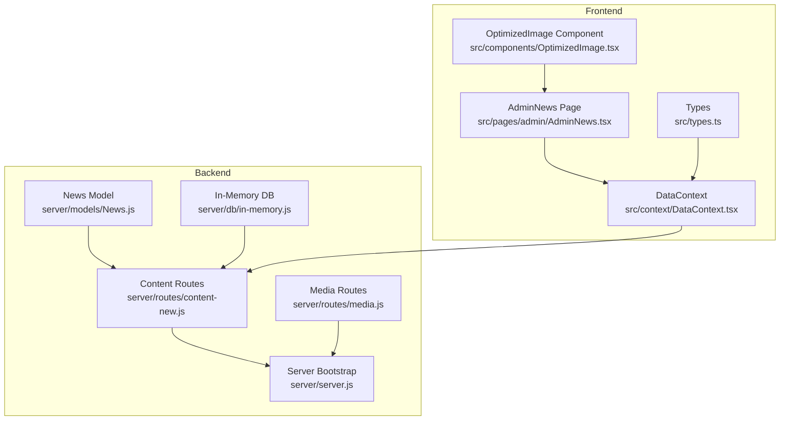
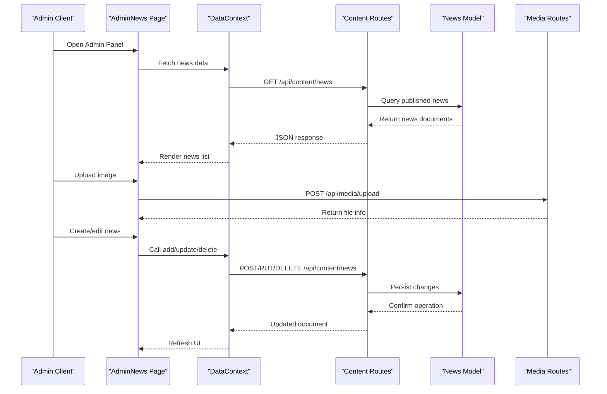
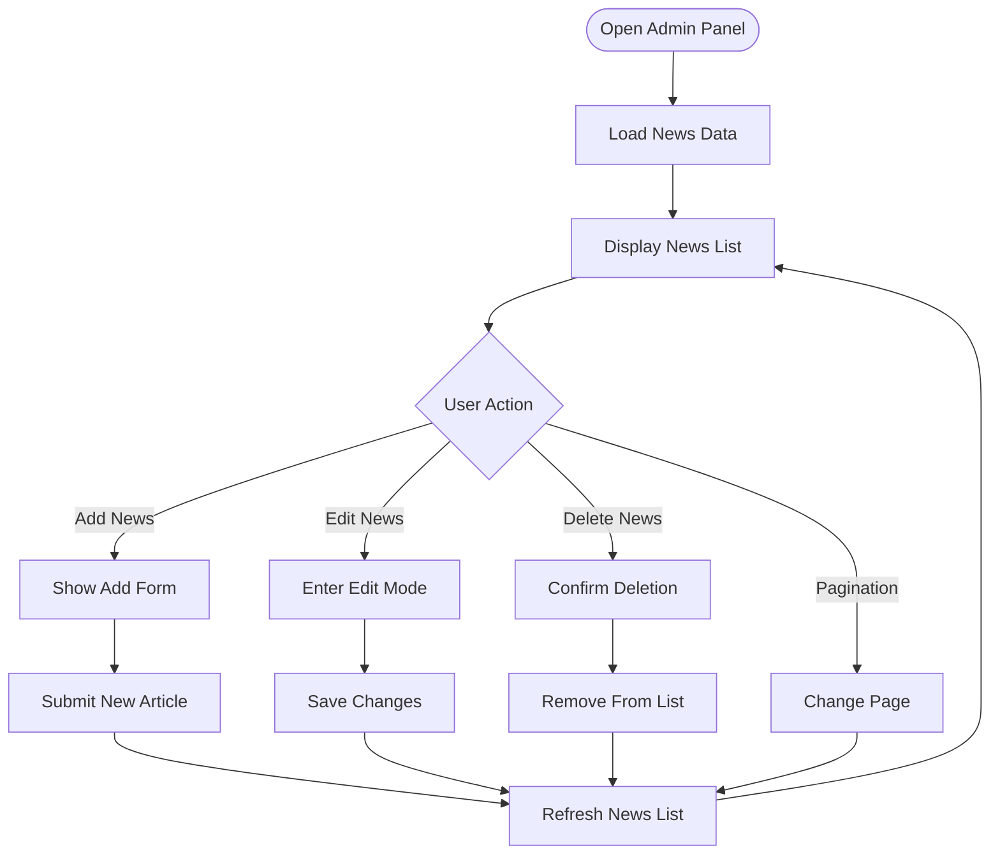
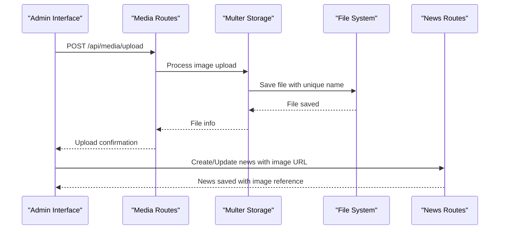
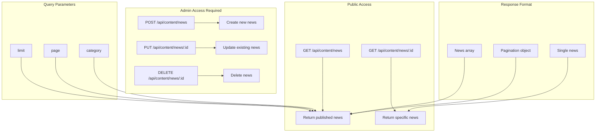
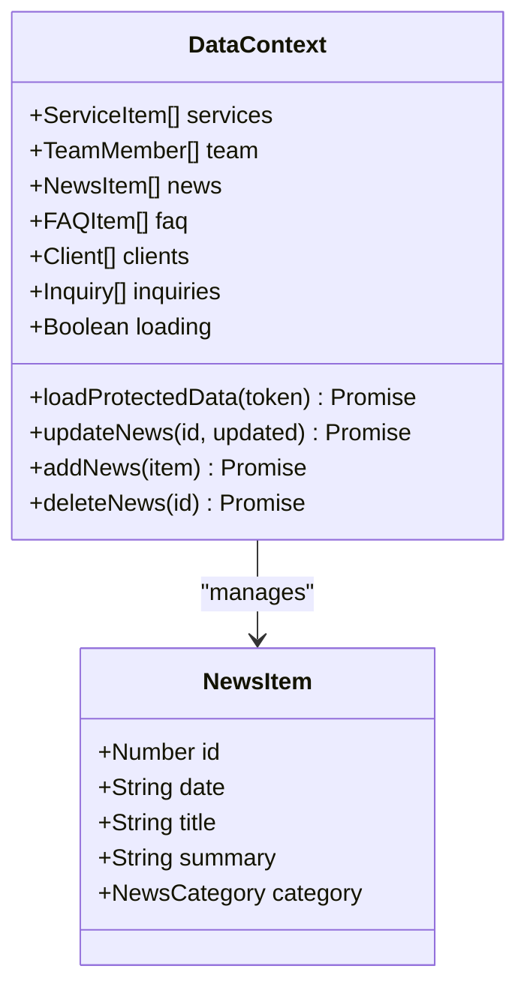
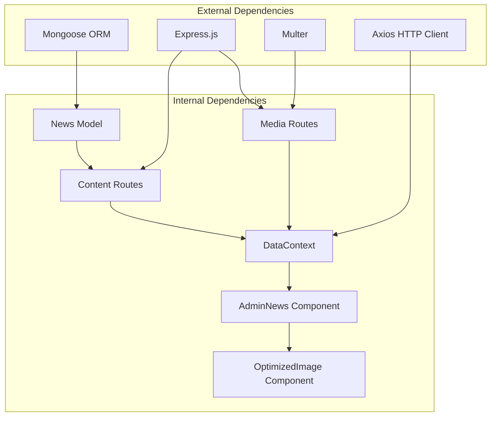

# News Model

<cite>
**Referenced Files in This Document**
- [News.js](file://server/models/News.js)
- [content-new.js](file://server/routes/content-new.js)
- [media.js](file://server/routes/media.js)
- [DataContext.tsx](file://src/context/DataContext.tsx)
- [AdminNews.tsx](file://src/pages/admin/AdminNews.tsx)
- [OptimizedImage.tsx](file://src/components/OptimizedImage.tsx)
- [server.js](file://server/server.js)
- [in-memory.js](file://server/db/in-memory.js)
- [types.ts](file://src/types.ts)
</cite>

## Table of Contents
1. [Introduction](#introduction)
2. [Project Structure](#project-structure)
3. [Core Components](#core-components)
4. [Architecture Overview](#architecture-overview)
5. [Detailed Component Analysis](#detailed-component-analysis)
6. [Dependency Analysis](#dependency-analysis)
7. [Performance Considerations](#performance-considerations)
8. [Troubleshooting Guide](#troubleshooting-guide)
9. [Conclusion](#conclusion)

## Introduction
This document provides comprehensive technical documentation for the News model used for announcements and news updates in the Anko project. It covers the complete schema definition, categorization system, media integration, administrative workflows, and frontend presentation patterns. The documentation also explains the relationship between the backend News model and the frontend admin interface, including CRUD operations, pagination, and display logic.

## Project Structure
The News functionality spans three primary areas:
- Backend data model and API endpoints
- Media management for image uploads
- Frontend admin interface for managing news content



**Diagram sources**
- [News.js](file://server/models/News.js#L1-L63)
- [content-new.js](file://server/routes/content-new.js#L1-L441)
- [media.js](file://server/routes/media.js#L1-L142)
- [server.js](file://server/server.js#L1-L337)
- [in-memory.js](file://server/db/in-memory.js#L1-L271)
- [DataContext.tsx](file://src/context/DataContext.tsx#L1-L259)
- [AdminNews.tsx](file://src/pages/admin/AdminNews.tsx#L1-L212)
- [OptimizedImage.tsx](file://src/components/OptimizedImage.tsx#L1-L82)
- [types.ts](file://src/types.ts#L1-L149)

**Section sources**
- [News.js](file://server/models/News.js#L1-L63)
- [content-new.js](file://server/routes/content-new.js#L1-L441)
- [media.js](file://server/routes/media.js#L1-L142)
- [DataContext.tsx](file://src/context/DataContext.tsx#L1-L259)
- [AdminNews.tsx](file://src/pages/admin/AdminNews.tsx#L1-L212)
- [OptimizedImage.tsx](file://src/components/OptimizedImage.tsx#L1-L82)
- [server.js](file://server/server.js#L1-L337)
- [in-memory.js](file://server/db/in-memory.js#L1-L271)
- [types.ts](file://src/types.ts#L1-L149)

## Core Components
The News model defines the structure and behavior of news articles, including categorization, publication controls, and indexing for efficient retrieval.

Key schema attributes:
- title: Required string with maximum length constraint
- summary: Required string with maximum length constraint
- content: Optional string with maximum length constraint
- category: Enumerated field with values 'News', 'Analytics', 'Event'
- date: Date field with default to current timestamp
- author: Reference to User model via ObjectId
- imageUrl: Optional string for featured image path
- isPublished: Boolean flag controlling visibility
- views: Counter for article views
- timestamps: Automatic createdAt/updatedAt fields

Indexes configured:
- date: descending order for chronological retrieval
- category + date: composite index for category-based sorting
- isPublished + date: index for filtering published content efficiently

Virtual field:
- formattedDate: Localized date formatting for Russian locale

**Section sources**
- [News.js](file://server/models/News.js#L3-L62)

## Architecture Overview
The News system follows a layered architecture with clear separation between data modeling, API orchestration, media handling, and presentation.



**Diagram sources**
- [AdminNews.tsx](file://src/pages/admin/AdminNews.tsx#L1-L212)
- [DataContext.tsx](file://src/context/DataContext.tsx#L129-L157)
- [content-new.js](file://server/routes/content-new.js#L129-L219)
- [media.js](file://server/routes/media.js#L47-L70)
- [News.js](file://server/models/News.js#L3-L62)

## Detailed Component Analysis

### News Model Schema
The News model implements a comprehensive schema optimized for content management and performance.

```mermaid
classDiagram
class News {
+Number id
+String title
+String summary
+String content
+String category
+Date date
+ObjectId author
+String imageUrl
+Boolean isPublished
+Number views
+Date createdAt
+Date updatedAt
+formattedDate() String
}
class NewsCategory {
<<enumeration>>
"News"
"Analytics"
"Event"
}
News --> NewsCategory : "uses"
```

**Diagram sources**
- [News.js](file://server/models/News.js#L3-L62)
- [types.ts](file://src/types.ts#L27-L35)

Schema validation and constraints:
- Required fields: title, summary
- Length limits: title (300 chars), summary (500 chars), content (5000 chars)
- Category enumeration ensures data consistency
- Author reference maintains content ownership
- Default values for date, publication status, and view counter

**Section sources**
- [News.js](file://server/models/News.js#L3-L62)
- [types.ts](file://src/types.ts#L27-L35)

### Administrative Management Interface
The AdminNews component provides a comprehensive interface for managing news content with CRUD operations, pagination, and real-time updates.



**Diagram sources**
- [AdminNews.tsx](file://src/pages/admin/AdminNews.tsx#L28-L56)
- [DataContext.tsx](file://src/context/DataContext.tsx#L129-L157)

Key features:
- Real-time pagination with configurable items per page
- Inline editing with cancel/save functionality
- Category-based visual indicators
- Responsive design with Tailwind CSS
- Form validation and error handling

**Section sources**
- [AdminNews.tsx](file://src/pages/admin/AdminNews.tsx#L1-L212)
- [DataContext.tsx](file://src/context/DataContext.tsx#L129-L157)

### Media Management and Image Handling
The media system supports secure image uploads with validation, storage, and retrieval capabilities.



**Diagram sources**
- [media.js](file://server/routes/media.js#L47-L70)
- [content-new.js](file://server/routes/content-new.js#L178-L184)

Media handling capabilities:
- Single and multiple file uploads
- MIME type validation (images only)
- Size limits (5MB per file)
- Unique filename generation
- Static file serving
- File deletion functionality

**Section sources**
- [media.js](file://server/routes/media.js#L1-L142)

### API Endpoints and Workflows
The content management API provides comprehensive CRUD operations for news management with authentication and authorization.



**Diagram sources**
- [content-new.js](file://server/routes/content-new.js#L129-L151)
- [content-new.js](file://server/routes/content-new.js#L159-L171)
- [content-new.js](file://server/routes/content-new.js#L178-L184)

API specifications:
- GET /api/content/news: Supports pagination, category filtering, and sorting by date
- GET /api/content/news/:id: Returns individual news with author population
- POST /api/content/news: Creates news with authenticated admin privileges
- PUT /api/content/news/:id: Updates existing news
- DELETE /api/content/news/:id: Removes news content

**Section sources**
- [content-new.js](file://server/routes/content-new.js#L129-L219)

### Frontend Data Management
The DataContext orchestrates all data operations between the frontend and backend APIs.



**Diagram sources**
- [DataContext.tsx](file://src/context/DataContext.tsx#L5-L28)
- [types.ts](file://src/types.ts#L27-L35)

Data flow patterns:
- Initial data loading via Promise.all for concurrent requests
- Real-time state updates after successful API operations
- Error handling and loading state management
- Protected data loading with authentication headers

**Section sources**
- [DataContext.tsx](file://src/context/DataContext.tsx#L1-L259)
- [types.ts](file://src/types.ts#L27-L35)

## Dependency Analysis
The News system exhibits clear dependency relationships across the application stack.



**Diagram sources**
- [News.js](file://server/models/News.js#L1-L1)
- [content-new.js](file://server/routes/content-new.js#L1-L2)
- [media.js](file://server/routes/media.js#L1-L2)
- [DataContext.tsx](file://src/context/DataContext.tsx#L1-L2)
- [AdminNews.tsx](file://src/pages/admin/AdminNews.tsx#L1-L1)
- [OptimizedImage.tsx](file://src/components/OptimizedImage.tsx#L1-L1)

Key dependency characteristics:
- Low coupling between components through well-defined interfaces
- Clear separation of concerns between data access, business logic, and presentation
- Type-safe communication through TypeScript interfaces
- Modular design enabling independent testing and maintenance

**Section sources**
- [News.js](file://server/models/News.js#L1-L63)
- [content-new.js](file://server/routes/content-new.js#L1-L441)
- [media.js](file://server/routes/media.js#L1-L142)
- [DataContext.tsx](file://src/context/DataContext.tsx#L1-L259)
- [AdminNews.tsx](file://src/pages/admin/AdminNews.tsx#L1-L212)
- [OptimizedImage.tsx](file://src/components/OptimizedImage.tsx#L1-L82)

## Performance Considerations
The News system incorporates several performance optimizations:

Indexing strategy:
- Composite indexes optimize common query patterns
- Efficient filtering by publication status
- Fast chronological sorting for recent content

Caching and optimization:
- Pagination reduces payload sizes
- Lazy loading for images improves initial load times
- Concurrent data loading minimizes wait times

Scalability recommendations:
- Consider implementing Redis caching for frequently accessed news
- Add search indexing for improved content discovery
- Implement CDN for static media assets
- Add database connection pooling for high concurrency

## Troubleshooting Guide
Common issues and solutions for the News system:

Authentication errors:
- Verify JWT token validity and expiration
- Check admin role requirements for privileged operations
- Ensure proper header formatting in API requests

Database connectivity:
- Confirm MongoDB connection string configuration
- Validate model schema compatibility
- Check for index creation during initialization

Media upload failures:
- Verify file type restrictions (image/* only)
- Check file size limits (5MB maximum)
- Ensure upload directory permissions

Frontend state synchronization:
- Monitor API response formats
- Implement proper error boundaries
- Handle loading states gracefully

**Section sources**
- [server.js](file://server/server.js#L44-L59)
- [media.js](file://server/routes/media.js#L29-L36)
- [DataContext.tsx](file://src/context/DataContext.tsx#L60-L64)

## Conclusion
The News model in the Anko project demonstrates a well-architected content management system with clear separation of concerns, robust validation, and comprehensive administrative capabilities. The implementation balances simplicity for development with scalability considerations for production deployment. The modular design enables easy extension for additional features such as RSS feeds, advanced search, or content syndication, while maintaining the existing performance characteristics and user experience standards.

The system successfully integrates backend data modeling with frontend administration through well-defined APIs and type-safe interfaces, providing a solid foundation for news and announcement management within the broader Anko ecosystem.