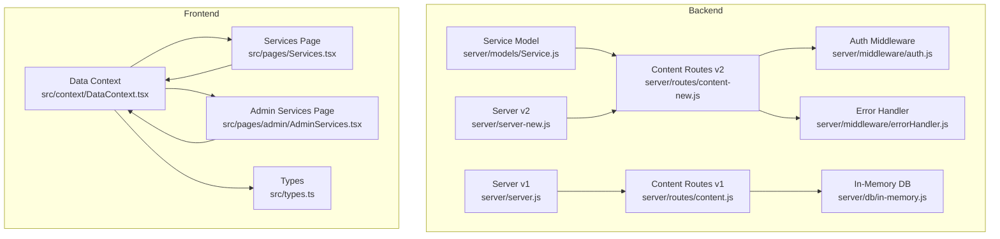
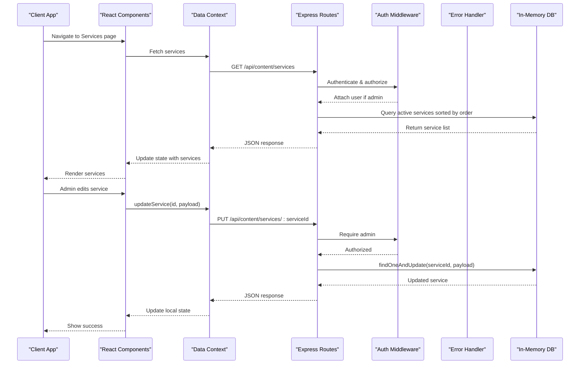
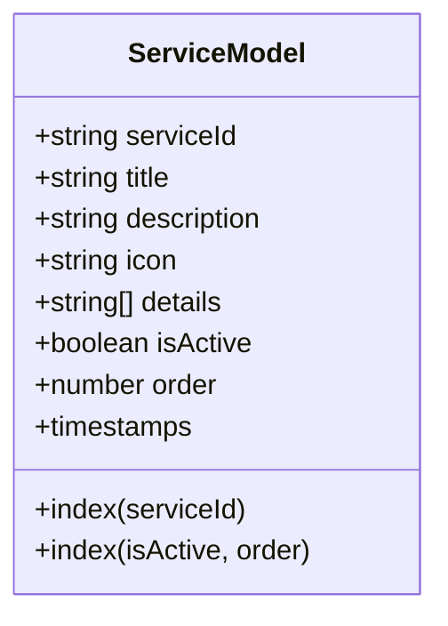
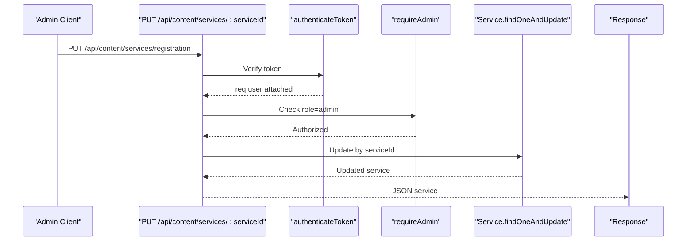
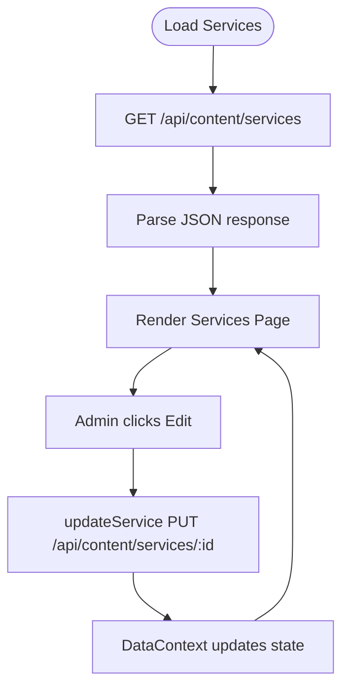
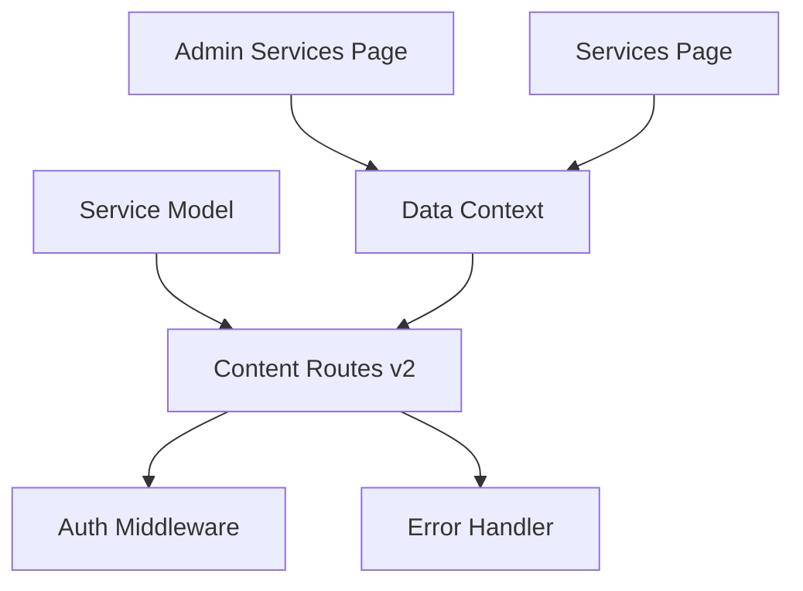

# Service Model

<cite>
**Referenced Files in This Document**
- [Service.js](file://server/models/Service.js)
- [content-new.js](file://server/routes/content-new.js)
- [content.js](file://server/routes/content.js)
- [in-memory.js](file://server/db/in-memory.js)
- [DataContext.tsx](file://src/context/DataContext.tsx)
- [AdminServices.tsx](file://src/pages/admin/AdminServices.tsx)
- [Services.tsx](file://src/pages/Services.tsx)
- [types.ts](file://src/types.ts)
- [auth.js](file://server/middleware/auth.js)
- [errorHandler.js](file://server/middleware/errorHandler.js)
- [server.js](file://server/server.js)
- [server-new.js](file://server/server-new.js)
</cite>

## Table of Contents
1. [Introduction](#introduction)
2. [Project Structure](#project-structure)
3. [Core Components](#core-components)
4. [Architecture Overview](#architecture-overview)
5. [Detailed Component Analysis](#detailed-component-analysis)
6. [Dependency Analysis](#dependency-analysis)
7. [Performance Considerations](#performance-considerations)
8. [Troubleshooting Guide](#troubleshooting-guide)
9. [Conclusion](#conclusion)

## Introduction
This document provides comprehensive documentation for the Service model used for accounting services in the Anko project. It covers the complete schema structure, field definitions, validation rules, relationships with other models, categorization, pricing structures, content organization, CRUD operations, query patterns, service management workflows, administrative features, service discovery, filtering, and display logic. Practical examples demonstrate service creation, modification, and retrieval operations.

## Project Structure
The Service model is part of the backend's Mongoose models and is exposed via Express routes. Frontend components consume the service data through a shared data context and render it on both the public Services page and the admin panel.

**Diagram sources**
- [Service.js](file://server/models/Service.js#L1-L48)
- [content-new.js](file://server/routes/content-new.js#L1-L60)
- [content.js](file://server/routes/content.js#L1-L30)
- [in-memory.js](file://server/db/in-memory.js#L1-L271)
- [auth.js](file://server/middleware/auth.js#L1-L45)
- [errorHandler.js](file://server/middleware/errorHandler.js#L1-L65)
- [server.js](file://server/server.js#L303-L305)
- [server-new.js](file://server/server-new.js#L81-L84)
- [DataContext.tsx](file://src/context/DataContext.tsx#L1-L259)
- [AdminServices.tsx](file://src/pages/admin/AdminServices.tsx#L1-L131)
- [Services.tsx](file://src/pages/Services.tsx#L1-L53)
- [types.ts](file://src/types.ts#L10-L16)

**Section sources**
- [Service.js](file://server/models/Service.js#L1-L48)
- [content-new.js](file://server/routes/content-new.js#L17-L59)
- [content.js](file://server/routes/content.js#L7-L30)
- [in-memory.js](file://server/db/in-memory.js#L118-L170)
- [DataContext.tsx](file://src/context/DataContext.tsx#L35-L68)
- [AdminServices.tsx](file://src/pages/admin/AdminServices.tsx#L1-L131)
- [Services.tsx](file://src/pages/Services.tsx#L1-L53)
- [types.ts](file://src/types.ts#L10-L16)
- [server.js](file://server/server.js#L303-L305)
- [server-new.js](file://server/server-new.js#L81-L84)

## Core Components
- Service Model: Defines the schema for accounting services with validation rules and indexes.
- Content Routes (v2): Provides public and admin endpoints for retrieving and updating services.
- In-Memory DB: Simulates MongoDB collections for development and testing.
- Data Context: Manages service data fetching and updates in the frontend.
- Admin Services Page: Allows administrators to edit service titles, descriptions, and details.
- Services Page: Renders services for public consumption.

Key responsibilities:
- Schema validation ensures data integrity.
- Public route filters active services ordered by display priority.
- Admin route requires authentication and admin role for updates.
- Frontend consumes services via a shared context and renders them in two contexts.

**Section sources**
- [Service.js](file://server/models/Service.js#L3-L44)
- [content-new.js](file://server/routes/content-new.js#L22-L59)
- [in-memory.js](file://server/db/in-memory.js#L94-L116)
- [DataContext.tsx](file://src/context/DataContext.tsx#L44-L68)
- [AdminServices.tsx](file://src/pages/admin/AdminServices.tsx#L6-L34)
- [Services.tsx](file://src/pages/Services.tsx#L7-L51)

## Architecture Overview
The Service model participates in a layered architecture:
- Data Layer: Mongoose model with indexes for efficient querying.
- API Layer: Express routes with authentication and error handling.
- Presentation Layer: React components rendering services for public and admin use.

**Diagram sources**
- [content-new.js](file://server/routes/content-new.js#L22-L59)
- [auth.js](file://server/middleware/auth.js#L5-L42)
- [errorHandler.js](file://server/middleware/errorHandler.js#L53-L57)
- [in-memory.js](file://server/db/in-memory.js#L47-L61)
- [DataContext.tsx](file://src/context/DataContext.tsx#L89-L97)
- [AdminServices.tsx](file://src/pages/admin/AdminServices.tsx#L23-L34)

**Section sources**
- [content-new.js](file://server/routes/content-new.js#L17-L59)
- [auth.js](file://server/middleware/auth.js#L1-L45)
- [errorHandler.js](file://server/middleware/errorHandler.js#L1-L65)
- [in-memory.js](file://server/db/in-memory.js#L24-L83)
- [DataContext.tsx](file://src/context/DataContext.tsx#L35-L97)
- [AdminServices.tsx](file://src/pages/admin/AdminServices.tsx#L23-L34)

## Detailed Component Analysis

### Service Model Schema
The Service model defines the structure and validation rules for accounting services.

**Diagram sources**
- [Service.js](file://server/models/Service.js#L3-L44)

Field definitions and validation rules:
- serviceId
  - Type: String
  - Required: Yes
  - Unique: Yes
  - Trimmed: Yes
- title
  - Type: String
  - Required: Yes
  - Trimmed: Yes
  - Max length: 200 characters
- description
  - Type: String
  - Required: Yes
  - Max length: 1000 characters
- icon
  - Type: String
  - Required: Yes
  - Default: "FileText"
- details
  - Type: Array of String
  - Max length per element: 500 characters
- isActive
  - Type: Boolean
  - Default: True
- order
  - Type: Number
  - Default: 0
- timestamps
  - Automatic createdAt and updatedAt fields

Indexes:
- serviceId: 1
- isActive: 1, order: 1

These indexes optimize queries for service lookup by ID and for retrieving active services in display order.

**Section sources**
- [Service.js](file://server/models/Service.js#L3-L44)

### Service CRUD Endpoints
Public and admin endpoints for services:

- GET /api/content/services
  - Access: Public
  - Behavior: Returns active services sorted by order ascending
  - Query logic: Filters by isActive: true, sorts by order: 1

- GET /api/content/services/:id
  - Access: Public
  - Behavior: Returns a single service by ObjectId
  - Error: Uses AppError with 404 if not found

- PUT /api/content/services/:serviceId
  - Access: Private/Admin
  - Behavior: Updates service by serviceId (not ObjectId)
  - Payload: title, description, details
  - Validation: runValidators enabled
  - Error: Uses AppError with 404 if not found

Authentication and authorization:
- authenticateToken: Extracts Bearer token from Authorization header, verifies it, attaches user to request
- requireAdmin: Ensures user role is admin

Error handling:
- catchAsync: Wraps async route handlers to forward errors to errorHandler
- errorHandler: Returns localized messages in development; generic messages in production for operational errors

**Diagram sources**
- [content-new.js](file://server/routes/content-new.js#L45-L59)
- [auth.js](file://server/middleware/auth.js#L5-L42)
- [errorHandler.js](file://server/middleware/errorHandler.js#L53-L57)

**Section sources**
- [content-new.js](file://server/routes/content-new.js#L17-L59)
- [auth.js](file://server/middleware/auth.js#L1-L45)
- [errorHandler.js](file://server/middleware/errorHandler.js#L1-L65)

### Service Data Flow and Display
Frontend integration:

- DataContext
  - Loads services via GET /api/content/services on initial load
  - Exposes updateService method that performs PUT /api/content/services/:id
  - Maintains loading state and error handling

- Services Page
  - Renders service cards with icon, title, description, and optional details list
  - Links to contacts pre-filled with service title

- Admin Services Page
  - Lists services with inline editing for title and description
  - Calls updateService to persist changes

**Diagram sources**
- [DataContext.tsx](file://src/context/DataContext.tsx#L44-L68)
- [DataContext.tsx](file://src/context/DataContext.tsx#L89-L97)
- [Services.tsx](file://src/pages/Services.tsx#L7-L51)
- [AdminServices.tsx](file://src/pages/admin/AdminServices.tsx#L23-L34)

**Section sources**
- [DataContext.tsx](file://src/context/DataContext.tsx#L35-L97)
- [Services.tsx](file://src/pages/Services.tsx#L7-L51)
- [AdminServices.tsx](file://src/pages/admin/AdminServices.tsx#L6-L34)

### In-Memory Database Simulation
The in-memory database simulates MongoDB collections for development and testing. It includes sample services data with IDs, titles, descriptions, icons, and details arrays.

Key capabilities:
- Generic CRUD operations (find, findOne, insertOne, updateOne, deleteOne)
- Collection-specific getters for services, team, news, FAQs, clients, inquiries
- Sample data initialization with realistic service entries

Note: The current routes use the in-memory DB for development, while the Mongoose model is designed for MongoDB in production.

**Section sources**
- [in-memory.js](file://server/db/in-memory.js#L4-L91)
- [in-memory.js](file://server/db/in-memory.js#L118-L170)

### Relationship to Other Models
- Service model does not define foreign keys to other models in the provided schema.
- The Client model includes a services array of strings, but this appears to be separate from the Service model's serviceId field.
- No explicit relationships between Service and other content models are defined in the schema.

**Section sources**
- [Service.js](file://server/models/Service.js#L3-L44)
- [Client.js](file://server/models/Client.js#L43-L45)

### Pricing Structures and Content Organization
- Pricing: Not defined in the Service model schema.
- Content organization: Uses details array for bullet points under each service.
- Display ordering: Controlled by the order field and isActive flag.

**Section sources**
- [Service.js](file://server/models/Service.js#L26-L37)
- [Services.tsx](file://src/pages/Services.tsx#L25-L36)

### Service Discovery, Filtering, and Display Logic
- Discovery: Public GET /api/content/services returns only active services sorted by order.
- Filtering: No query parameters for filtering by category or other attributes are present in the services endpoint.
- Display: Frontend renders icons, titles, descriptions, and optional details lists.

**Section sources**
- [content-new.js](file://server/routes/content-new.js#L22-L25)
- [Services.tsx](file://src/pages/Services.tsx#L14-L46)

### Administrative Features
- Admin-only updates: PUT /api/content/services/:serviceId requires authentication and admin role.
- Error handling: Uses AppError for consistent error responses.
- Frontend admin UI: Inline editing with save/cancel actions.

**Section sources**
- [content-new.js](file://server/routes/content-new.js#L45-L59)
- [auth.js](file://server/middleware/auth.js#L36-L42)
- [errorHandler.js](file://server/middleware/errorHandler.js#L5-L14)
- [AdminServices.tsx](file://src/pages/admin/AdminServices.tsx#L71-L100)

## Dependency Analysis
The Service model and its routes depend on middleware and error handling utilities. The frontend depends on the data context for API communication.

**Diagram sources**
- [Service.js](file://server/models/Service.js#L1-L48)
- [content-new.js](file://server/routes/content-new.js#L1-L11)
- [auth.js](file://server/middleware/auth.js#L1-L45)
- [errorHandler.js](file://server/middleware/errorHandler.js#L1-L65)
- [DataContext.tsx](file://src/context/DataContext.tsx#L1-L259)
- [AdminServices.tsx](file://src/pages/admin/AdminServices.tsx#L1-L131)
- [Services.tsx](file://src/pages/Services.tsx#L1-L53)

**Section sources**
- [Service.js](file://server/models/Service.js#L1-L48)
- [content-new.js](file://server/routes/content-new.js#L1-L11)
- [auth.js](file://server/middleware/auth.js#L1-L45)
- [errorHandler.js](file://server/middleware/errorHandler.js#L1-L65)
- [DataContext.tsx](file://src/context/DataContext.tsx#L1-L259)

## Performance Considerations
- Indexes: serviceId and (isActive, order) indexes improve query performance for service lookups and ordered retrieval.
- Sorting: Services are sorted by order in the public endpoint, ensuring predictable display order.
- Validation: Built-in Mongoose validation prevents invalid data, reducing downstream processing overhead.
- Rate Limiting: Production server includes rate limiting middleware for API routes.

Recommendations:
- Monitor query performance with the existing indexes.
- Consider adding compound indexes if additional filtering patterns emerge.
- Keep validation rules concise to minimize overhead during updates.

**Section sources**
- [Service.js](file://server/models/Service.js#L42-L44)
- [server-new.js](file://server/server-new.js#L68-L69)

## Troubleshooting Guide
Common issues and resolutions:
- Authentication failures: Ensure Authorization header contains a valid Bearer token; verify token expiration and user existence.
- Authorization failures: Confirm user role is admin for protected endpoints.
- Service not found: Verify serviceId exists and isActive is true for public retrieval.
- Validation errors: Check payload against schema constraints (max lengths, required fields).
- Development vs. production differences: In-memory DB simulates MongoDB in development; production uses MongoDB with Mongoose.

**Section sources**
- [auth.js](file://server/middleware/auth.js#L5-L33)
- [auth.js](file://server/middleware/auth.js#L36-L42)
- [content-new.js](file://server/routes/content-new.js#L32-L38)
- [errorHandler.js](file://server/middleware/errorHandler.js#L16-L44)
- [in-memory.js](file://server/db/in-memory.js#L118-L170)

## Conclusion
The Service model in the Anko project provides a robust foundation for managing accounting services with clear validation rules, indexing for performance, and a straightforward API surface. The public endpoints expose active services in a controlled order, while admin endpoints enable secure updates. The frontend integrates seamlessly through a shared data context, supporting both public display and administrative editing. Future enhancements could include pricing fields, category tagging, and expanded filtering capabilities aligned with business needs.