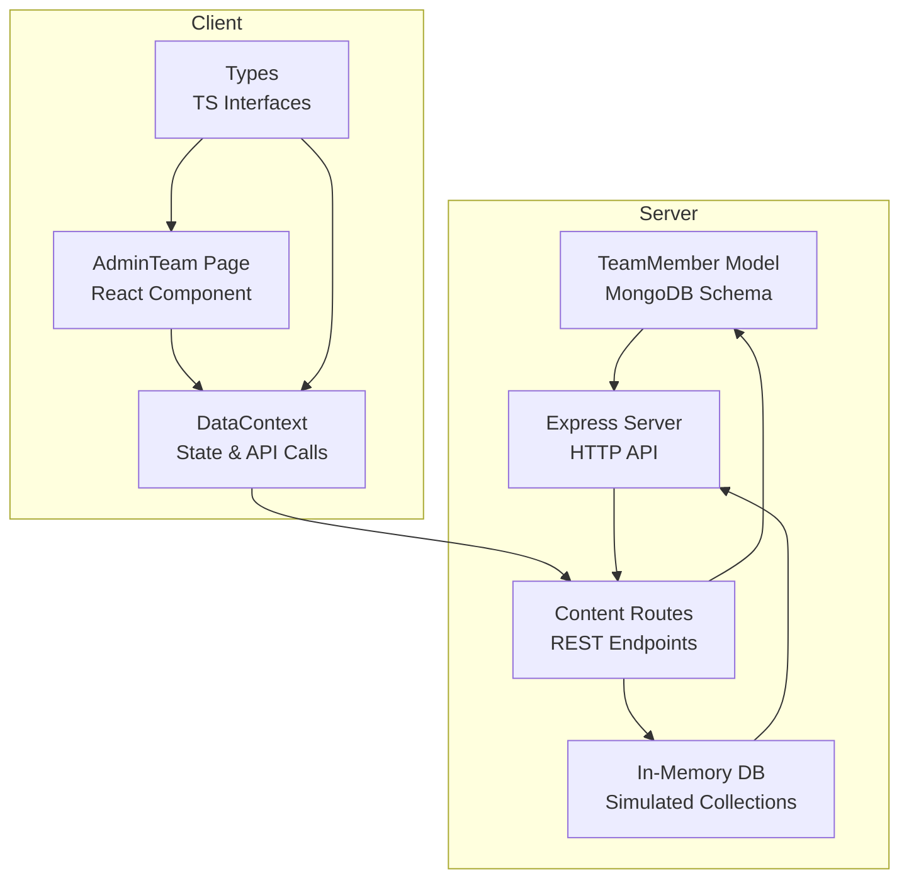
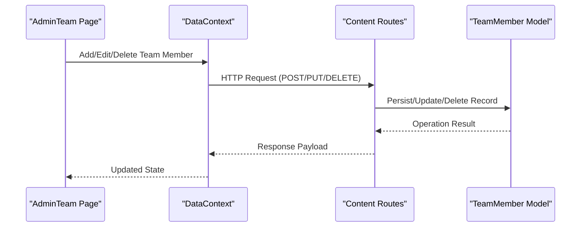
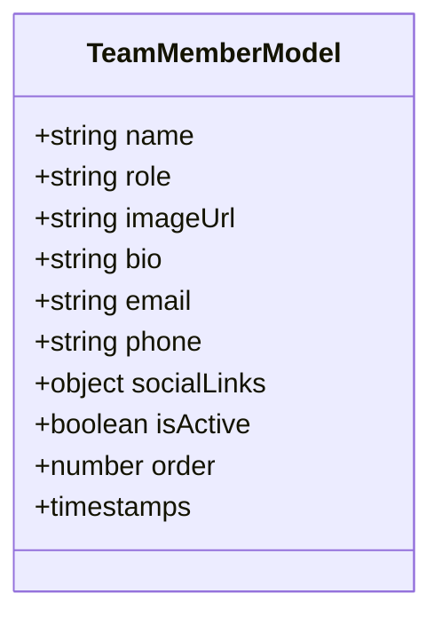
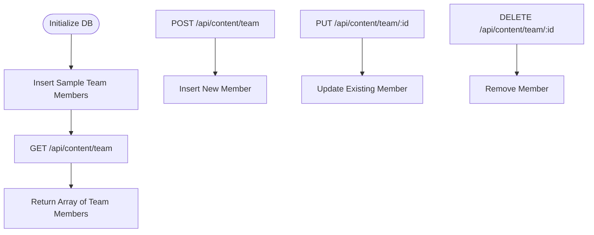
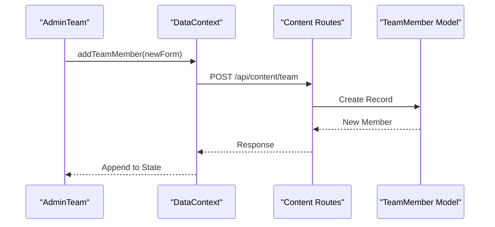
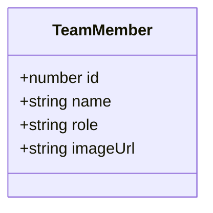
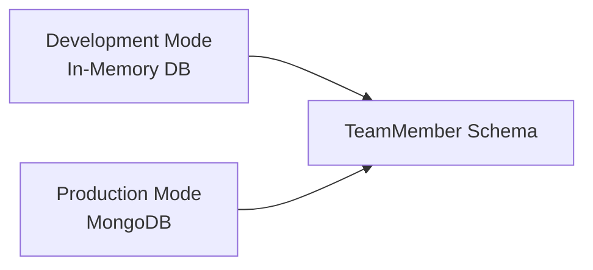
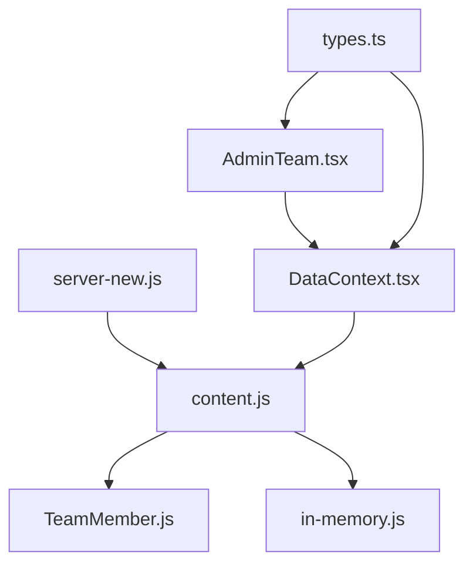

# Team Member Model

<cite>
**Referenced Files in This Document**
- [TeamMember.js](file://server/models/TeamMember.js)
- [Content.js](file://server/models/Content.js)
- [content.js](file://server/routes/content.js)
- [content-new.js](file://server/routes/content-new.js)
- [in-memory.js](file://server/db/in-memory.js)
- [AdminTeam.tsx](file://src/pages/admin/AdminTeam.tsx)
- [DataContext.tsx](file://src/context/DataContext.tsx)
- [types.ts](file://src/types.ts)
- [server-new.js](file://server/server-new.js)
</cite>

## Table of Contents
1. [Introduction](#introduction)
2. [Project Structure](#project-structure)
3. [Core Components](#core-components)
4. [Architecture Overview](#architecture-overview)
5. [Detailed Component Analysis](#detailed-component-analysis)
6. [Dependency Analysis](#dependency-analysis)
7. [Performance Considerations](#performance-considerations)
8. [Troubleshooting Guide](#troubleshooting-guide)
9. [Conclusion](#conclusion)

## Introduction
This document provides comprehensive documentation for the Team Member model used for staff and team member profiles in the Anko project. It explains the schema structure, field definitions, and relationships with supporting models. It also covers administrative management capabilities, frontend integration, and operational behavior for public and internal views.

## Project Structure
The Team Member model is implemented in two places within the backend:
- A simplified in-memory implementation used during development and testing
- A production-ready Mongoose model designed for MongoDB persistence

Frontend administration is handled via a dedicated admin page that integrates with the backend content API.

**Diagram sources**
- [TeamMember.js](file://server/models/TeamMember.js#L1-L57)
- [Content.js](file://server/models/Content.js#L1-L90)
- [content.js](file://server/routes/content.js#L1-L267)
- [in-memory.js](file://server/db/in-memory.js#L1-L271)
- [AdminTeam.tsx](file://src/pages/admin/AdminTeam.tsx#L1-L203)
- [DataContext.tsx](file://src/context/DataContext.tsx#L1-L259)
- [types.ts](file://src/types.ts#L18-L24)
- [server-new.js](file://server/server-new.js#L1-L133)

**Section sources**
- [TeamMember.js](file://server/models/TeamMember.js#L1-L57)
- [Content.js](file://server/models/Content.js#L1-L90)
- [content.js](file://server/routes/content.js#L1-L267)
- [in-memory.js](file://server/db/in-memory.js#L1-L271)
- [AdminTeam.tsx](file://src/pages/admin/AdminTeam.tsx#L1-L203)
- [DataContext.tsx](file://src/context/DataContext.tsx#L1-L259)
- [types.ts](file://src/types.ts#L18-L24)
- [server-new.js](file://server/server-new.js#L1-L133)

## Core Components
- TeamMember Mongoose model: Defines the schema for team member records, including personal information, professional role, image URL, and operational flags.
- In-memory database: Provides simulated CRUD operations for development and testing, including a collection for team members.
- Content routes: Expose REST endpoints for team member management, including listing, creation, updates, and deletion.
- AdminTeam page: Frontend component enabling administrators to add, edit, and remove team members with pagination.
- DataContext: Centralizes API calls and state for team member data, integrating with the content routes.
- Types: TypeScript interfaces define the shape of team member data exchanged between frontend and backend.

Key schema highlights:
- Personal information: name, role, optional biography
- Contact information: email, phone
- Social links: Telegram, VK, LinkedIn
- Operational fields: isActive flag, order for sorting, timestamps
- Image management: imageUrl is required for profile display

**Section sources**
- [TeamMember.js](file://server/models/TeamMember.js#L3-L49)
- [in-memory.js](file://server/db/in-memory.js#L98-L100)
- [content.js](file://server/routes/content.js#L32-L80)
- [AdminTeam.tsx](file://src/pages/admin/AdminTeam.tsx#L8-L53)
- [DataContext.tsx](file://src/context/DataContext.tsx#L99-L127)
- [types.ts](file://src/types.ts#L19-L24)

## Architecture Overview
The Team Member feature follows a layered architecture:
- Data Access Layer: Mongoose model and in-memory simulation
- API Layer: Express routes for team member operations
- Presentation Layer: Admin UI for managing team members
- State Management: DataContext orchestrates data fetching and updates

**Diagram sources**
- [AdminTeam.tsx](file://src/pages/admin/AdminTeam.tsx#L38-L53)
- [DataContext.tsx](file://src/context/DataContext.tsx#L99-L127)
- [content.js](file://server/routes/content.js#L42-L80)
- [TeamMember.js](file://server/models/TeamMember.js#L54-L56)

## Detailed Component Analysis

### TeamMember Mongoose Model
The production-ready model defines the canonical schema for team members, including validation rules, indexing for ordering, and timestamps.

**Diagram sources**
- [TeamMember.js](file://server/models/TeamMember.js#L3-L49)

**Section sources**
- [TeamMember.js](file://server/models/TeamMember.js#L1-L57)

### TeamMember Schema Fields
- name: Required, trimmed, max length constraint
- role: Required, trimmed, max length constraint
- imageUrl: Required URL for profile image
- bio: Optional, max length constraint
- email: Optional, trimmed, lowercased, validated format
- phone: Optional, trimmed
- socialLinks: Optional nested object with keys for Telegram, VK, LinkedIn
- isActive: Boolean flag to enable/disable profiles
- order: Numeric sort key with default value
- timestamps: Automatic createdAt/updatedAt fields

Validation and indexing:
- Validation messages are localized
- Composite index on {isActive: 1, order: 1} supports efficient retrieval and ordering

**Section sources**
- [TeamMember.js](file://server/models/TeamMember.js#L3-L52)

### In-Memory Team Member Implementation
During development, the in-memory database simulates the teamMembers collection and CRUD operations. It initializes with sample team member entries and supports find, insert, update, and delete operations.

**Diagram sources**
- [in-memory.js](file://server/db/in-memory.js#L98-L100)
- [in-memory.js](file://server/db/in-memory.js#L37-L61)
- [in-memory.js](file://server/db/in-memory.js#L171-L191)

**Section sources**
- [in-memory.js](file://server/db/in-memory.js#L1-L271)

### Content Routes for Team Members
The content routes expose endpoints for team member management:
- GET /api/content/team: Retrieve all team members
- POST /api/content/team: Create a new team member (authenticated)
- PUT /api/content/team/:id: Update a team member (authenticated)
- DELETE /api/content/team/:id: Delete a team member (authenticated)

These routes integrate with either the in-memory database (development) or the Mongoose model (production).

**Section sources**
- [content.js](file://server/routes/content.js#L32-L80)

### AdminTeam Page and DataContext Integration
Administrators use the AdminTeam page to manage team members:
- View all members in a paginated grid
- Add new members with name, role, and image URL
- Edit existing members inline
- Delete members with confirmation

DataContext handles API communication:
- Fetches team data on mount
- Updates state after successful API calls
- Supports pagination and loading states

**Diagram sources**
- [AdminTeam.tsx](file://src/pages/admin/AdminTeam.tsx#L43-L53)
- [DataContext.tsx](file://src/context/DataContext.tsx#L109-L117)
- [content.js](file://server/routes/content.js#L42-L49)
- [TeamMember.js](file://server/models/TeamMember.js#L54-L56)

**Section sources**
- [AdminTeam.tsx](file://src/pages/admin/AdminTeam.tsx#L1-L203)
- [DataContext.tsx](file://src/context/DataContext.tsx#L99-L127)

### Types and Interfaces
The frontend defines a TypeScript interface for TeamMember to ensure type safety across components and state management.

**Diagram sources**
- [types.ts](file://src/types.ts#L19-L24)

**Section sources**
- [types.ts](file://src/types.ts#L18-L24)

### Production vs Development Behavior
- Development: Uses in-memory database with sample data initialization
- Production: Uses Mongoose model connected to MongoDB with proper validation and indexing

**Diagram sources**
- [in-memory.js](file://server/db/in-memory.js#L118-L264)
- [TeamMember.js](file://server/models/TeamMember.js#L1-L57)
- [server-new.js](file://server/server-new.js#L23-L32)

**Section sources**
- [in-memory.js](file://server/db/in-memory.js#L1-L271)
- [server-new.js](file://server/server-new.js#L1-L133)

## Dependency Analysis
The Team Member feature depends on:
- Express server for routing and middleware
- Mongoose for data modeling and persistence
- Frontend React components for administration
- DataContext for centralized state and API orchestration

**Diagram sources**
- [server-new.js](file://server/server-new.js#L17-L84)
- [content.js](file://server/routes/content.js#L1-L267)
- [TeamMember.js](file://server/models/TeamMember.js#L1-L57)
- [in-memory.js](file://server/db/in-memory.js#L1-L271)
- [AdminTeam.tsx](file://src/pages/admin/AdminTeam.tsx#L1-L203)
- [DataContext.tsx](file://src/context/DataContext.tsx#L1-L259)
- [types.ts](file://src/types.ts#L1-L149)

**Section sources**
- [server-new.js](file://server/server-new.js#L1-L133)
- [content.js](file://server/routes/content.js#L1-L267)
- [TeamMember.js](file://server/models/TeamMember.js#L1-L57)
- [in-memory.js](file://server/db/in-memory.js#L1-L271)
- [AdminTeam.tsx](file://src/pages/admin/AdminTeam.tsx#L1-L203)
- [DataContext.tsx](file://src/context/DataContext.tsx#L1-L259)
- [types.ts](file://src/types.ts#L1-L149)

## Performance Considerations
- Indexing: The composite index on {isActive: 1, order: 1} optimizes retrieval and sorting of active team members.
- Pagination: The AdminTeam page implements pagination to limit DOM rendering and API payload sizes.
- Image URLs: Profile images are referenced via URLs; consider CDN integration and lazy loading for improved performance.
- Validation: Server-side validation prevents invalid data and reduces downstream errors.

[No sources needed since this section provides general guidance]

## Troubleshooting Guide
Common issues and resolutions:
- Missing or invalid image URL: Ensure imageUrl is a valid URL; otherwise, the profile image may not render.
- Email format errors: The email field validates against a strict pattern; correct malformed emails to avoid submission failures.
- Authentication errors: Team member management endpoints require authentication; ensure a valid bearer token is included in requests.
- Data not updating: Confirm that the DataContext is invoking the correct API endpoints and that the state is being updated accordingly.
- Pagination anomalies: Verify that the ITEMS_PER_PAGE constant and calculated total pages align with backend sorting and filtering.

**Section sources**
- [TeamMember.js](file://server/models/TeamMember.js#L24-L28)
- [content.js](file://server/routes/content.js#L42-L80)
- [AdminTeam.tsx](file://src/pages/admin/AdminTeam.tsx#L6-L53)
- [DataContext.tsx](file://src/context/DataContext.tsx#L99-L127)

## Conclusion
The Team Member model in Anko provides a robust foundation for managing staff and team member profiles. It supports essential fields for personal and professional information, contact details, and social links, along with operational controls like activation and ordering. The frontend admin interface enables efficient management, while the backend routes and models ensure secure, validated, and scalable operations. The dual-mode implementation (in-memory and MongoDB) allows smooth development and production transitions.