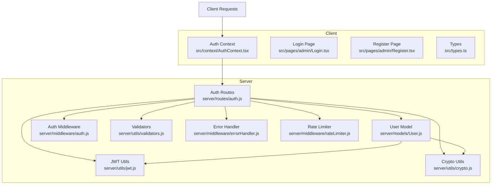
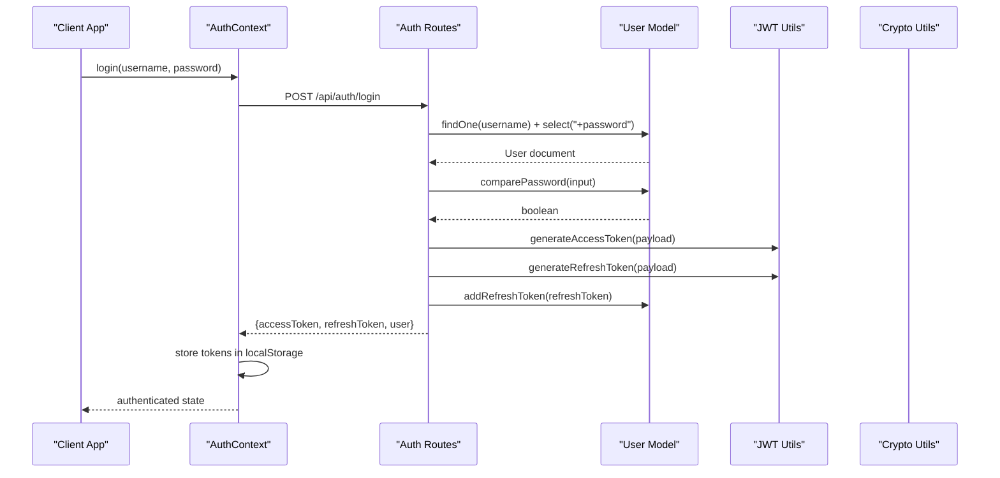
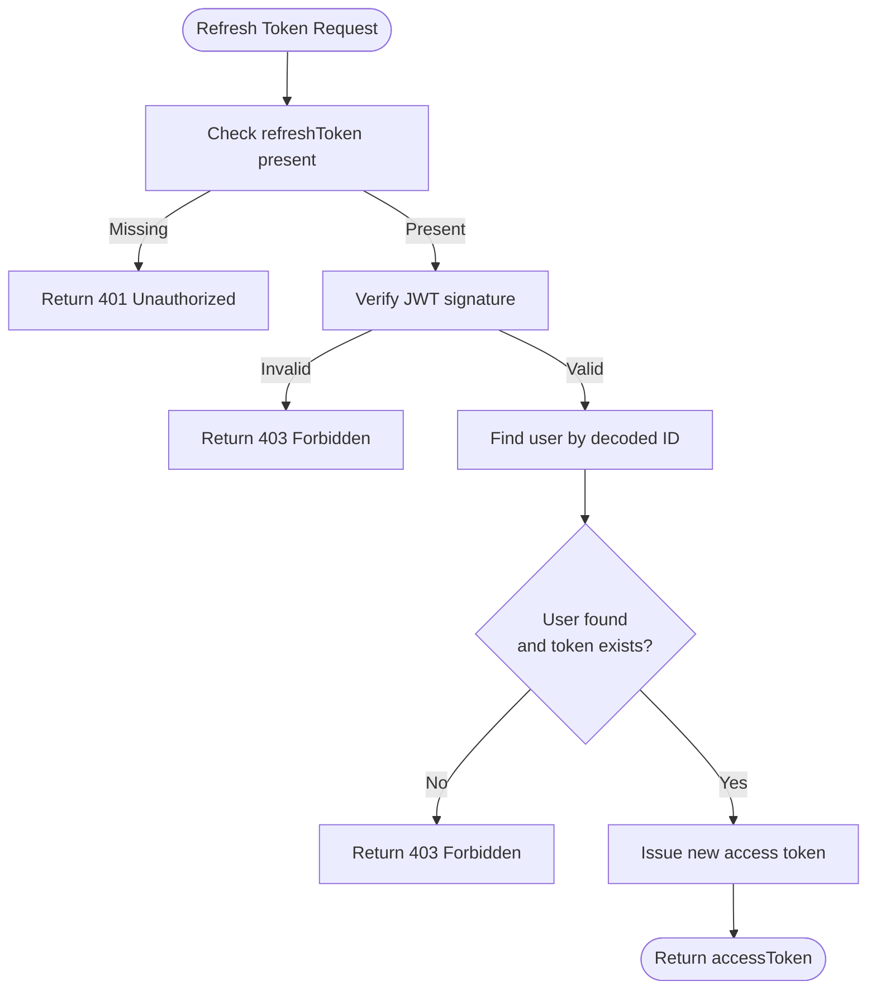
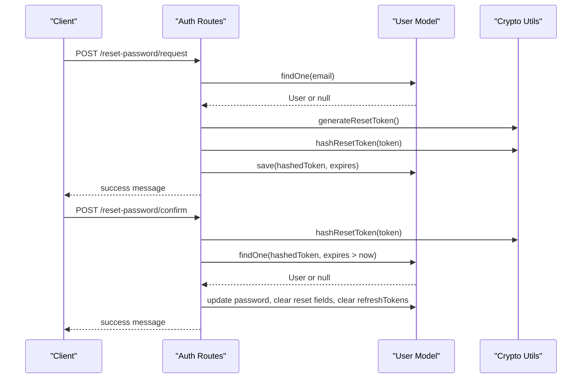
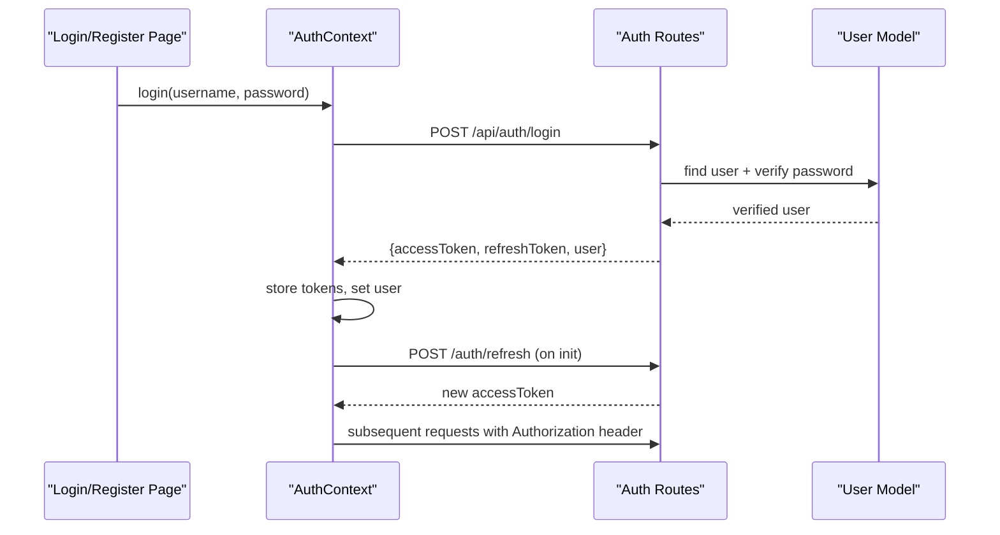
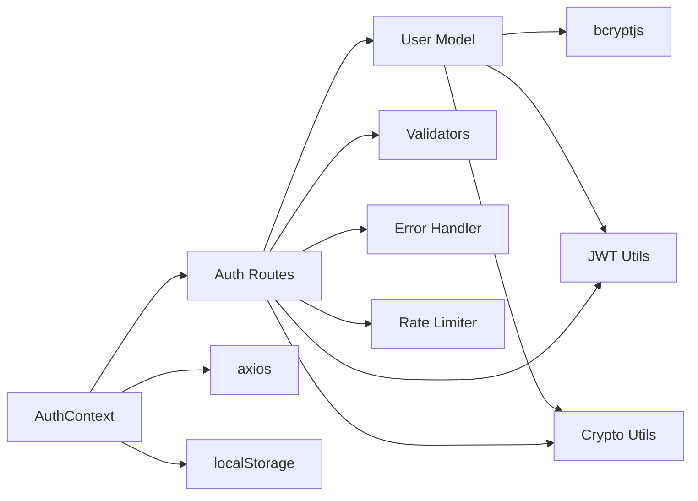

# User Model

<cite>
**Referenced Files in This Document**
- [User.js](file://server/models/User.js)
- [jwt.js](file://server/utils/jwt.js)
- [crypto.js](file://server/utils/crypto.js)
- [auth.js](file://server/middleware/auth.js)
- [auth.js](file://server/routes/auth.js)
- [validators.js](file://server/utils/validators.js)
- [errorHandler.js](file://server/middleware/errorHandler.js)
- [rateLimiter.js](file://server/middleware/rateLimiter.js)
- [AuthContext.tsx](file://src/context/AuthContext.tsx)
- [Login.tsx](file://src/pages/admin/Login.tsx)
- [Register.tsx](file://src/pages/admin/Register.tsx)
- [types.ts](file://src/types.ts)
- [generate-secret.js](file://scripts/generate-secret.js)
- [generate-hash.js](file://server/generate-hash.js)
- [SECURITY.md](file://SECURITY.md)
</cite>

## Table of Contents
1. [Introduction](#introduction)
2. [Project Structure](#project-structure)
3. [Core Components](#core-components)
4. [Architecture Overview](#architecture-overview)
5. [Detailed Component Analysis](#detailed-component-analysis)
6. [Dependency Analysis](#dependency-analysis)
7. [Performance Considerations](#performance-considerations)
8. [Troubleshooting Guide](#troubleshooting-guide)
9. [Conclusion](#conclusion)

## Introduction
This document provides comprehensive data model documentation for the User model in the Anko project. It covers the schema definition, validation rules, password hashing with bcrypt, role-based access control, refresh token lifecycle, secure serialization via toJSON, and practical workflows for user creation, authentication, and token management. Security considerations, password policies, and best practices are also included.

## Project Structure
The User model and related authentication components are organized across backend models, utilities, middleware, and routes, with client-side integration via a React context and pages.

**Diagram sources**
- [User.js](file://server/models/User.js#L1-L105)
- [jwt.js](file://server/utils/jwt.js#L1-L41)
- [crypto.js](file://server/utils/crypto.js#L1-L27)
- [auth.js](file://server/middleware/auth.js#L1-L45)
- [auth.js](file://server/routes/auth.js#L1-L280)
- [validators.js](file://server/utils/validators.js#L1-L72)
- [errorHandler.js](file://server/middleware/errorHandler.js#L1-L65)
- [rateLimiter.js](file://server/middleware/rateLimiter.js#L1-L50)
- [AuthContext.tsx](file://src/context/AuthContext.tsx#L1-L187)
- [Login.tsx](file://src/pages/admin/Login.tsx#L1-L129)
- [Register.tsx](file://src/pages/admin/Register.tsx#L1-L248)
- [types.ts](file://src/types.ts#L69-L92)

**Section sources**
- [User.js](file://server/models/User.js#L1-L105)
- [jwt.js](file://server/utils/jwt.js#L1-L41)
- [crypto.js](file://server/utils/crypto.js#L1-L27)
- [auth.js](file://server/middleware/auth.js#L1-L45)
- [auth.js](file://server/routes/auth.js#L1-L280)
- [validators.js](file://server/utils/validators.js#L1-L72)
- [errorHandler.js](file://server/middleware/errorHandler.js#L1-L65)
- [rateLimiter.js](file://server/middleware/rateLimiter.js#L1-L50)
- [AuthContext.tsx](file://src/context/AuthContext.tsx#L1-L187)
- [Login.tsx](file://src/pages/admin/Login.tsx#L1-L129)
- [Register.tsx](file://src/pages/admin/Register.tsx#L1-L248)
- [types.ts](file://src/types.ts#L69-L92)

## Core Components
- User model with Mongoose schema defining username, email, password, role, refreshTokens, reset password fields, timestamps, and lastLogin.
- Password hashing using bcrypt with salt generation and comparison methods.
- Role-based access control with user and admin roles.
- Refresh token management with storage, expiration (7 days), and validation methods.
- Secure JSON serialization via toJSON to exclude sensitive fields.
- Authentication routes for registration, login, token refresh, logout, and password reset.
- JWT utilities for access and refresh token generation and verification.
- Crypto utilities for password reset token generation and hashing.
- Client-side authentication context managing tokens and protected requests.

**Section sources**
- [User.js](file://server/models/User.js#L4-L48)
- [User.js](file://server/models/User.js#L50-L100)
- [auth.js](file://server/routes/auth.js#L16-L179)
- [jwt.js](file://server/utils/jwt.js#L10-L21)
- [crypto.js](file://server/utils/crypto.js#L7-L21)
- [AuthContext.tsx](file://src/context/AuthContext.tsx#L54-L114)

## Architecture Overview
The authentication flow integrates client-side token management with server-side validation, hashing, and token issuance.

**Diagram sources**
- [AuthContext.tsx](file://src/context/AuthContext.tsx#L54-L76)
- [auth.js](file://server/routes/auth.js#L75-L120)
- [User.js](file://server/models/User.js#L66-L89)
- [jwt.js](file://server/utils/jwt.js#L10-L21)

## Detailed Component Analysis

### User Schema Definition
- Fields and constraints:
  - username: String, required, unique, trimmed, 3–30 characters, alphanumeric and underscore.
  - email: String, required, unique, trimmed, lowercase, validated by regex pattern.
  - password: String, required, minimum 6 characters.
  - role: Enum ['user', 'admin'], defaults to 'user'.
  - refreshTokens: Array of objects containing token and createdAt with TTL of 7 days.
  - passwordResetToken: String (hashed).
  - passwordResetExpires: Date (expiration timestamp).
  - createdAt: Date (auto-generated).
  - lastLogin: Date (updated on successful login).
- Timestamps enabled via schema option.

Validation rules and data types are enforced both at the schema level and through dedicated validator utilities.

**Section sources**
- [User.js](file://server/models/User.js#L4-L48)
- [validators.js](file://server/utils/validators.js#L10-L19)
- [validators.js](file://server/utils/validators.js#L21-L46)

### Password Hashing with bcrypt
- Pre-save hook hashes the password using bcrypt with a salt generated at 10 rounds.
- comparePassword method compares candidate passwords against stored hash.
- A helper script demonstrates bcrypt hashing and verification.

Best practices:
- Use bcrypt with sufficient rounds (default 10 is acceptable; consider higher for sensitive environments).
- Never store plain-text passwords.
- Ensure salt generation occurs during save, not at creation time.

**Section sources**
- [User.js](file://server/models/User.js#L50-L63)
- [User.js](file://server/models/User.js#L66-L72)
- [generate-hash.js](file://server/generate-hash.js#L3-L18)

### Role-Based Access Control
- Roles: 'user' and 'admin'.
- requireAdmin middleware checks user role and rejects unauthorized access.
- Access tokens include role for client-side decisions.

Security considerations:
- Always verify role on protected endpoints.
- Avoid exposing role in client-side logs or responses unnecessarily.

**Section sources**
- [User.js](file://server/models/User.js#L26-L30)
- [auth.js](file://server/middleware/auth.js#L37-L42)
- [auth.js](file://server/routes/auth.js#L101-L105)

### Refresh Token Management
- Storage: Array of { token, createdAt } with createdAt TTL set to 7 days.
- Methods:
  - addRefreshToken: appends a new refresh token.
  - removeRefreshToken: deletes a specific refresh token.
  - hasRefreshToken: checks existence of a refresh token.
- Expiration: createdAt field configured with TTL of 7 days.
- Workflow:
  - On login/register: issue refresh token and persist via addRefreshToken.
  - On refresh: verify token signature and presence in user.refreshTokens.
  - On logout: remove refresh token from database.

**Diagram sources**
- [auth.js](file://server/routes/auth.js#L127-L156)
- [User.js](file://server/models/User.js#L74-L89)
- [jwt.js](file://server/utils/jwt.js#L28-L34)

**Section sources**
- [User.js](file://server/models/User.js#L31-L38)
- [User.js](file://server/models/User.js#L74-L89)
- [auth.js](file://server/routes/auth.js#L127-L156)

### Password Reset Flow
- Request reset:
  - Generate random token and hash it before storing.
  - Store hashed token and expiration (1 hour).
  - Respond success regardless of email existence (no email enumeration).
- Confirm reset:
  - Hash submitted token and check against stored hashed token with unexpired expiry.
  - Replace password, clear reset fields, invalidate all refresh tokens.

**Diagram sources**
- [auth.js](file://server/routes/auth.js#L186-L222)
- [auth.js](file://server/routes/auth.js#L229-L262)
- [crypto.js](file://server/utils/crypto.js#L7-L21)
- [User.js](file://server/models/User.js#L39-L40)

**Section sources**
- [auth.js](file://server/routes/auth.js#L186-L222)
- [auth.js](file://server/routes/auth.js#L229-L262)
- [crypto.js](file://server/utils/crypto.js#L7-L21)

### Secure Serialization with toJSON
- toJSON excludes password, refreshTokens, passwordResetToken, passwordResetExpires, and __v from serialized output.
- Ensures sensitive data is not leaked in API responses.

**Section sources**
- [User.js](file://server/models/User.js#L91-L100)

### Client-Side Authentication Integration
- AuthContext manages:
  - login: posts credentials, stores accessToken, refreshToken, and user.
  - refreshToken: calls /auth/refresh to renew accessToken.
  - logout: calls /auth/logout and clears local storage.
  - Axios interceptors: attach Authorization header and auto-refresh on 401.
- Login and Register pages coordinate with AuthContext and perform basic client-side validation.

**Diagram sources**
- [AuthContext.tsx](file://src/context/AuthContext.tsx#L54-L114)
- [Login.tsx](file://src/pages/admin/Login.tsx#L21-L39)
- [Register.tsx](file://src/pages/admin/Register.tsx#L58-L89)
- [auth.js](file://server/routes/auth.js#L75-L120)

**Section sources**
- [AuthContext.tsx](file://src/context/AuthContext.tsx#L54-L114)
- [Login.tsx](file://src/pages/admin/Login.tsx#L21-L39)
- [Register.tsx](file://src/pages/admin/Register.tsx#L58-L89)
- [types.ts](file://src/types.ts#L69-L92)

## Dependency Analysis
- User model depends on bcrypt for hashing and comparison.
- Auth routes depend on JWT utilities for token generation/verification, crypto utilities for password reset, validators for input, error handler for consistent error responses, and rate limiter for protection.
- Client-side AuthContext depends on axios and localStorage for token persistence and request interception.

**Diagram sources**
- [User.js](file://server/models/User.js#L1-L2)
- [jwt.js](file://server/utils/jwt.js#L1)
- [crypto.js](file://server/utils/crypto.js#L1)
- [auth.js](file://server/routes/auth.js#L1-L9)
- [validators.js](file://server/utils/validators.js#L1)
- [errorHandler.js](file://server/middleware/errorHandler.js#L1)
- [rateLimiter.js](file://server/middleware/rateLimiter.js#L1)
- [AuthContext.tsx](file://src/context/AuthContext.tsx#L1-L3)

**Section sources**
- [User.js](file://server/models/User.js#L1-L2)
- [auth.js](file://server/routes/auth.js#L1-L9)
- [AuthContext.tsx](file://src/context/AuthContext.tsx#L1-L3)

## Performance Considerations
- Password hashing cost: bcrypt default cost (10) balances security and performance; adjust based on hardware capacity.
- Indexes: username and email are unique; ensure database enforces uniqueness efficiently.
- Token TTL: 7-day refresh token TTL reduces long-term exposure risk.
- Rate limiting: protects against brute-force attacks and abuse on auth endpoints.

[No sources needed since this section provides general guidance]

## Troubleshooting Guide
Common issues and resolutions:
- Invalid or expired tokens:
  - Verify token signature and expiration; handle 403 responses by prompting re-authentication.
- User not found or credentials invalid:
  - Ensure user exists and password matches; avoid leaking account existence.
- Refresh token missing or invalid:
  - Confirm token is present in user.refreshTokens and not expired.
- Password reset token invalid or expired:
  - Ensure token matches hashed value and is within 1-hour validity window.
- Rate limit exceeded:
  - Implement exponential backoff or CAPTCHA for repeated failures.

**Section sources**
- [auth.js](file://server/middleware/auth.js#L5-L34)
- [auth.js](file://server/routes/auth.js#L127-L156)
- [auth.js](file://server/routes/auth.js#L186-L222)
- [auth.js](file://server/routes/auth.js#L229-L262)
- [rateLimiter.js](file://server/middleware/rateLimiter.js#L16-L42)

## Conclusion
The User model in Anko implements a robust authentication and authorization system with strong security practices: bcrypt-based password hashing, role-based access control, secure refresh token lifecycle, and safe serialization. The accompanying client-side context ensures seamless token management and protected requests. Adhering to the outlined security recommendations and best practices will help maintain a secure and reliable authentication flow.