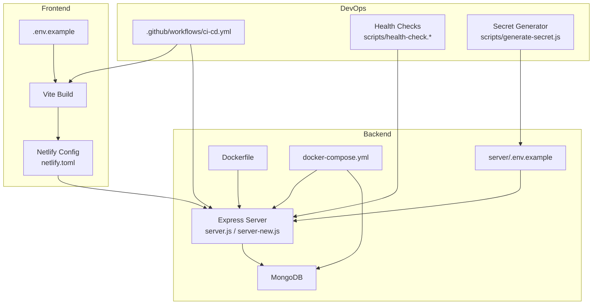
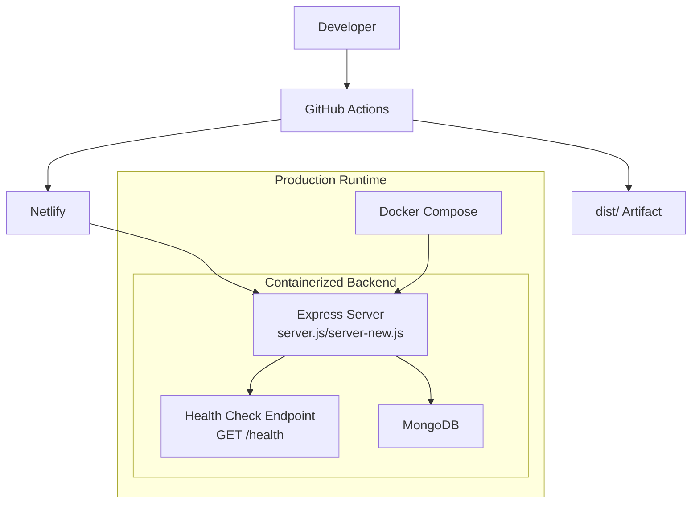
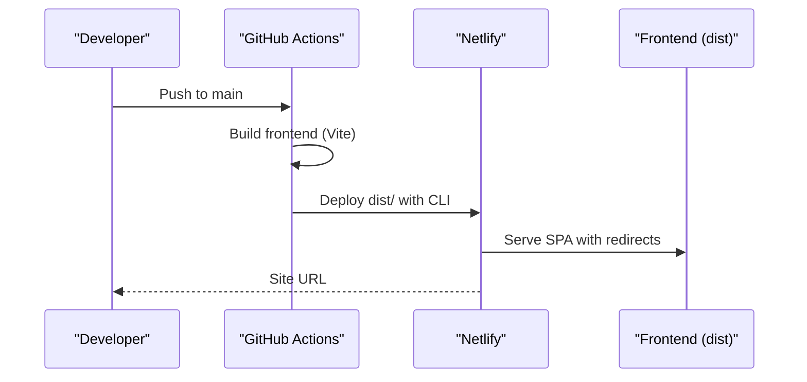
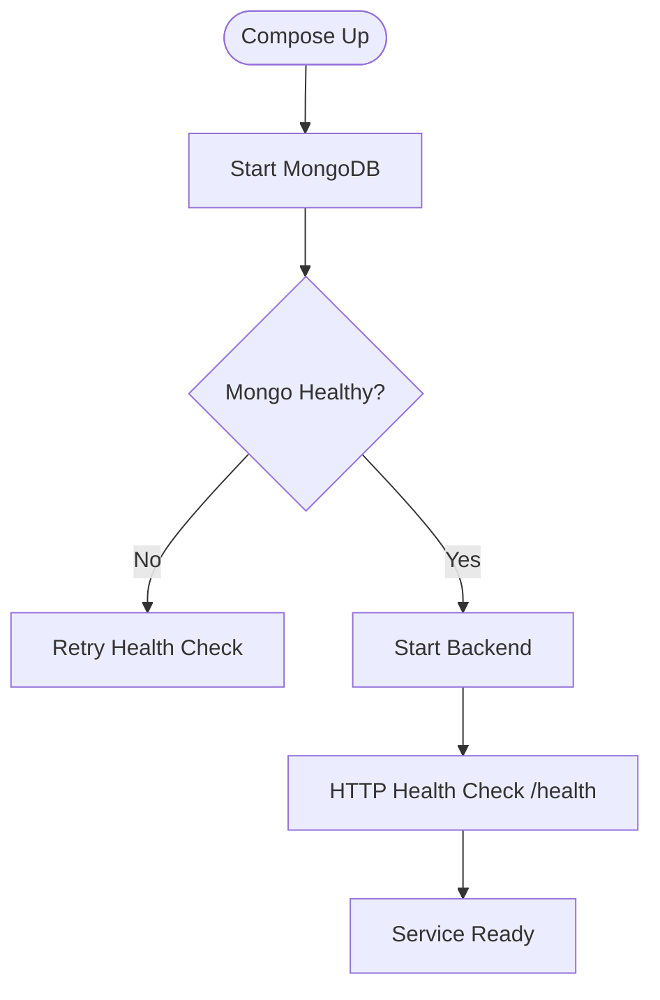
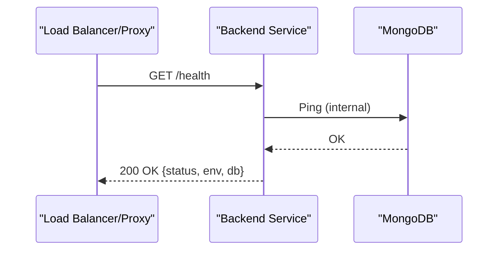
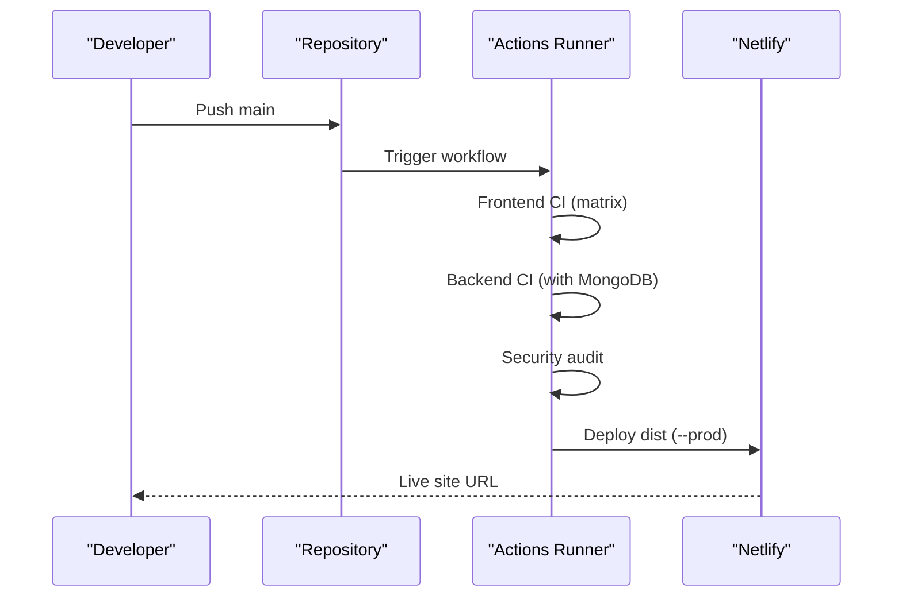
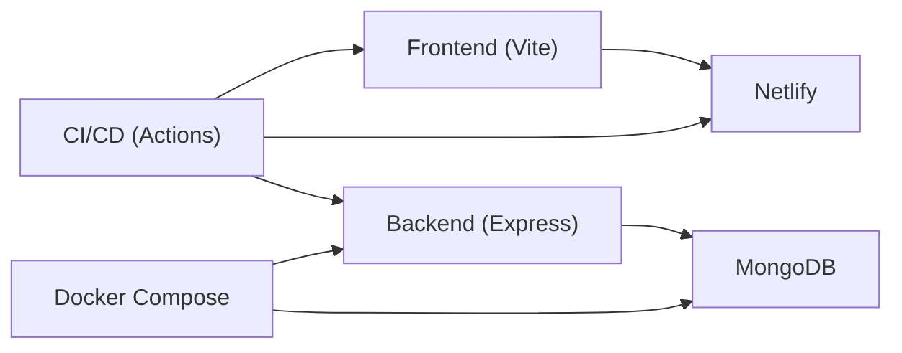

# Deployment & DevOps

<cite>
**Referenced Files in This Document**
- [DEPLOYMENT.md](file://DEPLOYMENT.md)
- [netlify.toml](file://netlify.toml)
- [ci-cd.yml](file://.github/workflows/ci-cd.yml)
- [docker-compose.yml](file://docker-compose.yml)
- [Dockerfile](file://server/Dockerfile)
- [.env.example](file://.env.example)
- [.env.docker.example](file://.env.docker.example)
- [server/.env.example](file://server/.env.example)
- [scripts/generate-secret.js](file://scripts/generate-secret.js)
- [scripts/health-check.sh](file://scripts/health-check.sh)
- [scripts/health-check.bat](file://scripts/health-check.bat)
- [server/server.js](file://server/server.js)
- [server/server-new.js](file://server/server-new.js)
- [server/middleware/rateLimiter.js](file://server/middleware/rateLimiter.js)
- [server/middleware/errorHandler.js](file://server/middleware/errorHandler.js)
- [server/package.json](file://server/package.json)
- [package.json](file://package.json)
</cite>

## Table of Contents
1. [Introduction](#introduction)
2. [Project Structure](#project-structure)
3. [Core Components](#core-components)
4. [Architecture Overview](#architecture-overview)
5. [Detailed Component Analysis](#detailed-component-analysis)
6. [Dependency Analysis](#dependency-analysis)
7. [Performance Considerations](#performance-considerations)
8. [Troubleshooting Guide](#troubleshooting-guide)
9. [Conclusion](#conclusion)
10. [Appendices](#appendices)

## Introduction
This document provides production-ready deployment and DevOps practices for the Anko project. It covers:
- Netlify deployment workflow (automatic and manual), environment variable management, and redirects/headers configuration
- Docker containerization with health checks and production server configuration
- Environment-based configuration management and secret generation utilities
- Security considerations, CI/CD pipelines, and monitoring strategies
- Rollback procedures, performance optimization, and scaling considerations
- Practical deployment commands, configuration references, and troubleshooting guidance

## Project Structure
The repository includes:
- Frontend built with Vite and deployed via Netlify
- Backend API written in Express with MongoDB connectivity
- GitHub Actions CI/CD pipeline for automated builds and deployments
- Docker Compose for local development and containerized production
- Scripts for health checks and secure secret generation

**Diagram sources**
- [netlify.toml](file://netlify.toml#L1-L19)
- [server/server.js](file://server/server.js#L1-L337)
- [server/server-new.js](file://server/server-new.js#L1-L133)
- [docker-compose.yml](file://docker-compose.yml#L1-L82)
- [server/Dockerfile](file://server/Dockerfile#L1-L72)
- [.env.example](file://.env.example#L1-L43)
- [server/.env.example](file://server/.env.example#L1-L94)
- [.github/workflows/ci-cd.yml](file://.github/workflows/ci-cd.yml#L1-L147)
- [scripts/health-check.sh](file://scripts/health-check.sh#L1-L191)
- [scripts/health-check.bat](file://scripts/health-check.bat#L1-L128)
- [scripts/generate-secret.js](file://scripts/generate-secret.js#L1-L117)

**Section sources**
- [netlify.toml](file://netlify.toml#L1-L19)
- [server/server.js](file://server/server.js#L1-L337)
- [server/server-new.js](file://server/server-new.js#L1-L133)
- [docker-compose.yml](file://docker-compose.yml#L1-L82)
- [server/Dockerfile](file://server/Dockerfile#L1-L72)
- [.env.example](file://.env.example#L1-L43)
- [server/.env.example](file://server/.env.example#L1-L94)
- [.github/workflows/ci-cd.yml](file://.github/workflows/ci-cd.yml#L1-L147)
- [scripts/health-check.sh](file://scripts/health-check.sh#L1-L191)
- [scripts/health-check.bat](file://scripts/health-check.bat#L1-L128)
- [scripts/generate-secret.js](file://scripts/generate-secret.js#L1-L117)

## Core Components
- Netlify deployment configuration defines build command, publish directory, environment variables, SPA redirects, and security headers.
- GitHub Actions pipeline automates frontend and backend builds/tests and deploys to Netlify on pushes to main.
- Docker Compose orchestrates MongoDB, backend service, and optional frontend, with health checks and environment propagation.
- Dockerfile implements a multi-stage production build, non-root user, health checks, and dumb-init for signal handling.
- Environment variable examples define frontend/backend configuration and security settings.
- Health check scripts validate Node/npm installation, environment readiness, and dependency audits.
- Secret generator creates cryptographically strong keys and safe defaults for production.

**Section sources**
- [netlify.toml](file://netlify.toml#L1-L19)
- [.github/workflows/ci-cd.yml](file://.github/workflows/ci-cd.yml#L115-L147)
- [docker-compose.yml](file://docker-compose.yml#L1-L82)
- [server/Dockerfile](file://server/Dockerfile#L1-L72)
- [.env.example](file://.env.example#L1-L43)
- [server/.env.example](file://server/.env.example#L1-L94)
- [scripts/health-check.sh](file://scripts/health-check.sh#L1-L191)
- [scripts/health-check.bat](file://scripts/health-check.bat#L1-L128)
- [scripts/generate-secret.js](file://scripts/generate-secret.js#L1-L117)

## Architecture Overview
The production architecture supports:
- Frontend static hosting on Netlify with SPA routing and security headers
- Backend API containerized with health checks and MongoDB persistence
- CI/CD pipeline validating builds and deploying to Netlify
- Optional Docker Compose for local development and containerized staging/production

**Diagram sources**
- [.github/workflows/ci-cd.yml](file://.github/workflows/ci-cd.yml#L115-L147)
- [server/server.js](file://server/server.js#L311-L314)
- [server/server-new.js](file://server/server-new.js#L71-L79)
- [docker-compose.yml](file://docker-compose.yml#L26-L56)

**Section sources**
- [.github/workflows/ci-cd.yml](file://.github/workflows/ci-cd.yml#L115-L147)
- [server/server.js](file://server/server.js#L311-L314)
- [server/server-new.js](file://server/server-new.js#L71-L79)
- [docker-compose.yml](file://docker-compose.yml#L26-L56)

## Detailed Component Analysis

### Netlify Deployment Workflow
- Automatic deployment: Netlify reads build settings from netlify.toml, executes the build command, publishes dist, sets Node version, applies SPA redirects, and injects security headers.
- Manual deployment: Install Netlify CLI, log in, and deploy the production build directory.
- Environment variables: Configure VITE_API_URL and VITE_APP_NAME in Netlify UI; ensure CORS_ORIGIN matches the frontend domain.

**Diagram sources**
- [.github/workflows/ci-cd.yml](file://.github/workflows/ci-cd.yml#L115-L147)
- [netlify.toml](file://netlify.toml#L1-L19)

**Section sources**
- [netlify.toml](file://netlify.toml#L1-L19)
- [.github/workflows/ci-cd.yml](file://.github/workflows/ci-cd.yml#L115-L147)
- [DEPLOYMENT.md](file://DEPLOYMENT.md#L40-L88)

### Docker Containerization and Health Checks
- Multi-stage Dockerfile builds a minimal production image, installs dumb-init, switches to a non-root user, exposes port 5000, and defines a health check against GET /health.
- docker-compose defines MongoDB and backend services, environment propagation, volume mounts for uploads, network isolation, and health checks with start periods and retry policies.

**Diagram sources**
- [docker-compose.yml](file://docker-compose.yml#L20-L24)
- [docker-compose.yml](file://docker-compose.yml#L50-L55)
- [server/Dockerfile](file://server/Dockerfile#L63-L65)

**Section sources**
- [server/Dockerfile](file://server/Dockerfile#L1-L72)
- [docker-compose.yml](file://docker-compose.yml#L1-L82)

### Production Server Configuration
- Health endpoint: GET /health returns service status and environment details.
- Graceful shutdown: Listens for SIGTERM/SIGINT to close MongoDB connections cleanly.
- Security middleware: Helmet enabled; CSP disabled in development; Morgan logging configured by environment.
- CORS: Controlled by CORS_ORIGIN; credentials allowed; methods and headers explicitly set.
- Rate limiting: Applied to /api routes with configurable windows and limits.

**Diagram sources**
- [server/server-new.js](file://server/server-new.js#L71-L79)
- [server/server.js](file://server/server.js#L311-L314)

**Section sources**
- [server/server-new.js](file://server/server-new.js#L1-L133)
- [server/server.js](file://server/server.js#L311-L314)
- [server/middleware/rateLimiter.js](file://server/middleware/rateLimiter.js#L1-L50)
- [server/middleware/errorHandler.js](file://server/middleware/errorHandler.js#L1-L65)

### Environment-Based Configuration Management
- Frontend variables (.env.example): VITE_API_URL, VITE_APP_NAME, feature flags, analytics toggles.
- Backend variables (server/.env.example): PORT, NODE_ENV, MONGODB_URI, JWT secrets, CORS_ORIGIN, upload settings, rate limits, logging level, base URL.
- Docker overrides (.env.docker.example): MONGO_ROOT_USER/PASSWORD, API_PORT, JWT secrets, CORS_ORIGIN.

Best practices:
- Never commit secrets; use platform-specific secret stores (Netlify/Vercel, CI/CD secrets, Docker secrets).
- Use environment-specific files and override via compose/runtime.
- Validate required variables during health checks.

**Section sources**
- [.env.example](file://.env.example#L1-L43)
- [server/.env.example](file://server/.env.example#L1-L94)
- [.env.docker.example](file://.env.docker.example#L1-L21)
- [scripts/health-check.sh](file://scripts/health-check.sh#L62-L76)
- [scripts/health-check.bat](file://scripts/health-check.bat#L56-L62)

### Secret Generation Utilities
- scripts/generate-secret.js produces cryptographically strong secrets for JWT, session, encryption, API keys, and random passwords.
- Provides CLI options for generating hex/base64 values and custom-length passwords.
- Emphasizes secure storage and rotation practices.

**Section sources**
- [scripts/generate-secret.js](file://scripts/generate-secret.js#L1-L117)

### CI/CD Integration and Deployment Pipelines
- Workflow triggers on pushes and pull requests to main/develop.
- Frontend job: Node matrix (18.x/20.x), type check, build, upload artifact for Node 20 on main.
- Backend job: Runs MongoDB service, installs dependencies, executes tests with isolated test DB and dummy secrets.
- Security audit: Runs npm audit for production dependencies (continue on error).
- Netlify deploy: On main push, builds, authenticates via tokens, and deploys dist to production.

**Diagram sources**
- [.github/workflows/ci-cd.yml](file://.github/workflows/ci-cd.yml#L1-L147)

**Section sources**
- [.github/workflows/ci-cd.yml](file://.github/workflows/ci-cd.yml#L1-L147)
- [DEPLOYMENT.md](file://DEPLOYMENT.md#L527-L563)

### Monitoring Strategies
- PM2 monitoring and logs for backend processes (status, logs, metrics, rotation).
- System-level monitoring: disk, memory, CPU, and MongoDB stats.
- Application logs: structured logging via Morgan; error boundaries via custom error handler.

**Section sources**
- [DEPLOYMENT.md](file://DEPLOYMENT.md#L431-L479)
- [server/middleware/errorHandler.js](file://server/middleware/errorHandler.js#L1-L65)

### Rollback Procedures
- Zero-downtime update: backup DB, fetch latest, install production dependencies, reload with PM2.
- Rollback: reset to previous commit, reinstall dependencies, reload.

**Section sources**
- [DEPLOYMENT.md](file://DEPLOYMENT.md#L527-L563)

### Security Considerations
- Strong JWT secrets generated via script; minimum lengths recommended.
- Firewall rules: allow SSH/HTTP/HTTPS; restrict MongoDB access.
- SSL/TLS via Let’s Encrypt; automated renewal.
- Rate limiting and strict CORS origin enforcement.
- Dependency vulnerability scanning and fixes.

**Section sources**
- [scripts/generate-secret.js](file://scripts/generate-secret.js#L34-L39)
- [DEPLOYMENT.md](file://DEPLOYMENT.md#L362-L430)
- [server/middleware/rateLimiter.js](file://server/middleware/rateLimiter.js#L1-L50)

## Dependency Analysis
- Frontend depends on Vite for building and Netlify for hosting.
- Backend depends on Express, Helmet, CORS, Morgan, Mongoose, and rate limiting.
- CI/CD depends on GitHub Actions, Netlify CLI, and environment secrets.
- Docker Compose depends on official images and environment variables.

**Diagram sources**
- [package.json](file://package.json#L7-L26)
- [server/package.json](file://server/package.json#L18-L29)
- [.github/workflows/ci-cd.yml](file://.github/workflows/ci-cd.yml#L1-L147)
- [docker-compose.yml](file://docker-compose.yml#L1-L82)

**Section sources**
- [package.json](file://package.json#L1-L68)
- [server/package.json](file://server/package.json#L1-L49)
- [.github/workflows/ci-cd.yml](file://.github/workflows/ci-cd.yml#L1-L147)
- [docker-compose.yml](file://docker-compose.yml#L1-L82)

## Performance Considerations
- Use PM2 with appropriate restart thresholds and log rotation.
- Enable gzip/HTTP2 and caching headers in Nginx for SPA delivery.
- Optimize MongoDB connection pool and indexes; monitor slow queries.
- Apply rate limiting to prevent abuse and protect resources.
- Prefer production builds and minification; avoid unnecessary assets.

[No sources needed since this section provides general guidance]

## Troubleshooting Guide
Common issues and remedies:
- Frontend build failures: verify VITE_API_URL and Node version; run health checks.
- Backend connectivity: check MongoDB status, connection string, and credentials.
- SSL problems: validate certificates and Nginx configuration.
- Memory spikes: restart with memory limits or scale horizontally.
- CI failures: inspect audit results and test logs; ensure secrets are configured.

**Section sources**
- [scripts/health-check.sh](file://scripts/health-check.sh#L1-L191)
- [scripts/health-check.bat](file://scripts/health-check.bat#L1-L128)
- [DEPLOYMENT.md](file://DEPLOYMENT.md#L565-L621)

## Conclusion
The Anko project provides a robust, production-ready deployment foundation:
- Netlify for fast, secure frontend delivery with SPA routing and headers
- Express backend with health checks, graceful shutdown, and security middleware
- GitHub Actions for automated CI/CD and Netlify deployments
- Docker Compose for reproducible local and containerized environments
- Comprehensive health checks, secret generation, and security hardening

Adopt the recommended practices for environment management, monitoring, and rollback to maintain a reliable production system.

[No sources needed since this section summarizes without analyzing specific files]

## Appendices

### Practical Deployment Commands
- Netlify CLI manual deploy: see [DEPLOYMENT.md](file://DEPLOYMENT.md#L61-L72)
- Docker Compose up/down: see [docker-compose.yml](file://docker-compose.yml#L1-L82)
- Health checks: see [scripts/health-check.sh](file://scripts/health-check.sh#L1-L191) and [scripts/health-check.bat](file://scripts/health-check.bat#L1-L128)
- Secret generation: see [scripts/generate-secret.js](file://scripts/generate-secret.js#L1-L117)

### Configuration References
- Frontend environment: see [.env.example](file://.env.example#L1-L43)
- Backend environment: see [server/.env.example](file://server/.env.example#L1-L94)
- Docker environment overrides: see [.env.docker.example](file://.env.docker.example#L1-L21)
- Netlify build and headers: see [netlify.toml](file://netlify.toml#L1-L19)
- CI/CD pipeline: see [.github/workflows/ci-cd.yml](file://.github/workflows/ci-cd.yml#L1-L147)