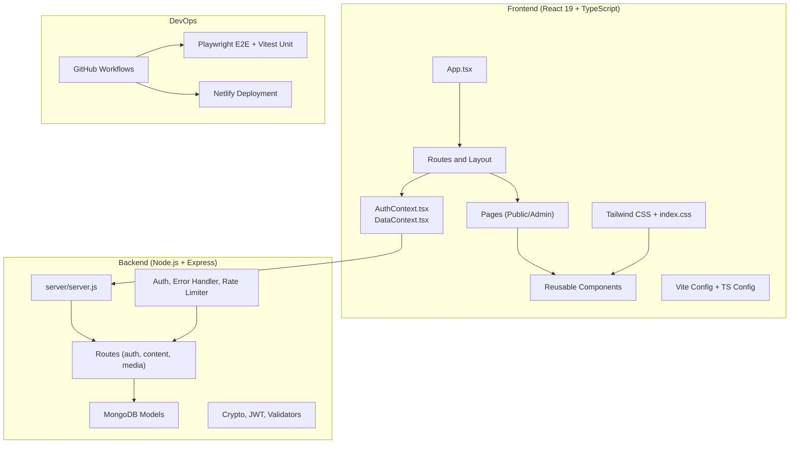
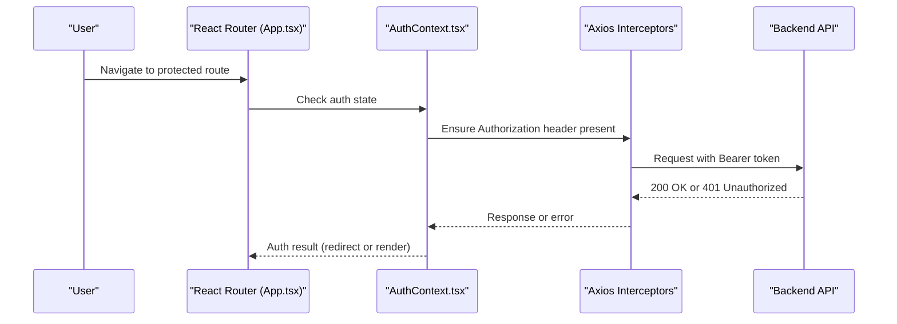
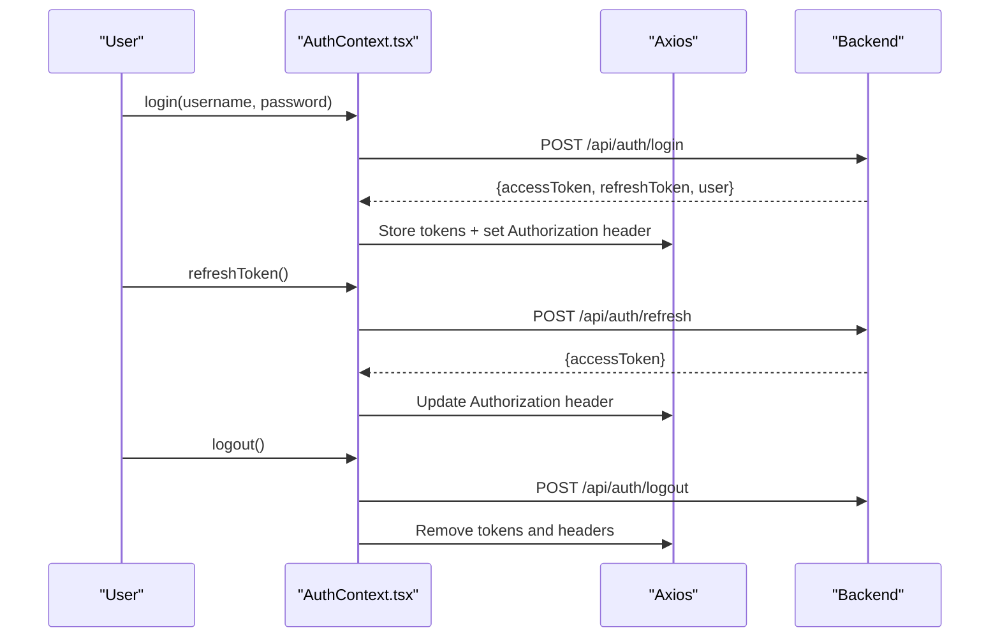
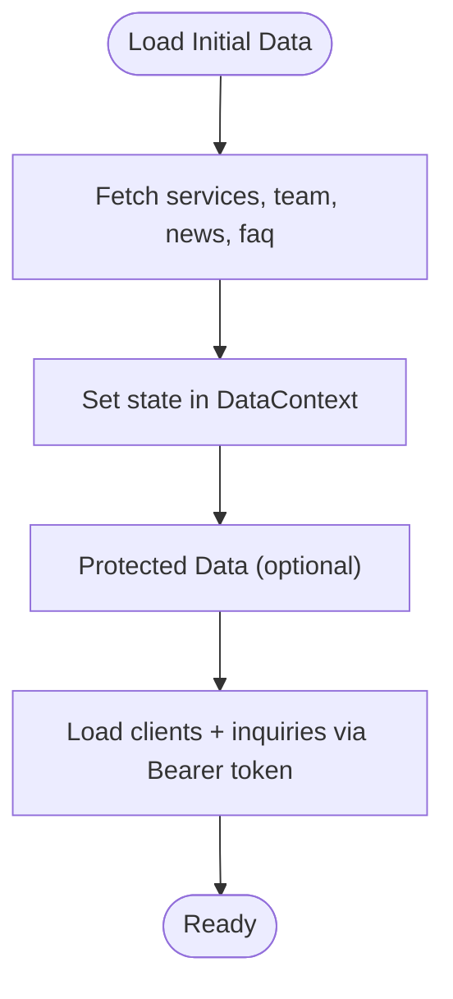
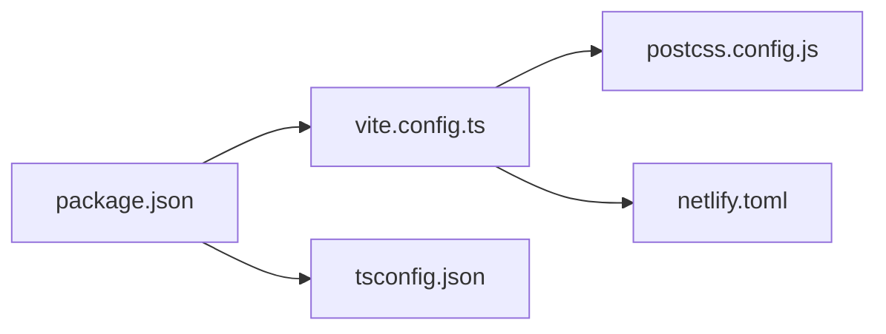
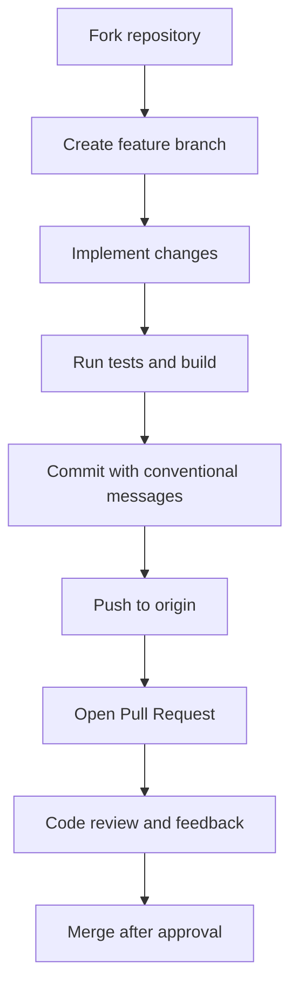

# Development Guide

<cite>
**Referenced Files in This Document**
- [CONTRIBUTING.md](file://CONTRIBUTING.md)
- [CODE_OF_CONDUCT.md](file://CODE_OF_CONDUCT.md)
- [README.md](file://README.md)
- [CHANGELOG.md](file://CHANGELOG.md)
- [package.json](file://package.json)
- [tsconfig.json](file://tsconfig.json)
- [vite.config.ts](file://vite.config.ts)
- [postcss.config.js](file://postcss.config.js)
- [netlify.toml](file://netlify.toml)
- [playwright.config.ts](file://playwright.config.ts)
- [src/index.css](file://src/index.css)
- [src/App.tsx](file://src/App.tsx)
- [src/constants.tsx](file://src/constants.tsx)
- [src/types.ts](file://src/types.ts)
- [src/context/AuthContext.tsx](file://src/context/AuthContext.tsx)
- [src/context/DataContext.tsx](file://src/context/DataContext.tsx)
</cite>

## Table of Contents
1. [Introduction](#introduction)
2. [Project Structure](#project-structure)
3. [Core Components](#core-components)
4. [Architecture Overview](#architecture-overview)
5. [Detailed Component Analysis](#detailed-component-analysis)
6. [Dependency Analysis](#dependency-analysis)
7. [Performance Considerations](#performance-considerations)
8. [Troubleshooting Guide](#troubleshooting-guide)
9. [Contribution Workflow](#contribution-workflow)
10. [Code Style and Configuration](#code-style-and-configuration)
11. [Component Development Patterns](#component-development-patterns)
12. [Testing and Quality Assurance](#testing-and-quality-assurance)
13. [Deployment and DevOps](#deployment-and-devops)
14. [Changelog and Versioning](#changelog-and-versioning)
15. [Community Guidelines and Conduct](#community-guidelines-and-conduct)
16. [Release Procedures](#release-procedures)
17. [Conclusion](#conclusion)

## Introduction
This development guide provides a comprehensive overview of contributing to the Anko project, covering workflows, standards, architecture, testing, deployment, and collaboration practices. It consolidates the official contribution guidelines, code of conduct, and project documentation into a single resource for contributors.

## Project Structure
The project follows a modern full-stack architecture with a React 19 + TypeScript frontend and a Node.js/Express backend. The frontend uses Vite for fast builds, Tailwind CSS for styling, and React Router (HashRouter) for routing. The backend provides a RESTful API with MongoDB integration, JWT authentication, and robust middleware for security and validation.

**Diagram sources**
- [src/App.tsx](file://src/App.tsx#L82-L134)
- [src/context/AuthContext.tsx](file://src/context/AuthContext.tsx#L25-L179)
- [src/context/DataContext.tsx](file://src/context/DataContext.tsx#L35-L251)
- [vite.config.ts](file://vite.config.ts#L6-L114)
- [netlify.toml](file://netlify.toml#L1-L19)

**Section sources**
- [README.md](file://README.md#L212-L242)
- [package.json](file://package.json#L1-L68)

## Core Components
- Application shell and routing: [src/App.tsx](file://src/App.tsx#L82-L134)
- Authentication context: [src/context/AuthContext.tsx](file://src/context/AuthContext.tsx#L25-L179)
- Data context for content management: [src/context/DataContext.tsx](file://src/context/DataContext.tsx#L35-L251)
- Shared constants and typed data structures: [src/constants.tsx](file://src/constants.tsx#L1-L156), [src/types.ts](file://src/types.ts#L1-L149)
- Global styles and Tailwind configuration: [src/index.css](file://src/index.css#L1-L44), [postcss.config.js](file://postcss.config.js#L1-L7)

Key responsibilities:
- App orchestrates routes, lazy-loading, error boundaries, analytics, and PWA update prompts.
- AuthContext manages login, logout, token refresh, and axios interceptors.
- DataContext centralizes CRUD operations for services, team, news, FAQ, clients, and inquiries.
- Constants and types define shared domain models and navigation.

**Section sources**
- [src/App.tsx](file://src/App.tsx#L1-L134)
- [src/context/AuthContext.tsx](file://src/context/AuthContext.tsx#L1-L187)
- [src/context/DataContext.tsx](file://src/context/DataContext.tsx#L1-L259)
- [src/constants.tsx](file://src/constants.tsx#L1-L156)
- [src/types.ts](file://src/types.ts#L1-L149)

## Architecture Overview
The frontend uses React 19 with TypeScript, Vite for bundling, and Tailwind CSS for styling. Routing leverages HashRouter for compatibility with static hosting platforms. The backend exposes a REST API with JWT-based authentication, rate limiting, and centralized error handling. MongoDB stores application data, and environment-driven configuration supports development and production environments.

**Diagram sources**
- [src/App.tsx](file://src/App.tsx#L54-L74)
- [src/context/AuthContext.tsx](file://src/context/AuthContext.tsx#L116-L163)

**Section sources**
- [README.md](file://README.md#L22-L29)
- [vite.config.ts](file://vite.config.ts#L6-L114)
- [netlify.toml](file://netlify.toml#L1-L19)

## Detailed Component Analysis

### Authentication Flow
The authentication system integrates token-based sessions with automatic refresh and secure axios interceptors.

**Diagram sources**
- [src/context/AuthContext.tsx](file://src/context/AuthContext.tsx#L54-L114)

**Section sources**
- [src/context/AuthContext.tsx](file://src/context/AuthContext.tsx#L1-L187)

### Data Management Pattern
The DataContext encapsulates CRUD operations for content entities and exposes a unified API for admin pages.

**Diagram sources**
- [src/context/DataContext.tsx](file://src/context/DataContext.tsx#L44-L87)

**Section sources**
- [src/context/DataContext.tsx](file://src/context/DataContext.tsx#L1-L259)

### Component Development Patterns
- Functional components with TypeScript interfaces for props.
- Descriptive naming, semantic Tailwind classes, and accessibility attributes.
- Centralized environment variable usage via Vite’s import.meta.env.

Examples of patterns:
- Props typing and destructuring: [src/context/AuthContext.tsx](file://src/context/AuthContext.tsx#L11-L18)
- Tailwind usage and semantic color usage: [src/index.css](file://src/index.css#L18-L26)
- Environment-driven API URLs: [src/context/AuthContext.tsx](file://src/context/AuthContext.tsx#L22-L23), [src/context/DataContext.tsx](file://src/context/DataContext.tsx#L32-L33)

**Section sources**
- [src/context/AuthContext.tsx](file://src/context/AuthContext.tsx#L1-L187)
- [src/index.css](file://src/index.css#L1-L44)
- [src/context/DataContext.tsx](file://src/context/DataContext.tsx#L1-L259)

## Dependency Analysis
The project uses a modular dependency graph with clear separation between frontend and backend.

**Diagram sources**
- [package.json](file://package.json#L1-L68)
- [vite.config.ts](file://vite.config.ts#L1-L115)
- [tsconfig.json](file://tsconfig.json#L1-L52)
- [postcss.config.js](file://postcss.config.js#L1-L7)
- [netlify.toml](file://netlify.toml#L1-L19)

**Section sources**
- [package.json](file://package.json#L1-L68)

## Performance Considerations
- Code splitting and lazy loading reduce initial bundle size.
- Manual chunking groups vendor libraries for caching benefits.
- PWA caching strategies for fonts, images, and API responses.
- Tailwind CSS purging and minimal animations keep styles lightweight.

Recommendations:
- Keep lazy boundaries around heavy pages.
- Monitor cache hit rates and adjust Workbox configurations.
- Use React Profiler to identify slow components.

**Section sources**
- [vite.config.ts](file://vite.config.ts#L102-L112)
- [src/App.tsx](file://src/App.tsx#L12-L31)

## Troubleshooting Guide
Common issues and resolutions:
- Environment readiness: Use the health-check script to validate Node.js, npm, and MongoDB.
- Backend connectivity: Ensure MongoDB is running and environment variables are configured.
- Authentication failures: Verify tokens, refresh cycles, and axios interceptors.
- Build errors: Confirm TypeScript strictness and module resolution settings.

**Section sources**
- [README.md](file://README.md#L38-L96)
- [src/context/AuthContext.tsx](file://src/context/AuthContext.tsx#L116-L163)
- [tsconfig.json](file://tsconfig.json#L29-L48)

## Contribution Workflow
Follow the official contribution guide for forking, branching, committing, and pull request procedures.

**Diagram sources**
- [CONTRIBUTING.md](file://CONTRIBUTING.md#L26-L46)
- [CONTRIBUTING.md](file://CONTRIBUTING.md#L266-L321)

**Section sources**
- [CONTRIBUTING.md](file://CONTRIBUTING.md#L24-L113)
- [CONTRIBUTING.md](file://CONTRIBUTING.md#L266-L321)

## Code Style and Configuration
- TypeScript configuration enforces strict type checking and modern module resolution.
- Tailwind CSS with PostCSS for utility-first styling.
- Vite configuration for dev server, PWA, and build optimization.

Guidelines:
- Prefer functional components and hooks.
- Use async/await and descriptive prop interfaces.
- Apply Tailwind utilities with semantic color tokens.
- Follow conventional commits for commit messages.

**Section sources**
- [tsconfig.json](file://tsconfig.json#L1-L52)
- [postcss.config.js](file://postcss.config.js#L1-L7)
- [vite.config.ts](file://vite.config.ts#L1-L115)
- [CONTRIBUTING.md](file://CONTRIBUTING.md#L114-L224)

## Component Development Patterns
- Reusable components with clear props typing.
- Accessible markup with aria-labels and semantic HTML.
- Centralized constants and types for domain modeling.
- Context providers for global state and API communication.

Patterns demonstrated:
- AuthContext for session management and axios interceptors.
- DataContext for content CRUD operations.
- Constants and types for services, team, news, FAQ, clients, and inquiries.

**Section sources**
- [src/context/AuthContext.tsx](file://src/context/AuthContext.tsx#L1-L187)
- [src/context/DataContext.tsx](file://src/context/DataContext.tsx#L1-L259)
- [src/constants.tsx](file://src/constants.tsx#L1-L156)
- [src/types.ts](file://src/types.ts#L1-L149)

## Testing and Quality Assurance
- Unit testing with Vitest and React Testing Library.
- End-to-end testing with Playwright across multiple browsers and devices.
- CI workflows validating linting, building, dependency audits, and tests.

Quality practices:
- Run unit tests before committing.
- Execute E2E tests locally and in CI.
- Use coverage reports to identify gaps.
- Maintain accessibility and responsive checks.

**Section sources**
- [package.json](file://package.json#L11-L25)
- [playwright.config.ts](file://playwright.config.ts#L1-L97)

## Deployment and DevOps
- Netlify configuration for Node.js 18, SPA routing, and security headers.
- Vite PWA plugin for offline caching and update prompts.
- Scripts for health checks, secret generation, and dependency updates.

Deployment steps:
- Build with Vite and serve from dist.
- Configure Netlify redirects for SPA routing.
- Use environment variables for API URLs and secrets.

**Section sources**
- [netlify.toml](file://netlify.toml#L1-L19)
- [vite.config.ts](file://vite.config.ts#L14-L91)
- [README.md](file://README.md#L157-L176)

## Changelog and Versioning
- Semantic Versioning is followed for releases.
- Changelog categorizes enhancements, fixes, security improvements, and documentation updates.
- Version bumps align with MAJOR/MINOR/PATCH semantics.

Maintenance tips:
- Record changes per category in the changelog.
- Link related issues and PRs in commit footers.
- Prepare release notes summarizing breaking changes and migration steps.

**Section sources**
- [CHANGELOG.md](file://CHANGELOG.md#L372-L378)

## Community Guidelines and Conduct
- Follow the Code of Conduct in all interactions.
- Practice respectful communication and constructive feedback.
- Report issues and seek help using the documented templates.

**Section sources**
- [CODE_OF_CONDUCT.md](file://CODE_OF_CONDUCT.md#L1-L80)

## Release Procedures
- Update changelog with new entries and version bump.
- Ensure all tests pass and security audits are clean.
- Tag releases and publish artifacts as appropriate.
- Announce releases and document breaking changes.

**Section sources**
- [CHANGELOG.md](file://CHANGELOG.md#L161-L378)

## Conclusion
This guide consolidates the essential practices and processes for contributing to the Anko project. By following the contribution workflow, adhering to code style and configuration standards, leveraging testing and quality tools, and respecting community guidelines, contributors can efficiently collaborate and deliver high-quality features and improvements.