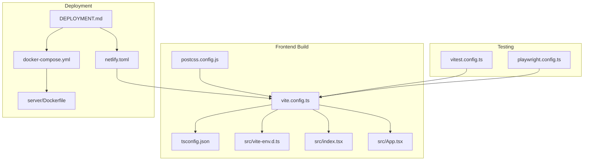
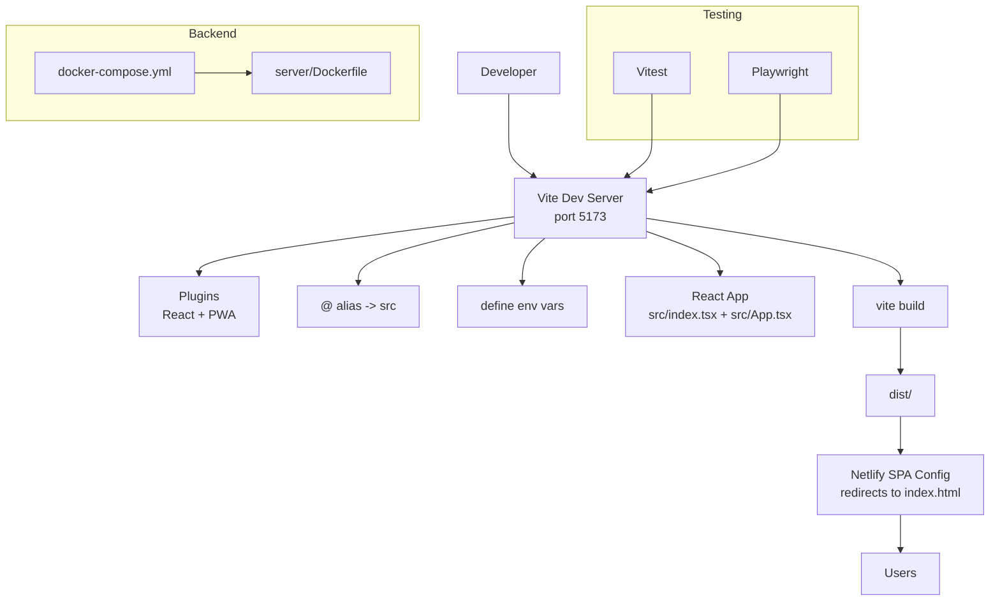
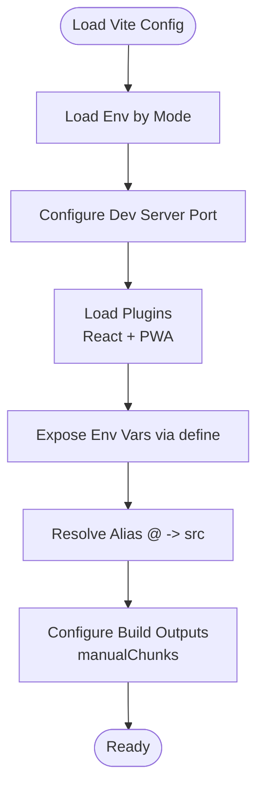
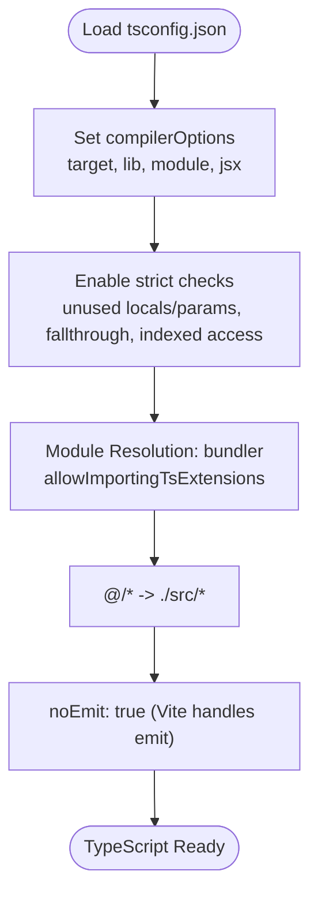
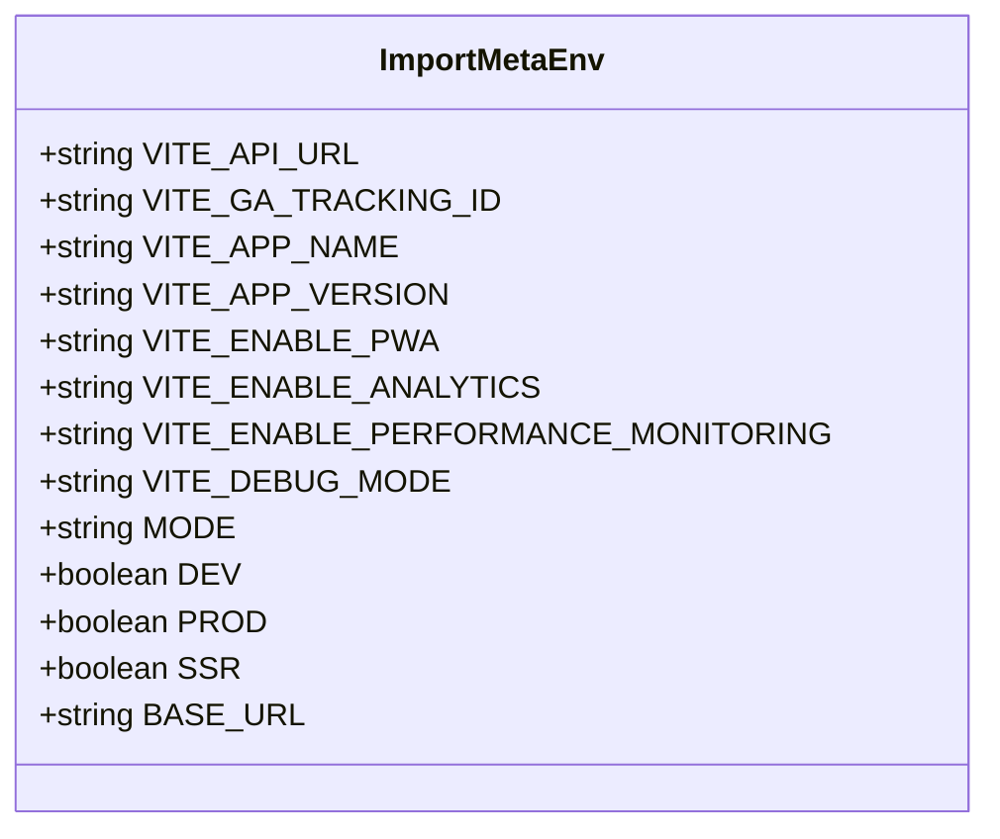
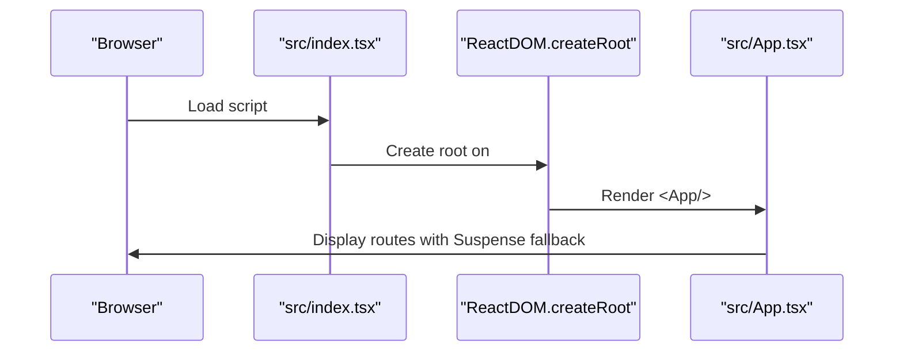
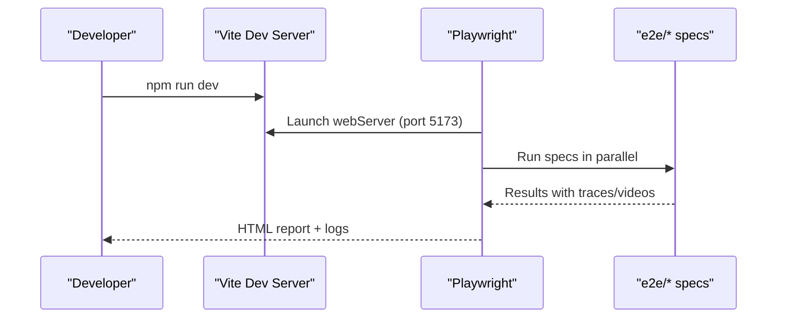
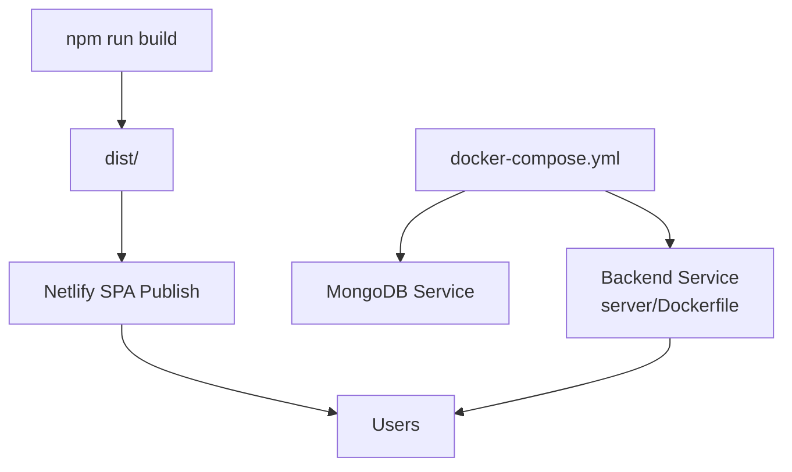
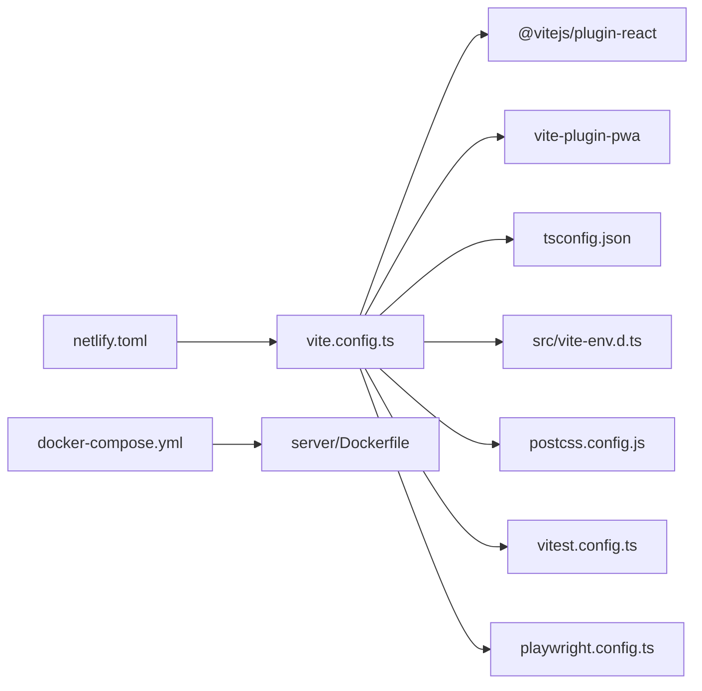

# Build Configuration

<cite>
**Referenced Files in This Document**
- [vite.config.ts](file://vite.config.ts)
- [tsconfig.json](file://tsconfig.json)
- [package.json](file://package.json)
- [postcss.config.js](file://postcss.config.js)
- [vitest.config.ts](file://vitest.config.ts)
- [playwright.config.ts](file://playwright.config.ts)
- [netlify.toml](file://netlify.toml)
- [src/vite-env.d.ts](file://src/vite-env.d.ts)
- [src/index.tsx](file://src/index.tsx)
- [src/App.tsx](file://src/App.tsx)
- [docker-compose.yml](file://docker-compose.yml)
- [server/Dockerfile](file://server/Dockerfile)
- [DEPLOYMENT.md](file://DEPLOYMENT.md)
</cite>

## Table of Contents
1. [Introduction](#introduction)
2. [Project Structure](#project-structure)
3. [Core Components](#core-components)
4. [Architecture Overview](#architecture-overview)
5. [Detailed Component Analysis](#detailed-component-analysis)
6. [Dependency Analysis](#dependency-analysis)
7. [Performance Considerations](#performance-considerations)
8. [Troubleshooting Guide](#troubleshooting-guide)
9. [Conclusion](#conclusion)
10. [Appendices](#appendices)

## Introduction
This document explains the Vite build configuration and TypeScript setup for the project. It covers Vite configuration options, plugin integrations, build optimization strategies, TypeScript compiler options, type checking, module resolution, environment-specific builds, asset handling, production optimizations, development server configuration, hot module replacement setup, debugging configurations, build performance optimization, bundle analysis, and deployment preparation. It also documents the integration between Vite, TypeScript, and React development workflows.

## Project Structure
The build system centers around Vite for the frontend, TypeScript for type safety, and optional tooling for testing and E2E verification. The repository includes:
- Vite configuration for development and build
- TypeScript configuration for strict type checking and module resolution
- PostCSS/Tailwind configuration for styling
- Vitest configuration for unit testing
- Playwright configuration for E2E testing
- Deployment configuration for Netlify and Docker Compose
- Environment variable typing for Vite

**Diagram sources**
- [vite.config.ts](file://vite.config.ts#L1-L115)
- [tsconfig.json](file://tsconfig.json#L1-L52)
- [src/vite-env.d.ts](file://src/vite-env.d.ts#L1-L44)
- [src/index.tsx](file://src/index.tsx#L1-L16)
- [src/App.tsx](file://src/App.tsx#L1-L134)
- [postcss.config.js](file://postcss.config.js#L1-L7)
- [vitest.config.ts](file://vitest.config.ts#L1-L31)
- [playwright.config.ts](file://playwright.config.ts#L1-L97)
- [netlify.toml](file://netlify.toml#L1-L19)
- [docker-compose.yml](file://docker-compose.yml#L1-L82)
- [server/Dockerfile](file://server/Dockerfile#L1-L72)
- [DEPLOYMENT.md](file://DEPLOYMENT.md#L1-L634)

**Section sources**
- [vite.config.ts](file://vite.config.ts#L1-L115)
- [tsconfig.json](file://tsconfig.json#L1-L52)
- [src/vite-env.d.ts](file://src/vite-env.d.ts#L1-L44)
- [src/index.tsx](file://src/index.tsx#L1-L16)
- [src/App.tsx](file://src/App.tsx#L1-L134)
- [postcss.config.js](file://postcss.config.js#L1-L7)
- [vitest.config.ts](file://vitest.config.ts#L1-L31)
- [playwright.config.ts](file://playwright.config.ts#L1-L97)
- [netlify.toml](file://netlify.toml#L1-L19)
- [docker-compose.yml](file://docker-compose.yml#L1-L82)
- [server/Dockerfile](file://server/Dockerfile#L1-L72)
- [DEPLOYMENT.md](file://DEPLOYMENT.md#L1-L634)

## Core Components
- Vite configuration defines the development server, plugins, aliases, build outputs, and environment variable exposure.
- TypeScript configuration enforces strict type checking, module resolution via bundler, and JSX transform.
- PostCSS/Tailwind configuration integrates CSS tooling.
- Vitest configuration sets up unit testing with jsdom and coverage.
- Playwright configuration orchestrates E2E tests against the Vite dev server.
- Netlify configuration publishes the built SPA to dist with redirects.
- Docker Compose and server Dockerfile prepare backend services for production.

**Section sources**
- [vite.config.ts](file://vite.config.ts#L6-L115)
- [tsconfig.json](file://tsconfig.json#L1-L52)
- [postcss.config.js](file://postcss.config.js#L1-L7)
- [vitest.config.ts](file://vitest.config.ts#L1-L31)
- [playwright.config.ts](file://playwright.config.ts#L1-L97)
- [netlify.toml](file://netlify.toml#L1-L19)
- [docker-compose.yml](file://docker-compose.yml#L1-L82)
- [server/Dockerfile](file://server/Dockerfile#L1-L72)

## Architecture Overview
The build and deployment pipeline integrates Vite, TypeScript, and React during development and production, with optional PWA caching and SPA routing handled by Netlify.

**Diagram sources**
- [vite.config.ts](file://vite.config.ts#L9-L115)
- [src/index.tsx](file://src/index.tsx#L1-L16)
- [src/App.tsx](file://src/App.tsx#L1-L134)
- [netlify.toml](file://netlify.toml#L1-L19)
- [playwright.config.ts](file://playwright.config.ts#L90-L95)
- [docker-compose.yml](file://docker-compose.yml#L1-L82)
- [server/Dockerfile](file://server/Dockerfile#L1-L72)

## Detailed Component Analysis

### Vite Configuration
Key aspects:
- Development server runs on port 5173.
- Plugin stack includes React Fast Refresh and PWA generation with Workbox runtime caching.
- Environment variables are exposed via define to the browser bundle.
- Path alias @ resolves to src for ergonomic imports.
- Build splits vendor chunks for React and UI libraries.

**Diagram sources**
- [vite.config.ts](file://vite.config.ts#L6-L115)

**Section sources**
- [vite.config.ts](file://vite.config.ts#L6-L115)

### TypeScript Configuration
Key aspects:
- Targets modern JS (ES2022), uses ESNext modules, DOM libs.
- Enforces strict type checking and unused code detection.
- Uses bundler module resolution for compatibility with Vite.
- Enables JSX transform for React and allows importing TS extensions.
- Includes path mapping @/* for cleaner imports.

**Diagram sources**
- [tsconfig.json](file://tsconfig.json#L1-L52)

**Section sources**
- [tsconfig.json](file://tsconfig.json#L1-L52)

### Environment Variable Typings
The project defines strongly typed environment variables for Vite, enabling compile-time safety for variables consumed at runtime.

**Diagram sources**
- [src/vite-env.d.ts](file://src/vite-env.d.ts#L8-L35)

**Section sources**
- [src/vite-env.d.ts](file://src/vite-env.d.ts#L1-L44)

### React Application Bootstrap
The React app mounts to the DOM and renders routes lazily with Suspense fallbacks. This complements Vite’s fast refresh and chunk splitting.

**Diagram sources**
- [src/index.tsx](file://src/index.tsx#L1-L16)
- [src/App.tsx](file://src/App.tsx#L82-L132)

**Section sources**
- [src/index.tsx](file://src/index.tsx#L1-L16)
- [src/App.tsx](file://src/App.tsx#L1-L134)

### Testing Configuration
- Vitest runs in jsdom with global setup and coverage reporting.
- Playwright launches the Vite dev server, navigates to the app, and executes cross-browser tests with tracing and video on failure.

**Diagram sources**
- [playwright.config.ts](file://playwright.config.ts#L90-L95)
- [playwright.config.ts](file://playwright.config.ts#L1-L97)

**Section sources**
- [vitest.config.ts](file://vitest.config.ts#L1-L31)
- [playwright.config.ts](file://playwright.config.ts#L1-L97)

### Deployment Configuration
- Netlify build command compiles the app and publishes dist with SPA redirects.
- Docker Compose provisions MongoDB, backend, and optional frontend service.
- Server Dockerfile uses multi-stage builds for production readiness.

**Diagram sources**
- [netlify.toml](file://netlify.toml#L1-L19)
- [docker-compose.yml](file://docker-compose.yml#L1-L82)
- [server/Dockerfile](file://server/Dockerfile#L1-L72)

**Section sources**
- [netlify.toml](file://netlify.toml#L1-L19)
- [docker-compose.yml](file://docker-compose.yml#L1-L82)
- [server/Dockerfile](file://server/Dockerfile#L1-L72)
- [DEPLOYMENT.md](file://DEPLOYMENT.md#L40-L137)

## Dependency Analysis
- Vite depends on React plugin and PWA plugin for HMR and offline caching.
- TypeScript configuration depends on bundler module resolution and JSX transform.
- Testing depends on Vite dev server lifecycle managed by Playwright.
- Deployment depends on Netlify SPA behavior and Docker Compose orchestration.

**Diagram sources**
- [vite.config.ts](file://vite.config.ts#L1-L115)
- [tsconfig.json](file://tsconfig.json#L1-L52)
- [src/vite-env.d.ts](file://src/vite-env.d.ts#L1-L44)
- [postcss.config.js](file://postcss.config.js#L1-L7)
- [vitest.config.ts](file://vitest.config.ts#L1-L31)
- [playwright.config.ts](file://playwright.config.ts#L1-L97)
- [netlify.toml](file://netlify.toml#L1-L19)
- [docker-compose.yml](file://docker-compose.yml#L1-L82)
- [server/Dockerfile](file://server/Dockerfile#L1-L72)

**Section sources**
- [vite.config.ts](file://vite.config.ts#L1-L115)
- [tsconfig.json](file://tsconfig.json#L1-L52)
- [src/vite-env.d.ts](file://src/vite-env.d.ts#L1-L44)
- [postcss.config.js](file://postcss.config.js#L1-L7)
- [vitest.config.ts](file://vitest.config.ts#L1-L31)
- [playwright.config.ts](file://playwright.config.ts#L1-L97)
- [netlify.toml](file://netlify.toml#L1-L19)
- [docker-compose.yml](file://docker-compose.yml#L1-L82)
- [server/Dockerfile](file://server/Dockerfile#L1-L72)

## Performance Considerations
- Manual chunking separates React and UI vendor bundles to improve caching and reduce initial payload.
- Source maps disabled in production to reduce bundle size.
- PWA runtime caching targets fonts, images, and API endpoints with appropriate expiration and cache names.
- Lazy loading of routes reduces initial JavaScript and improves perceived performance.
- Tailwind and autoprefixer optimize CSS delivery.

Recommendations:
- Use dynamic imports for heavy third-party libraries.
- Monitor bundle sizes with a visualizer plugin.
- Enable Treeshaking by avoiding side effects and using pure ES modules.
- Consider code-splitting strategies for feature routes.

**Section sources**
- [vite.config.ts](file://vite.config.ts#L102-L112)
- [vite.config.ts](file://vite.config.ts#L43-L87)
- [src/App.tsx](file://src/App.tsx#L12-L31)
- [postcss.config.js](file://postcss.config.js#L1-L7)

## Troubleshooting Guide
Common issues and resolutions:
- PWA caching conflicts: Verify Workbox runtime caching patterns and cache names align with asset URLs.
- Environment variables missing in browser: Confirm define entries and Vite env prefix naming.
- SPA routing errors on refresh: Ensure Netlify redirects to index.html for all routes.
- E2E flakiness: Increase timeouts and rely on Playwright’s trace collection.
- Docker health checks failing: Validate backend readiness endpoint and environment variables.

**Section sources**
- [vite.config.ts](file://vite.config.ts#L93-L96)
- [vite.config.ts](file://vite.config.ts#L88-L91)
- [netlify.toml](file://netlify.toml#L8-L11)
- [playwright.config.ts](file://playwright.config.ts#L10-L49)
- [server/Dockerfile](file://server/Dockerfile#L64-L65)

## Conclusion
The project’s build configuration leverages Vite for rapid development, TypeScript for robust type safety, and PWA caching for improved performance. Testing is integrated via Vitest and Playwright, while deployment is streamlined through Netlify and Docker Compose. The setup emphasizes modularity, performance, and maintainability.

## Appendices

### Environment-Specific Builds
- Development: Vite dev server on port 5173 with HMR and PWA dev disabled.
- Production: Vite build with vendor chunking, disabled source maps, and PWA precache manifest.

**Section sources**
- [vite.config.ts](file://vite.config.ts#L9-L11)
- [vite.config.ts](file://vite.config.ts#L102-L112)
- [vite.config.ts](file://vite.config.ts#L88-L91)

### Asset Handling and Caching
- PWA includes static assets and defines runtime caching strategies for fonts, images, and API traffic with cache expiration and cacheable responses.

**Section sources**
- [vite.config.ts](file://vite.config.ts#L14-L91)

### Development Server and HMR
- Dev server configured on port 5173; React plugin enables Fast Refresh; Playwright launches the dev server automatically for E2E tests.

**Section sources**
- [vite.config.ts](file://vite.config.ts#L9-L11)
- [playwright.config.ts](file://playwright.config.ts#L90-L95)

### Debugging Configurations
- Vitest uses jsdom environment and global setup; Playwright collects traces and videos on first retry for failures.

**Section sources**
- [vitest.config.ts](file://vitest.config.ts#L7-L24)
- [playwright.config.ts](file://playwright.config.ts#L37-L44)

### Build Performance Optimization and Bundle Analysis
- Manual chunking for vendor libraries; disabled source maps in production; lazy loading of routes; Tailwind and autoprefixer for optimized CSS.

**Section sources**
- [vite.config.ts](file://vite.config.ts#L106-L110)
- [vite.config.ts](file://vite.config.ts#L103-L104)
- [src/App.tsx](file://src/App.tsx#L12-L31)
- [postcss.config.js](file://postcss.config.js#L1-L7)

### Deployment Preparation
- Netlify build command and publish directory; SPA redirect rules; Docker Compose for backend and database; server Dockerfile multi-stage build.

**Section sources**
- [netlify.toml](file://netlify.toml#L1-L3)
- [netlify.toml](file://netlify.toml#L8-L11)
- [docker-compose.yml](file://docker-compose.yml#L1-L82)
- [server/Dockerfile](file://server/Dockerfile#L1-L72)
- [DEPLOYMENT.md](file://DEPLOYMENT.md#L40-L137)