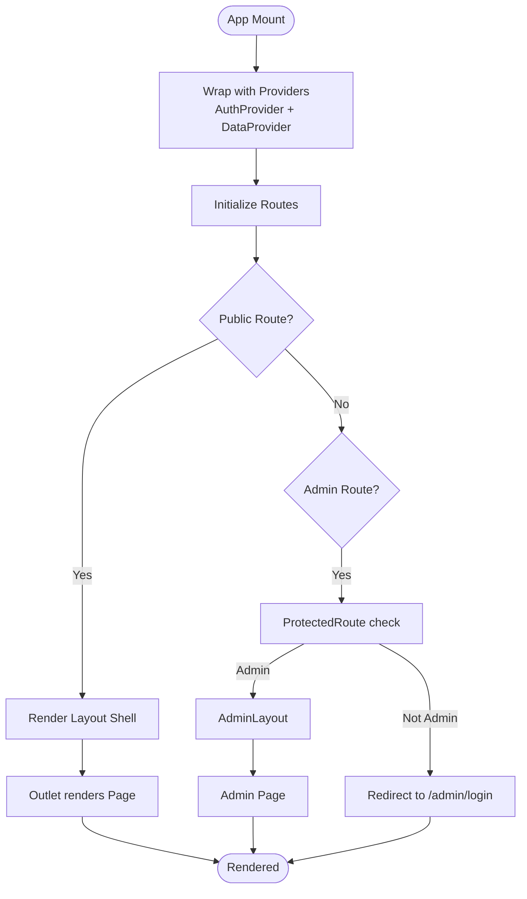

# Component Structure

<cite>
**Referenced Files in This Document**
- [App.tsx](file://src/App.tsx)
- [Layout.tsx](file://src/components/Layout.tsx)
- [OptimizedImage.tsx](file://src/components/OptimizedImage.tsx)
- [ErrorBoundary.tsx](file://src/components/ErrorBoundary.tsx)
- [CookieConsent.tsx](file://src/components/CookieConsent.tsx)
- [Home.tsx](file://src/pages/Home.tsx)
- [About.tsx](file://src/pages/About.tsx)
- [Services.tsx](file://src/pages/Services.tsx)
- [Contacts.tsx](file://src/pages/Contacts.tsx)
- [Education.tsx](file://src/pages/Education.tsx)
- [Veterans.tsx](file://src/pages/Veterans.tsx)
- [AuthContext.tsx](file://src/context/AuthContext.tsx)
- [DataContext.tsx](file://src/context/DataContext.tsx)
- [useAnalytics.ts](file://src/hooks/useAnalytics.ts)
</cite>

## Table of Contents
1. [Introduction](#introduction)
2. [Project Structure](#project-structure)
3. [Core Components](#core-components)
4. [Architecture Overview](#architecture-overview)
5. [Detailed Component Analysis](#detailed-component-analysis)
6. [Dependency Analysis](#dependency-analysis)
7. [Performance Considerations](#performance-considerations)
8. [Troubleshooting Guide](#troubleshooting-guide)
9. [Conclusion](#conclusion)

## Introduction
This document describes the React component architecture of the project, focusing on the hierarchical organization of reusable components, page components, and specialized components. It explains composition patterns, prop interfaces, TypeScript type definitions, lifecycle and rendering optimizations, performance characteristics, accessibility implementations, and data flow between components. The goal is to help developers understand how components fit together and how to extend or maintain the system effectively.

## Project Structure
The application is organized around a routing-driven layout with lazy-loaded pages, shared layouts, and reusable UI primitives. Context providers supply global state for authentication and content data. Analytics hooks integrate performance and page-view tracking.

**Diagram sources**
- [App.tsx](file://src/App.tsx#L82-L132)
- [Layout.tsx](file://src/components/Layout.tsx#L6-L284)
- [ErrorBoundary.tsx](file://src/components/ErrorBoundary.tsx#L15-L144)
- [CookieConsent.tsx](file://src/components/CookieConsent.tsx#L14-L156)
- [OptimizedImage.tsx](file://src/components/OptimizedImage.tsx#L15-L82)
- [Home.tsx](file://src/pages/Home.tsx#L7-L221)
- [Services.tsx](file://src/pages/Services.tsx#L7-L53)
- [AuthContext.tsx](file://src/context/AuthContext.tsx#L25-L187)
- [DataContext.tsx](file://src/context/DataContext.tsx#L35-L251)

**Section sources**
- [App.tsx](file://src/App.tsx#L1-L134)
- [Layout.tsx](file://src/components/Layout.tsx#L1-L284)

## Core Components
This section documents the reusable building blocks and their roles.

- ErrorBoundary
  - Purpose: Gracefully handles JavaScript errors in descendant components and renders a friendly fallback UI.
  - Lifecycle: Uses static getDerivedStateFromError and componentDidCatch to capture and log errors.
  - Accessibility: Provides buttons with aria-labels for resetting and navigating home.
  - Props: Accepts children and an optional fallback node.
  - Rendering: Conditionally renders fallback UI or children based on captured error state.

- CookieConsent
  - Purpose: GDPR-compliant cookie consent banner with acceptance options and customization.
  - Lifecycle: Uses useEffect to check consent and conditionally show banner after a small delay.
  - Accessibility: Uses icons and semantic markup; buttons support keyboard navigation.
  - Props: No props; manages internal state for visibility and customization view.

- OptimizedImage
  - Purpose: Image primitives optimized for lazy loading and responsive sources.
  - Interfaces:
    - OptimizedImage: Extends ImgHTMLAttributes with explicit props for src, alt, width, height, loading, className.
    - OptimizedPicture: Accepts src, alt, sources array, and dimensions.
  - Rendering: Renders img with async decoding and lazy loading; picture element with source variants.

- Layout
  - Purpose: Shared site shell with navigation, mobile menu, footer, back-to-top, and outlet for nested pages.
  - Lifecycle: Manages scroll position, back-to-top visibility, and toast notifications via useEffect and useState.
  - Accessibility: Uses NavLink for navigation; mobile menu toggles via aria-controls semantics; icons for visual cues.
  - Props: None; composes child pages via Outlet.

- PWAUpdatePrompt (specialized component)
  - Purpose: Prompts users to update the app when a new service worker is available.
  - Integration: Rendered at the top level alongside ErrorBoundary and contexts.

**Section sources**
- [ErrorBoundary.tsx](file://src/components/ErrorBoundary.tsx#L15-L144)
- [CookieConsent.tsx](file://src/components/CookieConsent.tsx#L14-L156)
- [OptimizedImage.tsx](file://src/components/OptimizedImage.tsx#L3-L82)
- [Layout.tsx](file://src/components/Layout.tsx#L6-L284)

## Architecture Overview
The application bootstraps with App, which sets up routing, lazy-loading, analytics, error boundary, and context providers. Layout wraps public pages and exposes an outlet for page-specific content. Contexts provide authentication and data to pages and components.

**Diagram sources**
- [App.tsx](file://src/App.tsx#L82-L132)
- [Layout.tsx](file://src/components/Layout.tsx#L166-L168)
- [AuthContext.tsx](file://src/context/AuthContext.tsx#L25-L187)
- [DataContext.tsx](file://src/context/DataContext.tsx#L35-L251)

## Detailed Component Analysis

### App Routing and Composition
- Routing
  - Public website routes under "/" use Layout as a shell and lazy-load page components.
  - Admin routes are separate, protected by a ProtectedRoute guard that checks admin status.
  - Fallback loading UI is shown during lazy-load suspense.
- Providers
  - ErrorBoundary wraps the entire app.
  - DataProvider supplies content and CRUD helpers.
  - AuthProvider supplies authentication state and token refresh logic.
  - AnalyticsWrapper initializes analytics and tracks page views.
- Navigation
  - ScrollToTop resets scroll position on route changes.
  - ProtectedRoute redirects unauthenticated admins to login.

**Diagram sources**
- [App.tsx](file://src/App.tsx#L82-L132)

**Section sources**
- [App.tsx](file://src/App.tsx#L1-L134)

### Layout Component
- Responsibilities
  - Header with logo, desktop/mobile navigation, and action button.
  - Footer with links, services, and contact info.
  - Back-to-top button controlled by scroll position.
  - Toast notifications for user feedback.
- State and Effects
  - Tracks mobile menu open state, back-to-top visibility, and toast messages.
  - Adds scroll listener to toggle back-to-top visibility.
- Composition
  - Uses NAV_LINKS and COMPANY_INFO constants.
  - Exposes Outlet for nested pages.

**Diagram sources**
- [Layout.tsx](file://src/components/Layout.tsx#L6-L284)

**Section sources**
- [Layout.tsx](file://src/components/Layout.tsx#L1-L284)

### Reusable Components

#### ErrorBoundary
- Behavior
  - Captures errors via getDerivedStateFromError and logs via componentDidCatch.
  - Provides reset and go-home actions.
  - Shows development details inside a collapsible section.
- Accessibility
  - Buttons include aria-labels for screen readers.

**Diagram sources**
- [ErrorBoundary.tsx](file://src/components/ErrorBoundary.tsx#L25-L60)

**Section sources**
- [ErrorBoundary.tsx](file://src/components/ErrorBoundary.tsx#L1-L144)

#### CookieConsent
- Behavior
  - Checks consent on mount; conditionally displays banner after a short delay.
  - Handles accept-all, accept-essential, and customize flows.
- Accessibility
  - Uses icons and readable labels; supports keyboard navigation.

**Diagram sources**
- [CookieConsent.tsx](file://src/components/CookieConsent.tsx#L18-L42)

**Section sources**
- [CookieConsent.tsx](file://src/components/CookieConsent.tsx#L1-L156)

#### OptimizedImage
- Behavior
  - OptimizedImage applies lazy loading and async decoding.
  - OptimizedPicture composes multiple sources for responsive images.
- Props
  - Strictly typed props for images and picture elements.

**Diagram sources**
- [OptimizedImage.tsx](file://src/components/OptimizedImage.tsx#L15-L82)

**Section sources**
- [OptimizedImage.tsx](file://src/components/OptimizedImage.tsx#L1-L82)

### Page Components

#### Home
- Composition
  - Uses Section for content blocks.
  - Consumes services and news from DataContext via useData.
  - Integrates OptimizedImage for hero backgrounds.
- Accessibility
  - Semantic headings and links; focusable interactive elements.

**Diagram sources**
- [Home.tsx](file://src/pages/Home.tsx#L7-L221)
- [DataContext.tsx](file://src/context/DataContext.tsx#L253-L259)

**Section sources**
- [Home.tsx](file://src/pages/Home.tsx#L1-L221)
- [DataContext.tsx](file://src/context/DataContext.tsx#L1-L259)

#### Services
- Composition
  - Lists services with icons and details.
  - Links to contacts pre-filled with service subject.
- Data Flow
  - Reads services from DataContext.

**Section sources**
- [Services.tsx](file://src/pages/Services.tsx#L1-L53)
- [DataContext.tsx](file://src/context/DataContext.tsx#L1-L259)

#### Contacts
- Composition
  - Contact form with validation, submission flow, and success state.
  - Integrates addInquiry from DataContext to persist inquiries.
  - Displays FAQ from DataContext.
- Accessibility
  - Proper labels, error hints, and focus styles.
  - Success overlay with clear next steps.

**Diagram sources**
- [Contacts.tsx](file://src/pages/Contacts.tsx#L76-L117)
- [DataContext.tsx](file://src/context/DataContext.tsx#L189-L204)

**Section sources**
- [Contacts.tsx](file://src/pages/Contacts.tsx#L1-L369)
- [DataContext.tsx](file://src/context/DataContext.tsx#L1-L259)

#### Education
- Composition
  - Event schedule and downloadable materials.
- Accessibility
  - Semantic lists and buttons with clear labels.

**Section sources**
- [Education.tsx](file://src/pages/Education.tsx#L1-L101)

#### Veterans
- Composition
  - Program overview and application form with success state.
- Accessibility
  - Ordered steps and labeled inputs.

**Section sources**
- [Veterans.tsx](file://src/pages/Veterans.tsx#L1-L130)

### Contexts and Hooks

#### DataContext
- Responsibilities
  - Loads public content (services, team, news, FAQ).
  - Provides CRUD operations for admin-managed content.
  - Supports protected data loading with bearer tokens.
- Data Types
  - Uses types ServiceItem, TeamMember, NewsItem, FAQItem, Client, Inquiry.

**Diagram sources**
- [DataContext.tsx](file://src/context/DataContext.tsx#L5-L251)

**Section sources**
- [DataContext.tsx](file://src/context/DataContext.tsx#L1-L259)

#### AuthContext
- Responsibilities
  - Manages user session, login/logout, and token refresh.
  - Sets axios defaults and interceptors for automatic token refresh.
- Security
  - Stores tokens in localStorage; clears on logout; refreshes token on 401.

**Diagram sources**
- [AuthContext.tsx](file://src/context/AuthContext.tsx#L54-L114)

**Section sources**
- [AuthContext.tsx](file://src/context/AuthContext.tsx#L1-L187)

#### useAnalytics Hook
- Responsibilities
  - Initializes analytics and performance monitoring on mount.
  - Tracks page views on route changes.
  - Provides scroll depth and time-on-page tracking utilities.

**Section sources**
- [useAnalytics.ts](file://src/hooks/useAnalytics.ts#L9-L72)

## Dependency Analysis
- Component Coupling
  - App composes Layout and lazy-loaded pages; Layout composes pages via Outlet.
  - Pages depend on DataContext and sometimes OptimizedImage.
  - Contacts depends on DataContext for form submission and FAQ display.
  - AuthContext is consumed by ProtectedRoute and used throughout admin pages.
- External Dependencies
  - react-router-dom for routing and navigation.
  - lucide-react for icons.
  - axios for API communication.
- Potential Circular Dependencies
  - None observed among the analyzed files; contexts are imported at the top-level App.

**Diagram sources**
- [App.tsx](file://src/App.tsx#L82-L132)
- [Layout.tsx](file://src/components/Layout.tsx#L6-L284)
- [Home.tsx](file://src/pages/Home.tsx#L1-L221)
- [Services.tsx](file://src/pages/Services.tsx#L1-L53)
- [Contacts.tsx](file://src/pages/Contacts.tsx#L1-L369)
- [OptimizedImage.tsx](file://src/components/OptimizedImage.tsx#L1-L82)
- [AuthContext.tsx](file://src/context/AuthContext.tsx#L1-L187)
- [DataContext.tsx](file://src/context/DataContext.tsx#L1-L259)

**Section sources**
- [App.tsx](file://src/App.tsx#L1-L134)
- [AuthContext.tsx](file://src/context/AuthContext.tsx#L1-L187)
- [DataContext.tsx](file://src/context/DataContext.tsx#L1-L259)

## Performance Considerations
- Lazy Loading
  - Pages and admin pages are lazy-loaded to reduce initial bundle size.
- Suspense
  - Fallback loading UI improves perceived performance during lazy loads.
- Image Optimization
  - OptimizedImage applies lazy loading and async decoding.
  - OptimizedPicture supports responsive sources for efficient bandwidth usage.
- Analytics and Monitoring
  - useAnalytics initializes performance monitoring and tracks page views.
  - Scroll and time-on-page tracking hooks enable performance insights.
- Context Data Fetching
  - DataContext loads initial data in parallel using Promise.all.
- Token Management
  - AuthContext uses interceptors to automatically refresh tokens and retry requests, reducing UI-level error handling overhead.

[No sources needed since this section provides general guidance]

## Troubleshooting Guide
- ErrorBoundary
  - Use the reset and go-home buttons to recover from runtime errors.
  - In development, inspect the collapsible error details panel for stack traces.
- Authentication
  - If redirected to login, ensure tokens are present and valid; AuthContext will clear invalid tokens and retry refresh.
  - On 401 responses, AuthContext retries with a refreshed token; persistent failures indicate logout and re-authentication.
- Data Loading
  - DataContext sets loading state during initial fetch; verify network tab for API responses.
  - Protected data requires a valid bearer token; confirm AuthContext is initialized and tokens are stored.
- Forms
  - Contacts form validates input and clears per-field errors on change; ensure required fields meet regex criteria.
  - After submission, the success overlay indicates successful creation; mailto link opens the user’s email client.

**Section sources**
- [ErrorBoundary.tsx](file://src/components/ErrorBoundary.tsx#L62-L139)
- [AuthContext.tsx](file://src/context/AuthContext.tsx#L93-L163)
- [DataContext.tsx](file://src/context/DataContext.tsx#L44-L87)
- [Contacts.tsx](file://src/pages/Contacts.tsx#L32-L127)

## Conclusion
The component architecture emphasizes separation of concerns: a robust App shell with routing and providers, a reusable Layout for consistent navigation and footer, and specialized page components that consume context for data and authentication. Reusable components like ErrorBoundary, CookieConsent, and OptimizedImage encapsulate cross-cutting concerns and improve maintainability. The use of lazy loading, Suspense, and context-based data fetching ensures good performance and scalability. Accessibility is considered through semantic markup, icons, and keyboard-friendly controls.