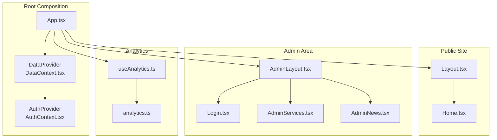
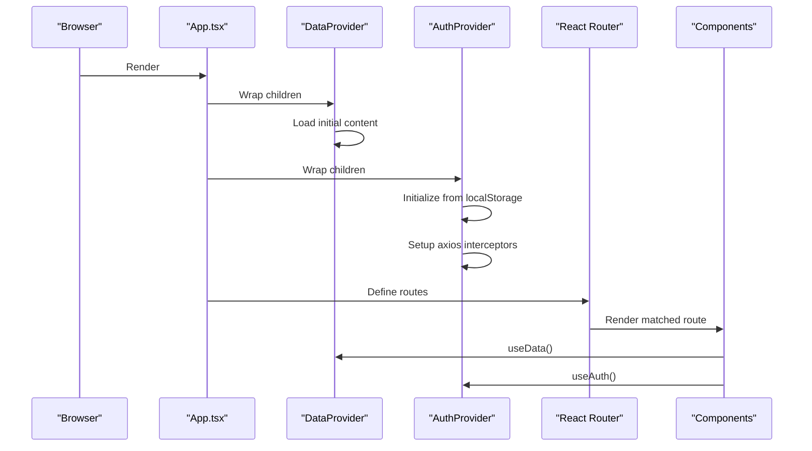
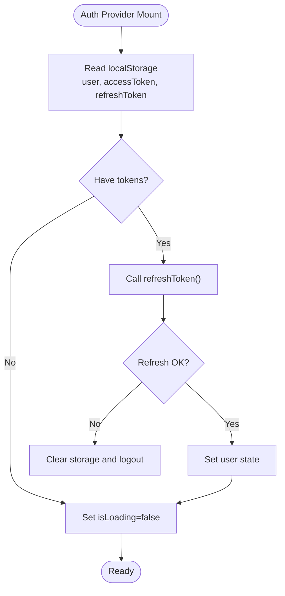
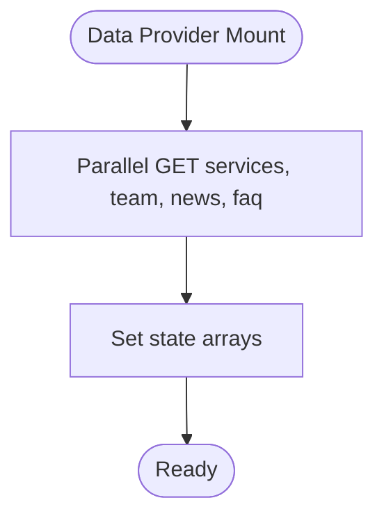
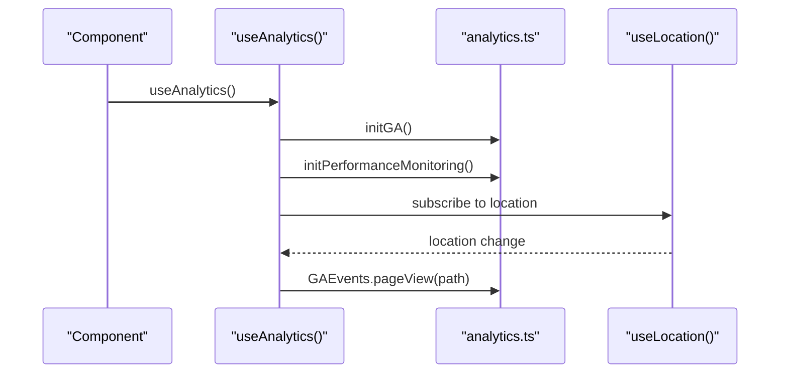
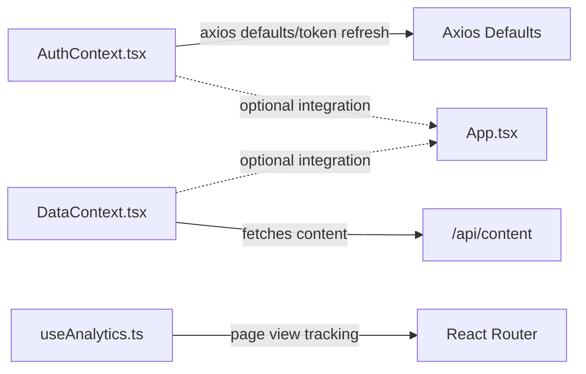
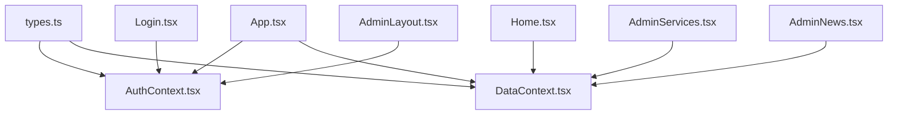

# Context System

<cite>
**Referenced Files in This Document**
- [App.tsx](file://src/App.tsx)
- [AuthContext.tsx](file://src/context/AuthContext.tsx)
- [DataContext.tsx](file://src/context/DataContext.tsx)
- [useAnalytics.ts](file://src/hooks/useAnalytics.ts)
- [analytics.ts](file://src/utils/analytics.ts)
- [types.ts](file://src/types.ts)
- [Login.tsx](file://src/pages/admin/Login.tsx)
- [AdminLayout.tsx](file://src/pages/admin/AdminLayout.tsx)
- [AdminServices.tsx](file://src/pages/admin/AdminServices.tsx)
- [AdminNews.tsx](file://src/pages/admin/AdminNews.tsx)
- [Home.tsx](file://src/pages/Home.tsx)
- [Layout.tsx](file://src/components/Layout.tsx)
- [constants.tsx](file://src/constants.tsx)
</cite>

## Table of Contents
1. [Introduction](#introduction)
2. [Project Structure](#project-structure)
3. [Core Components](#core-components)
4. [Architecture Overview](#architecture-overview)
5. [Detailed Component Analysis](#detailed-component-analysis)
6. [Dependency Analysis](#dependency-analysis)
7. [Performance Considerations](#performance-considerations)
8. [Troubleshooting Guide](#troubleshooting-guide)
9. [Conclusion](#conclusion)
10. [Appendices](#appendices)

## Introduction
This document explains the React Context system used in the application, focusing on three primary contexts:
- Authentication context for user state and session lifecycle
- Data context for content and administrative CRUD operations
- Analytics hooks for tracking page views, engagement, and performance

It covers provider composition, consumer patterns, hook implementations, state update mechanisms, subscription behavior, performance optimization through context splitting, best practices, common pitfalls, debugging strategies, and migration guidance for context changes.

## Project Structure
The application composes contexts at the root level and exposes typed hooks to components. Providers wrap routing and layout layers, enabling global state sharing across the UI.

**Diagram sources**
- [App.tsx](file://src/App.tsx#L82-L132)
- [DataContext.tsx](file://src/context/DataContext.tsx#L35-L251)
- [AuthContext.tsx](file://src/context/AuthContext.tsx#L25-L179)
- [useAnalytics.ts](file://src/hooks/useAnalytics.ts#L9-L25)
- [analytics.ts](file://src/utils/analytics.ts#L16-L37)

**Section sources**
- [App.tsx](file://src/App.tsx#L82-L132)

## Core Components
- Authentication Context
  - Provides user profile, admin flag, loading state, login, logout, and token refresh
  - Initializes from localStorage and sets up axios interceptors for automatic token refresh
  - Exposes a typed hook to consume context safely

- Data Context
  - Manages lists of services, team, news, FAQ, clients, and inquiries
  - Offers CRUD operations for content and protected data retrieval
  - Loads initial data on mount and exposes a loading state

- Analytics Hooks
  - Initializes Google Analytics and performance monitoring
  - Tracks page views on route changes and supports scroll depth/time-on-page tracking

**Section sources**
- [AuthContext.tsx](file://src/context/AuthContext.tsx#L11-L187)
- [DataContext.tsx](file://src/context/DataContext.tsx#L5-L259)
- [useAnalytics.ts](file://src/hooks/useAnalytics.ts#L9-L71)
- [analytics.ts](file://src/utils/analytics.ts#L16-L165)

## Architecture Overview
The app composes providers around routing and layout. Authentication wraps Data, ensuring admin-protected routes can rely on both user state and content data.

**Diagram sources**
- [App.tsx](file://src/App.tsx#L82-L132)
- [DataContext.tsx](file://src/context/DataContext.tsx#L44-L68)
- [AuthContext.tsx](file://src/context/AuthContext.tsx#L30-L52)
- [AuthContext.tsx](file://src/context/AuthContext.tsx#L117-L163)

## Detailed Component Analysis

### Authentication Context
- Purpose: Centralize user session, roles, and token lifecycle
- Initialization: Reads user and tokens from localStorage; validates and refreshes tokens automatically
- Interceptors: Adds Authorization header and handles 401 with token refresh
- Exposed methods: login, logout, refreshToken
- Hook safety: Throws if used outside provider

**Diagram sources**
- [AuthContext.tsx](file://src/context/AuthContext.tsx#L30-L52)
- [AuthContext.tsx](file://src/context/AuthContext.tsx#L93-L114)

**Section sources**
- [AuthContext.tsx](file://src/context/AuthContext.tsx#L25-L179)

### Data Context
- Purpose: Manage content entities and administrative operations
- Initialization: Parallel fetch of services, team, news, and FAQ
- Protected data: Loads clients and inquiries when provided a token
- Operations: Update/add/delete for services, team, news, FAQ, clients; add inquiry with computed date/status
- Hook safety: Throws if used outside provider

**Diagram sources**
- [DataContext.tsx](file://src/context/DataContext.tsx#L44-L68)

**Section sources**
- [DataContext.tsx](file://src/context/DataContext.tsx#L35-L259)

### Analytics Hooks and Utilities
- Initialization: Loads gtag script and initializes dataLayer
- Tracking: Page views on route changes; scroll depth and time-on-page helpers
- Utilities: Type-safe event tracking and common event groups

**Diagram sources**
- [useAnalytics.ts](file://src/hooks/useAnalytics.ts#L9-L25)
- [analytics.ts](file://src/utils/analytics.ts#L16-L37)

**Section sources**
- [useAnalytics.ts](file://src/hooks/useAnalytics.ts#L9-L71)
- [analytics.ts](file://src/utils/analytics.ts#L16-L165)

### Consumer Patterns and Hook Implementations
- App-level composition: Providers wrap router and analytics wrapper
- Protected routes: Use useAuth to guard admin area
- Public site: useData to render services and news
- Admin CRUD: useData to update/add/delete content

Examples by file:
- App composition and protection: [App.tsx](file://src/App.tsx#L82-L132)
- Protected route logic: [App.tsx](file://src/App.tsx#L54-L74)
- Login form consuming useAuth: [Login.tsx](file://src/pages/admin/Login.tsx#L11-L39)
- Admin layout consuming useAuth: [AdminLayout.tsx](file://src/pages/admin/AdminLayout.tsx#L7-L13)
- Public home consuming useData: [Home.tsx](file://src/pages/Home.tsx#L5-L8)
- Admin services editing with useData: [AdminServices.tsx](file://src/pages/admin/AdminServices.tsx#L7-L34)
- Admin news CRUD with useData: [AdminNews.tsx](file://src/pages/admin/AdminNews.tsx#L9-L56)

**Section sources**
- [App.tsx](file://src/App.tsx#L54-L132)
- [Login.tsx](file://src/pages/admin/Login.tsx#L11-L39)
- [AdminLayout.tsx](file://src/pages/admin/AdminLayout.tsx#L7-L13)
- [Home.tsx](file://src/pages/Home.tsx#L5-L8)
- [AdminServices.tsx](file://src/pages/admin/AdminServices.tsx#L7-L34)
- [AdminNews.tsx](file://src/pages/admin/AdminNews.tsx#L9-L56)

### State Update Mechanisms and Subscription Patterns
- Authentication updates:
  - login: stores tokens and user, sets state
  - logout: clears tokens and user, calls backend logout
  - refreshToken: updates localStorage and axios defaults
  - Interceptor-driven retry on 401
- Data updates:
  - CRUD functions update local state immutably
  - Protected data loaded via token-provided requests
- Subscription:
  - Components subscribe via useAuth/useData/useAnalytics
  - Updates re-render affected subtrees

**Section sources**
- [AuthContext.tsx](file://src/context/AuthContext.tsx#L54-L114)
- [AuthContext.tsx](file://src/context/AuthContext.tsx#L117-L163)
- [DataContext.tsx](file://src/context/DataContext.tsx#L89-L234)

### Relationship Between Contexts
- DataContext depends on network availability and does not depend on AuthContext
- AuthContext manages tokens and axios defaults; it can be used independently
- App.tsx composes both contexts so admin routes can rely on both user state and content data
- Analytics hooks are independent of contexts but integrated at the app root

**Diagram sources**
- [AuthContext.tsx](file://src/context/AuthContext.tsx#L117-L163)
- [DataContext.tsx](file://src/context/DataContext.tsx#L44-L68)
- [useAnalytics.ts](file://src/hooks/useAnalytics.ts#L9-L25)
- [App.tsx](file://src/App.tsx#L82-L132)

## Dependency Analysis
- Providers are composed in App.tsx with DataProvider wrapping AuthProvider
- Components import and consume hooks from their respective contexts
- Types define shared shapes for content and auth models

**Diagram sources**
- [types.ts](file://src/types.ts#L10-L67)
- [AuthContext.tsx](file://src/context/AuthContext.tsx#L11-L18)
- [DataContext.tsx](file://src/context/DataContext.tsx#L2-L3)
- [App.tsx](file://src/App.tsx#L8-L10)
- [Login.tsx](file://src/pages/admin/Login.tsx#L2-L2)
- [AdminLayout.tsx](file://src/pages/admin/AdminLayout.tsx#L4-L4)
- [Home.tsx](file://src/pages/Home.tsx#L5-L5)
- [AdminServices.tsx](file://src/pages/admin/AdminServices.tsx#L2-L4)
- [AdminNews.tsx](file://src/pages/admin/AdminNews.tsx#L2-L4)

**Section sources**
- [types.ts](file://src/types.ts#L10-L67)
- [App.tsx](file://src/App.tsx#L8-L10)

## Performance Considerations
- Context splitting: Keep Auth and Data contexts separate to minimize unnecessary re-renders when only one is accessed
- Provider order: Place DataProvider outermost so public pages can consume content without auth overhead
- Axios caching: Consider adding caching strategies for repeated queries if needed
- Lazy loading: App already uses lazy-loaded routes; keep this pattern for heavy admin pages
- Avoid excessive subscribers: Prefer granular hooks per component rather than subscribing to entire contexts in leaf components

[No sources needed since this section provides general guidance]

## Troubleshooting Guide
Common issues and resolutions:
- Using hooks outside providers
  - Symptom: Error indicating hook must be used within a provider
  - Fix: Ensure the provider wraps the component tree
  - Reference: [AuthContext.tsx](file://src/context/AuthContext.tsx#L181-L187), [DataContext.tsx](file://src/context/DataContext.tsx#L253-L259)

- Authentication loops or stale state
  - Symptom: Infinite redirects or stale admin flag
  - Fix: Verify localStorage tokens; ensure interceptor retry logic is intact
  - Reference: [AuthContext.tsx](file://src/context/AuthContext.tsx#L136-L163)

- Axios unauthorized errors
  - Symptom: 401 responses despite login
  - Fix: Confirm Authorization header is set; verify token refresh flow
  - Reference: [AuthContext.tsx](file://src/context/AuthContext.tsx#L124-L133), [AuthContext.tsx](file://src/context/AuthContext.tsx#L136-L157)

- Content not loading in admin
  - Symptom: Empty lists or loading state stuck
  - Fix: Check network tab; confirm API endpoints and CORS
  - Reference: [DataContext.tsx](file://src/context/DataContext.tsx#L44-L68)

- Analytics not reporting
  - Symptom: No page views or events
  - Fix: Verify tracking ID env var and gtag initialization
  - Reference: [analytics.ts](file://src/utils/analytics.ts#L13-L37), [useAnalytics.ts](file://src/hooks/useAnalytics.ts#L12-L18)

**Section sources**
- [AuthContext.tsx](file://src/context/AuthContext.tsx#L181-L187)
- [DataContext.tsx](file://src/context/DataContext.tsx#L253-L259)
- [AuthContext.tsx](file://src/context/AuthContext.tsx#L124-L163)
- [DataContext.tsx](file://src/context/DataContext.tsx#L44-L68)
- [analytics.ts](file://src/utils/analytics.ts#L13-L37)
- [useAnalytics.ts](file://src/hooks/useAnalytics.ts#L12-L18)

## Conclusion
The application’s context system cleanly separates concerns:
- AuthContext manages identity and tokens
- DataContext centralizes content and admin operations
- Analytics hooks integrate tracking at the app root

Adopting context splitting, careful provider composition, and typed hooks ensures maintainable, performant, and debuggable state management.

[No sources needed since this section summarizes without analyzing specific files]

## Appendices

### Best Practices for Context Consumption
- Always wrap the app with providers at the root
- Use typed hooks and guard against missing providers
- Keep contexts focused and avoid cross-contextrual coupling
- Prefer small, single-responsibility contexts for scalability

[No sources needed since this section provides general guidance]

### Migration Strategies for Context Changes
- Introduce new context alongside existing ones; gradually migrate consumers
- Use feature flags to toggle new vs legacy flows during rollout
- Maintain backward compatibility in exposed APIs until migration completes
- Thoroughly test protected routes and analytics after changes

[No sources needed since this section provides general guidance]