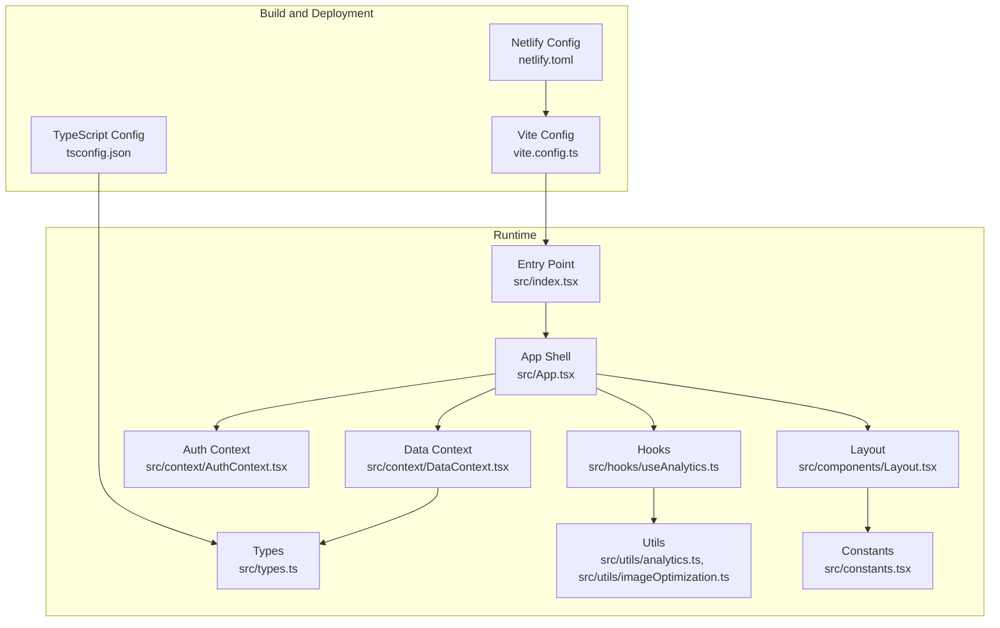
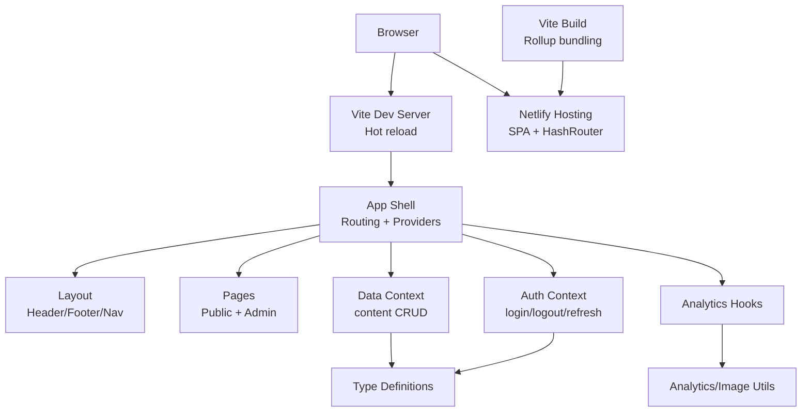
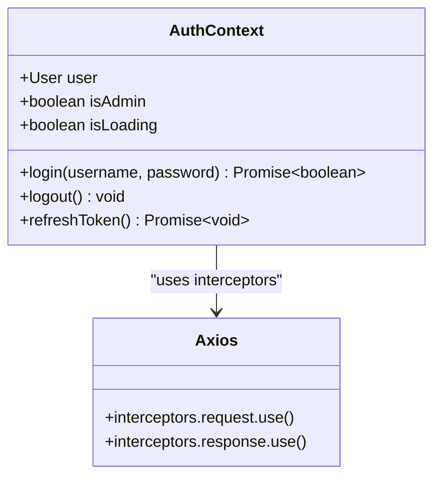
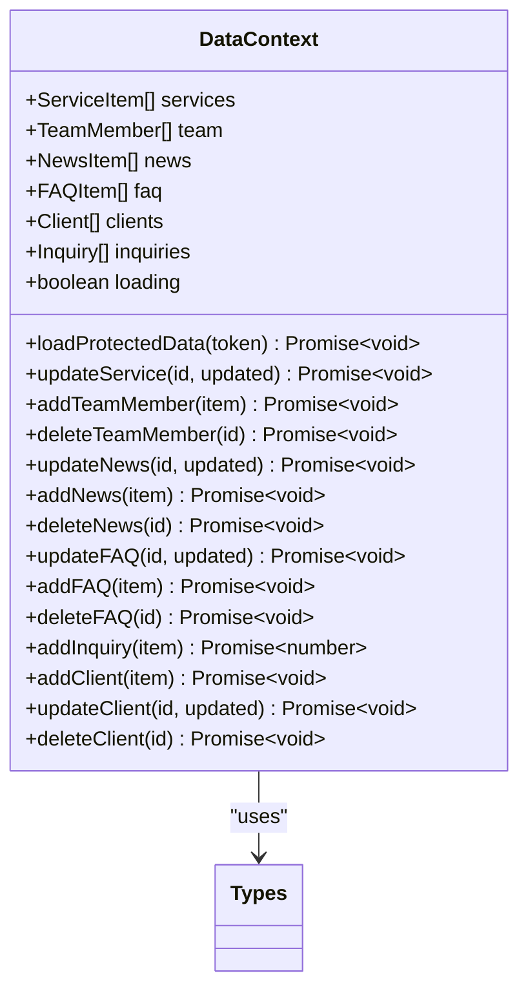
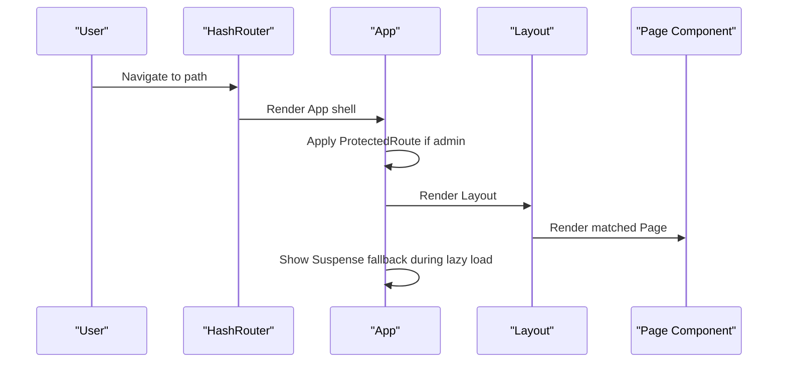
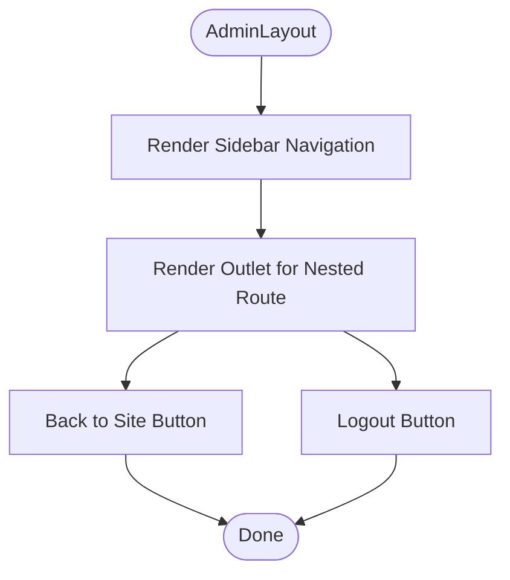
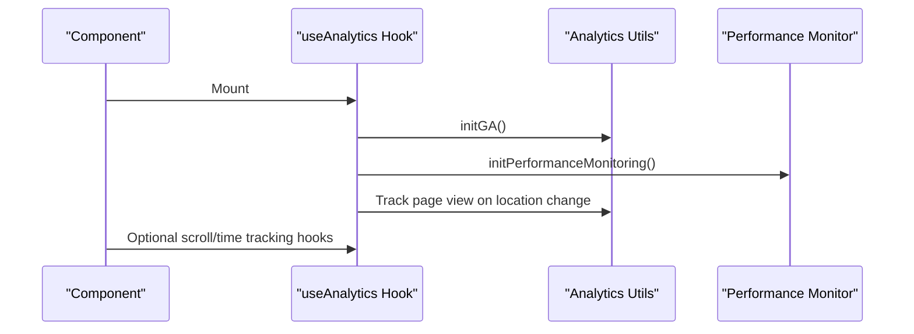
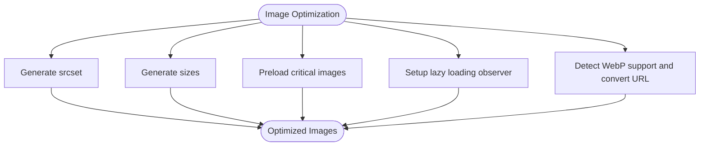
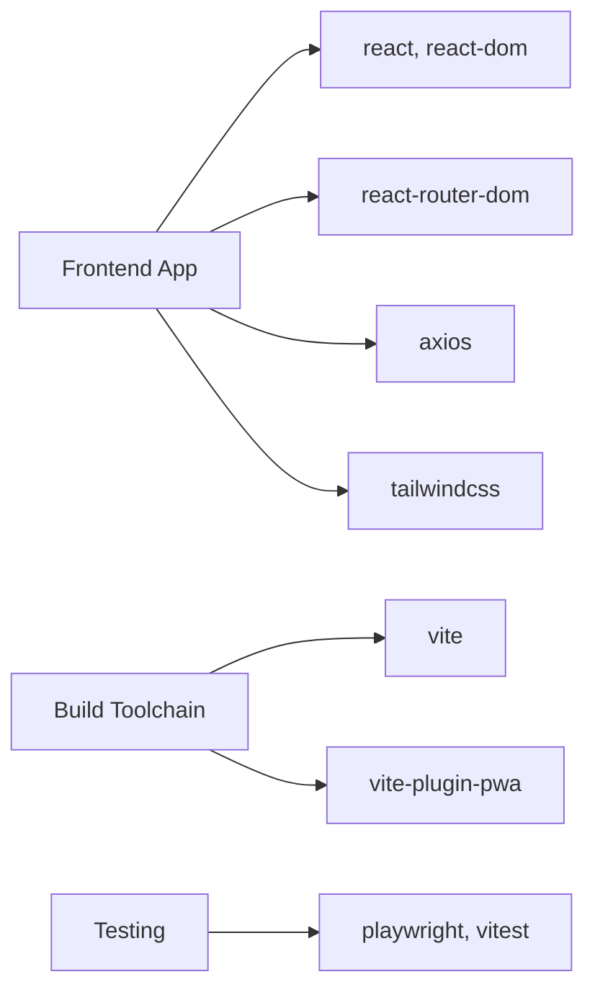

# Frontend Architecture

<cite>
**Referenced Files in This Document**
- [package.json](file://package.json)
- [vite.config.ts](file://vite.config.ts)
- [netlify.toml](file://netlify.toml)
- [tsconfig.json](file://tsconfig.json)
- [src/index.tsx](file://src/index.tsx)
- [src/App.tsx](file://src/App.tsx)
- [src/context/AuthContext.tsx](file://src/context/AuthContext.tsx)
- [src/context/DataContext.tsx](file://src/context/DataContext.tsx)
- [src/types.ts](file://src/types.ts)
- [src/components/Layout.tsx](file://src/components/Layout.tsx)
- [src/pages/Home.tsx](file://src/pages/Home.tsx)
- [src/pages/admin/AdminLayout.tsx](file://src/pages/admin/AdminLayout.tsx)
- [src/utils/analytics.ts](file://src/utils/analytics.ts)
- [src/hooks/useAnalytics.ts](file://src/hooks/useAnalytics.ts)
- [src/utils/imageOptimization.ts](file://src/utils/imageOptimization.ts)
- [src/constants.tsx](file://src/constants.tsx)
</cite>

## Table of Contents
1. [Introduction](#introduction)
2. [Project Structure](#project-structure)
3. [Core Components](#core-components)
4. [Architecture Overview](#architecture-overview)
5. [Detailed Component Analysis](#detailed-component-analysis)
6. [Dependency Analysis](#dependency-analysis)
7. [Performance Considerations](#performance-considerations)
8. [Troubleshooting Guide](#troubleshooting-guide)
9. [Conclusion](#conclusion)
10. [Appendices](#appendices)

## Introduction
This document describes the frontend architecture for a React 19 + TypeScript application built with Vite, styled with Tailwind CSS, and configured for Netlify hosting using HashRouter. It covers component organization, React Context patterns for authentication and data management, the TypeScript type system, build configuration and optimization, API integration, environment configuration, and deployment considerations. Accessibility and performance are addressed throughout.

## Project Structure
The frontend is organized into feature-based directories with clear separation of concerns:
- src/components: Reusable UI components (layout, sections, images, PWA prompt, error boundary)
- src/pages: Page-level components (public website and admin panels)
- src/context: React Context providers for authentication and data
- src/hooks: Custom hooks (analytics, performance monitoring)
- src/utils: Utilities for analytics, image optimization, and performance monitoring
- src/constants: Shared constants and static data
- src/types: Centralized TypeScript type definitions
- Build and deployment: Vite configuration, Netlify configuration, and TypeScript compiler options

**Diagram sources**
- [vite.config.ts](file://vite.config.ts#L1-L115)
- [netlify.toml](file://netlify.toml#L1-L19)
- [tsconfig.json](file://tsconfig.json#L1-L52)
- [src/index.tsx](file://src/index.tsx#L1-L16)
- [src/App.tsx](file://src/App.tsx#L1-L134)
- [src/components/Layout.tsx](file://src/components/Layout.tsx#L1-L284)
- [src/context/AuthContext.tsx](file://src/context/AuthContext.tsx#L1-L187)
- [src/context/DataContext.tsx](file://src/context/DataContext.tsx#L1-L259)
- [src/types.ts](file://src/types.ts#L1-L149)
- [src/hooks/useAnalytics.ts](file://src/hooks/useAnalytics.ts#L1-L72)
- [src/utils/analytics.ts](file://src/utils/analytics.ts#L1-L172)
- [src/utils/imageOptimization.ts](file://src/utils/imageOptimization.ts#L1-L95)
- [src/constants.tsx](file://src/constants.tsx#L1-L156)

**Section sources**
- [package.json](file://package.json#L1-L68)
- [vite.config.ts](file://vite.config.ts#L1-L115)
- [netlify.toml](file://netlify.toml#L1-L19)
- [tsconfig.json](file://tsconfig.json#L1-L52)

## Core Components
- App shell orchestrates routing, lazy-loaded pages, Suspense fallbacks, analytics, error boundaries, and PWA update prompts.
- Layout composes header, navigation, footer, mobile menu, toast notifications, and back-to-top behavior.
- AuthContext manages user session, token lifecycle, and axios interceptors for automatic refresh and authorization.
- DataContext centralizes content CRUD operations and protected data loading with typed APIs.
- Custom hooks integrate analytics and performance monitoring.
- Utilities encapsulate image optimization and analytics initialization.

Key implementation patterns:
- Lazy loading for routes and admin pages to reduce initial bundle size.
- HashRouter for Netlify static hosting compatibility.
- React Context providers layered around the app for global state.
- Strongly typed models for API payloads and forms.

**Section sources**
- [src/App.tsx](file://src/App.tsx#L1-L134)
- [src/components/Layout.tsx](file://src/components/Layout.tsx#L1-L284)
- [src/context/AuthContext.tsx](file://src/context/AuthContext.tsx#L1-L187)
- [src/context/DataContext.tsx](file://src/context/DataContext.tsx#L1-L259)
- [src/hooks/useAnalytics.ts](file://src/hooks/useAnalytics.ts#L1-L72)
- [src/utils/analytics.ts](file://src/utils/analytics.ts#L1-L172)
- [src/utils/imageOptimization.ts](file://src/utils/imageOptimization.ts#L1-L95)
- [src/types.ts](file://src/types.ts#L1-L149)

## Architecture Overview
The frontend follows a layered architecture:
- Presentation layer: App, Layout, pages, and reusable components
- State management: AuthContext and DataContext
- Data access: Axios with interceptors and typed endpoints
- Analytics and performance: Custom hooks and utilities
- Build and deployment: Vite bundling, PWA caching, and Netlify redirects

**Diagram sources**
- [src/App.tsx](file://src/App.tsx#L1-L134)
- [src/components/Layout.tsx](file://src/components/Layout.tsx#L1-L284)
- [src/context/AuthContext.tsx](file://src/context/AuthContext.tsx#L1-L187)
- [src/context/DataContext.tsx](file://src/context/DataContext.tsx#L1-L259)
- [src/hooks/useAnalytics.ts](file://src/hooks/useAnalytics.ts#L1-L72)
- [src/utils/analytics.ts](file://src/utils/analytics.ts#L1-L172)
- [vite.config.ts](file://vite.config.ts#L1-L115)
- [netlify.toml](file://netlify.toml#L1-L19)

## Detailed Component Analysis

### Authentication Context
AuthContext provides:
- User state and admin role detection
- Login, logout, and refresh token flows
- Axios interceptors for request authorization and automatic token refresh
- LocalStorage persistence for tokens and user profile

**Diagram sources**
- [src/context/AuthContext.tsx](file://src/context/AuthContext.tsx#L1-L187)

**Section sources**
- [src/context/AuthContext.tsx](file://src/context/AuthContext.tsx#L1-L187)

### Data Context
DataContext manages:
- Initial content loading (services, team, news, FAQ)
- Protected data loading for admin panel (clients, inquiries)
- CRUD operations for content entities with typed requests/responses
- Loading state coordination

**Diagram sources**
- [src/context/DataContext.tsx](file://src/context/DataContext.tsx#L1-L259)
- [src/types.ts](file://src/types.ts#L1-L149)

**Section sources**
- [src/context/DataContext.tsx](file://src/context/DataContext.tsx#L1-L259)
- [src/types.ts](file://src/types.ts#L1-L149)

### Routing and Navigation
The App sets up:
- HashRouter for SPA on Netlify
- Lazy-loaded routes for public pages and admin sections
- ProtectedRoute guard for admin area
- Scroll-to-top behavior and loading fallbacks
- Error boundary and PWA update prompt integration

**Diagram sources**
- [src/App.tsx](file://src/App.tsx#L1-L134)
- [src/components/Layout.tsx](file://src/components/Layout.tsx#L1-L284)

**Section sources**
- [src/App.tsx](file://src/App.tsx#L1-L134)
- [src/components/Layout.tsx](file://src/components/Layout.tsx#L1-L284)

### Admin Layout Composition
AdminLayout provides:
- Sidebar navigation for admin sections
- User info and logout handling
- Outlet for nested admin pages
- Navigation back to public site

**Diagram sources**
- [src/pages/admin/AdminLayout.tsx](file://src/pages/admin/AdminLayout.tsx#L1-L90)

**Section sources**
- [src/pages/admin/AdminLayout.tsx](file://src/pages/admin/AdminLayout.tsx#L1-L90)

### Analytics and Performance Hooks
Custom hooks integrate:
- Google Analytics initialization and page/event tracking
- Scroll depth and time-on-page tracking
- Performance monitoring initialization

**Diagram sources**
- [src/hooks/useAnalytics.ts](file://src/hooks/useAnalytics.ts#L1-L72)
- [src/utils/analytics.ts](file://src/utils/analytics.ts#L1-L172)

**Section sources**
- [src/hooks/useAnalytics.ts](file://src/hooks/useAnalytics.ts#L1-L72)
- [src/utils/analytics.ts](file://src/utils/analytics.ts#L1-L172)

### Image Optimization Utilities
Utilities support:
- Responsive image generation (srcset, sizes)
- Critical image preloading
- Lazy loading with IntersectionObserver
- WebP format detection and conversion

**Diagram sources**
- [src/utils/imageOptimization.ts](file://src/utils/imageOptimization.ts#L1-L95)

**Section sources**
- [src/utils/imageOptimization.ts](file://src/utils/imageOptimization.ts#L1-L95)

## Dependency Analysis
External dependencies and roles:
- React 19 and React Router Dom 7.x for UI and routing
- Axios for HTTP requests with interceptors
- Tailwind CSS v4 for styling
- Vite 6 for build tooling and dev server
- VitePWA plugin for offline caching and PWA features
- Playwright and Vitest for testing

**Diagram sources**
- [package.json](file://package.json#L27-L52)

**Section sources**
- [package.json](file://package.json#L1-L68)

## Performance Considerations
- Code splitting: Routes and admin pages are lazy-loaded to minimize initial payload.
- Vendor chunking: React and UI libraries are separated into dedicated chunks.
- Asset caching: Workbox runtime caching for fonts, images, and API responses with sensible TTLs.
- Source maps: Disabled in production builds to reduce bundle size.
- Image optimization: Utilities for responsive images, lazy loading, and WebP conversion.
- Analytics overhead: GA initialized conditionally and events tracked efficiently.

Recommendations:
- Monitor bundle size with Vite’s built-in analyzer.
- Consider CDN for static assets and external fonts.
- Implement skeleton loaders for content areas to improve perceived performance.

**Section sources**
- [vite.config.ts](file://vite.config.ts#L102-L115)
- [src/utils/imageOptimization.ts](file://src/utils/imageOptimization.ts#L1-L95)

## Troubleshooting Guide
Common issues and resolutions:
- Authentication failures: Verify API base URL and token refresh logic; check interceptors and local storage state.
- API errors: Inspect axios interceptors and ensure Authorization header is set; confirm backend CORS and rate limiting.
- Routing problems on Netlify: Confirm HashRouter usage and redirects to index.html.
- Build errors: Validate Vite and TypeScript configurations; ensure module resolution paths match aliases.
- Analytics not reporting: Check tracking ID environment variable and script loading order.

**Section sources**
- [src/context/AuthContext.tsx](file://src/context/AuthContext.tsx#L22-L163)
- [src/App.tsx](file://src/App.tsx#L82-L131)
- [netlify.toml](file://netlify.toml#L8-L11)
- [vite.config.ts](file://vite.config.ts#L6-L115)
- [tsconfig.json](file://tsconfig.json#L21-L25)

## Conclusion
The frontend leverages modern tooling and patterns to deliver a fast, maintainable, and accessible React application. HashRouter ensures compatibility with Netlify hosting, while Vite and PWA plugins optimize performance and user experience. Strong typing, Context providers, and utility modules contribute to a robust and scalable architecture.

## Appendices

### Environment Variables and API Integration
- API base URL is resolved from environment variables and used consistently across contexts.
- Admin routes require authenticated sessions; protected data requires bearer tokens.
- Analytics tracking ID is loaded from environment variables.

**Section sources**
- [src/context/AuthContext.tsx](file://src/context/AuthContext.tsx#L22-L23)
- [src/context/DataContext.tsx](file://src/context/DataContext.tsx#L32-L33)
- [src/utils/analytics.ts](file://src/utils/analytics.ts#L13-L13)

### TypeScript Type System Implementation
- Centralized types for navigation, content entities, forms, media, and API responses.
- Utility types for optionality and pagination.
- Strict compiler options enforced for reliability.

**Section sources**
- [src/types.ts](file://src/types.ts#L1-L149)
- [tsconfig.json](file://tsconfig.json#L29-L47)

### Build and Deployment Configuration
- Vite configuration defines aliases, plugins, PWA manifest, Workbox caching, and chunk splitting.
- Netlify configuration builds the app and serves SPA with HashRouter-compatible redirects.
- Aliases enable clean imports using the @ prefix.

**Section sources**
- [vite.config.ts](file://vite.config.ts#L6-L115)
- [netlify.toml](file://netlify.toml#L1-L19)
- [tsconfig.json](file://tsconfig.json#L21-L25)