# Routing and Navigation

<cite>
**Referenced Files in This Document**
- [App.tsx](file://src/App.tsx)
- [index.tsx](file://src/index.tsx)
- [Layout.tsx](file://src/components/Layout.tsx)
- [AdminLayout.tsx](file://src/pages/admin/AdminLayout.tsx)
- [AuthContext.tsx](file://src/context/AuthContext.tsx)
- [Login.tsx](file://src/pages/admin/Login.tsx)
- [Register.tsx](file://src/pages/admin/Register.tsx)
- [constants.tsx](file://src/constants.tsx)
- [netlify.toml](file://netlify.toml)
- [sitemap.xml](file://public/sitemap.xml)
- [useAnalytics.ts](file://src/hooks/useAnalytics.ts)
- [analytics.ts](file://src/utils/analytics.ts)
- [performanceMonitoring.ts](file://src/utils/performanceMonitoring.ts)
</cite>

## Table of Contents
1. [Introduction](#introduction)
2. [Project Structure](#project-structure)
3. [Core Components](#core-components)
4. [Architecture Overview](#architecture-overview)
5. [Detailed Component Analysis](#detailed-component-analysis)
6. [Dependency Analysis](#dependency-analysis)
7. [Performance Considerations](#performance-considerations)
8. [Troubleshooting Guide](#troubleshooting-guide)
9. [Conclusion](#conclusion)
10. [Appendices](#appendices)

## Introduction
This document explains the routing and navigation system of the application, focusing on:
- HashRouter configuration for Netlify compatibility
- Route definitions for the public website and admin panel
- Protected routes and authentication-based navigation guards
- Programmatic navigation, route parameters, query strings, and navigation state
- Responsive navigation components and footer links
- SEO-friendly routing and sitemap generation
- Performance optimization via lazy loading and analytics
- Error handling in routing scenarios

## Project Structure
The routing system is centered around a single-page application built with React Router and configured for Netlify’s static hosting model. The application mounts at the root and renders nested routes inside a shared layout for the public site and an admin shell for administrative features.

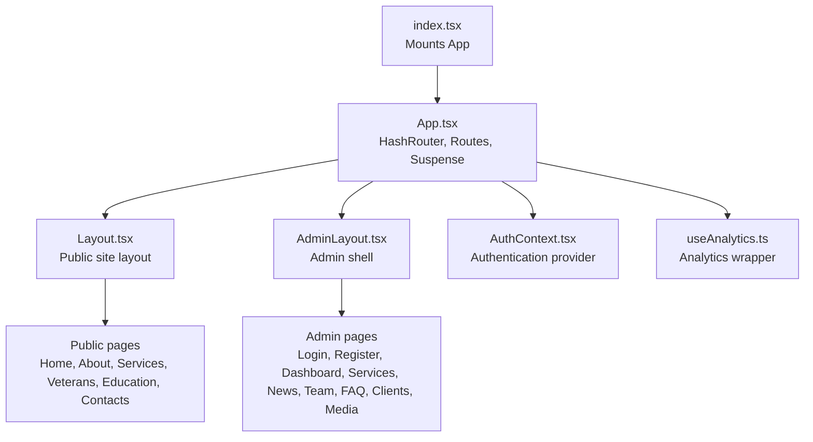

**Diagram sources**
- [index.tsx](file://src/index.tsx#L1-L16)
- [App.tsx](file://src/App.tsx#L82-L132)
- [Layout.tsx](file://src/components/Layout.tsx#L6-L282)
- [AdminLayout.tsx](file://src/pages/admin/AdminLayout.tsx#L6-L89)
- [AuthContext.tsx](file://src/context/AuthContext.tsx#L25-L187)
- [useAnalytics.ts](file://src/hooks/useAnalytics.ts#L9-L25)

**Section sources**
- [index.tsx](file://src/index.tsx#L1-L16)
- [App.tsx](file://src/App.tsx#L82-L132)

## Core Components
- HashRouter: The application uses HashRouter to enable client-side routing with hash-based URLs suitable for static hosts like Netlify.
- Routes: Public routes under the Layout shell and admin routes under an admin shell with protected routes.
- ProtectedRoute: A route wrapper that checks authentication state and redirects unauthenticated users to the login page.
- Lazy loading: Pages are dynamically imported to improve initial load performance.
- Scroll restoration: A ScrollToTop component resets scroll position on route changes.
- Analytics: A wrapper initializes analytics and tracks page views on route changes.

**Section sources**
- [App.tsx](file://src/App.tsx#L82-L132)
- [App.tsx](file://src/App.tsx#L44-L52)
- [App.tsx](file://src/App.tsx#L54-L74)
- [useAnalytics.ts](file://src/hooks/useAnalytics.ts#L9-L25)

## Architecture Overview
The routing architecture separates public and admin sections. Public routes render inside a shared Layout that provides responsive navigation, mobile menu, and footer links. Admin routes are protected and rendered inside AdminLayout, which provides sidebar navigation and logout.

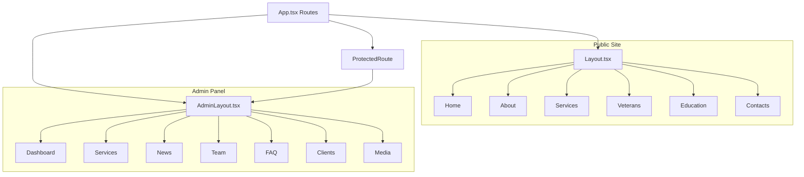

**Diagram sources**
- [App.tsx](file://src/App.tsx#L92-L124)
- [Layout.tsx](file://src/components/Layout.tsx#L104-L162)
- [AdminLayout.tsx](file://src/pages/admin/AdminLayout.tsx#L19-L77)
- [AuthContext.tsx](file://src/context/AuthContext.tsx#L165-L172)

## Detailed Component Analysis

### HashRouter and Netlify Compatibility
- The application uses HashRouter so that all client-side routes are prefixed with a hash (#). This ensures deep linking works correctly on static hosts like Netlify without server-side rewrite conflicts.
- Netlify configuration enforces a catch-all redirect to index.html for SPA support, which complements HashRouter behavior.

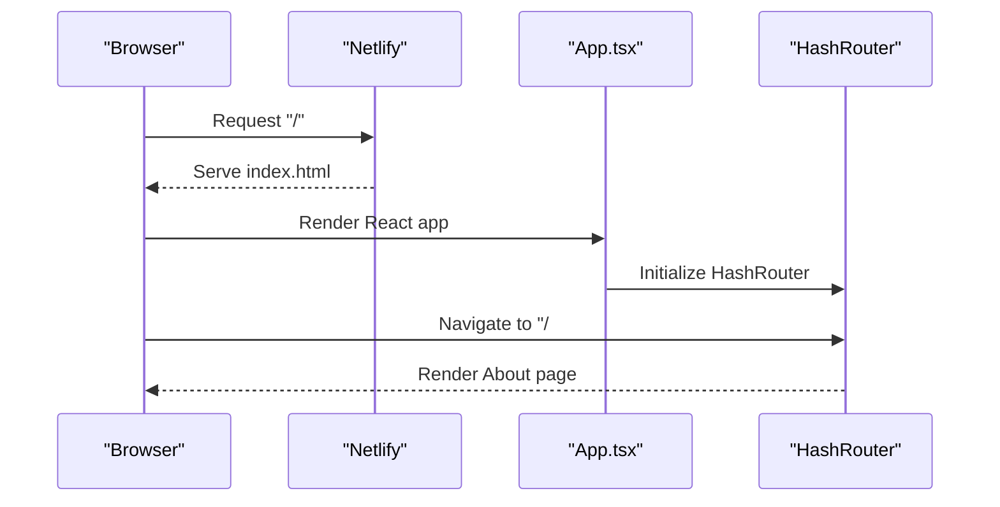

**Diagram sources**
- [App.tsx](file://src/App.tsx#L87-L87)
- [netlify.toml](file://netlify.toml#L8-L11)

**Section sources**
- [App.tsx](file://src/App.tsx#L87-L87)
- [netlify.toml](file://netlify.toml#L8-L11)

### Route Definitions and Navigation Patterns
- Public routes are defined under the Layout shell. Index route renders the home page; other routes render dedicated pages.
- Admin routes include login, registration, password reset, and a redirect to the dashboard. The admin shell protects nested routes via a ProtectedRoute wrapper.
- Catch-all route redirects unknown paths to the home page.

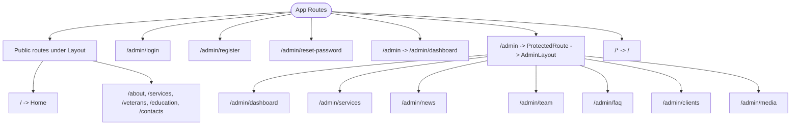

**Diagram sources**
- [App.tsx](file://src/App.tsx#L92-L124)

**Section sources**
- [App.tsx](file://src/App.tsx#L92-L124)

### Protected Routes and Authentication Guards
- ProtectedRoute checks authentication state and role. While loading, it displays a spinner; if not authenticated or not an admin, it navigates to the login page.
- AuthContext manages user state, tokens, and axios interceptors for automatic token refresh and request authorization.

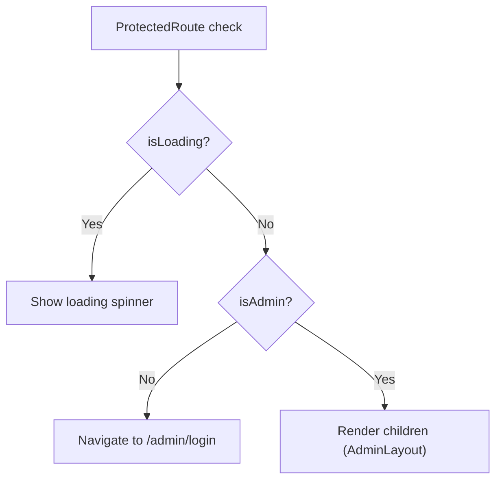

**Diagram sources**
- [App.tsx](file://src/App.tsx#L54-L74)
- [AuthContext.tsx](file://src/context/AuthContext.tsx#L25-L52)
- [AuthContext.tsx](file://src/context/AuthContext.tsx#L165-L172)

**Section sources**
- [App.tsx](file://src/App.tsx#L54-L74)
- [AuthContext.tsx](file://src/context/AuthContext.tsx#L25-L52)
- [AuthContext.tsx](file://src/context/AuthContext.tsx#L165-L172)

### Programmatic Navigation, Parameters, Query Strings, and State
- Programmatic navigation is used in several places:
  - AdminLayout uses navigation hooks to log out and return to the public site.
  - Login page redirects upon successful authentication.
  - Register page redirects after successful registration.
- Route parameters and query strings are not currently used in the codebase; navigation relies on path-based routing and programmatic navigate calls.
- Navigation state is not explicitly managed beyond redirects and route guards.

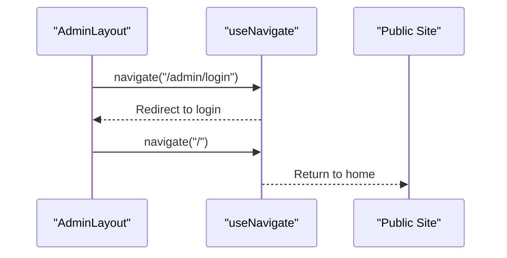

**Diagram sources**
- [AdminLayout.tsx](file://src/pages/admin/AdminLayout.tsx#L10-L17)

**Section sources**
- [AdminLayout.tsx](file://src/pages/admin/AdminLayout.tsx#L10-L17)
- [Login.tsx](file://src/pages/admin/Login.tsx#L14-L39)
- [Register.tsx](file://src/pages/admin/Register.tsx#L74-L78)

### Responsive Navigation Components and Footer Links
- Layout.tsx defines responsive navigation:
  - Desktop navigation bar with active state styling.
  - Mobile hamburger menu with animated open/close behavior.
  - Footer links mirror the main navigation and include an admin login link.
- NAV_LINKS constant centralizes navigation items for reuse across components.

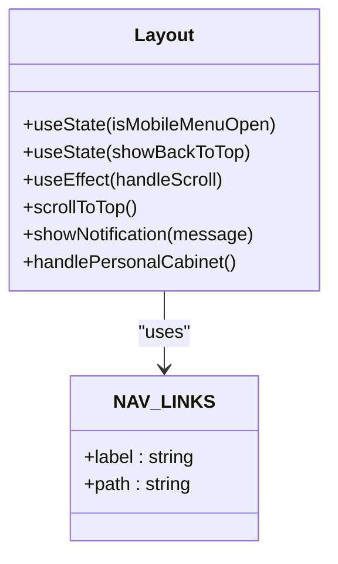

**Diagram sources**
- [Layout.tsx](file://src/components/Layout.tsx#L6-L282)
- [constants.tsx](file://src/constants.tsx#L26-L33)

**Section sources**
- [Layout.tsx](file://src/components/Layout.tsx#L104-L162)
- [Layout.tsx](file://src/components/Layout.tsx#L222-L231)
- [constants.tsx](file://src/constants.tsx#L26-L33)

### SEO-Friendly Routing and Sitemap
- The sitemap lists public routes with hash-based fragments to align with HashRouter. This helps search engines crawl SPA content.
- Netlify configuration ensures all routes fall back to index.html, supporting hash-based navigation.

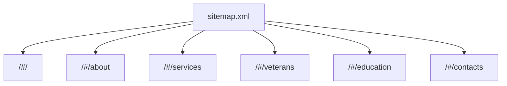

**Diagram sources**
- [sitemap.xml](file://public/sitemap.xml#L7-L53)
- [netlify.toml](file://netlify.toml#L8-L11)

**Section sources**
- [sitemap.xml](file://public/sitemap.xml#L7-L53)
- [netlify.toml](file://netlify.toml#L8-L11)

### Authentication-Based Navigation Guards
- AuthContext provides login, logout, and token refresh mechanisms. Axios interceptors automatically attach Authorization headers and refresh tokens on 401 responses.
- ProtectedRoute leverages AuthContext to enforce admin-only access.

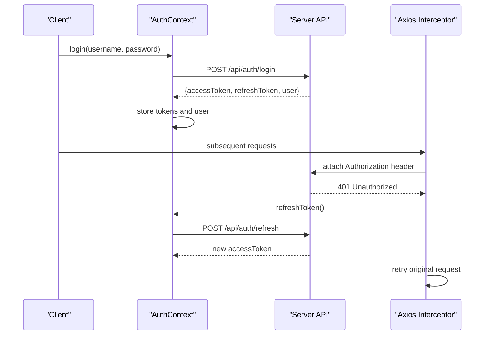

**Diagram sources**
- [AuthContext.tsx](file://src/context/AuthContext.tsx#L54-L76)
- [AuthContext.tsx](file://src/context/AuthContext.tsx#L93-L114)
- [AuthContext.tsx](file://src/context/AuthContext.tsx#L136-L156)

**Section sources**
- [AuthContext.tsx](file://src/context/AuthContext.tsx#L54-L76)
- [AuthContext.tsx](file://src/context/AuthContext.tsx#L93-L114)
- [AuthContext.tsx](file://src/context/AuthContext.tsx#L136-L156)

### Admin Panel Routing Structure
- Admin routes include login, register, reset-password, and a redirect to the dashboard.
- AdminLayout provides sidebar navigation and logout. It also allows returning to the public site.

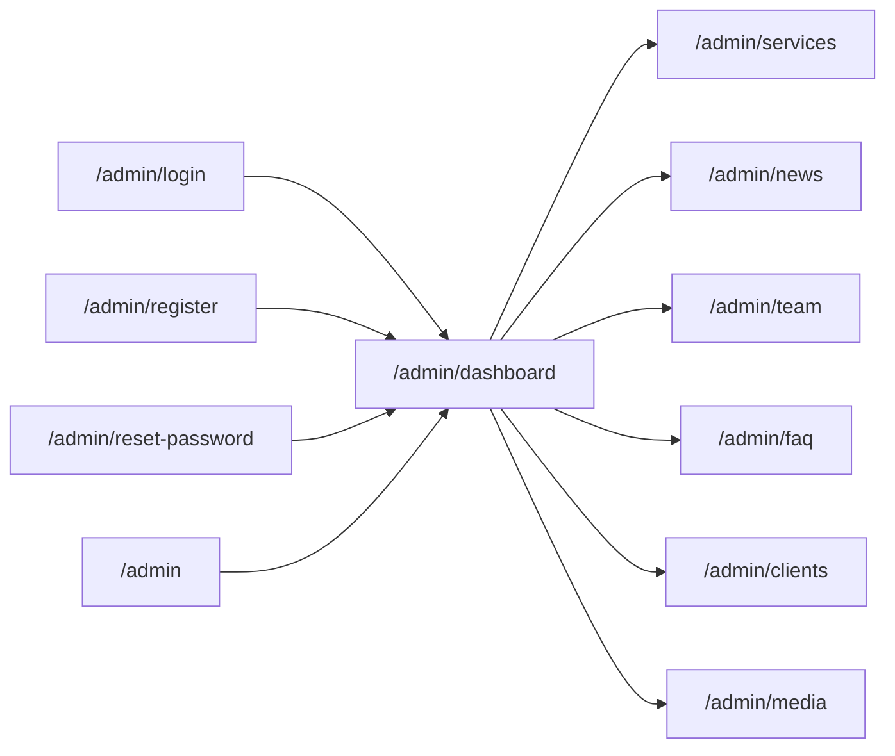

**Diagram sources**
- [App.tsx](file://src/App.tsx#L104-L121)
- [AdminLayout.tsx](file://src/pages/admin/AdminLayout.tsx#L19-L27)

**Section sources**
- [App.tsx](file://src/App.tsx#L104-L121)
- [AdminLayout.tsx](file://src/pages/admin/AdminLayout.tsx#L19-L27)

## Dependency Analysis
The routing system exhibits clear separation of concerns:
- App.tsx orchestrates routing, lazy loading, error boundaries, analytics, and scroll restoration.
- Layout.tsx encapsulates public navigation and footer links.
- AdminLayout.tsx encapsulates admin navigation and actions.
- AuthContext.tsx centralizes authentication state and HTTP interactions.
- useAnalytics.ts integrates analytics initialization and page view tracking.

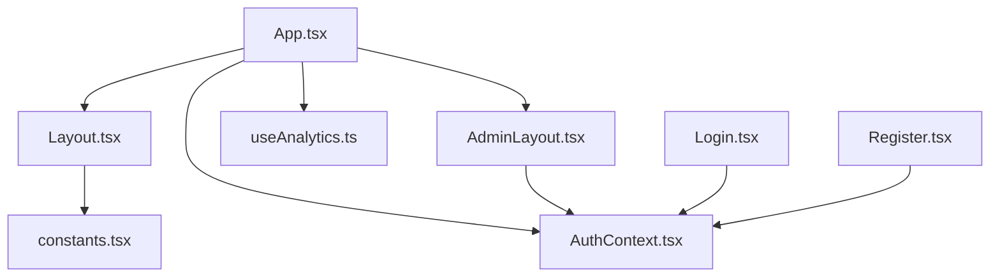

**Diagram sources**
- [App.tsx](file://src/App.tsx#L82-L132)
- [Layout.tsx](file://src/components/Layout.tsx#L6-L282)
- [AdminLayout.tsx](file://src/pages/admin/AdminLayout.tsx#L6-L89)
- [AuthContext.tsx](file://src/context/AuthContext.tsx#L25-L187)
- [useAnalytics.ts](file://src/hooks/useAnalytics.ts#L9-L25)
- [constants.tsx](file://src/constants.tsx#L26-L33)
- [Login.tsx](file://src/pages/admin/Login.tsx#L6-L12)
- [Register.tsx](file://src/pages/admin/Register.tsx#L6-L18)

**Section sources**
- [App.tsx](file://src/App.tsx#L82-L132)
- [Layout.tsx](file://src/components/Layout.tsx#L6-L282)
- [AdminLayout.tsx](file://src/pages/admin/AdminLayout.tsx#L6-L89)
- [AuthContext.tsx](file://src/context/AuthContext.tsx#L25-L187)
- [useAnalytics.ts](file://src/hooks/useAnalytics.ts#L9-L25)
- [constants.tsx](file://src/constants.tsx#L26-L33)
- [Login.tsx](file://src/pages/admin/Login.tsx#L6-L12)
- [Register.tsx](file://src/pages/admin/Register.tsx#L6-L18)

## Performance Considerations
- Lazy loading: Pages are dynamically imported to reduce initial bundle size and improve first paint.
- Suspense fallback: A loading spinner is shown during dynamic imports.
- Scroll restoration: ScrollToTop resets scroll position on route changes to avoid cached positions.
- Analytics and performance monitoring: useAnalytics.ts initializes analytics and tracks page views; performanceMonitoring.ts captures Core Web Vitals and page load metrics.

Recommendations:
- Use React.lazy with Suspense for all major routes.
- Consider route-level code splitting for admin pages.
- Monitor slow resources and optimize heavy assets.
- Keep analytics initialization lightweight and avoid unnecessary re-renders.

**Section sources**
- [App.tsx](file://src/App.tsx#L12-L41)
- [App.tsx](file://src/App.tsx#L44-L52)
- [useAnalytics.ts](file://src/hooks/useAnalytics.ts#L9-L25)
- [performanceMonitoring.ts](file://src/utils/performanceMonitoring.ts#L29-L40)

## Troubleshooting Guide
Common issues and resolutions:
- 404 or blank page on reload: Ensure Netlify redirects to index.html and HashRouter is used.
- Admin access denied: Verify authentication state and role; ProtectedRoute will redirect to login if not admin.
- Login failures: Check credentials and server availability; AuthContext handles token storage and axios interceptors.
- Slow initial load: Confirm lazy loading is applied and images are optimized.

**Section sources**
- [netlify.toml](file://netlify.toml#L8-L11)
- [App.tsx](file://src/App.tsx#L54-L74)
- [AuthContext.tsx](file://src/context/AuthContext.tsx#L54-L76)
- [performanceMonitoring.ts](file://src/utils/performanceMonitoring.ts#L133-L154)

## Conclusion
The routing and navigation system leverages HashRouter for Netlify compatibility, separates public and admin routes, and enforces authentication-based access control. It incorporates responsive navigation, SEO-friendly sitemaps, lazy loading, and analytics for performance insights. The modular structure supports maintainability and scalability.

## Appendices
- Example navigation patterns:
  - Programmatic navigation to admin login from AdminLayout.
  - Redirect after successful login or registration.
  - Returning to the public site from admin panel.

**Section sources**
- [AdminLayout.tsx](file://src/pages/admin/AdminLayout.tsx#L10-L17)
- [Login.tsx](file://src/pages/admin/Login.tsx#L14-L39)
- [Register.tsx](file://src/pages/admin/Register.tsx#L74-L78)