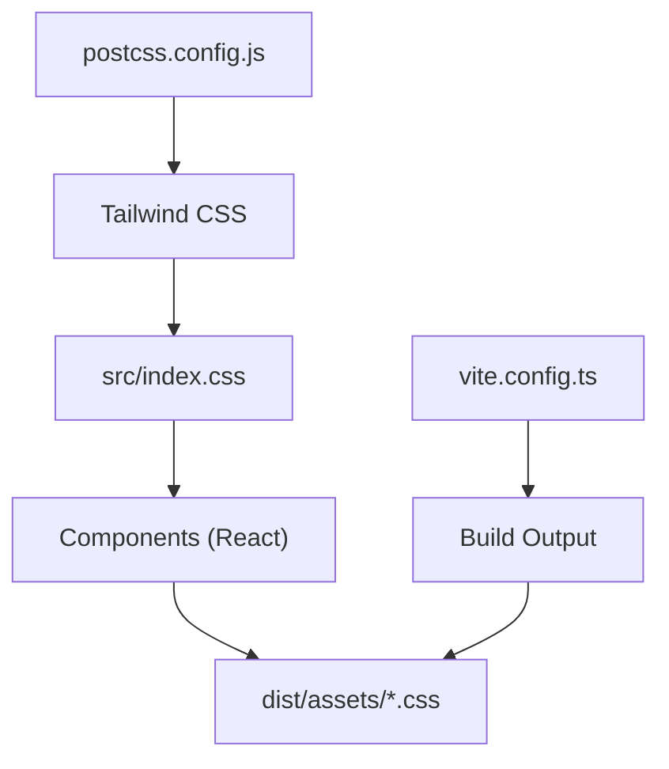
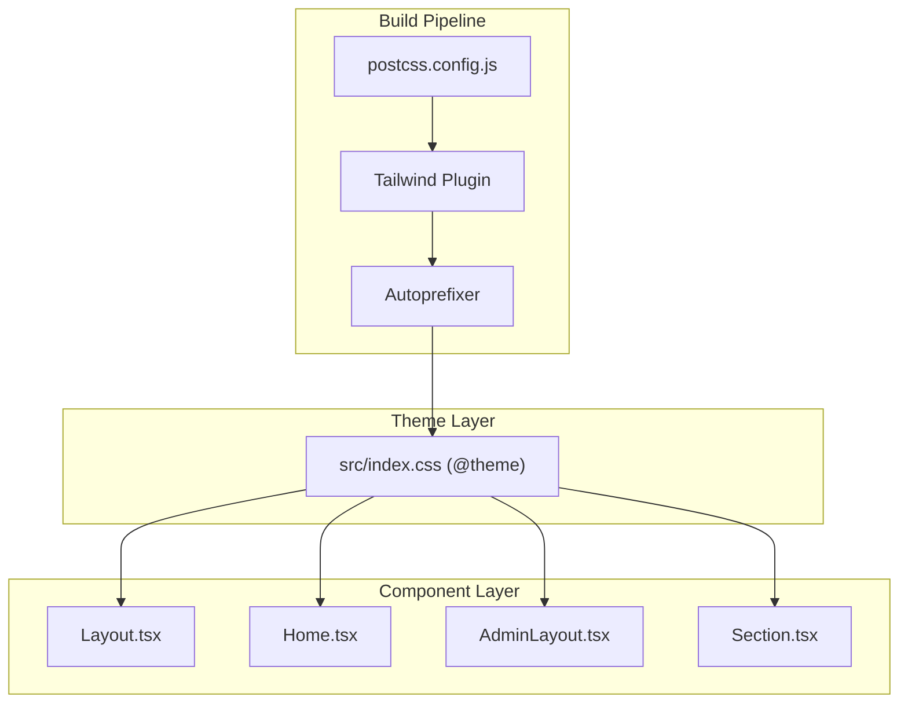
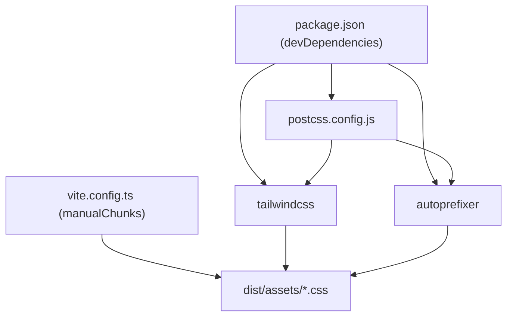

# Styling and Theming

<cite>
**Referenced Files in This Document**
- [postcss.config.js](file://postcss.config.js)
- [package.json](file://package.json)
- [src/index.css](file://src/index.css)
- [vite.config.ts](file://vite.config.ts)
- [src/components/Layout.tsx](file://src/components/Layout.tsx)
- [src/pages/Home.tsx](file://src/pages/Home.tsx)
- [src/pages/admin/AdminLayout.tsx](file://src/pages/admin/AdminLayout.tsx)
- [src/components/Section.tsx](file://src/components/Section.tsx)
- [src/constants.tsx](file://src/constants.tsx)
- [CONTRIBUTING.md](file://CONTRIBUTING.md)
</cite>

## Table of Contents
1. [Introduction](#introduction)
2. [Project Structure](#project-structure)
3. [Core Components](#core-components)
4. [Architecture Overview](#architecture-overview)
5. [Detailed Component Analysis](#detailed-component-analysis)
6. [Dependency Analysis](#dependency-analysis)
7. [Performance Considerations](#performance-considerations)
8. [Troubleshooting Guide](#troubleshooting-guide)
9. [Conclusion](#conclusion)

## Introduction
This document describes the styling and theming architecture of the project, focusing on the Tailwind CSS configuration, utility-first approach, and custom styling patterns. It explains the color system, typography hierarchy, spacing conventions, and responsive design implementation. It also covers component styling examples, theme customization, dark mode considerations, and CSS-in-JS patterns. Finally, it details the PostCSS configuration, autoprefixer settings, and build-time optimizations, including performance considerations for CSS delivery and style optimization techniques, along with the integration between Tailwind utilities and custom CSS classes.

## Project Structure
The styling pipeline integrates Tailwind CSS via PostCSS with autoprefixer, and custom CSS is authored in a single stylesheet. Build-time optimizations leverage Vite’s chunking and caching strategies. The layout and page components apply Tailwind utilities extensively, while custom animations and brand tokens are defined in the global stylesheet.

**Diagram sources**
- [postcss.config.js](file://postcss.config.js#L1-L6)
- [src/index.css](file://src/index.css#L1-L44)
- [vite.config.ts](file://vite.config.ts#L1-L115)

**Section sources**
- [postcss.config.js](file://postcss.config.js#L1-L6)
- [src/index.css](file://src/index.css#L1-L44)
- [vite.config.ts](file://vite.config.ts#L102-L112)

## Core Components
- Tailwind CSS integration via PostCSS plugin and autoprefixer.
- Global stylesheet defines brand color tokens and reusable animations.
- Utility-first React components apply Tailwind classes for layout, colors, spacing, and responsiveness.
- Custom animations are exposed as theme tokens and applied via animation utilities.

Key implementation references:
- Tailwind and autoprefixer configuration: [postcss.config.js](file://postcss.config.js#L1-L6)
- Brand color tokens and animations: [src/index.css](file://src/index.css#L18-L43)
- Utility-first component examples: [src/components/Layout.tsx](file://src/components/Layout.tsx#L47-L281), [src/pages/Home.tsx](file://src/pages/Home.tsx#L13-L218), [src/pages/admin/AdminLayout.tsx](file://src/pages/admin/AdminLayout.tsx#L30-L87)

**Section sources**
- [postcss.config.js](file://postcss.config.js#L1-L6)
- [src/index.css](file://src/index.css#L18-L43)
- [src/components/Layout.tsx](file://src/components/Layout.tsx#L47-L281)
- [src/pages/Home.tsx](file://src/pages/Home.tsx#L13-L218)
- [src/pages/admin/AdminLayout.tsx](file://src/pages/admin/AdminLayout.tsx#L30-L87)

## Architecture Overview
The styling architecture follows a utility-first model with a centralized theme definition and consistent component-level styling. Tailwind generates base utilities, custom animations, and brand tokens are injected into the theme. Components consume these utilities and tokens directly in JSX.

**Diagram sources**
- [postcss.config.js](file://postcss.config.js#L1-L6)
- [src/index.css](file://src/index.css#L1-L44)
- [src/components/Layout.tsx](file://src/components/Layout.tsx#L1-L284)
- [src/pages/Home.tsx](file://src/pages/Home.tsx#L1-L221)
- [src/pages/admin/AdminLayout.tsx](file://src/pages/admin/AdminLayout.tsx#L1-L90)
- [src/components/Section.tsx](file://src/components/Section.tsx#L1-L44)

## Detailed Component Analysis

### Tailwind Configuration and PostCSS
- PostCSS configuration enables the Tailwind plugin and autoprefixer, ensuring vendor prefixes are applied automatically during build.
- Tailwind is imported in the global stylesheet, allowing utilities and theme tokens to be generated and consumed across components.

References:
- [postcss.config.js](file://postcss.config.js#L1-L6)
- [src/index.css](file://src/index.css#L1-L1)

**Section sources**
- [postcss.config.js](file://postcss.config.js#L1-L6)
- [src/index.css](file://src/index.css#L1-L1)

### Theme Tokens and Animations
- Brand color tokens are defined under a theme block, enabling semantic color usage across components.
- Reusable animations are defined as theme tokens and can be applied via animation utilities.

References:
- [src/index.css](file://src/index.css#L18-L43)

**Section sources**
- [src/index.css](file://src/index.css#L18-L43)

### Color System
- Semantic brand palette is defined with multiple tints/shades suitable for backgrounds, borders, and accents.
- Components consistently use brand tokens for primary actions, highlights, and interactive states.

Examples in code:
- Brand background and text usage in header and footer: [src/components/Layout.tsx](file://src/components/Layout.tsx#L59-L82), [src/components/Layout.tsx](file://src/components/Layout.tsx#L171-L271)
- Brand buttons and highlights in home hero and CTAs: [src/pages/Home.tsx](file://src/pages/Home.tsx#L50-L56), [src/pages/Home.tsx](file://src/pages/Home.tsx#L212-L214)

**Section sources**
- [src/components/Layout.tsx](file://src/components/Layout.tsx#L59-L82)
- [src/components/Layout.tsx](file://src/components/Layout.tsx#L171-L271)
- [src/pages/Home.tsx](file://src/pages/Home.tsx#L50-L56)
- [src/pages/Home.tsx](file://src/pages/Home.tsx#L212-L214)

### Typography Hierarchy
- Consistent use of font weights and sizes across headings and body copy.
- Components rely on Tailwind typography utilities for sizing and line heights.

Examples:
- Hero headings and subtitles: [src/pages/Home.tsx](file://src/pages/Home.tsx#L43-L48)
- Section titles and subtitles: [src/components/Section.tsx](file://src/components/Section.tsx#L26-L35)

**Section sources**
- [src/pages/Home.tsx](file://src/pages/Home.tsx#L43-L48)
- [src/components/Section.tsx](file://src/components/Section.tsx#L26-L35)

### Spacing Conventions
- Container-based layouts with horizontal padding and vertical spacing units.
- Grid and flex utilities are used for alignment and distribution.

Examples:
- Container and padding usage: [src/components/Layout.tsx](file://src/components/Layout.tsx#L166-L168), [src/pages/Home.tsx](file://src/pages/Home.tsx#L24-L58)
- Section wrapper and spacing: [src/components/Section.tsx](file://src/components/Section.tsx#L21-L40)

**Section sources**
- [src/components/Layout.tsx](file://src/components/Layout.tsx#L166-L168)
- [src/pages/Home.tsx](file://src/pages/Home.tsx#L24-L58)
- [src/components/Section.tsx](file://src/components/Section.tsx#L21-L40)

### Responsive Design Implementation
- Mobile-first approach with responsive breakpoints embedded in class names.
- Navigation adapts from desktop flex to mobile collapsible menu.

Examples:
- Desktop navigation and mobile toggle: [src/components/Layout.tsx](file://src/components/Layout.tsx#L105-L133)
- Responsive grid layouts: [src/pages/Home.tsx](file://src/pages/Home.tsx#L94-L110), [src/pages/Home.tsx](file://src/pages/Home.tsx#L178-L203)

**Section sources**
- [src/components/Layout.tsx](file://src/components/Layout.tsx#L105-L133)
- [src/pages/Home.tsx](file://src/pages/Home.tsx#L94-L110)
- [src/pages/Home.tsx](file://src/pages/Home.tsx#L178-L203)

### Component Styling Patterns
- Layout.tsx demonstrates:
  - Sticky header with brand background and shadows.
  - Responsive navigation with active states and hover effects.
  - Footer grid with brand accents and social links.
  - Back-to-top button with smooth transitions.
- Home.tsx showcases:
  - Hero section with gradient overlays and backdrop blur.
  - Stats cards with brand icons and hover interactions.
  - Veteran support highlight with gradient backgrounds and animated elements.
  - News cards with category badges and hover states.
  - Call-to-action section with brand accent.
- AdminLayout.tsx illustrates:
  - Sidebar navigation with active state scaling and shadows.
  - Main content area with containerized padding.

References:
- [src/components/Layout.tsx](file://src/components/Layout.tsx#L47-L281)
- [src/pages/Home.tsx](file://src/pages/Home.tsx#L13-L218)
- [src/pages/admin/AdminLayout.tsx](file://src/pages/admin/AdminLayout.tsx#L30-L87)

**Section sources**
- [src/components/Layout.tsx](file://src/components/Layout.tsx#L47-L281)
- [src/pages/Home.tsx](file://src/pages/Home.tsx#L13-L218)
- [src/pages/admin/AdminLayout.tsx](file://src/pages/admin/AdminLayout.tsx#L30-L87)

### Theme Customization
- Brand tokens are centralized in the theme block and reused across components.
- Animation tokens enable consistent motion design.

References:
- [src/index.css](file://src/index.css#L18-L43)

**Section sources**
- [src/index.css](file://src/index.css#L18-L43)

### Dark Mode Implementation
- No explicit dark mode implementation was identified in the analyzed files.
- Consider adding a dark mode variant by extending the theme tokens and toggling a root attribute or class in JavaScript.

[No sources needed since this section provides general guidance]

### CSS-in-JS Patterns
- No CSS-in-JS libraries were detected in the project dependencies.
- Styling is implemented purely via Tailwind utilities and a global stylesheet.

References:
- [package.json](file://package.json#L34-L51)

**Section sources**
- [package.json](file://package.json#L34-L51)

### Integration Between Tailwind Utilities and Custom CSS Classes
- Tailwind utilities are applied directly in JSX for layout and styling.
- Custom animations and brand tokens are defined in the global stylesheet and referenced via Tailwind utilities.

References:
- [src/index.css](file://src/index.css#L1-L44)
- [src/components/Layout.tsx](file://src/components/Layout.tsx#L47-L281)

**Section sources**
- [src/index.css](file://src/index.css#L1-L44)
- [src/components/Layout.tsx](file://src/components/Layout.tsx#L47-L281)

## Dependency Analysis
The styling stack depends on Tailwind CSS and PostCSS with autoprefixer. Vite orchestrates the build, splitting vendor and UI dependencies into separate chunks.

**Diagram sources**
- [package.json](file://package.json#L34-L51)
- [postcss.config.js](file://postcss.config.js#L1-L6)
- [vite.config.ts](file://vite.config.ts#L106-L110)

**Section sources**
- [package.json](file://package.json#L34-L51)
- [postcss.config.js](file://postcss.config.js#L1-L6)
- [vite.config.ts](file://vite.config.ts#L106-L110)

## Performance Considerations
- Build-time optimizations:
  - Vendor chunk separation for React and UI library bundles reduces bundle duplication and improves caching.
  - Source maps are disabled in production builds to reduce artifact size.
- CSS delivery:
  - Tailwind purging is not configured; ensure purge options are considered in production builds to minimize CSS size.
  - Critical CSS extraction is not implemented; consider extracting critical styles for above-the-fold content.
- Caching:
  - Workbox runtime caching strategies are configured for fonts, images, and API responses; similar strategies can be applied to static CSS assets if needed.

References:
- [vite.config.ts](file://vite.config.ts#L102-L112)

**Section sources**
- [vite.config.ts](file://vite.config.ts#L102-L112)

## Troubleshooting Guide
- Tailwind utilities not applying:
  - Verify PostCSS plugin configuration and that the global stylesheet imports Tailwind.
  - Confirm that the theme tokens and animations are defined in the global stylesheet.
- Autoprefixer not generating vendor prefixes:
  - Ensure autoprefixer is included in the PostCSS plugin list.
- Build artifacts missing styles:
  - Check that the global stylesheet is imported in the application entry and that Vite resolves aliases correctly.

References:
- [postcss.config.js](file://postcss.config.js#L1-L6)
- [src/index.css](file://src/index.css#L1-L44)
- [vite.config.ts](file://vite.config.ts#L97-L101)

**Section sources**
- [postcss.config.js](file://postcss.config.js#L1-L6)
- [src/index.css](file://src/index.css#L1-L44)
- [vite.config.ts](file://vite.config.ts#L97-L101)

## Conclusion
The project employs a clean, utility-first styling architecture powered by Tailwind CSS and PostCSS with autoprefixer. Brand tokens and animations are centralized in the global stylesheet, while components consistently apply Tailwind utilities for layout, color, and responsiveness. Build-time optimizations leverage Vite’s chunking strategy. To further enhance the system, consider implementing Tailwind purging, critical CSS extraction, and optional dark mode support aligned with the existing brand tokens.