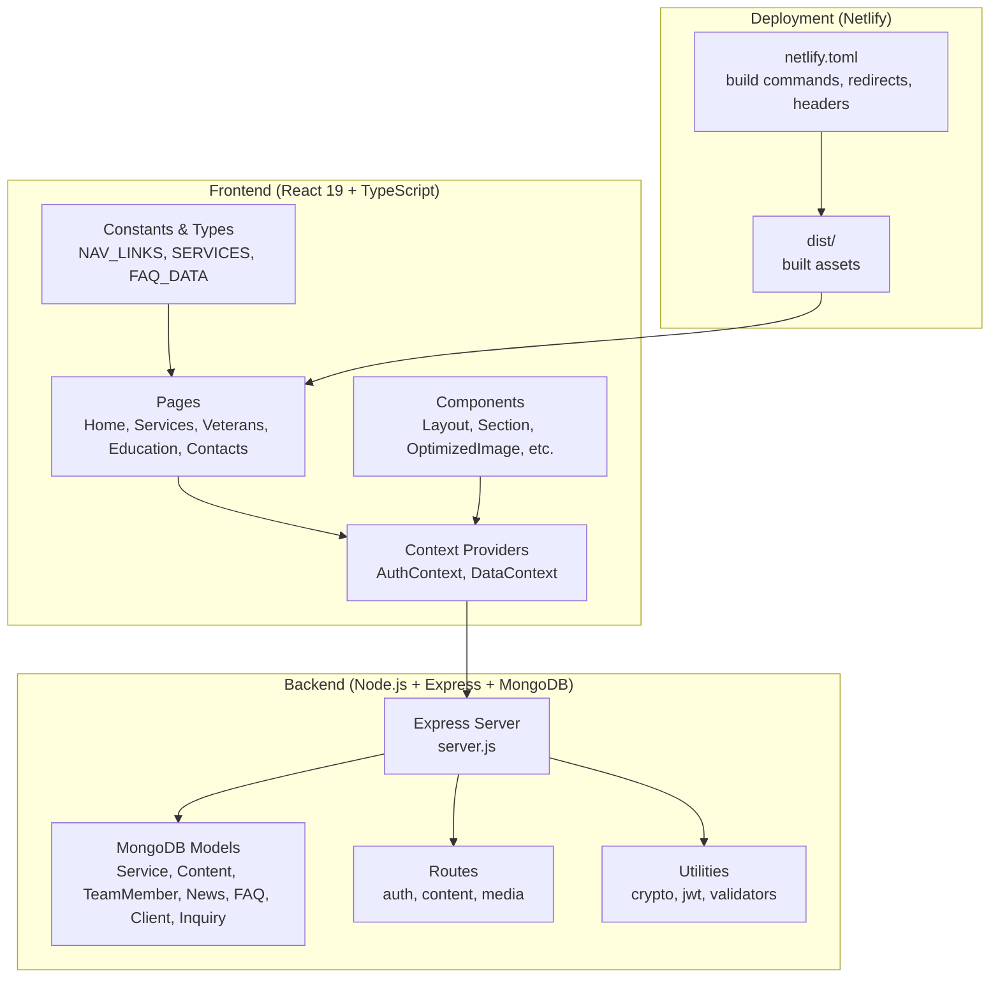
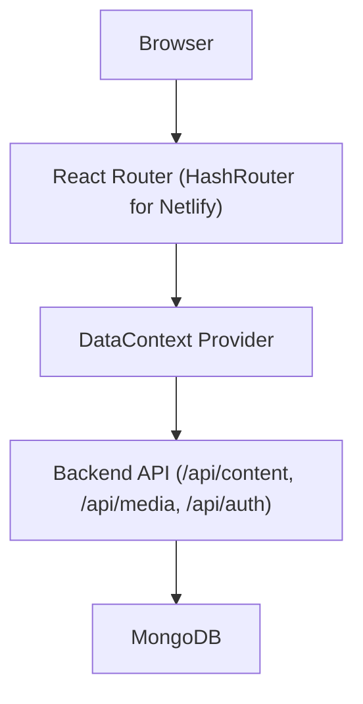
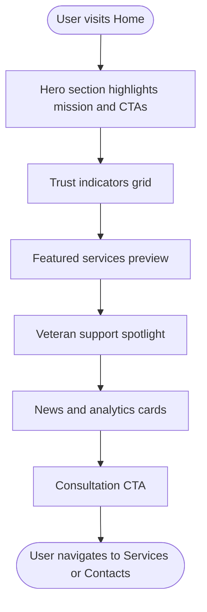
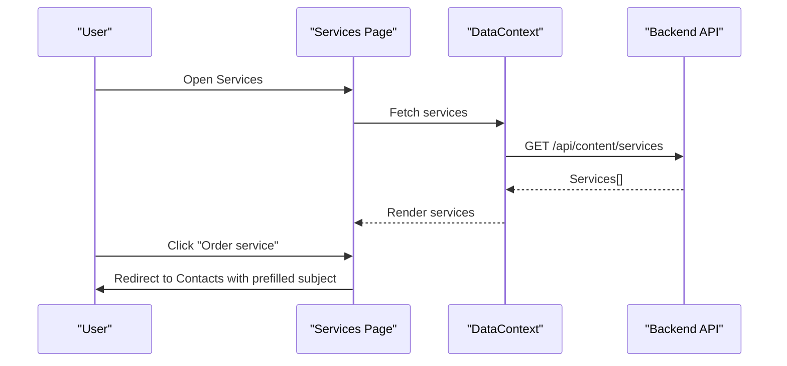
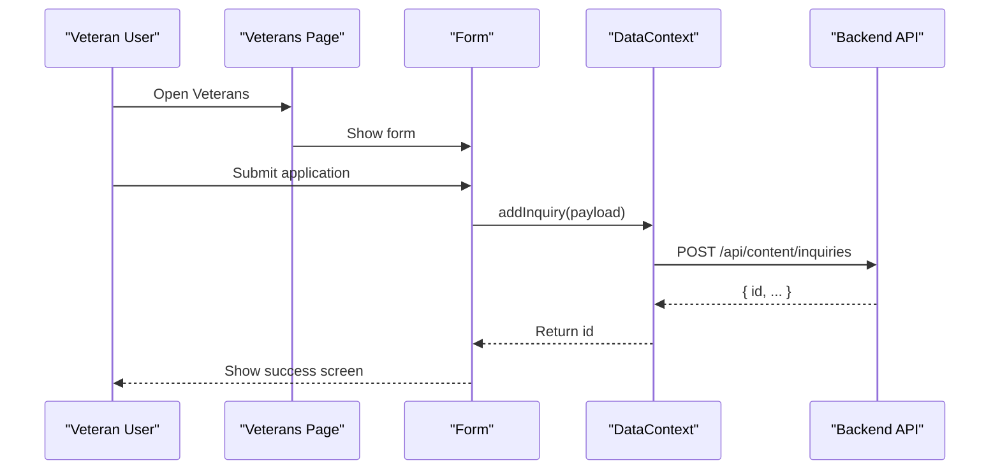
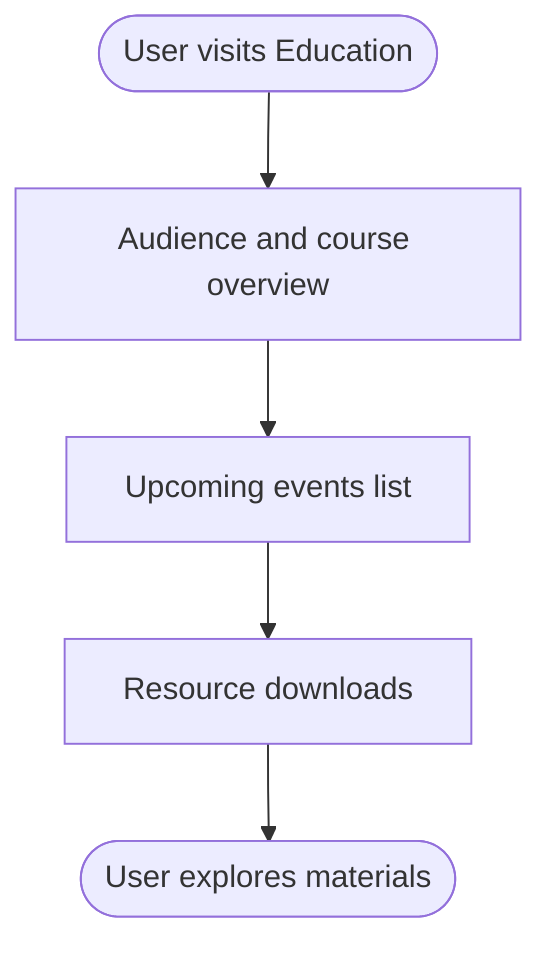
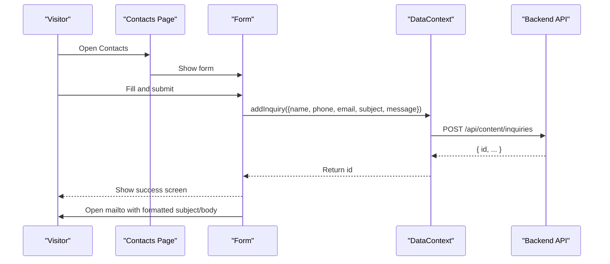
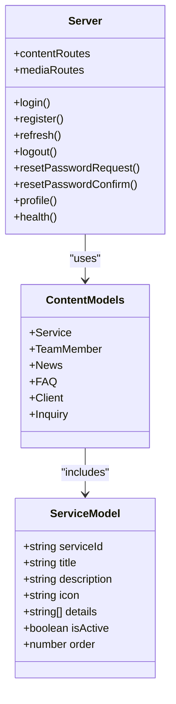
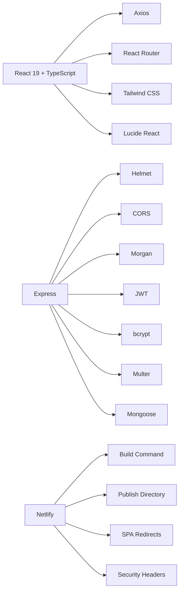

# Project Overview

<cite>
**Referenced Files in This Document**
- [README.md](file://README.md)
- [package.json](file://package.json)
- [netlify.toml](file://netlify.toml)
- [src/pages/Home.tsx](file://src/pages/Home.tsx)
- [src/pages/Services.tsx](file://src/pages/Services.tsx)
- [src/pages/Veterans.tsx](file://src/pages/Veterans.tsx)
- [src/pages/Education.tsx](file://src/pages/Education.tsx)
- [src/pages/Contacts.tsx](file://src/pages/Contacts.tsx)
- [src/constants.tsx](file://src/constants.tsx)
- [src/context/DataContext.tsx](file://src/context/DataContext.tsx)
- [server/server.js](file://server/server.js)
- [server/package.json](file://server/package.json)
- [server/models/Content.js](file://server/models/Content.js)
- [server/models/Service.js](file://server/models/Service.js)
</cite>

## Table of Contents
1. [Introduction](#introduction)
2. [Project Structure](#project-structure)
3. [Core Components](#core-components)
4. [Architecture Overview](#architecture-overview)
5. [Detailed Component Analysis](#detailed-component-analysis)
6. [Dependency Analysis](#dependency-analysis)
7. [Performance Considerations](#performance-considerations)
8. [Troubleshooting Guide](#troubleshooting-guide)
9. [Conclusion](#conclusion)

## Introduction
Anko is the official website of an autonomous non-commercial professional accounting and business support organization based in Novorossiysk. The project’s mission is to provide a full spectrum of accounting services for small and medium business, alongside dedicated support programs for veterans of active hostilities. The website offers a bilingual Russian–English experience and is organized around six primary sections: Home, About Us, Services, Veterans, Education, and Contacts.

The site is built with modern web technologies: React 19 with TypeScript for the frontend, Node.js with Express for the backend, MongoDB for data persistence, and Netlify for deployment. It emphasizes accessibility, maintainability, and developer productivity through a clean architecture, centralized data context, and a robust admin content management surface.

## Project Structure
The repository follows a clear separation of concerns:
- Frontend (React 19 + TypeScript): Pages, components, context providers, and shared utilities.
- Backend (Node.js + Express + MongoDB): API endpoints, models, middleware, and scripts.
- Deployment (Netlify): Build automation, environment configuration, and SPA routing.

**Diagram sources**
- [src/pages/Home.tsx](file://src/pages/Home.tsx#L1-L221)
- [src/pages/Services.tsx](file://src/pages/Services.tsx#L1-L53)
- [src/pages/Veterans.tsx](file://src/pages/Veterans.tsx#L1-L130)
- [src/pages/Education.tsx](file://src/pages/Education.tsx#L1-L101)
- [src/pages/Contacts.tsx](file://src/pages/Contacts.tsx#L1-L369)
- [src/constants.tsx](file://src/constants.tsx#L1-L156)
- [src/context/DataContext.tsx](file://src/context/DataContext.tsx#L1-L259)
- [server/server.js](file://server/server.js#L1-L337)
- [server/models/Content.js](file://server/models/Content.js#L1-L90)
- [server/models/Service.js](file://server/models/Service.js#L1-L49)
- [netlify.toml](file://netlify.toml#L1-L19)

**Section sources**
- [README.md](file://README.md#L212-L242)
- [package.json](file://package.json#L1-L68)
- [netlify.toml](file://netlify.toml#L1-L19)

## Core Components
- Home page: Highlights the organization’s mission, trust indicators, featured services, veteran support, news, and a call-to-action.
- Services page: Presents the full range of accounting and business services with icons and detailed bullet points.
- Veterans page: Promotes the special program for veterans, including a form to submit applications and a step-by-step guide.
- Education page: Showcases educational offerings, schedules, and downloadable materials.
- Contacts page: Provides contact information, social links, and a comprehensive inquiry form with validation and submission flow.
- DataContext: Centralizes data fetching and CRUD operations against the backend content API, enabling dynamic content updates and admin workflows.
- Backend server: Implements authentication, content management endpoints, media handling, and health checks, backed by MongoDB models.

Practical examples:
- A visitor lands on the Home page and navigates to Services to learn about registration support and accounting services.
- A veteran submits an application via the Veterans page, which is persisted and triggers an automated email notification.
- A user contacts the organization through the Contacts page; the form validates input, persists the inquiry, and opens the default mail client with a preformatted message.

**Section sources**
- [src/pages/Home.tsx](file://src/pages/Home.tsx#L1-L221)
- [src/pages/Services.tsx](file://src/pages/Services.tsx#L1-L53)
- [src/pages/Veterans.tsx](file://src/pages/Veterans.tsx#L1-L130)
- [src/pages/Education.tsx](file://src/pages/Education.tsx#L1-L101)
- [src/pages/Contacts.tsx](file://src/pages/Contacts.tsx#L1-L369)
- [src/context/DataContext.tsx](file://src/context/DataContext.tsx#L1-L259)

## Architecture Overview
The system is a frontend–backend pair with a content-driven model:
- Frontend: React 19 + TypeScript with React Router (configured for Netlify SPA behavior) and a data context provider.
- Backend: Node.js + Express serving REST endpoints for content, media, and authentication, backed by MongoDB.
- Deployment: Netlify handles build, environment variables, and SPA routing via redirects.

**Diagram sources**
- [src/context/DataContext.tsx](file://src/context/DataContext.tsx#L32-L34)
- [server/server.js](file://server/server.js#L304-L314)
- [netlify.toml](file://netlify.toml#L8-L11)

**Section sources**
- [README.md](file://README.md#L22-L29)
- [netlify.toml](file://netlify.toml#L1-L19)

## Detailed Component Analysis

### Home Page
Purpose:
- Introduce the organization, highlight trust signals, showcase services, emphasize veteran support, and present recent news.
Key features:
- Hero banner with a prominent call-to-action and a dedicated plaque for the veterans’ program.
- Trust indicators (reliability, growth, support).
- Preview of services and news items.
- Strong CTA for consultations.

**Diagram sources**
- [src/pages/Home.tsx](file://src/pages/Home.tsx#L10-L218)

**Section sources**
- [src/pages/Home.tsx](file://src/pages/Home.tsx#L1-L221)

### Services Page
Purpose:
- Present the complete portfolio of accounting and business services with clear descriptions and benefits.
Key features:
- Responsive layout alternating service blocks with icons.
- Detailed bullets for each service.
- “Order service” buttons linking to the Contacts page with prefilled subject.

**Diagram sources**
- [src/pages/Services.tsx](file://src/pages/Services.tsx#L1-L53)
- [src/context/DataContext.tsx](file://src/context/DataContext.tsx#L49-L54)
- [server/server.js](file://server/server.js#L304-L305)

**Section sources**
- [src/pages/Services.tsx](file://src/pages/Services.tsx#L1-L53)

### Veterans Page
Purpose:
- Promote the special program for veterans, explain eligibility and benefits, and collect applications.
Key features:
- Hero section with program branding.
- Three pillars: business launch, free education, and supportive supervision.
- Application form with validation and submission feedback.

**Diagram sources**
- [src/pages/Veterans.tsx](file://src/pages/Veterans.tsx#L1-L130)
- [src/context/DataContext.tsx](file://src/context/DataContext.tsx#L189-L204)
- [server/server.js](file://server/server.js#L304-L305)

**Section sources**
- [src/pages/Veterans.tsx](file://src/pages/Veterans.tsx#L1-L130)

### Education Page
Purpose:
- Showcase educational programs, upcoming events, and downloadable resources.
Key features:
- Target audience and schedule display.
- Event cards with registration status.
- Resource library with download actions.

**Diagram sources**
- [src/pages/Education.tsx](file://src/pages/Education.tsx#L1-L101)

**Section sources**
- [src/pages/Education.tsx](file://src/pages/Education.tsx#L1-L101)

### Contacts Page
Purpose:
- Provide contact details, social channels, and a validated inquiry form that integrates with the backend and default mail client.
Key features:
- Company info card with phone, email, Telegram, VK, Max, and office hours.
- Comprehensive form with real-time validation and error messaging.
- Submission flow that persists the inquiry and opens the mail client with a formatted body.

**Diagram sources**
- [src/pages/Contacts.tsx](file://src/pages/Contacts.tsx#L1-L369)
- [src/context/DataContext.tsx](file://src/context/DataContext.tsx#L189-L204)
- [server/server.js](file://server/server.js#L304-L305)

**Section sources**
- [src/pages/Contacts.tsx](file://src/pages/Contacts.tsx#L1-L369)

### Backend API and Data Models
Purpose:
- Serve content and administrative data to the frontend, manage authentication, and expose media endpoints.
Key features:
- Authentication endpoints (login, register, refresh, logout, reset password).
- Content management routes for services, team, news, FAQ, clients, and inquiries.
- MongoDB models for each content type with indexes and validation.
- Helmet, CORS, rate limiting, and Morgan middleware for security and observability.

**Diagram sources**
- [server/models/Service.js](file://server/models/Service.js#L1-L49)
- [server/models/Content.js](file://server/models/Content.js#L1-L90)
- [server/server.js](file://server/server.js#L62-L314)

**Section sources**
- [server/server.js](file://server/server.js#L1-L337)
- [server/models/Service.js](file://server/models/Service.js#L1-L49)
- [server/models/Content.js](file://server/models/Content.js#L1-L90)

## Dependency Analysis
Technology stack and integrations:
- Frontend: React 19, TypeScript, React Router, Tailwind CSS, Lucide React, Axios, PWA support.
- Backend: Express, Helmet, CORS, Morgan, bcrypt, JWT, Multer, Mongoose, Nodemon (dev).
- Database: MongoDB (via Mongoose).
- Deployment: Netlify with build command, publish directory, Node.js version, SPA redirects, and security headers.

**Diagram sources**
- [package.json](file://package.json#L27-L52)
- [server/package.json](file://server/package.json#L18-L33)
- [netlify.toml](file://netlify.toml#L1-L19)

**Section sources**
- [README.md](file://README.md#L22-L29)
- [package.json](file://package.json#L1-L68)
- [server/package.json](file://server/package.json#L1-L49)
- [netlify.toml](file://netlify.toml#L1-L19)

## Performance Considerations
- Frontend: Lazy loading of images, optimized asset delivery, and efficient state updates via the DataContext reduce render overhead.
- Backend: Indexes on frequently queried fields (e.g., serviceId, isActive, order) improve query performance.
- Deployment: Netlify’s CDN and caching headers minimize latency for static assets.

## Troubleshooting Guide
Common issues and resolutions:
- Environment variables: Ensure API URL is configured in the frontend and backend environment files.
- MongoDB connectivity: Confirm the MongoDB URI and local instance availability.
- SPA routing on Netlify: Verify redirects to index.html are enabled.
- Form validation errors: Review client-side regex patterns and error messages for name, phone, and email fields.
- Authentication: Confirm JWT secret and token lifecycle during development and testing.

**Section sources**
- [src/pages/Contacts.tsx](file://src/pages/Contacts.tsx#L32-L62)
- [src/context/DataContext.tsx](file://src/context/DataContext.tsx#L32-L34)
- [server/server.js](file://server/server.js#L15-L18)
- [netlify.toml](file://netlify.toml#L8-L11)

## Conclusion
Anko delivers a professional, accessible, and scalable platform for an autonomous non-commercial accounting organization. Its bilingual website, comprehensive service catalog, and specialized veteran support are supported by a modern tech stack and a robust admin content management system. The architecture balances developer productivity with operational reliability, ensuring smooth maintenance and future enhancements.