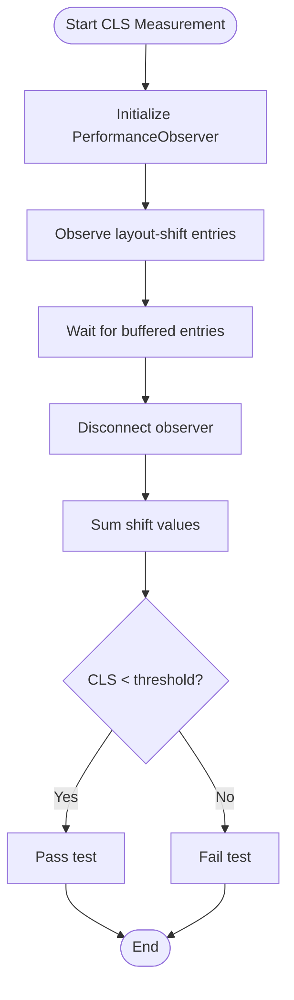

# Testing & Quality Assurance

<cite>
**Referenced Files in This Document**
- [vitest.config.ts](file://vitest.config.ts)
- [playwright.config.ts](file://playwright.config.ts)
- [package.json](file://package.json)
- [src/test/setup.ts](file://src/test/setup.ts)
- [src/test/ErrorBoundary.test.tsx](file://src/test/ErrorBoundary.test.tsx)
- [src/test/Section.test.tsx](file://src/test/Section.test.tsx)
- [src/test/types.test.ts](file://src/test/types.test.ts)
- [src/components/ErrorBoundary.tsx](file://src/components/ErrorBoundary.tsx)
- [src/components/Section.tsx](file://src/components/Section.tsx)
- [e2e/admin.spec.ts](file://e2e/admin.spec.ts)
- [e2e/navigation.spec.ts](file://e2e/navigation.spec.ts)
- [e2e/pages.spec.ts](file://e2e/pages.spec.ts)
- [e2e/performance.spec.ts](file://e2e/performance.spec.ts)
- [e2e/responsive.spec.ts](file://e2e/responsive.spec.ts)
- [e2e/accessibility.spec.ts](file://e2e/accessibility.spec.ts)
- [.github/workflows/ci-cd.yml](file://.github/workflows/ci-cd.yml)
- [.github/workflows/e2e-tests.yml](file://.github/workflows/e2e-tests.yml)
- [src/utils/analytics.ts](file://src/utils/analytics.ts)
</cite>

## Table of Contents
1. [Introduction](#introduction)
2. [Project Structure](#project-structure)
3. [Core Components](#core-components)
4. [Architecture Overview](#architecture-overview)
5. [Detailed Component Analysis](#detailed-component-analysis)
6. [Dependency Analysis](#dependency-analysis)
7. [Performance Considerations](#performance-considerations)
8. [Troubleshooting Guide](#troubleshooting-guide)
9. [Conclusion](#conclusion)
10. [Appendices](#appendices)

## Introduction
This document describes the multi-layered testing and quality assurance strategy for the Anko project. It covers unit testing with Vitest, end-to-end testing with Playwright, accessibility and performance testing, component and integration testing patterns, coverage requirements, continuous integration workflows, and automated quality checks. It also provides practical examples, best practices, debugging strategies, and guidance on test data management, mocks, and environment setup.

## Project Structure
The testing ecosystem is organized into:
- Unit tests under src/test with Vitest configuration and shared setup
- End-to-end tests under e2e grouped by concern (admin, navigation, pages, performance, responsive, accessibility)
- CI/CD workflows orchestrating linting, builds, coverage, backend tests, and E2E runs
- Playwright configuration defining browser targets, timeouts, tracing, screenshots, and videos

**Diagram sources**
- [vitest.config.ts](file://vitest.config.ts#L1-L31)
- [src/test/setup.ts](file://src/test/setup.ts#L1-L41)
- [src/test/ErrorBoundary.test.tsx](file://src/test/ErrorBoundary.test.tsx#L1-L55)
- [src/test/Section.test.tsx](file://src/test/Section.test.tsx#L1-L72)
- [src/test/types.test.ts](file://src/test/types.test.ts#L1-L79)
- [playwright.config.ts](file://playwright.config.ts#L1-L97)
- [e2e/admin.spec.ts](file://e2e/admin.spec.ts#L1-L119)
- [e2e/navigation.spec.ts](file://e2e/navigation.spec.ts#L1-L101)
- [e2e/pages.spec.ts](file://e2e/pages.spec.ts#L1-L105)
- [e2e/performance.spec.ts](file://e2e/performance.spec.ts#L1-L103)
- [e2e/responsive.spec.ts](file://e2e/responsive.spec.ts#L1-L104)
- [e2e/accessibility.spec.ts](file://e2e/accessibility.spec.ts#L1-L114)
- [.github/workflows/ci-cd.yml](file://.github/workflows/ci-cd.yml#L1-L147)
- [.github/workflows/e2e-tests.yml](file://.github/workflows/e2e-tests.yml#L1-L49)

**Section sources**
- [vitest.config.ts](file://vitest.config.ts#L1-L31)
- [playwright.config.ts](file://playwright.config.ts#L1-L97)
- [package.json](file://package.json#L1-L68)
- [.github/workflows/ci-cd.yml](file://.github/workflows/ci-cd.yml#L1-L147)
- [.github/workflows/e2e-tests.yml](file://.github/workflows/e2e-tests.yml#L1-L49)

## Core Components
- Vitest configuration defines the jsdom environment, global setup, aliases, and coverage settings. Coverage excludes generated files, config files, and test directories.
- Playwright configuration sets up parallel E2E runs, multiple browser targets, trace/screenshot/video collection, and a local dev server for test execution.
- Shared unit test setup initializes DOM matchers, cleans up after each test, and provides environment mocks for media queries, IntersectionObserver, and scrolling.
- E2E suite is split into focused domains: admin flows, navigation, page content, performance metrics, responsive behavior, and accessibility checks.

Key capabilities:
- Unit tests validate component rendering, props, and fallback behavior
- E2E tests validate real user journeys, responsive layouts, performance budgets, and basic accessibility checks
- CI workflows enforce type checking, building, backend tests, and E2E execution with artifact uploads

**Section sources**
- [vitest.config.ts](file://vitest.config.ts#L5-L30)
- [src/test/setup.ts](file://src/test/setup.ts#L1-L41)
- [playwright.config.ts](file://playwright.config.ts#L7-L96)
- [package.json](file://package.json#L7-L26)

## Architecture Overview
The testing architecture separates concerns across unit and E2E layers, with CI orchestration ensuring quality gates.

**Diagram sources**
- [vitest.config.ts](file://vitest.config.ts#L12-L24)
- [playwright.config.ts](file://playwright.config.ts#L26-L30)
- [.github/workflows/ci-cd.yml](file://.github/workflows/ci-cd.yml#L32-L36)
- [.github/workflows/e2e-tests.yml](file://.github/workflows/e2e-tests.yml#L31-L48)

## Detailed Component Analysis

### Vitest Unit Testing Framework
- Environment and setup
  - Uses jsdom with global helpers enabled
  - Loads a shared setup file for cleanup and mocks
  - Enables CSS handling for styled components
- Coverage
  - Provider v8 with reporters text, json, html
  - Excludes node_modules, test files, type declarations, config files, and dist
- Aliasing
  - @ resolves to src for clean imports

Recommended patterns:
- Place component-specific unit tests alongside components under src/test
- Use Testing Library’s render and screen helpers
- Mock external APIs via environment variables and fetch interceptors
- Keep tests deterministic by avoiding real timers and network calls

**Section sources**
- [vitest.config.ts](file://vitest.config.ts#L5-L30)
- [src/test/setup.ts](file://src/test/setup.ts#L1-L41)

### Playwright End-to-End Testing
- Projects
  - Chromium, Firefox, WebKit, Mobile Chrome, Mobile Safari
- Timeouts and retries
  - Global timeout increased for lazy-loaded content
  - Retries on CI, single worker for stability
- Observability
  - Trace on first retry, screenshot on failure, video on failure
- Local server
  - Starts dev server automatically during tests

Best practices:
- Prefer locators over brittle selectors
- Use waitForLoadState and explicit waits for dynamic content
- Capture artifacts (screenshots, videos, traces) for failures
- Run targeted projects locally and full matrix on CI

**Section sources**
- [playwright.config.ts](file://playwright.config.ts#L7-L96)

### Accessibility Testing Procedures
Current E2E accessibility checks include:
- Heading hierarchy validation
- Image alt attributes presence
- Form labels and aria-labels
- Keyboard navigation focus
- ARIA landmarks (main, navigation)
- Skip links visibility
- Manual placeholder for color contrast checks

Recommendations:
- Integrate axe-core for automated contrast and WCAG checks
- Add color contrast assertions using computed styles
- Expand landmark and skip-link checks across pages

**Section sources**
- [e2e/accessibility.spec.ts](file://e2e/accessibility.spec.ts#L1-L114)

### Performance Testing Methodologies
Current E2E performance checks include:
- Page load time budget
- First Contentful Paint timing
- Lazy-loading indicators
- DOM size thresholds
- Cumulative Layout Shift measurement
- Static asset caching behavior

Recommendations:
- Add Lighthouse integration for deeper performance metrics
- Instrument Core Web Vitals in CI
- Establish baselines and alert thresholds

**Section sources**
- [e2e/performance.spec.ts](file://e2e/performance.spec.ts#L1-L103)

### Component Testing Patterns
- ErrorBoundary
  - Renders children normally when no error
  - Displays fallback UI and buttons when child throws
  - Supports custom fallback prop
  - Suppresses console errors in test for cleaner output
- Section
  - Renders title and subtitle when provided
  - Applies custom className and centers content when requested
  - Ensures correct id attribute and default padding classes

Integration patterns:
- Wrap components under test with ErrorBoundary for boundary tests
- Use Testing Library queries to assert rendered content and attributes

**Section sources**
- [src/test/ErrorBoundary.test.tsx](file://src/test/ErrorBoundary.test.tsx#L1-L55)
- [src/components/ErrorBoundary.tsx](file://src/components/ErrorBoundary.tsx#L1-L144)
- [src/test/Section.test.tsx](file://src/test/Section.test.tsx#L1-L72)
- [src/components/Section.tsx](file://src/components/Section.tsx#L1-L44)

### Integration Testing Approaches
- Backend integration
  - MongoDB service in CI with health checks
  - Dedicated backend test runs with isolated test database
  - JWT secrets and environment configured for tests
- Frontend integration
  - Playwright tests navigate real routes and interact with UI
  - Admin protected routes validated via redirects and form presence
  - Navigation and responsive behavior validated across viewports

**Section sources**
- [.github/workflows/ci-cd.yml](file://.github/workflows/ci-cd.yml#L48-L91)
- [e2e/admin.spec.ts](file://e2e/admin.spec.ts#L1-L119)
- [e2e/navigation.spec.ts](file://e2e/navigation.spec.ts#L1-L101)
- [e2e/responsive.spec.ts](file://e2e/responsive.spec.ts#L1-L104)

### Continuous Integration Testing Workflows
- Frontend CI
  - Node versions 18 and 20 matrix
  - Type checking, build, and artifact upload on main branch
- Backend CI
  - MongoDB service startup and health checks
  - Test runs with dedicated test database and secrets
- Security audit
  - Production dependency audits for both frontend and backend
- E2E CI
  - Installs browsers, runs Playwright tests, uploads reports and artifacts
- Deployments
  - Netlify deployment job triggered on main branch pushes

**Section sources**
- [.github/workflows/ci-cd.yml](file://.github/workflows/ci-cd.yml#L1-L147)
- [.github/workflows/e2e-tests.yml](file://.github/workflows/e2e-tests.yml#L1-L49)

### Automated Quality Checks
- Type safety enforced via TypeScript compilation
- Coverage reporting via Vitest
- Security audits via npm audit
- E2E reports and artifacts for regression tracking

**Section sources**
- [.github/workflows/ci-cd.yml](file://.github/workflows/ci-cd.yml#L32-L36)
- [.github/workflows/ci-cd.yml](file://.github/workflows/ci-cd.yml#L106-L113)
- [vitest.config.ts](file://vitest.config.ts#L12-L24)

### Practical Examples and Best Practices
- Writing effective unit tests
  - Use describe blocks to group related tests
  - Assert both presence and absence of elements
  - Verify class names and attributes for styling and accessibility
- Mocking and environment setup
  - Use setup.ts to mock window.matchMedia, IntersectionObserver, and scrollTo
  - Set VITE_API_URL to point to a test backend or mock server
- Debugging strategies
  - Use Playwright’s --debug, --headed, and --ui modes
  - Inspect trace, screenshot, and video artifacts
  - Leverage beforeEach/afterEach for state isolation
- Test data management
  - Prefer deterministic fixtures and controlled inputs
  - Use environment variables for base URLs and feature flags
- Maintaining test suites
  - Keep tests focused and fast
  - Group E2E tests by domain and browser targets
  - Regularly review flaky tests and increase timeouts selectively

**Section sources**
- [src/test/setup.ts](file://src/test/setup.ts#L10-L41)
- [playwright.config.ts](file://playwright.config.ts#L33-L49)
- [package.json](file://package.json#L11-L19)

### Test Data Management and Mock Implementations
- Environment mocking
  - VITE_API_URL set in setup.ts for predictable backend behavior
  - matchMedia mock ensures layout-dependent tests are stable
- IntersectionObserver mock prevents real intersection calculations
- ScrollTo mock avoids side effects during tests
- Playwright baseURL respects VITE_BASE_URL environment variable

**Section sources**
- [src/test/setup.ts](file://src/test/setup.ts#L10-L41)
- [playwright.config.ts](file://playwright.config.ts#L33-L35)

### Testing Environment Setup
- Local development
  - Vitest runs with jsdom and custom setup
  - Playwright launches the dev server automatically
- CI environments
  - Node.js setup with caching
  - Playwright browsers installed with dependencies
  - MongoDB service for backend tests
  - Secrets injected via CI environment

**Section sources**
- [vitest.config.ts](file://vitest.config.ts#L5-L10)
- [playwright.config.ts](file://playwright.config.ts#L90-L95)
- [.github/workflows/e2e-tests.yml](file://.github/workflows/e2e-tests.yml#L19-L29)
- [.github/workflows/ci-cd.yml](file://.github/workflows/ci-cd.yml#L53-L62)

## Dependency Analysis
The testing stack depends on:
- Vitest for unit tests and jsdom environment
- Playwright for cross-browser E2E automation
- GitHub Actions for CI orchestration
- Backend services for integration contexts

**Diagram sources**
- [package.json](file://package.json#L7-L26)
- [vitest.config.ts](file://vitest.config.ts#L1-L31)
- [src/test/setup.ts](file://src/test/setup.ts#L1-L41)
- [playwright.config.ts](file://playwright.config.ts#L1-L97)
- [.github/workflows/ci-cd.yml](file://.github/workflows/ci-cd.yml#L1-L147)

**Section sources**
- [package.json](file://package.json#L1-L68)
- [vitest.config.ts](file://vitest.config.ts#L1-L31)
- [playwright.config.ts](file://playwright.config.ts#L1-L97)
- [.github/workflows/ci-cd.yml](file://.github/workflows/ci-cd.yml#L1-L147)

## Performance Considerations
- E2E performance checks include load time, FCP, CLS, DOM size, and caching behavior
- CI uses a single worker for E2E runs to reduce flakiness
- Consider adding Lighthouse or WebPageTest for deeper performance insights

[No sources needed since this section provides general guidance]

## Troubleshooting Guide
Common issues and resolutions:
- Flaky E2E tests
  - Increase actionTimeout and navigationTimeout selectively
  - Use waitForLoadState and explicit waits
  - Capture trace, screenshot, and video for failed runs
- Coverage gaps
  - Adjust vitest coverage.exclude patterns
  - Ensure setup.ts is included in coverage configuration
- Mock failures
  - Verify setup.ts is loaded by Vitest
  - Confirm environment variables are set before tests run
- CI failures
  - Check backend service health and database connection
  - Validate secrets availability in CI

**Section sources**
- [playwright.config.ts](file://playwright.config.ts#L10-L11)
- [playwright.config.ts](file://playwright.config.ts#L46-L48)
- [vitest.config.ts](file://vitest.config.ts#L12-L24)
- [src/test/setup.ts](file://src/test/setup.ts#L10-L41)
- [.github/workflows/ci-cd.yml](file://.github/workflows/ci-cd.yml#L53-L62)

## Conclusion
The Anko project employs a robust multi-layered testing strategy combining Vitest for unit tests, Playwright for E2E scenarios, and CI workflows for continuous quality checks. The current suite validates critical user journeys, responsive behavior, performance budgets, and basic accessibility. Extending coverage with automated accessibility and performance tools, along with maintaining deterministic mocks and environment configuration, will further strengthen the quality assurance posture.

[No sources needed since this section summarizes without analyzing specific files]

## Appendices

### API/Service Component Sequence (Admin Login Flow)

**Diagram sources**
- [e2e/admin.spec.ts](file://e2e/admin.spec.ts#L1-L119)
- [src/components/ErrorBoundary.tsx](file://src/components/ErrorBoundary.tsx#L15-L47)

### Component Class Diagram (ErrorBoundary)

**Diagram sources**
- [src/components/ErrorBoundary.tsx](file://src/components/ErrorBoundary.tsx#L4-L141)

### Flowchart: Performance Measurement (CLS)

**Diagram sources**
- [e2e/performance.spec.ts](file://e2e/performance.spec.ts#L64-L82)